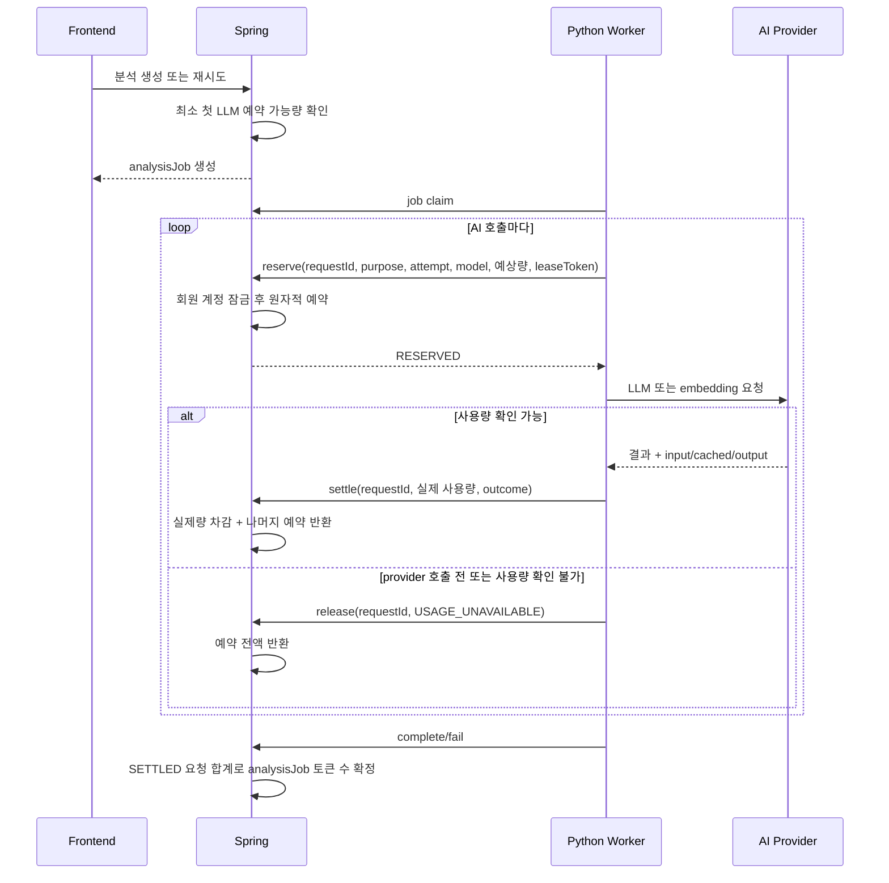
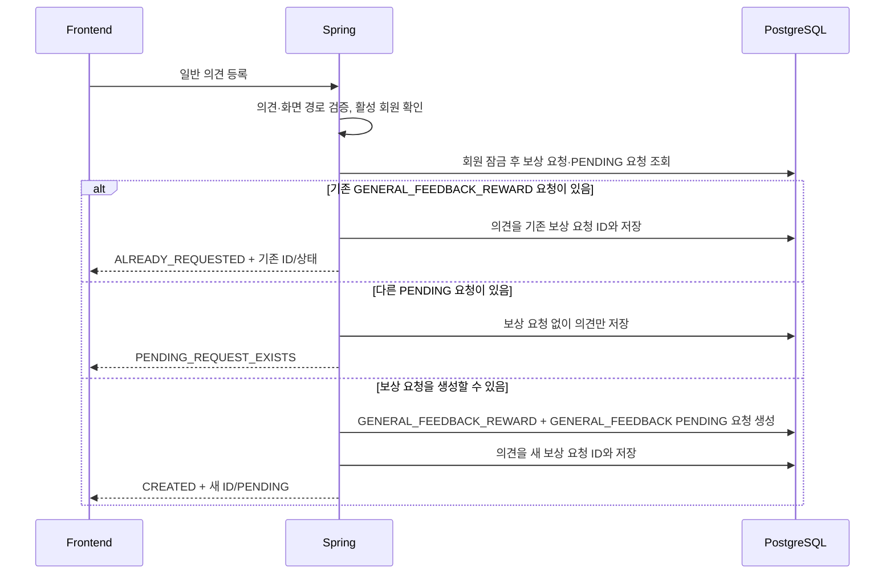

# AI Token Usage

AI 요청별 실제 토큰 사용량을 관측하면서, 결제 기능이 없는 MVP 회원에게 일회성 기본 한도를 제공하는 흐름을 정리합니다.

## 정책

- 회원은 `AI_TOKEN_DEFAULT_GRANT`만큼 최초 한 번 지급받습니다.
- 추가 사용량 요청이 승인되면 승인 시점의 `AI_TOKEN_DEFAULT_GRANT`만큼 다시 지급받습니다. 승인 요청에서 지급량을 받지 않습니다.
- 지급량과 사용량은 누적되며 월 단위로 자동 초기화하지 않습니다.
- 잔여량은 `granted - used - reserved`입니다.
- 사용자용 `remainingPercent`는 누적 지급량이 아니라 현재 `AI_TOKEN_DEFAULT_GRANT`를 100% 기준으로 계산하고 최대 100%로 제한합니다. 따라서 한도를 모두 쓴 뒤 기본 지급량과 같은 양을 추가 지급받으면 누적 지급·사용 원장은 유지하면서 화면은 100%로 복구됩니다.
- 분석 생성·재시도는 잔여량이 최소 첫 추출 예약량(`AI_TOKEN_MINIMUM_ANALYSIS_RESERVATION`, 기본 `6256`)보다 적으면, 세계관 비교 시작·일괄 재개는 최소 첫 비교 예약량(`AI_TOKEN_MINIMUM_COMPARISON_RESERVATION`, 기본 `16256`)보다 적으면 `AI_TOKEN_QUOTA_EXHAUSTED` 409로 거절합니다.
- 실제로 실행되는 각 LLM·임베딩 호출 직전에는 예상 최대량을 예약하므로 동시 분석이 한도를 중복 소비하지 못합니다. 임베딩 feature flag가 꺼진 경우에는 임베딩 예약도 만들지 않습니다.
- provider가 사용량을 반환하면 실제 input/output을 정산하고 사용하지 않은 예약량은 즉시 반환합니다.
- provider를 호출하기 전에 실패했거나 사용량을 알 수 없는 실패는 예약을 해제합니다.
- prompt, 원고, 모델 응답 본문은 토큰 이력에 저장하지 않습니다.
- 추가 사용량 피드백은 앞뒤 공백을 제외한 35~1,000자만 저장하며, 한 회원에게 처리 대기 요청은 하나만 허용합니다.
- 사용량 부족 추가 요청은 `QUOTA_EXHAUSTION`, 일반 의견 보상 요청은 `GENERAL_FEEDBACK_REWARD` 출처로 구분합니다. 전자는 기존 세 가지 한도 안내 컨텍스트만, 후자는 `GENERAL_FEEDBACK` 컨텍스트만 사용합니다.
- 일반 의견은 유효한 요청마다 `feedbacks`에 새 행으로 저장합니다. 보상 요청은 회원당 전체 상태를 통틀어 한 번만 생성하며, 이미 다른 요청이 `PENDING`이면 의견만 저장하고 자동 대기열이나 사후 backfill은 만들지 않습니다.

cached input은 input token의 일부이므로 관측 컬럼으로 별도 기록하되 사용량 합계에 다시 더하지 않습니다. 실제 차감량은 `input_tokens + output_tokens`입니다.

## 데이터 구조

| 테이블 | 책임 |
| --- | --- |
| `ai_token_accounts` | 회원별 누적 지급·사용·예약량의 현재 상태 |
| `ai_token_grants` | `DEFAULT`, `MANUAL` 지급 이력. 추가 사용량 승인 지급은 원본 요청 ID를 unique로 연결 |
| `ai_token_usages` | 요청 UUID별 예약·정산·해제와 모델 사용량 |
| `ai_token_extension_requests` | `QUOTA_EXHAUSTION`, `GENERAL_FEEDBACK_REWARD` 출처와 `PENDING`, `APPROVED`, `REJECTED` 운영 처리 이력 |
| `feedbacks` | 로그인 회원이 남긴 일반 의견, 선택적 화면 경로, 선택적 보상 요청 연결 |

`ai_token_usages.purpose`는 호출 목적을 구분합니다.

- `SETTING_EXTRACTION`: 청크 설정 후보 추출과 그 재시도
- `SUBJECT_RESOLUTION`: 지칭어 주체 fallback
- `CHUNK_EMBEDDING`: 청크 batch 임베딩
- `WORLD_SETTING_EXTRACTION`: 세계관 설정 1차 추출
- `WORLD_SETTING_SUBJECT_RESOLUTION`: 기존 세계관 대상 후보 선택
- `WORLD_SETTING_COMPARISON`: 세계관 후보 ADD/UPDATE/MERGE/EXCLUDE 비교

## 요청 흐름



`attempt`는 같은 분석 작업·목적 안의 호출 순번이며 schema 검증 재시도도 각각 별도 순번으로 남습니다.

같은 `requestId`의 reserve·settle·release 재호출은 중복 차감을 만들지 않습니다. 이미 반대 상태로 종료된 요청을 다른 상태로 바꾸려 하면 conflict로 거절합니다.

## 분석 중 토큰 부족과 복구

최소 예약 검사는 실행 불가능한 작업을 일찍 막기 위한 빠른 검사입니다. 여러 Job이 동시에 실행될 때의 최종 권한은 각 provider 호출 직전 계정 행을 잠그는 `reserve`가 가집니다.

`SETTING_EXTRACTION`이 `WORLD_CANDIDATES_PUBLISHED` checkpoint 이후 예약 409를 만나면 Worker는 같은 Job의 다음 후보를 claim하지 않고 `AI_TOKEN_QUOTA_EXHAUSTED`로 실패 보고합니다. Backend는 이미 완료된 1차 캐릭터·세계관 추출과 완료 비교를 보존하고, 남은 `PENDING`·`PROCESSING` 세계관 후보만 typed 부분 중단으로 표시합니다. Job은 원인을 추적하기 위해 `FAILED`지만 대상 회차와 보존 산출물은 분석 완료 상태를 유지합니다.

추가 사용량 지급 뒤 Frontend는 다음 배치 API로 중단 후보만 재개합니다.

```text
POST /api/v1/works/{workId}/world-setting-candidates/batches/{batchId}/resume-token-interrupted
```

재개 요청도 최소 비교 예약량을 먼저 확인합니다. 후보별 활성 `WORLD_SETTING_COMPARISON` Job은 하나만 만들며 반복 호출은 중복 Job이나 중복 원장 차감을 만들지 않습니다.

## API

### 사용자 사용량

```text
GET /api/v1/ai-token-usages/me
```

응답은 `grantedTokens`, `usedTokens`, `reservedTokens`, `remainingTokens`, `remainingPercent`, `exhausted`, `contactEmail`을 제공합니다. Frontend는 사이드바에 `remainingPercent`만 `남은 사용량`으로 표시하고, 정확한 token 수와 처리 중 예약량은 사용자에게 노출하지 않습니다. 한도 소진 안내는 `contactEmail`을 사용하되 내부 token 용어와 수치를 표시하지 않습니다.

### 사용량 부족 추가 요청

```text
POST /api/v1/ai-token-usages/extension-requests
GET  /api/v1/ai-token-usages/extension-requests/me/pending
```

POST가 생성하는 요청의 출처는 `QUOTA_EXHAUSTION`입니다. 같은 회원에게 출처와 무관하게 `PENDING` 요청이 이미 있으면 새 행을 만들지 않고 기존 요청을 반환합니다. GET은 출처와 무관하게 현재 `PENDING` 요청을 조회합니다.

POST는 앞뒤 공백을 제거한 `feedback` 35~1,000자와 한도 안내 컨텍스트를 저장합니다. 원고 원문과 AI 전체 출력은 요청에 자동 첨부하지 않습니다.

컨텍스트는 다음 세 값입니다.

- `REQUEST_BLOCKED`: 새 분석 또는 비교 요청이 시작 전에 거절됨
- `ANALYSIS_FAILED`: 실행 중 회차 분석이 사용량 부족으로 실패함
- `ANALYSIS_INTERRUPTED`: 세계관 설정 비교가 사용량 부족으로 중단됨

`GENERAL_FEEDBACK`은 일반 의견 보상 전용 저장 컨텍스트이므로 이 API의 요청 enum에 포함하지 않습니다. 클라이언트가 보내면 `REQUEST_INVALID_ARGUMENT` 400으로 거절합니다.

### 일반 의견과 1회 보상 요청

```text
POST /api/v1/feedbacks
```

요청은 앞뒤 공백을 제거한 `content` 35~1,000자와 선택적 `pagePath`를 받습니다. `pagePath`는 `/`로 시작하는 255자 이하의 내부 경로이며 query(`?`)와 fragment(`#`)를 포함할 수 없습니다.



모든 분기는 하나의 transaction에서 처리하므로 의견 저장이 실패하면 같이 생성한 보상 요청도 rollback됩니다. 회원당 `PENDING` 요청 1건 제약은 두 출처가 공유하고, `GENERAL_FEEDBACK_REWARD` 요청은 승인·거절 후를 포함해 회원당 한 건만 허용합니다. 다른 요청이 처리 대기 중이었다면 이를 처리한 뒤 새 의견이 등록될 때만 보상 생성 조건을 다시 평가합니다.

생성된 보상 요청은 사용량 부족 요청과 같은 운영자 목록·승인·거절 API를 사용합니다. 승인하면 현재 `AI_TOKEN_DEFAULT_GRANT`를 계정에 더하고 요청 ID가 연결된 `MANUAL` 지급 원장을 한 번만 저장하며, 거절하면 지급 원장을 만들지 않습니다.

### Worker 내부 API

```text
POST /api/internal/v1/ai-token-usages/reserve
POST /api/internal/v1/ai-token-usages/{requestId}/settle
POST /api/internal/v1/ai-token-usages/{requestId}/release
```

내부 API는 기존 `X-Internal-Api-Key` 인증을 재사용합니다. reserve는 현재 `RUNNING` Job의 유효한 `X-Worker-Lease-Token`도 검증합니다. settle/release는 provider 응답이 lease 만료 뒤 도착해도 기존 예약을 정리할 수 있도록 `requestId` 소유권을 기준으로 처리합니다.

## 환경 변수

| 변수 | 기본값 | 의미 |
| --- | --- | --- |
| `AI_TOKEN_DEFAULT_GRANT` | `2000000` | 신규 계정 최초 지급과 추가 사용량 요청 승인에 공통으로 사용할 지급량 |
| `AI_TOKEN_CONTACT_EMAIL` | `aicatchhole@gmail.com` | 한도 소진 안내에 표시할 피드백 연락처 |
| `AI_TOKEN_MINIMUM_ANALYSIS_RESERVATION` | `6256` | 캐릭터 추출 상한 6,000 + 입력 최소 여유 256. 분석 생성·재시도 전 요구 |
| `AI_TOKEN_MINIMUM_COMPARISON_RESERVATION` | `16256` | 가장 큰 세계관 batch 비교 상한 16,000 + 입력 최소 여유 256. 비교 시작·중단 후보 재개 전 요구 |

기본 지급량을 바꾸면 이후 처음 생성되는 계정과 이후 승인되는 추가 사용량 요청부터 새 값이 적용됩니다. 이미 생성된 계정과 과거 `DEFAULT`·`MANUAL` 지급 이력은 소급 변경하지 않습니다.

## 운영 추가 지급

MVP에는 관리자 화면을 두지 않습니다. `ROLE_ADMIN` 운영자가 전용 API로 대기 요청을 조회하고 승인하거나 거절합니다.

운영자 계정은 일반 회원가입으로 만든 전용 계정을 한 번만 DB에서 승격합니다. 정적 관리자 비밀번호를 migration이나 저장소에 넣지 않습니다. 아래 SQL은 정확한 이메일 한 건만 변경됐는지 확인한 뒤 실행하고, 권한은 access token 발급 시 반영되므로 승격 전에 로그인했다면 반드시 로그아웃 후 다시 로그인합니다.

```sql
UPDATE members
SET role = 'ADMIN', updated_at = CURRENT_TIMESTAMP
WHERE email = 'admin@example.com'
  AND role = 'AUTHOR';
```

승격 이후에는 일반 로그인 API로 관리자 access token을 발급받아 사용합니다. DB 직접 변경은 계정 역할의 최초 승격에만 사용하고, 사용자 토큰 잔액·추가 요청 상태·지급 원장은 아래 관리자 API로만 처리합니다.

```bash
export ADMIN_ACCESS_TOKEN='<관리자 access token>'

curl -sS \
  -H "Authorization: Bearer ${ADMIN_ACCESS_TOKEN}" \
  'http://localhost:8080/api/v1/admin/ai-token-extension-requests?status=PENDING&page=0&size=20'

curl -sS -X POST \
  -H "Authorization: Bearer ${ADMIN_ACCESS_TOKEN}" \
  'http://localhost:8080/api/v1/admin/ai-token-extension-requests/{requestId}/approve'

curl -sS -X POST \
  -H "Authorization: Bearer ${ADMIN_ACCESS_TOKEN}" \
  -H 'Content-Type: application/json' \
  -d '{"reason":"현재 베타 운영 기준에 따라 이번 요청은 지급하지 않습니다."}' \
  'http://localhost:8080/api/v1/admin/ai-token-extension-requests/{requestId}/reject'
```

승인은 요청 ID를 멱등 기준으로 사용합니다. 첫 승인만 승인 시점의 `AI_TOKEN_DEFAULT_GRANT`를 `granted_tokens`에 더하고 요청 ID가 연결된 `MANUAL` 지급 원장을 같은 transaction에 저장합니다. `used_tokens`와 `reserved_tokens`는 초기화하지 않으며, 사용자용 잔여 비율만 현재 1회 제공량 기준으로 다시 계산합니다. 같은 승인 API를 반복 호출하면 기존 승인 결과만 반환합니다. 거절은 지급 원장을 만들지 않으며 승인된 요청을 거절하거나 거절된 요청을 승인할 수 없습니다.

운영자가 지급량을 임의로 입력하는 API와 DB 직접 지급 절차는 제공하지 않습니다. 정책 지급량을 바꾸려면 `AI_TOKEN_DEFAULT_GRANT`를 변경하고 Backend 컨테이너를 재생성한 뒤, 이후 승인 응답의 `grantedAmount`를 확인합니다.

## 장애와 점검

- Worker의 정상 예외 경로는 사용량을 정산하거나 예약을 해제합니다.
- 프로세스 강제 종료나 Spring 연결 단절로 `RESERVED`가 남으면, Backend가 다음 claim에서 만료 lease를 복구하면서 `WORKER_LEASE_EXPIRED`로 예약을 자동 해제합니다. 같은 회차 재분석이 미검토 세계관 후보와 연결된 재비교 Job을 대체할 때도 `USAGE_UNAVAILABLE`로 예약을 해제합니다.
- 실제 provider 사용량이 예상 예약량보다 커지면 실제량을 보존해 정산하고 잔여량은 0으로 표시합니다. 다음 AI 호출은 거절됩니다.
- `analysis_jobs.input_token_count`, `output_token_count`는 Worker가 보내는 임의 합계가 아니라 해당 job의 `SETTLED` 이력을 Spring이 집계한 값입니다.

오래된 예약 확인 예시:

```sql
SELECT request_id, member_id, analysis_job_id, purpose, reserved_tokens, created_at
FROM ai_token_usages
WHERE status = 'RESERVED'
  AND created_at < CURRENT_TIMESTAMP - INTERVAL '30 minutes'
ORDER BY created_at;
```
