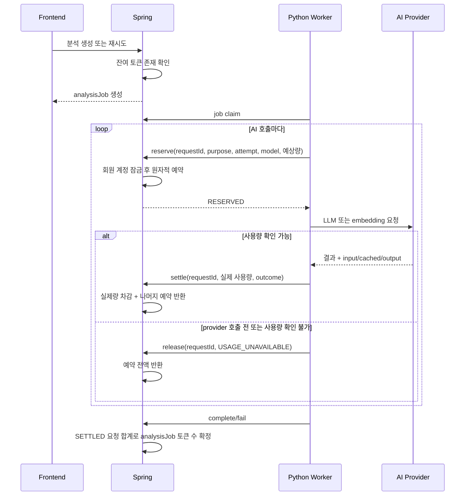

# AI Token Usage

AI 요청별 실제 토큰 사용량을 관측하면서, 결제 기능이 없는 MVP 회원에게 일회성 기본 한도를 제공하는 흐름을 정리합니다.

## 정책

- 회원은 `AI_TOKEN_DEFAULT_GRANT`만큼 최초 한 번 지급받습니다.
- 지급량과 사용량은 누적되며 월 단위로 자동 초기화하지 않습니다.
- 잔여량은 `granted - used - reserved`입니다.
- 분석 요청 생성·재시도 시 잔여량이 0이면 `AI_TOKEN_QUOTA_EXHAUSTED`로 거절합니다.
- 실제로 실행되는 각 LLM·임베딩 호출 직전에는 예상 최대량을 예약하므로 동시 분석이 한도를 중복 소비하지 못합니다. 임베딩 feature flag가 꺼진 경우에는 임베딩 예약도 만들지 않습니다.
- provider가 사용량을 반환하면 실제 input/output을 정산하고 사용하지 않은 예약량은 즉시 반환합니다.
- provider를 호출하기 전에 실패했거나 사용량을 알 수 없는 실패는 예약을 해제합니다.
- prompt, 원고, 모델 응답 본문은 토큰 이력에 저장하지 않습니다.

cached input은 input token의 일부이므로 관측 컬럼으로 별도 기록하되 사용량 합계에 다시 더하지 않습니다. 실제 차감량은 `input_tokens + output_tokens`입니다.

## 데이터 구조

| 테이블 | 책임 |
| --- | --- |
| `ai_token_accounts` | 회원별 누적 지급·사용·예약량의 현재 상태 |
| `ai_token_grants` | `DEFAULT`, `MANUAL` 지급 이력 |
| `ai_token_usages` | 요청 UUID별 예약·정산·해제와 모델 사용량 |

`ai_token_usages.purpose`는 호출 목적을 구분합니다.

- `SETTING_EXTRACTION`: 청크 설정 후보 추출과 그 재시도
- `SUBJECT_RESOLUTION`: 지칭어 주체 fallback
- `CHUNK_EMBEDDING`: 청크 batch 임베딩

## 요청 흐름



`attempt`는 같은 분석 작업·목적 안의 호출 순번이며 schema 검증 재시도도 각각 별도 순번으로 남습니다.

같은 `requestId`의 reserve·settle·release 재호출은 중복 차감을 만들지 않습니다. 이미 반대 상태로 종료된 요청을 다른 상태로 바꾸려 하면 conflict로 거절합니다.

## API

### 사용자 사용량

```text
GET /api/v1/ai-token-usage/me
```

응답은 `grantedTokens`, `usedTokens`, `reservedTokens`, `remainingTokens`, `remainingPercent`, `exhausted`, `contactEmail`을 제공합니다. Frontend 사이드바와 한도 소진 안내가 같은 계약을 사용합니다.

### Worker 내부 API

```text
POST /api/internal/v1/ai-token-usages/reserve
POST /api/internal/v1/ai-token-usages/{requestId}/settle
POST /api/internal/v1/ai-token-usages/{requestId}/release
```

내부 API는 기존 `X-Internal-Api-Key` 인증을 재사용합니다.

## 환경 변수

| 변수 | 기본값 | 의미 |
| --- | --- | --- |
| `AI_TOKEN_DEFAULT_GRANT` | `1000000` | 계정 최초 조회 또는 분석 시작 시 한 번 지급할 기본량 |
| `AI_TOKEN_CONTACT_EMAIL` | `support@catchhole.com` | 한도 소진 안내에 표시할 피드백 연락처 |

기본 지급량을 바꿔도 이미 생성된 계정은 소급 변경하지 않습니다.

## 운영 추가 지급

MVP에는 관리자 화면을 두지 않습니다. 운영자가 지급할 때는 같은 DB transaction에서 계정 행을 잠그고 현재량과 지급 이력을 함께 변경합니다.

```sql
BEGIN;

SELECT member_id
FROM ai_token_accounts
WHERE member_id = :member_id
FOR UPDATE;

UPDATE ai_token_accounts
SET granted_tokens = granted_tokens + :amount,
    updated_at = CURRENT_TIMESTAMP
WHERE member_id = :member_id;

INSERT INTO ai_token_grants (id, member_id, amount, grant_type, note, created_at, updated_at)
VALUES (gen_random_uuid(), :member_id, :amount, 'MANUAL', :note, CURRENT_TIMESTAMP, CURRENT_TIMESTAMP);

COMMIT;
```

계정 행이 아직 없다면 사용량 API를 한 번 조회해 기본 계정을 생성한 뒤 지급합니다. 지급 이력 없이 계정 숫자만 수정하지 않습니다.

## 장애와 점검

- Worker의 정상 예외 경로는 사용량을 정산하거나 예약을 해제합니다.
- 프로세스 강제 종료나 Spring 연결 단절이 예약 직후 발생하면 `RESERVED`가 남을 수 있습니다. 자동 만료는 현재 MVP 범위에 넣지 않았으므로 오래된 예약과 해당 analysis job 상태를 함께 확인한 뒤 운영자가 해제해야 합니다.
- 실제 provider 사용량이 예상 예약량보다 커지면 실제량을 보존해 정산하고 잔여량은 0으로 표시합니다. 다음 AI 호출은 거절됩니다.
- `analysis_jobs.input_token_count`, `output_token_count`는 Worker가 보내는 임의 합계가 아니라 해당 job의 `SETTLED` 이력을 Spring이 집계한 값입니다.

오래된 예약 확인 예시:

```sql
SELECT request_id, member_id, analysis_job_id, purpose, reserved_tokens, created_at
FROM ai_token_usages
WHERE status = 'RESERVED'
  AND created_at < CURRENT_TIMESTAMP - INTERVAL '30 minutes'
ORDER BY created_at;
```
