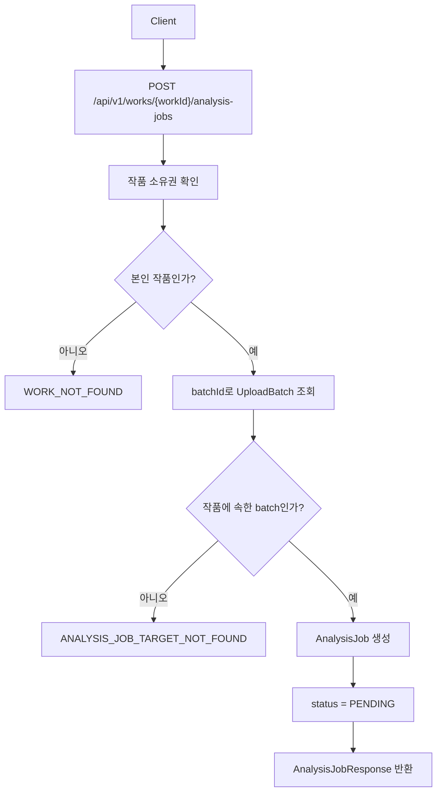
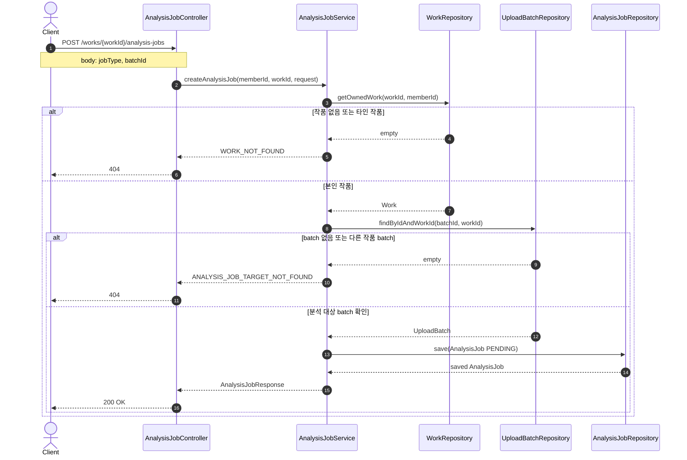
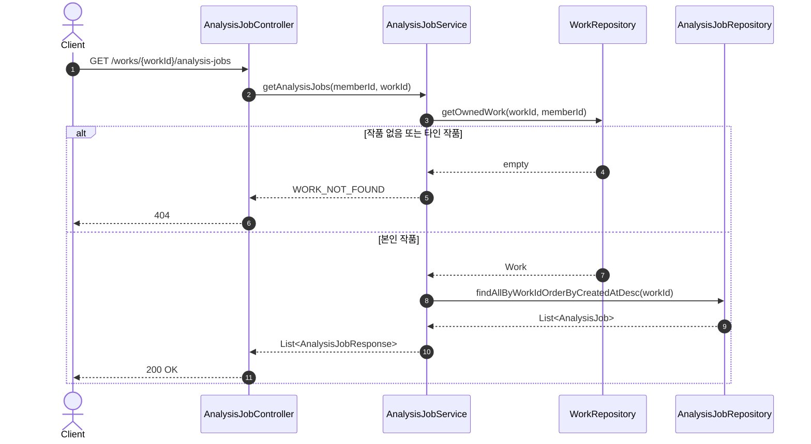
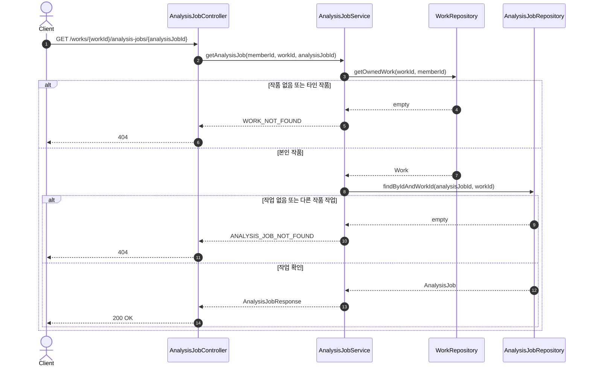
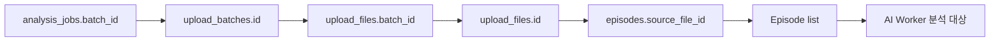
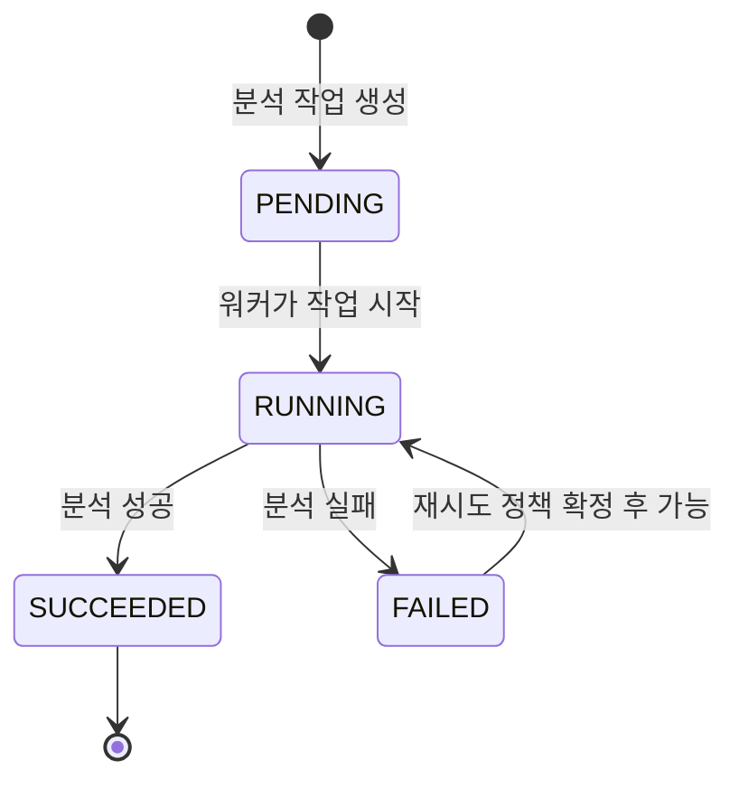

# Analysis Workflow

Analysis 도메인의 API별 처리 흐름을 눈으로 확인하기 위한 문서입니다.

상세 필드와 설계 결정은 [Analysis](analysis.md)를 기준으로 확인합니다.

## 전체 흐름

## 분석 작업 생성 API

## 분석 작업 목록 조회 API

## 분석 작업 상세 조회 API

## Batch 내부 분석 대상 조회

분석 작업 생성 request는 `batchId`만 받습니다.

실제 분석 단계에서 batch에 속한 회차 목록이 필요하면 다음 관계를 따라 조회합니다.

## 상태 전이

현재 구현 범위에서는 생성 시 `PENDING` 상태로 저장하고, 이후 `RUNNING`, `SUCCEEDED`, `FAILED` 전이는 워커 연동 작업에서 연결합니다.
