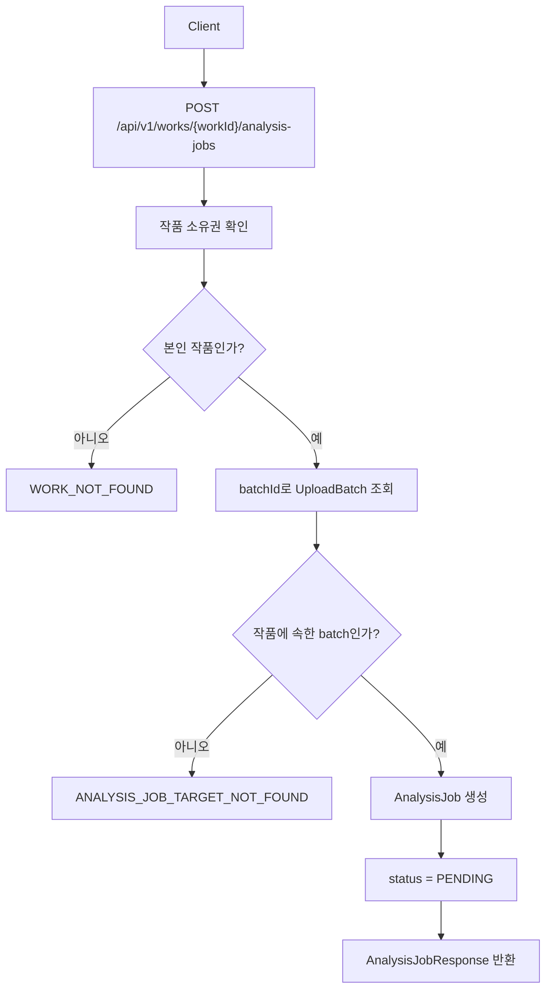
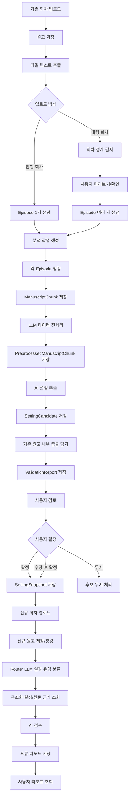
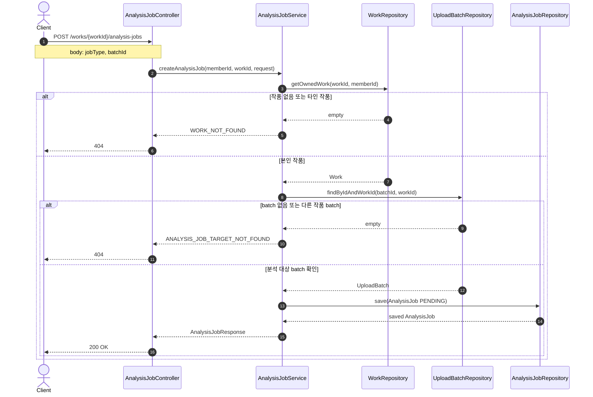
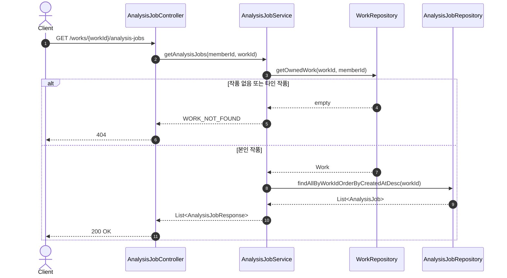
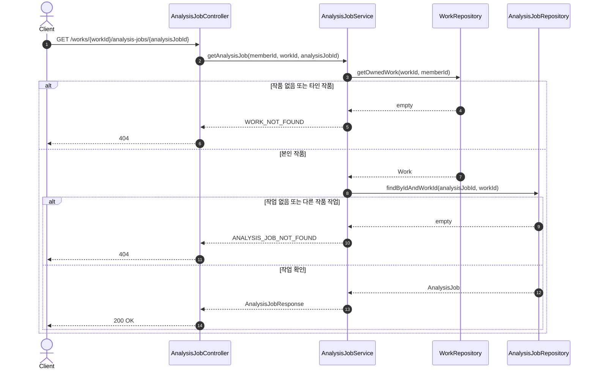
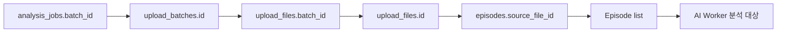
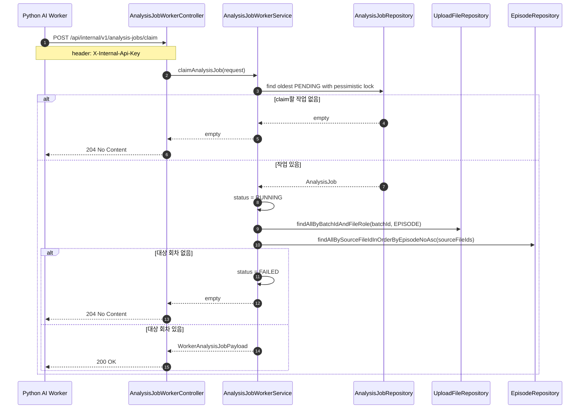
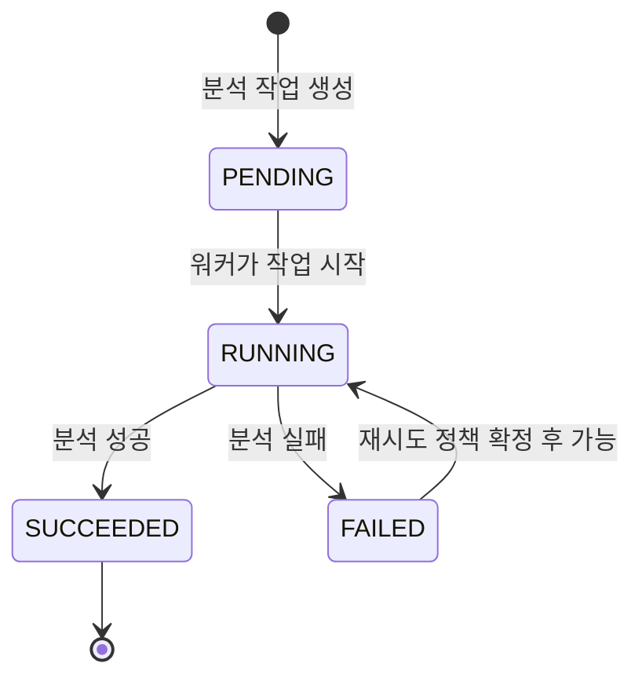

# Analysis Workflow

Analysis 도메인의 API별 처리 흐름을 눈으로 확인하기 위한 문서입니다.

상세 필드와 설계 결정은 [Analysis](analysis.md)를 기준으로 확인합니다.

## 전체 흐름

## Notion 기준 전체 분석 흐름

아래 흐름은 Notion의 “흐름 정리 - 임준우”에 있는 전체 작업 흐름을 백엔드 기준 용어로 옮긴 것입니다.

현재 구현 범위는 분석 작업 생성/조회, 업로드 batch 연결, Worker 내부 claim/상태 변경 API까지입니다. 실제 청킹, LLM 전처리, 설정 후보, 검수 리포트 저장은 후속 AI Worker 구현 범위입니다.

## Notion 기준 저장 순서

1. 백엔드는 사용자 권한과 작품 소유 여부를 검증합니다.
2. 파일 업로드 방식이면 원본 파일을 object storage에 저장하고 원본 파일 참조를 `UploadFile`에 저장합니다.
3. 파일에서 원문 텍스트를 추출합니다.
4. 단일 회차 업로드라면 입력된 회차 정보로 `Episode`를 1개 생성합니다.
5. 대량 회차 업로드라면 회차 경계를 감지하고 사용자 확인 후 `Episode`를 여러 개 생성합니다.
6. 각 회차 원문을 문단, 장면, 길이 기준으로 나누어 `ManuscriptChunk`를 생성합니다.
7. 청크마다 회차 번호, 문단 번호, 장면 번호, 문자 offset 같은 원문 위치 메타데이터를 저장합니다.
8. 기존 설정 구축용 업로드라면 `SETTING_EXTRACTION` 작업을 생성합니다.
9. 신규 회차 검수용 업로드라면 `EPISODE_VALIDATION` 작업을 생성합니다.
10. Spring Boot 서버는 작업 상태를 `PENDING`으로 둡니다.
11. Worker는 내부 claim API를 polling해 작업 ID와 회차 메타데이터를 가져옵니다.
12. Worker는 청킹된 원문을 LLM 데이터 전처리에 넣고, 결과를 `PreprocessedManuscriptChunk`로 저장합니다.
13. Worker는 전처리 결과를 기준으로 임베딩 생성, 설정 정보 추출, 후보 저장을 수행합니다.

## 분석 작업 생성 API

## 분석 작업 목록 조회 API

## 분석 작업 상세 조회 API

## Batch 내부 분석 대상 조회

분석 작업 생성 request는 `batchId`만 받습니다.

실제 분석 단계에서 batch에 속한 회차 목록이 필요하면 다음 관계를 따라 조회합니다.

## Worker 내부 API Polling

## 상태 전이

Worker가 내부 claim API로 작업을 가져가면 `RUNNING`으로 전환합니다. 이후 Worker가 내부 상태 변경 API로 `SUCCEEDED` 또는 `FAILED`를 기록합니다.

## Episode 처리 상태

Notion에는 `Episode.processingStatus`라는 이름으로 정리되어 있으나, 현재 코드에서는 `Episode.status`와 `EpisodeStatus` enum을 사용합니다.

| 상태 | 의미 | 다음 상태 |
| --- | --- | --- |
| `UPLOADED` | 원문 저장 완료 | `CHUNKING`, `FAILED` |
| `CHUNKING` | 원문 청킹 진행 중 | `CHUNKED`, `FAILED` |
| `CHUNKED` | 청크 저장 완료 | `PREPROCESSING` |
| `PREPROCESSING` | LLM 데이터 전처리 진행 중 | `PREPROCESSED`, `FAILED` |
| `PREPROCESSED` | LLM 전처리 결과 저장 완료 | `ANALYZING` |
| `ANALYZING` | AI 설정 추출 진행 중 | `ANALYZED`, `FAILED` |
| `ANALYZED` | 설정 후보 생성 완료 | 없음 |
| `FAILED` | 처리 실패 | 재시도 시 이전 처리 단계 |

## AnalysisJob 유형과 상태

Notion 설계의 `AnalysisJob.type`은 현재 분석 초안의 `jobType`에 해당합니다.

| 유형 | 의미 | 생성 시점 |
| --- | --- | --- |
| `SETTING_EXTRACTION` | 기존 회차 원고에서 캐릭터, 아이템, 능력, 시간 흐름 같은 설정 후보를 추출 | 기존 설정 구축용 회차 업로드 후 청킹 완료 시 |
| `BASELINE_CONSISTENCY_CHECK` | 기존 회차들에서 추출된 설정 후보끼리 충돌하는지 검수 | 기존 회차 설정 후보 저장 완료 후, 사용자 기준 설정 확정 전 |
| `EPISODE_VALIDATION` | 신규 회차가 기존 확정 설정과 충돌하는지 검수 | 신규 회차 검수용 업로드 후 청킹 완료 시 |

현재 코드 초안에는 `SETTING_EXTRACTION`, `EPISODE_VALIDATION`만 포함합니다. `BASELINE_CONSISTENCY_CHECK`는 기존 원고 내부 정합성 검수 기능을 구현할 때 추가합니다.

Notion 기준 `AnalysisJob.status`

| 상태 | 의미 | 다음 상태 |
| --- | --- | --- |
| `PENDING` | 작업 생성 후 대기 | `RUNNING`, `CANCELED` |
| `RUNNING` | Worker 처리 중 | `SUCCEEDED`, `FAILED` |
| `SUCCEEDED` | 결과 저장 완료 | 없음 |
| `FAILED` | 처리 실패 | `PENDING`, `CANCELED` |
| `CANCELED` | 사용자 또는 시스템 취소 | 없음 |

현재 코드 초안에는 `CANCELED`가 없습니다. 취소 API 또는 시스템 취소 정책이 정해질 때 추가합니다.

## LLM 전처리와 설정 후보 저장

LLM 전처리 입력은 다음 정보를 포함합니다.

- 작품 ID와 `Episode` ID
- 회차 번호, 제목, 문단 번호, 장면 번호 같은 위치 메타데이터
- `ManuscriptChunk` ID와 청크 순서
- `ManuscriptChunk` 원문 텍스트
- 작품 장르와 설정 추출 우선순위

LLM 전처리 출력은 다음 정보를 포함합니다.

- 청크 요약
- 등장 인물과 별칭 후보
- 설정 후보 유형: 캐릭터 상태, 아이템/스킬, 시간 경과, 사건 결과, 관계 변화
- 원문에서 설정 추출에 불필요한 노이즈 또는 메타 텍스트 표시
- 장면/문단 경계 보정 필요 여부
- 회차/청크 메타데이터 연결 정보
- 후속 설정 추출에 넘길 구조화된 입력 JSON

설정 후보 저장 규칙은 다음과 같습니다.

- Worker는 원문 청크와 LLM 전처리 결과를 함께 사용해 설정 후보를 추출합니다.
- 추출 결과는 `SettingCandidate`에 `PENDING_REVIEW` 상태로 저장합니다.
- 후보에는 설정 유형, 설정 값, 신뢰도, 근거 청크, AI 원본 응답, 추출 작업 ID를 연결합니다.
- 저장이 끝나면 `AnalysisJob.status=SUCCEEDED`, `Episode.status=ANALYZED`로 변경합니다.
- 여러 기존 회차의 설정 후보가 생성된 뒤에는 작품 단위 `BASELINE_CONSISTENCY_CHECK` 작업을 생성해 기존 원고 내부 충돌 후보를 탐지할 수 있습니다.

## 기존 원고 내부 정합성 검수

기존 회차 사이의 설정 충돌은 확정 오류가 아니라 사용자가 검토해야 하는 후보로 저장합니다.

검수 흐름은 다음과 같습니다.

1. 설정 후보 추출이 끝난 기존 회차들을 회차 번호 순서로 정렬합니다.
2. 캐릭터명, 별칭, 설정 유형, 설정 key를 기준으로 같은 의미의 후보를 묶습니다.
3. 시간 흐름상 자연스러운 변화인지, 근거 없는 충돌인지 비교합니다.
4. 충돌 가능성이 있으면 `ValidationReport.reportType=BASELINE_CONSISTENCY` 리포트를 생성합니다.
5. 개별 충돌 후보는 `ValidationFinding`으로 저장하고, 양쪽 근거 회차와 문단 위치를 모두 연결합니다.
6. 사용자는 후보를 `CONFIRMED`, `DISMISSED`, `FIXED`로 검토합니다.
7. 사용자가 정리한 결과만 `SettingSnapshot`에 기준 설정 또는 설정 변화 이력으로 반영합니다.

사용자 결정 기준

| 사용자 결정 | 처리 |
| --- | --- |
| 실제 오류로 확정 | `ValidationFinding.reviewStatus=CONFIRMED`로 변경하고 수정 대상 원고 또는 설정 후보를 표시 |
| 의도된 설정 변화로 판단 | `DISMISSED` 처리하거나 설정 변화 이력으로 `SettingSnapshot` 버전에 반영 |
| 원고 또는 설정 후보 수정 완료 | `FIXED` 처리하고 수정된 후보를 기준 설정 반영 대상으로 전환 |

## 신규 회차 검수

신규 회차 검수용 업로드도 원문 저장과 청킹까지는 기존 회차 업로드와 같은 흐름을 사용합니다.

다만 분석 작업은 `EPISODE_VALIDATION` 유형으로 만들고, AI 검수 전에 Router LLM 또는 규칙 기반 classifier가 신규 회차에서 검토가 필요한 설정 유형을 분류합니다.

근거 조회는 다음 데이터를 함께 사용합니다.

- 신규 회차의 문장 또는 문단 청크
- 해당 작품의 최신 `SettingSnapshot`
- Router LLM이 분류한 설정 유형
- 캐릭터명, 별칭, 설정 key 기준의 구조화 조회 결과
- pgvector 기반 관련 과거 원문 Top-K
- 과거 설정 후보와 사용자가 확정한 수정 이력

구조화 조회는 수치/상태 비교의 기준이고, 벡터 검색은 원문 맥락과 근거 문장을 찾기 위한 보조 수단입니다. 둘 중 하나만 사용하지 않습니다.

## 오류 리포트 데이터

`ValidationReport`는 기존 원고 내부 정합성 검수와 신규 회차 검수에서 공통으로 사용합니다. `reportType`으로 리포트 성격을 구분합니다.

| 리포트 유형 | 의미 |
| --- | --- |
| `BASELINE_CONSISTENCY` | 기존 회차들 사이의 설정 충돌 후보 |
| `EPISODE_VALIDATION` | 신규 회차와 확정 기준 설정 사이의 충돌 후보 |

`ValidationFinding.reviewStatus`

| 상태 | 의미 |
| --- | --- |
| `OPEN` | 사용자가 아직 확인하지 않은 오류 후보 |
| `CONFIRMED` | 사용자가 실제 오류로 판단 |
| `DISMISSED` | 사용자가 오류가 아니라고 판단 |
| `FIXED` | 사용자가 원고 수정 또는 설정 갱신을 완료 |

`ValidationFinding`은 최소한 다음 정보를 포함합니다.

- 오류 유형: 수치 불일치, 아이템/스킬 보유 여부 불일치, 시간 경과 불일치, 상태 변화 불일치
- 심각도: `LOW`, `MEDIUM`, `HIGH`
- 비교 대상 위치: 회차 번호, 문단 번호, 문장, 문자 offset
- 기존 근거 또는 반대 근거: 회차 번호, 문단 번호, 원문 문장, 연결된 설정 후보 또는 설정 스냅샷
- 비교 값: 신규 원고 값과 기존 기준 값, 또는 기존 회차 A의 값과 기존 회차 B의 값
- AI 수정 제안
- 사용자 검토 상태

## 실패 및 재시도 기준

| 단계 | 실패 원인 | 처리 |
| --- | --- | --- |
| 원문 저장 | 파일 형식 오류, 빈 원문, 권한 없음 | 동기 API에서 실패 응답 |
| 원본 파일 저장 | S3 업로드 실패, 파일 크기 초과 | 원본 파일 참조를 만들지 않고 업로드 실패 응답 |
| 청킹 | 텍스트 파싱 오류, 너무 긴 문단 | `Episode`와 `AnalysisJob`을 `FAILED` 처리하고 실패 사유 저장 |
| Worker claim | 내부 API 인증 실패, Worker가 작업 수신 실패 | 인증 실패는 401로 응답하고, 수신 실패 시 `AnalysisJob`은 `PENDING` 유지 |
| LLM 데이터 전처리 | LLM API 오류, 전처리 응답 스키마 오류, 장면/문단 매핑 실패 | `Episode`와 `AnalysisJob`을 `FAILED` 처리하고 재시도 가능 |
| AI 설정 추출 | LLM API 오류, 응답 스키마 오류, timeout | `AnalysisJob` 실패 처리, 재시도 가능 |
| 후보 저장 | DB 오류, 근거 청크 매핑 실패 | 작업 실패 처리, 중복 저장 방지를 위해 작업 단위 idempotency 필요 |
| 기존 원고 내부 검수 | 비교 대상 후보 부족, 회차 순서 누락, LLM 응답 스키마 오류 | `ValidationReport` 실패 처리 또는 근거 부족 리포트로 저장 |
| 근거 검색 | 임베딩 누락, 검색 결과 부족 | 구조화 설정만으로 검수하거나 리포트에 근거 부족 표시 |
| AI 검수 | LLM API 오류, 응답 스키마 오류 | `ValidationReport` 실패 처리, 재시도 가능 |
| 리포트 저장 | 일부 finding 저장 실패 | 트랜잭션으로 전체 롤백 후 재시도 |
| 사용자 검토 | 이미 처리된 후보 수정, 권한 없음 | 동기 API에서 실패 응답 |

재시도는 같은 `AnalysisJob`을 재사용하되 `retryCount`를 증가시킵니다. 같은 작업이 중복 실행되어도 `Episode`, `SettingCandidate`, `ValidationReport`가 중복 생성되지 않도록 작업 ID와 대상 회차 ID를 기준으로 멱등성을 확보합니다.
