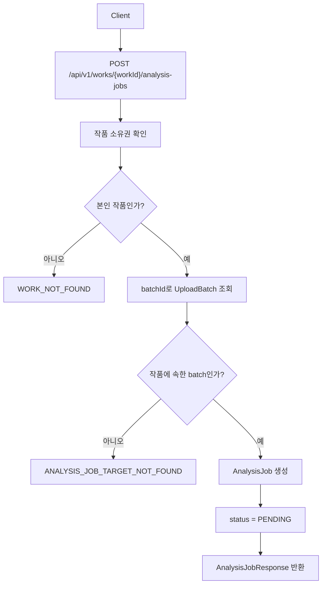
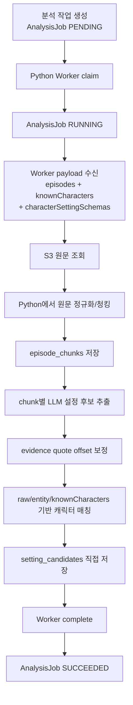
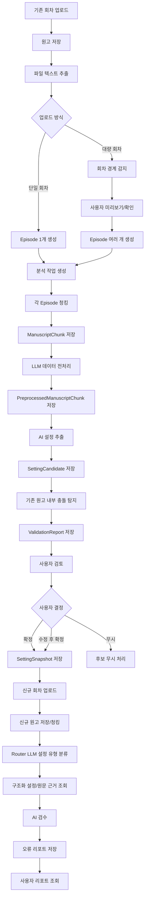
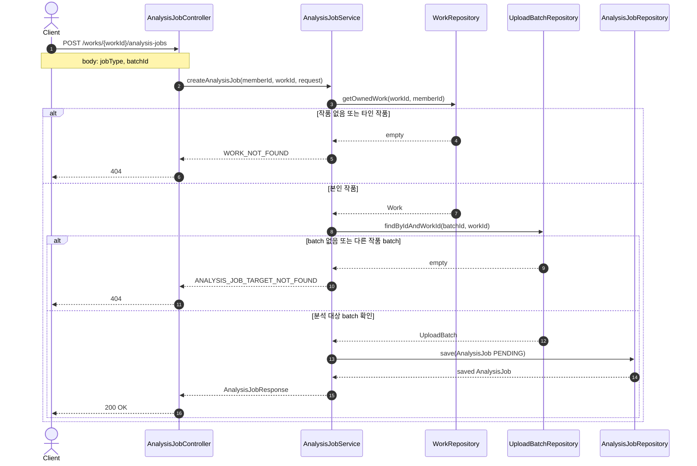
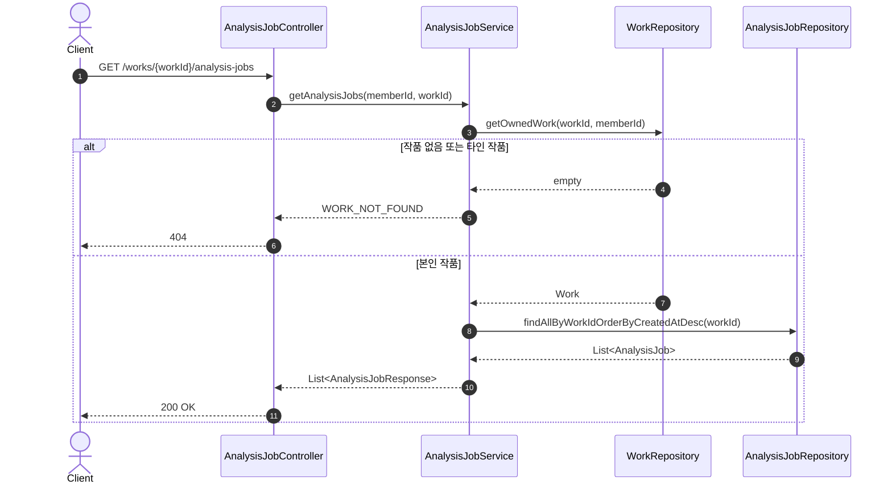
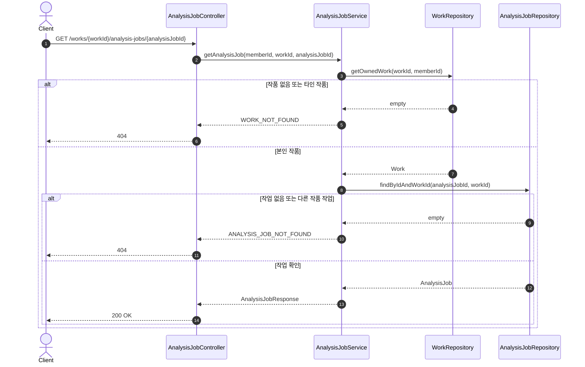
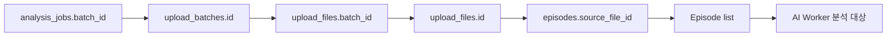
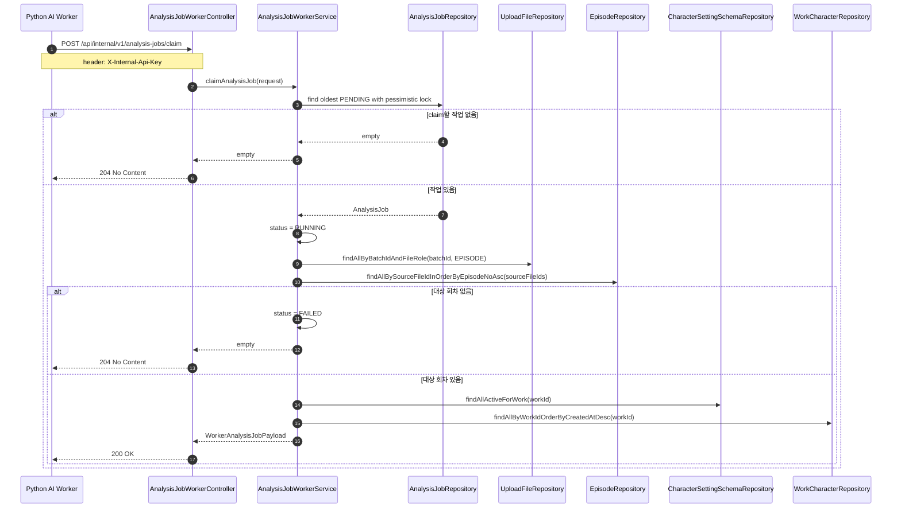
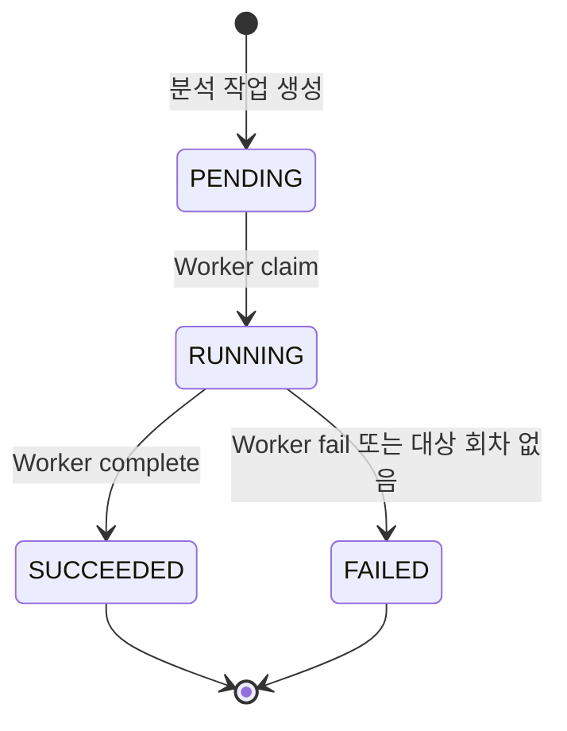

# Analysis Workflow

Analysis 도메인의 API별 처리 흐름을 눈으로 확인하기 위한 문서입니다.

상세 필드와 설계 결정은 [Analysis](analysis.md)를 기준으로 확인합니다.

## 전체 흐름

```mermaid
flowchart TD
    A["Client"] --> B["POST /api/v1/works/{workId}/analysis-jobs"]
    B --> C["작품 소유권 확인"]
    C --> D{"본인 작품인가?"}
    D -- "아니오" --> E["WORK_NOT_FOUND"]
    D -- "예" --> F["batchId로 UploadBatch 조회"]
    F --> G{"작품에 속한 batch인가?"}
    G -- "아니오" --> H["ANALYSIS_JOB_TARGET_NOT_FOUND"]
    G -- "예" --> I["AnalysisJob 생성"]
    I --> J["status = PENDING"]
    J --> K["AnalysisJobResponse 반환"]
```

## 현재 구현된 Worker 연동 흐름

현재 코드 기준으로 Spring은 분석 작업과 내부 API 계약을 관리하고, Python Worker는 S3 원문을 읽어 청킹/LLM 설정 후보 추출/후보 저장을 수행합니다.

```mermaid
flowchart TD
    A["분석 작업 생성<br/>AnalysisJob PENDING"] --> B["Python Worker claim"]
    B --> C["AnalysisJob RUNNING"]
    C --> D["Worker payload 수신<br/>episodes + knownCharacters<br/>+ characterSettingSchemas"]
    D --> E["S3 원문 조회"]
    E --> F["Python에서 원문 정규화/청킹"]
    F --> G["episode_chunks 저장"]
    G --> H["chunk별 LLM 설정 후보 추출"]
    H --> I["evidence quote offset 보정"]
    I --> J["raw/entity/knownCharacters 기반 캐릭터 매칭"]
    J --> K["setting_candidates 직접 저장"]
    K --> L["Worker complete"]
    L --> M["AnalysisJob SUCCEEDED"]
```

현재 구현에서 Spring은 `setting_candidates` 생성 API를 제공하지 않습니다. 후보 생성은 Worker의 DB 직접 저장 흐름이며, Spring은 생성된 후보의 조회/수정/확정/무시와 `AnalysisJob` 상태 전이를 담당합니다. Claim의 `characterSettingSchemas`는 Worker에 전달되는 schema hint이고, 동반 AI Worker 변경은 이 hint를 실제 추출 prompt의 canonical key, alias, pattern, value type 지침으로 사용합니다. Spring Backend는 사용자 confirm 시 schemaKey 정확 일치 → 별칭 → 마지막이 `.*`로 끝나는 속성 패턴 순으로 최종 매칭하고 후보/schema의 `SettingValueType`과 merge policy를 검증합니다. 미지원 정책은 부수효과 전에 거절하며, 검증된 Fact는 `setting_candidate_id`로 확정 후보를 연결해 `evidence_spans`를 역추적할 수 있게 합니다. 이후 episodeNo 기준 current를 재선정하고 `factKey -> current valueJson` object map snapshot으로 반영합니다.

## Notion 기준 전체 분석 흐름

아래 흐름은 Notion의 “흐름 정리 - 임준우”에 있는 전체 작업 흐름을 백엔드 기준 용어로 옮긴 것입니다.

현재 구현과 다르게 `ManuscriptChunk`, `PreprocessedManuscriptChunk`, `SettingSnapshot`, `ValidationReport` 같은 후속 모델까지 포함한 목표 흐름입니다. 현재 캐릭터 설정 후보 MVP에서는 `episode_chunks`, `setting_candidates`, `CharacterSettingSchema`, `CharacterFact`, `WorkCharacter` 중심으로 먼저 구현합니다.

```mermaid
flowchart TD
    A["기존 회차 업로드"] --> B["원고 저장"]
    B --> B1["파일 텍스트 추출"]
    B1 --> B2{"업로드 방식"}
    B2 -->|단일 회차| B3["Episode 1개 생성"]
    B2 -->|대량 회차| B4["회차 경계 감지"]
    B4 --> B5["사용자 미리보기/확인"]
    B5 --> B6["Episode 여러 개 생성"]
    B3 --> C["분석 작업 생성"]
    B6 --> C
    C --> C1["각 Episode 청킹"]
    C1 --> D["ManuscriptChunk 저장"]
    D --> R["LLM 데이터 전처리"]
    R --> R1["PreprocessedManuscriptChunk 저장"]
    R1 --> E["AI 설정 추출"]
    E --> F["SettingCandidate 저장"]
    F --> F1["기존 원고 내부 충돌 탐지"]
    F1 --> F2["ValidationReport 저장"]
    F2 --> G["사용자 검토"]
    G --> H{"사용자 결정"}
    H -->|확정| I["SettingSnapshot 저장"]
    H -->|수정 후 확정| I
    H -->|무시| J["후보 무시 처리"]
    I --> K["신규 회차 업로드"]
    K --> L["신규 원고 저장/청킹"]
    L --> M["Router LLM 설정 유형 분류"]
    M --> N["구조화 설정/원문 근거 조회"]
    N --> Q["AI 검수"]
    Q --> O["오류 리포트 저장"]
    O --> P["사용자 리포트 조회"]
```

## Notion 기준 저장 순서

1. 백엔드는 사용자 권한과 작품 소유 여부를 검증합니다.
2. 파일 업로드 방식이면 원본 파일을 object storage에 저장하고 원본 파일 참조를 `UploadFile`에 저장합니다.
3. 파일에서 원문 텍스트를 추출합니다.
4. 단일 회차 업로드라면 입력된 회차 정보로 `Episode`를 1개 생성합니다.
5. 대량 회차 업로드라면 회차 경계를 감지하고 사용자 확인 후 `Episode`를 여러 개 생성합니다.
6. 각 회차 원문을 문단, 장면, 길이 기준으로 나누어 `ManuscriptChunk`를 생성합니다.
7. 청크마다 회차 번호, 문단 번호, 장면 번호, 문자 offset 같은 원문 위치 메타데이터를 저장합니다.
8. 기존 설정 구축용 업로드라면 `SETTING_EXTRACTION` 작업을 생성합니다.
9. 신규 회차 검수용 업로드라면 `EPISODE_VALIDATION` 작업을 생성합니다.
10. Spring Boot 서버는 작업 상태를 `PENDING`으로 둡니다.
11. Worker는 내부 claim API를 polling해 작업 ID, 회차 메타데이터, 기존 캐릭터 목록, 활성 캐릭터 설정 schema를 가져옵니다.
12. 현재 Worker는 S3 원문을 읽어 직접 정규화/청킹하고 `episode_chunks`를 저장합니다.
13. Worker는 청크별 LLM 설정 후보를 추출하고, quote offset 보정과 캐릭터 매칭 상태 계산 후 `setting_candidates`를 저장합니다.
14. `PreprocessedManuscriptChunk`, `SettingSnapshot`, `ValidationReport` 기반 흐름은 후속 검수 모델 구현 때 확장합니다.

## 분석 작업 생성 API

```mermaid
sequenceDiagram
    autonumber
    actor Client
    participant Controller as AnalysisJobController
    participant Service as AnalysisJobService
    participant WorkRepo as WorkRepository
    participant BatchRepo as UploadBatchRepository
    participant JobRepo as AnalysisJobRepository

    Client->>Controller: POST /works/{workId}/analysis-jobs
    Note over Client,Controller: body: jobType, batchId
    Controller->>Service: createAnalysisJob(memberId, workId, request)
    Service->>WorkRepo: getOwnedWork(workId, memberId)
    alt 작품 없음 또는 타인 작품
        WorkRepo-->>Service: empty
        Service-->>Controller: WORK_NOT_FOUND
        Controller-->>Client: 404
    else 본인 작품
        WorkRepo-->>Service: Work
        Service->>BatchRepo: findByIdAndWorkId(batchId, workId)
        alt batch 없음 또는 다른 작품 batch
            BatchRepo-->>Service: empty
            Service-->>Controller: ANALYSIS_JOB_TARGET_NOT_FOUND
            Controller-->>Client: 404
        else 분석 대상 batch 확인
            BatchRepo-->>Service: UploadBatch
            Service->>JobRepo: save(AnalysisJob PENDING)
            JobRepo-->>Service: saved AnalysisJob
            Service-->>Controller: AnalysisJobResponse
            Controller-->>Client: 200 OK
        end
    end
```

## 분석 작업 목록 조회 API

```mermaid
sequenceDiagram
    autonumber
    actor Client
    participant Controller as AnalysisJobController
    participant Service as AnalysisJobService
    participant WorkRepo as WorkRepository
    participant JobRepo as AnalysisJobRepository

    Client->>Controller: GET /works/{workId}/analysis-jobs
    Controller->>Service: getAnalysisJobs(memberId, workId)
    Service->>WorkRepo: getOwnedWork(workId, memberId)
    alt 작품 없음 또는 타인 작품
        WorkRepo-->>Service: empty
        Service-->>Controller: WORK_NOT_FOUND
        Controller-->>Client: 404
    else 본인 작품
        WorkRepo-->>Service: Work
        Service->>JobRepo: findAllByWorkIdOrderByCreatedAtDesc(workId)
        JobRepo-->>Service: List<AnalysisJob>
        Service-->>Controller: List<AnalysisJobResponse>
        Controller-->>Client: 200 OK
    end
```

## 분석 작업 상세 조회 API

```mermaid
sequenceDiagram
    autonumber
    actor Client
    participant Controller as AnalysisJobController
    participant Service as AnalysisJobService
    participant WorkRepo as WorkRepository
    participant JobRepo as AnalysisJobRepository

    Client->>Controller: GET /works/{workId}/analysis-jobs/{analysisJobId}
    Controller->>Service: getAnalysisJob(memberId, workId, analysisJobId)
    Service->>WorkRepo: getOwnedWork(workId, memberId)
    alt 작품 없음 또는 타인 작품
        WorkRepo-->>Service: empty
        Service-->>Controller: WORK_NOT_FOUND
        Controller-->>Client: 404
    else 본인 작품
        WorkRepo-->>Service: Work
        Service->>JobRepo: findByIdAndWorkId(analysisJobId, workId)
        alt 작업 없음 또는 다른 작품 작업
            JobRepo-->>Service: empty
            Service-->>Controller: ANALYSIS_JOB_NOT_FOUND
            Controller-->>Client: 404
        else 작업 확인
            JobRepo-->>Service: AnalysisJob
            Service-->>Controller: AnalysisJobResponse
            Controller-->>Client: 200 OK
        end
    end
```

## Batch 내부 분석 대상 조회

분석 작업 생성 request는 `batchId`만 받습니다.

실제 분석 단계에서 batch에 속한 회차 목록이 필요하면 다음 관계를 따라 조회합니다.

```mermaid
flowchart LR
    A["analysis_jobs.batch_id"] --> B["upload_batches.id"]
    B --> C["upload_files.batch_id"]
    C --> D["upload_files.id"]
    D --> E["episodes.source_file_id"]
    E --> F["Episode list"]
    F --> G["AI Worker 분석 대상"]
```

## Worker 내부 API Polling

```mermaid
sequenceDiagram
    autonumber
    participant Worker as Python AI Worker
    participant Controller as AnalysisJobWorkerController
    participant Service as AnalysisJobWorkerService
    participant JobRepo as AnalysisJobRepository
    participant UploadRepo as UploadFileRepository
    participant EpisodeRepo as EpisodeRepository
    participant SchemaRepo as CharacterSettingSchemaRepository
    participant CharacterRepo as WorkCharacterRepository

    Worker->>Controller: POST /api/internal/v1/analysis-jobs/claim
    Note over Worker,Controller: header: X-Internal-Api-Key
    Controller->>Service: claimAnalysisJob(request)
    Service->>JobRepo: find oldest PENDING with pessimistic lock
    alt claim할 작업 없음
        JobRepo-->>Service: empty
        Service-->>Controller: empty
        Controller-->>Worker: 204 No Content
    else 작업 있음
        JobRepo-->>Service: AnalysisJob
        Service->>Service: status = RUNNING
        Service->>UploadRepo: findAllByBatchIdAndFileRole(batchId, EPISODE)
        Service->>EpisodeRepo: findAllBySourceFileIdInOrderByEpisodeNoAsc(sourceFileIds)
        alt 대상 회차 없음
            Service->>Service: status = FAILED
            Service-->>Controller: empty
            Controller-->>Worker: 204 No Content
        else 대상 회차 있음
            Service->>SchemaRepo: findAllActiveForWork(workId)
            Service->>CharacterRepo: findAllByWorkIdOrderByCreatedAtDesc(workId)
            Service-->>Controller: WorkerAnalysisJobPayload
            Controller-->>Worker: 200 OK
        end
    end
```

Claim payload의 `characterSettingSchemas`는 `enabled = true`인 전역 schema와 현재 작품의 추가 schema를 `schemaKey` 오름차순으로 조회한 결과입니다. Registry row가 없으면 빈 배열이며, Worker에는 `schemaKey`, `displayName`, `attributePattern`, `aliases`, `valueType`만 노출합니다.

## 상태 전이

```mermaid
stateDiagram-v2
    [*] --> PENDING: 분석 작업 생성
    PENDING --> RUNNING: Worker claim
    RUNNING --> SUCCEEDED: Worker complete
    RUNNING --> FAILED: Worker fail 또는 대상 회차 없음
    SUCCEEDED --> [*]
    FAILED --> [*]
```

Worker가 내부 claim API로 작업을 가져가면 `RUNNING`으로 전환합니다. 이후 Worker가 내부 상태 변경 API로 `SUCCEEDED` 또는 `FAILED`를 기록합니다.
`FAILED` 이후 재시도는 현재 코드에 직접 전이로 연결되어 있지 않습니다. 같은 작업을 재사용할지 새 작업을 만들지는 후속 정책으로 결정합니다.

화면에서는 `AnalysisJob.status`를 분석 작업의 상위 상태로 표시합니다. 현재 분석 작업 상세 응답은 회차별 `Episode.status` 목록을 포함하지 않습니다.
회차별 단계 표시는 Worker 단계별 회차 상태 전이와 상세 응답 확장이 연결된 뒤 후속으로 구현합니다.
후속 Worker의 회차 상태 변경은 단계별 엔드포인트를 나누지 않고, `EpisodeStatus`를 파라미터로 받는 단일 내부 전이 API로 구현합니다.

## Episode 처리 상태

Notion에는 `Episode.processingStatus`라는 이름으로 정리되어 있으나, 현재 코드에서는 `Episode.status`와 `EpisodeStatus` enum을 사용합니다.

| 상태 | 의미 | 다음 상태 | 현재 코드 연결 |
| --- | --- | --- | --- |
| `UPLOADED` | 원문 저장 완료 | `CHUNKING`, `FAILED` | `Episode.create()`, `Episode.updateContent()`에서 설정 |
| `CHUNKING` | 원문 청킹 진행 중 | `CHUNKED`, `FAILED` | `markChunking()` 메서드만 있고 호출 API는 미정 |
| `CHUNKED` | 청크 저장 완료 | `PREPROCESSING` | `markChunked()` 메서드만 있고 `ManuscriptChunk` 구현 후 연결 |
| `PREPROCESSING` | LLM 데이터 전처리 진행 중 | `PREPROCESSED`, `FAILED` | `markPreprocessing()` 메서드만 있고 호출 API는 미정 |
| `PREPROCESSED` | LLM 전처리 결과 저장 완료 | `ANALYZING` | `markPreprocessed()` 메서드만 있고 전처리 산출물 모델 구현 후 연결 |
| `ANALYZING` | AI 설정 추출 진행 중 | `ANALYZED`, `FAILED` | `markAnalyzing()` 메서드만 있고 분석 작업 상세의 회차별 단계로 표시 |
| `ANALYZED` | 설정 후보 생성 완료 | 없음 | `markAnalyzed()` 메서드만 있고 결과 저장 흐름 구현 후 연결 |
| `FAILED` | 처리 실패 | 재시도 정책 확정 후 결정 | `markFailed()`로 마지막 실패 사유를 기록하고, 실패 처리 이력은 후속 모니터링 기능에서 조회 |
| `ARCHIVED` | 일반 조회/분석 대상 제외 | 복구 정책 확정 후 결정 | `archive()` 메서드만 있고 현재 회차 삭제 API는 hard delete |

## AnalysisJob 유형과 상태

Notion 설계의 `AnalysisJob.type`은 현재 분석 초안의 `jobType`에 해당합니다.

| 유형 | 의미 | 생성 시점 |
| --- | --- | --- |
| `SETTING_EXTRACTION` | 기존 회차 원고에서 캐릭터, 아이템, 능력, 시간 흐름 같은 설정 후보를 추출 | 기존 설정 구축용 회차 업로드 후 청킹 완료 시 |
| `BASELINE_CONSISTENCY_CHECK` | 기존 회차들에서 추출된 설정 후보끼리 충돌하는지 검수 | 기존 회차 설정 후보 저장 완료 후, 사용자 기준 설정 확정 전 |
| `EPISODE_VALIDATION` | 신규 회차가 기존 확정 설정과 충돌하는지 검수 | 신규 회차 검수용 업로드 후 청킹 완료 시 |

현재 코드 초안에는 `SETTING_EXTRACTION`, `EPISODE_VALIDATION`만 포함합니다. `BASELINE_CONSISTENCY_CHECK`는 기존 원고 내부 정합성 검수 기능을 구현할 때 추가합니다.

Notion 기준 `AnalysisJob.status`

| 상태 | 의미 | 다음 상태 | 현재 코드 연결 |
| --- | --- | --- | --- |
| `PENDING` | 작업 생성 후 대기 | `RUNNING` | 분석 작업 생성 API에서 `AnalysisJob.create()`로 생성 |
| `RUNNING` | Worker 처리 중 | `SUCCEEDED`, `FAILED` | Worker claim API에서 `AnalysisJob.start()`로 전환 |
| `SUCCEEDED` | 결과 저장 완료 | 없음 | Worker complete API에서 `AnalysisJob.succeed()`로 전환 |
| `FAILED` | 처리 실패 | 재시도 정책 확정 후 결정 | Worker fail API 또는 대상 회차 없음에서 `AnalysisJob.fail()`로 전환 |

현재 코드에는 `CANCELED`가 없습니다. 취소 API 또는 시스템 취소 정책이 정해질 때 추가합니다.

## 현재 설정 후보 저장 흐름

현재 구현은 별도 `PreprocessedManuscriptChunk` 없이 Python Worker가 청크 원문을 LLM에 직접 넣어 `setting_candidates`를 저장합니다.

1. Spring claim payload는 `analysisJobId`, `workId`, `batchId`, episode S3 메타데이터, `knownCharacters`, `characterSettingSchemas`를 내려줍니다.
2. Python Worker는 `contentS3Key`, `contentS3Version`으로 S3 원문을 읽습니다.
3. Worker는 원문을 정규화/청킹하고 `episode_chunks`를 저장합니다.
4. Worker는 chunk별 LLM 설정 후보를 추출합니다.
5. Worker는 LLM이 반환한 `evidence_spans[].quote`를 chunk 원문에서 다시 찾아 `start_offset`, `end_offset`을 보정합니다.
6. Worker는 `rawEntityMention`, `entityName`, `knownCharacters`를 비교해 `matchedCharacterId`, `matchStatus`를 계산합니다.
7. Worker는 후보를 `PENDING_REVIEW` 상태의 `setting_candidates`로 저장합니다.
8. 저장이 끝나면 complete API를 호출해 `AnalysisJob.status=SUCCEEDED`로 변경합니다.

현재 complete API는 `AnalysisJob` 상태와 summary/token 메타데이터를 반영합니다. 회차별 `Episode.status=ANALYZED` 전이는 아직 Worker 내부 API와 연결하지 않았고, 후속 정책으로 둡니다.

캐릭터 매칭 후속 TODO:

- adjacent chunk fallback으로 `나`, `그`, `그녀` 같은 지칭어 후보를 해소한 뒤 `matchStatus` 품질을 높입니다.
- `MATCHED`, `UNRESOLVED`, `AMBIGUOUS`별 Spring confirm 처리 정책은 `docs/character.md`의 캐릭터 매칭 상태 기반 confirm 정책을 따릅니다.
- Spring은 `UNRESOLVED` 후보의 첫 confirm에서 trim 후 exact-name 활성 캐릭터를 재사용하거나 새 캐릭터를 생성하고, 같은 작품·이름의 `PENDING_REVIEW + UNRESOLVED + CHARACTER` 후보를 모두 해당 캐릭터에 `MATCHED`로 연결합니다. 같은 분석 claim에서 신규 캐릭터의 속성이 여러 후보로 생성되어도 이후 confirm이 한 캐릭터로 모이게 하기 위한 보정입니다.
- `AMBIGUOUS` 후보는 사용자가 character-match API로 `MATCHED` 또는 `UNRESOLVED` 상태로 해소한 뒤 confirm합니다.

## 후속 LLM 전처리와 검수 확장

LLM 전처리 입력은 다음 정보를 포함합니다.

- 작품 ID와 `Episode` ID
- 회차 번호, 제목, 문단 번호, 장면 번호 같은 위치 메타데이터
- `ManuscriptChunk` ID와 청크 순서
- `ManuscriptChunk` 원문 텍스트
- 작품 장르와 설정 추출 우선순위

LLM 전처리 출력은 다음 정보를 포함합니다.

- 청크 요약
- 등장 인물과 별칭 후보
- 설정 후보 유형: 캐릭터 상태, 아이템/스킬, 시간 경과, 사건 결과, 관계 변화
- 원문에서 설정 추출에 불필요한 노이즈 또는 메타 텍스트 표시
- 장면/문단 경계 보정 필요 여부
- 회차/청크 메타데이터 연결 정보
- 후속 설정 추출에 넘길 구조화된 입력 JSON

설정 후보 저장 규칙은 다음과 같습니다.

- Worker는 원문 청크와 LLM 전처리 결과를 함께 사용해 설정 후보를 추출할 수 있습니다.
- 추출 결과는 `SettingCandidate`에 `PENDING_REVIEW` 상태로 저장합니다.
- 후보에는 설정 유형, 설정 값, 신뢰도, 근거 청크, AI 원본 응답, 추출 작업 ID를 연결합니다.
- 저장이 끝나면 `AnalysisJob.status=SUCCEEDED`로 변경합니다. `Episode.status=ANALYZED` 전이는 후속 상태 전이 API와 함께 연결합니다.
- 여러 기존 회차의 설정 후보가 생성된 뒤에는 작품 단위 `BASELINE_CONSISTENCY_CHECK` 작업을 생성해 기존 원고 내부 충돌 후보를 탐지할 수 있습니다.

## 기존 원고 내부 정합성 검수

기존 회차 사이의 설정 충돌은 확정 오류가 아니라 사용자가 검토해야 하는 후보로 저장합니다.

검수 흐름은 다음과 같습니다.

1. 설정 후보 추출이 끝난 기존 회차들을 회차 번호 순서로 정렬합니다.
2. 캐릭터명, 별칭, 설정 유형, 설정 key를 기준으로 같은 의미의 후보를 묶습니다.
3. 시간 흐름상 자연스러운 변화인지, 근거 없는 충돌인지 비교합니다.
4. 충돌 가능성이 있으면 `ValidationReport.reportType=BASELINE_CONSISTENCY` 리포트를 생성합니다.
5. 개별 충돌 후보는 `ValidationFinding`으로 저장하고, 양쪽 근거 회차와 문단 위치를 모두 연결합니다.
6. 사용자는 후보를 `CONFIRMED`, `DISMISSED`, `FIXED`로 검토합니다.
7. 사용자가 정리한 결과만 `SettingSnapshot`에 기준 설정 또는 설정 변화 이력으로 반영합니다.

사용자 결정 기준

| 사용자 결정 | 처리 |
| --- | --- |
| 실제 오류로 확정 | `ValidationFinding.reviewStatus=CONFIRMED`로 변경하고 수정 대상 원고 또는 설정 후보를 표시 |
| 의도된 설정 변화로 판단 | `DISMISSED` 처리하거나 설정 변화 이력으로 `SettingSnapshot` 버전에 반영 |
| 원고 또는 설정 후보 수정 완료 | `FIXED` 처리하고 수정된 후보를 기준 설정 반영 대상으로 전환 |

## 신규 회차 검수

신규 회차 검수용 업로드도 원문 저장과 청킹까지는 기존 회차 업로드와 같은 흐름을 사용합니다.

다만 분석 작업은 `EPISODE_VALIDATION` 유형으로 만들고, AI 검수 전에 Router LLM 또는 규칙 기반 classifier가 신규 회차에서 검토가 필요한 설정 유형을 분류합니다.

근거 조회는 다음 데이터를 함께 사용합니다.

- 신규 회차의 문장 또는 문단 청크
- 해당 작품의 최신 `SettingSnapshot`
- Router LLM이 분류한 설정 유형
- 캐릭터명, 별칭, 설정 key 기준의 구조화 조회 결과
- pgvector 기반 관련 과거 원문 Top-K
- 과거 설정 후보와 사용자가 확정한 수정 이력

구조화 조회는 수치/상태 비교의 기준이고, 벡터 검색은 원문 맥락과 근거 문장을 찾기 위한 보조 수단입니다. 둘 중 하나만 사용하지 않습니다.

## 오류 리포트 데이터

`ValidationReport`는 기존 원고 내부 정합성 검수와 신규 회차 검수에서 공통으로 사용합니다. `reportType`으로 리포트 성격을 구분합니다.

| 리포트 유형 | 의미 |
| --- | --- |
| `BASELINE_CONSISTENCY` | 기존 회차들 사이의 설정 충돌 후보 |
| `EPISODE_VALIDATION` | 신규 회차와 확정 기준 설정 사이의 충돌 후보 |

`ValidationFinding.reviewStatus`

| 상태 | 의미 |
| --- | --- |
| `OPEN` | 사용자가 아직 확인하지 않은 오류 후보 |
| `CONFIRMED` | 사용자가 실제 오류로 판단 |
| `DISMISSED` | 사용자가 오류가 아니라고 판단 |
| `FIXED` | 사용자가 원고 수정 또는 설정 갱신을 완료 |

`ValidationFinding`은 최소한 다음 정보를 포함합니다.

- 오류 유형: 수치 불일치, 아이템/스킬 보유 여부 불일치, 시간 경과 불일치, 상태 변화 불일치
- 심각도: `LOW`, `MEDIUM`, `HIGH`
- 비교 대상 위치: 회차 번호, 문단 번호, 문장, 문자 offset
- 기존 근거 또는 반대 근거: 회차 번호, 문단 번호, 원문 문장, 연결된 설정 후보 또는 설정 스냅샷
- 비교 값: 신규 원고 값과 기존 기준 값, 또는 기존 회차 A의 값과 기존 회차 B의 값
- AI 수정 제안
- 사용자 검토 상태

## 실패 및 재시도 기준

| 단계 | 실패 원인 | 처리 |
| --- | --- | --- |
| 원문 저장 | 파일 형식 오류, 빈 원문, 권한 없음 | 동기 API에서 실패 응답 |
| 원본 파일 저장 | S3 업로드 실패, 파일 크기 초과 | 원본 파일 참조를 만들지 않고 업로드 실패 응답 |
| 청킹 | 텍스트 파싱 오류, 너무 긴 문단 | 현재는 `AnalysisJob` 실패 처리 대상입니다. `Episode.status=FAILED` 연결은 후속 상태 전이 API 구현 후 적용합니다. |
| Worker claim | 내부 API 인증 실패, Worker가 작업 수신 실패 | 인증 실패는 401로 응답하고, 수신 실패 시 `AnalysisJob`은 `PENDING` 유지 |
| LLM 데이터 전처리 | LLM API 오류, 전처리 응답 스키마 오류, 장면/문단 매핑 실패 | `AnalysisJob` 실패 처리 대상입니다. 회차별 실패 표시는 후속 `Episode.status` 전이와 함께 연결합니다. |
| AI 설정 추출 | LLM API 오류, 응답 스키마 오류, timeout | `AnalysisJob` 실패 처리, 재시도 가능 |
| 후보 저장 | DB 오류, 근거 청크 매핑 실패 | 작업 실패 처리, 중복 저장 방지를 위해 작업 단위 idempotency 필요 |
| 기존 원고 내부 검수 | 비교 대상 후보 부족, 회차 순서 누락, LLM 응답 스키마 오류 | `ValidationReport` 실패 처리 또는 근거 부족 리포트로 저장 |
| 근거 검색 | 임베딩 누락, 검색 결과 부족 | 구조화 설정만으로 검수하거나 리포트에 근거 부족 표시 |
| AI 검수 | LLM API 오류, 응답 스키마 오류 | `ValidationReport` 실패 처리, 재시도 가능 |
| 리포트 저장 | 일부 finding 저장 실패 | 트랜잭션으로 전체 롤백 후 재시도 |
| 사용자 검토 | 이미 처리된 후보 수정, 권한 없음 | 동기 API에서 실패 응답 |

현재 `AnalysisJob`에는 `retryCount`가 없습니다. 재시도는 같은 `AnalysisJob`을 되살릴지, 새 `AnalysisJob`을 만들지 먼저 정책을 정해야 합니다.
후속 재시도 구현 시 같은 작업이 중복 실행되어도 `Episode`, `SettingCandidate`, `ValidationReport`가 중복 생성되지 않도록 작업 ID와 대상 회차 ID를 기준으로 멱등성을 확보합니다.
