# Analysis Workflow

Analysis 도메인의 API별 처리 흐름을 눈으로 확인하기 위한 문서입니다.

상세 필드와 설계 결정은 [Analysis](analysis.md)를 기준으로 확인합니다.

## 전체 흐름

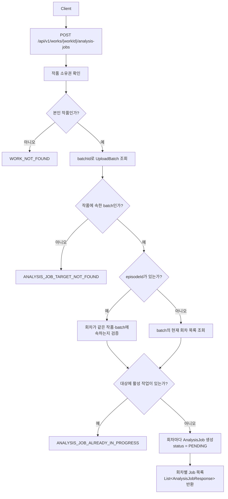
```mermaid
flowchart TD
    A["Client"] --> B["POST /api/v1/works/{workId}/analysis-jobs"]
    B --> C["작품 소유권 확인"]
    C --> D{"본인 작품인가?"}
    D -- "아니오" --> E["WORK_NOT_FOUND"]
    D -- "예" --> F["batchId로 UploadBatch 조회"]
    F --> G{"작품에 속한 batch인가?"}
    G -- "아니오" --> H["ANALYSIS_JOB_TARGET_NOT_FOUND"]
    G -- "예" --> I{"episodeId가 있는가?"}
    I -- "예" --> J["회차가 같은 작품·batch에<br/>속하는지 검증"]
    I -- "아니오" --> K["batch의 현재 회차 목록 조회"]
    J --> L{"대상에 활성 작업이 있는가?"}
    K --> L
    L -- "예" --> M["ANALYSIS_JOB_ALREADY_IN_PROGRESS"]
    L -- "아니오" --> N["회차마다 AnalysisJob 생성<br/>status = PENDING"]
    N --> O["회차별 Job 목록<br/>List&lt;AnalysisJobResponse&gt; 반환"]
```

## 현재 구현된 Worker 연동 흐름

현재 코드 기준으로 Spring은 분석 작업의 lease/checkpoint와 내부 API 계약을 관리하고, Python Worker는 S3 원문을 읽어 청킹, 캐릭터 후보 추출, 세계관 후보 추출·비교를 수행합니다.

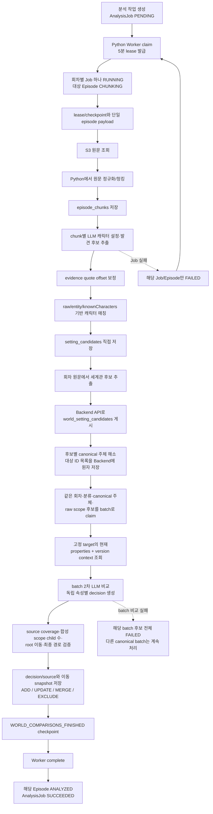
```mermaid
flowchart TD
    A["분석 작업 생성<br/>AnalysisJob PENDING"] --> B["Python Worker claim<br/>5분 lease 발급"]
    B --> C["회차별 Job 하나 RUNNING<br/>대상 Episode CHUNKING"]
    C --> D["lease/checkpoint와 단일 episode payload"]
    D --> E["S3 원문 조회"]
    E --> F["Python에서 원문 정규화/청킹"]
    F --> G["episode_chunks 저장"]
    G --> H["chunk별 LLM 캐릭터 설정·발견 후보 추출"]
    H --> I["evidence quote offset 보정"]
    I --> J["raw/entity/knownCharacters 기반 캐릭터 매칭"]
    J --> K["setting_candidates 직접 저장"]
    K --> L["회차 원문에서 세계관 후보 추출"]
    L --> M["Backend API로<br/>world_setting_candidates 게시"]
    M --> N["후보별 canonical 주체 해소<br/>대상 ID 목록을 Backend에 원자 저장"]
    N --> O["같은 회차·분류·canonical 주체·<br/>raw scope 후보를 batch로 claim"]
    O --> P["고정 target의 현재<br/>properties + version context 조회"]
    P --> Q["batch 2차 LLM 비교<br/>독립 속성별 decision 생성"]
    Q --> R["source coverage·합성 scope child 수·<br/>root 이동·최종 경로 검증"]
    R --> S["decision/source와 이동 snapshot 저장<br/>ADD / UPDATE / MERGE / EXCLUDE"]
    S --> T["WORLD_COMPARISONS_FINISHED checkpoint"]
    T --> U["Worker complete"]
    U --> V["해당 Episode ANALYZED<br/>AnalysisJob SUCCEEDED"]
    Q -. "batch 비교 실패" .-> Y["해당 batch 후보 전체 FAILED<br/>다른 canonical batch는 계속 처리"]
    H -. "Job 실패" .-> X["해당 Job/Episode만 FAILED"]
    X --> B
```

Spring은 캐릭터 `setting_candidates` 생성 API를 제공하지 않아 1차 Worker의 DB 직접 저장 흐름을 유지합니다. 반면 캐릭터 2차 비교 상태와 세계관 후보·비교 상태는 Spring 내부 API로만 변경합니다. Worker는 claim의 `knownCharacters`를 prompt에 전달해 등록되지 않은 명시적 이름을 `CHARACTER_DISCOVERY`로 만들고, 기존 캐릭터와 같은 이름의 발견 후보는 저장하지 않습니다. 각 기존 캐릭터의 `activeStatuses`는 1차가 회복·악화·지속 근거를 찾는 문맥일 뿐 삭제 판단은 하지 않습니다. `CHARACTER_DISCOVERY` 확정은 캐릭터와 최초 등장만 반영하고 Fact를 만들지 않습니다. `SETTING`은 schema hint로 canonical slot을 결정한 뒤 현재 `WorkCharacter` snapshot과 2차 비교해 operation·시간 범위·최종 표시값/JSON·제거 slot을 제안합니다. 사용자 확정 시 새 `CharacterFact`는 append-only로 저장하고, `APPLY_PROPOSAL`만 snapshot과 `character_snapshot_sources`를 갱신합니다. `HISTORY_ONLY`는 Fact와 원문 근거만 이력에 남깁니다.

세계관 batch에서 raw와 다른 새 scope는 기존 scoped child, 이번 batch의 독립 `ADD`, 함께 이동할 실제 root 설정을
합친 최종 child가 둘 이상일 때만 허용합니다. 이동 계획은 비교 decision에 snapshot으로 저장할 뿐 비교 완료 시
확정본을 바꾸지 않으며, 사용자가 수정하지 않은 제안을 그룹 확정할 때만 새 property와 함께 한 번에 적용합니다.
상세 시퀀스는 [World Setting의 기존 root 설정 재범위화 파이프라인](world-setting.md#기존-root-설정-재범위화-파이프라인)을
기준으로 확인합니다.

Worker는 `X-Worker-Lease-Token`을 상태·token 예약·세계관 내부 API에 전달하고 heartbeat로 lease를 연장합니다. 이미 시작된 provider 요청의 token 정산·해제는 lease 만료 뒤에도 예약을 정리할 수 있도록 `requestId` 기준으로 처리합니다. 만료된 Job은 마지막 checkpoint부터 최대 세 번 claim하며, 공개 `recompare` 요청은 별도 `WORLD_SETTING_COMPARISON` Job을 생성해 전용 Worker가 후보 하나만 다시 비교합니다. 이 숨김 Job은 공개 분석 진행률과 `Episode.status`에 영향을 주지 않습니다.

### Worker 실행 슬롯과 운영 동시성

PostgreSQL의 `analysis_jobs`가 Job 대기열이고 Python 프로세스의 실행 슬롯은 즉시 처리 가능한 자리입니다. Worker scheduler는 슬롯을 먼저 확보한 뒤 claim 한 건을 요청하고, 성공한 Job을 곧바로 Job별 Task와 heartbeat Task로 실행합니다. 슬롯을 기다리는 Job을 미리 claim하지 않습니다.

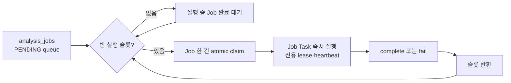
```mermaid
flowchart LR
    Q["analysis_jobs<br/>PENDING queue"] --> S{"빈 실행 슬롯?"}
    S -- "없음" --> W["실행 중 Job 완료 대기"]
    S -- "있음" --> C["Job 한 건 atomic claim"]
    C --> T["Job Task 즉시 실행<br/>전용 lease·heartbeat"]
    T --> F["complete 또는 fail"]
    F --> R["슬롯 반환"]
    W --> S
    R --> S
```

현재 운영 기본값은 `SETTING_EXTRACTION` Worker 5개 × 프로세스당 동시 Job 10개 = 최대 50개입니다. 한 Job 안의 청크는 순차 처리하며, 50개 Job 부하 테스트가 기준에 미달하면 Worker 5개는 유지하고 프로세스당 Job과 LLM 요청을 5개로 낮춰 최대 25개로 되돌립니다. `ai-character-comparison-worker`와 `ai-world-comparison-worker`는 Job·LLM 동시성을 각각 1로 고정합니다. 따라서 50은 설정 추출 Job 용량이고 provider 계정 전체에 걸친 분산 동시 요청 상한은 아닙니다.

LLM은 역할별로 분리합니다. 캐릭터 Fact·세계관 후보의 1차 추출은 `LLM_EXTRACTION_MODEL=gpt-5.6-terra`, 캐릭터·세계관 주체 해소는 `LLM_SUBJECT_RESOLUTION_MODEL=gpt-5.6-luna`, 세계관 비교와 재비교는 `LLM_COMPARISON_MODEL=gpt-5.6-luna`를 사용합니다. 세 값이 비어 있을 때만 `LLM_MODEL`로 fallback하며 프롬프트·Responses API·구조화 응답 계약은 동일하게 유지합니다.

종료 신호를 받은 Worker는 신규 claim을 중단하고 내부 180초 동안 실행 중 Job과 heartbeat를 유지합니다. Compose는 210초의 `stop_grace_period`를 제공하며, 끝내지 못한 Job은 heartbeat 중단 뒤 5분 lease가 만료되면 checkpoint부터 회수됩니다. 한 Job의 실패나 취소는 다른 Job Task로 전파하지 않습니다.

## Notion 기준 전체 분석 흐름

아래 흐름은 Notion의 “흐름 정리 - 임준우”에 있는 전체 작업 흐름을 백엔드 기준 용어로 옮긴 것입니다.

현재 구현과 다르게 `ManuscriptChunk`, `PreprocessedManuscriptChunk`, `SettingSnapshot`, `ValidationReport` 같은 후속 모델까지 포함한 목표 흐름입니다. 현재 캐릭터 설정 후보 MVP에서는 `episode_chunks`, `setting_candidates`, `CharacterSettingSchema`, `CharacterFact`, `WorkCharacter` 중심으로 먼저 구현합니다.

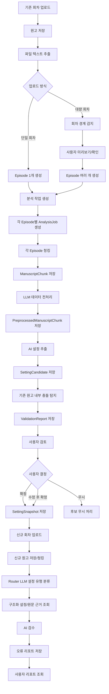
```mermaid
flowchart TD
    A["기존 회차 업로드"] --> B["원고 저장"]
    B --> B1["파일 텍스트 추출"]
    B1 --> B2{"업로드 방식"}
    B2 -->|단일 회차| B3["Episode 1개 생성"]
    B2 -->|대량 회차| B4["회차 경계 감지"]
    B4 --> B5["사용자 미리보기/확인"]
    B5 --> B6["Episode 여러 개 생성"]
    B3 --> C["분석 작업 생성"]
    B6 --> C
    C --> C0["각 Episode별 AnalysisJob 생성"]
    C0 --> C1["각 Episode 청킹"]
    C1 --> D["ManuscriptChunk 저장"]
    D --> R["LLM 데이터 전처리"]
    R --> R1["PreprocessedManuscriptChunk 저장"]
    R1 --> E["AI 설정 추출"]
    E --> F["SettingCandidate 저장"]
    F --> F1["기존 원고 내부 충돌 탐지"]
    F1 --> F2["ValidationReport 저장"]
    F2 --> G["사용자 검토"]
    G --> H{"사용자 결정"}
    H -->|확정| I["SettingSnapshot 저장"]
    H -->|수정 후 확정| I
    H -->|무시| J["후보 무시 처리"]
    I --> K["신규 회차 업로드"]
    K --> L["신규 원고 저장/청킹"]
    L --> M["Router LLM 설정 유형 분류"]
    M --> N["구조화 설정/원문 근거 조회"]
    N --> Q["AI 검수"]
    Q --> O["오류 리포트 저장"]
    O --> P["사용자 리포트 조회"]
```

## Notion 기준 저장 순서

1. 백엔드는 사용자 권한과 작품 소유 여부를 검증합니다.
2. 파일 업로드 방식이면 원본 파일을 object storage에 저장하고 원본 파일 참조를 `UploadFile`에 저장합니다.
3. 파일에서 원문 텍스트를 추출합니다.
4. 단일 회차 업로드라면 입력된 회차 정보로 `Episode`를 1개 생성합니다.
5. 대량 회차 업로드라면 회차 경계를 감지하고 사용자 확인 후 `Episode`를 여러 개 생성합니다.
6. 각 회차 원문을 문단, 장면, 길이 기준으로 나누어 `ManuscriptChunk`를 생성합니다.
7. 청크마다 회차 번호, 문단 번호, 장면 번호, 문자 offset 같은 원문 위치 메타데이터를 저장합니다.
8. 기존 설정 구축용 업로드라면 `SETTING_EXTRACTION` 작업을 생성합니다.
9. 신규 회차 검수용 업로드라면 `EPISODE_VALIDATION` 작업을 생성합니다.
10. Spring Boot 서버는 작업 상태를 `PENDING`으로 둡니다.
11. Worker는 내부 claim API를 polling해 작업 ID, 회차 메타데이터, 기존 캐릭터 목록, 활성 캐릭터 설정 schema를 가져옵니다.
12. 현재 Worker는 S3 원문을 읽어 직접 정규화/청킹하고 `episode_chunks`를 저장합니다.
13. Worker는 청크별 LLM 설정 후보를 추출하고, quote offset 보정과 캐릭터 매칭 상태 계산 후 `setting_candidates`를 저장합니다.
14. `PreprocessedManuscriptChunk`, `SettingSnapshot`, `ValidationReport` 기반 흐름은 후속 검수 모델 구현 때 확장합니다.

## 분석 작업 생성 API

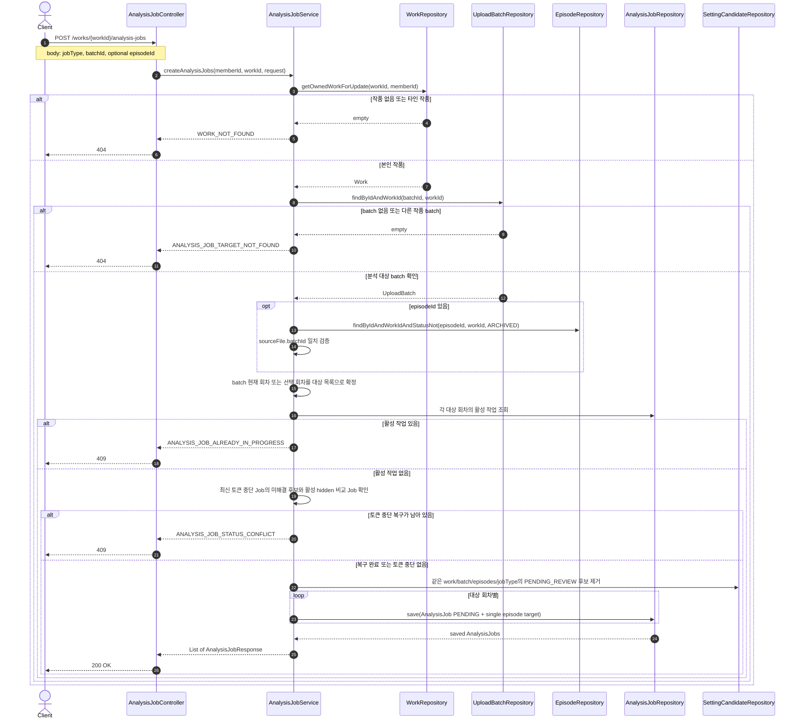
```mermaid
sequenceDiagram
    autonumber
    actor Client
    participant Controller as AnalysisJobController
    participant Service as AnalysisJobService
    participant WorkRepo as WorkRepository
    participant BatchRepo as UploadBatchRepository
    participant EpisodeRepo as EpisodeRepository
    participant JobRepo as AnalysisJobRepository
    participant CandidateRepo as SettingCandidateRepository

    Client->>Controller: POST /works/{workId}/analysis-jobs
    Note over Client,Controller: body: jobType, batchId, optional episodeId
    Controller->>Service: createAnalysisJobs(memberId, workId, request)
    Service->>WorkRepo: getOwnedWorkForUpdate(workId, memberId)
    alt 작품 없음 또는 타인 작품
        WorkRepo-->>Service: empty
        Service-->>Controller: WORK_NOT_FOUND
        Controller-->>Client: 404
    else 본인 작품
        WorkRepo-->>Service: Work
        Service->>BatchRepo: findByIdAndWorkId(batchId, workId)
        alt batch 없음 또는 다른 작품 batch
            BatchRepo-->>Service: empty
            Service-->>Controller: ANALYSIS_JOB_TARGET_NOT_FOUND
            Controller-->>Client: 404
        else 분석 대상 batch 확인
            BatchRepo-->>Service: UploadBatch
            opt episodeId 있음
                Service->>EpisodeRepo: findByIdAndWorkIdAndStatusNot(episodeId, workId, ARCHIVED)
                Service->>Service: sourceFile.batchId 일치 검증
            end
            Service->>Service: batch 현재 회차 또는 선택 회차를 대상 목록으로 확정
            Service->>JobRepo: 각 대상 회차의 활성 작업 조회
            alt 활성 작업 있음
                Service-->>Controller: ANALYSIS_JOB_ALREADY_IN_PROGRESS
                Controller-->>Client: 409
            else 활성 작업 없음
                Service->>Service: 최신 토큰 중단 Job의 미해결 후보와 활성 hidden 비교 Job 확인
                alt 토큰 중단 복구가 남아 있음
                    Service-->>Controller: ANALYSIS_JOB_STATUS_CONFLICT
                    Controller-->>Client: 409
                else 복구 완료 또는 토큰 중단 없음
                    Service->>CandidateRepo: 같은 work/batch/episodes/jobType의 PENDING_REVIEW 후보 제거
                    loop 대상 회차별
                        Service->>JobRepo: save(AnalysisJob PENDING + single episode target)
                    end
                    JobRepo-->>Service: saved AnalysisJobs
                    Service-->>Controller: List of AnalysisJobResponse
                    Controller-->>Client: 200 OK
                end
            end
        end
    end
```

## 분석 작업 목록 조회 API

```mermaid
sequenceDiagram
    autonumber
    actor Client
    participant Controller as AnalysisJobController
    participant Service as AnalysisJobService
    participant WorkRepo as WorkRepository
    participant JobRepo as AnalysisJobRepository

    Client->>Controller: GET /works/{workId}/analysis-jobs
    Controller->>Service: getAnalysisJobs(memberId, workId)
    Service->>WorkRepo: getOwnedWork(workId, memberId)
    alt 작품 없음 또는 타인 작품
        WorkRepo-->>Service: empty
        Service-->>Controller: WORK_NOT_FOUND
        Controller-->>Client: 404
    else 본인 작품
        WorkRepo-->>Service: Work
        Service->>JobRepo: findAllWithTargetsByWorkIdOrderByCreatedAtDesc(workId)
        JobRepo-->>Service: List<AnalysisJob>
        Service-->>Controller: List<AnalysisJobResponse>
        Controller-->>Client: 200 OK
    end
```

## 분석 작업 상세 조회 API

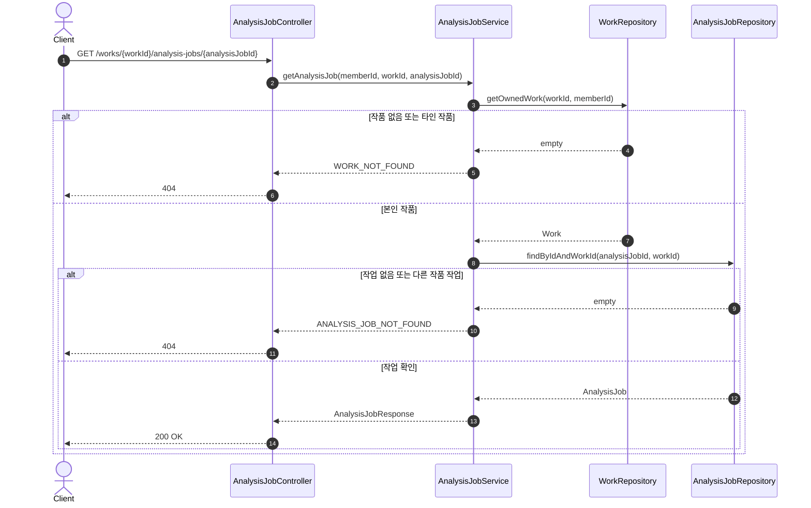
```mermaid
sequenceDiagram
    autonumber
    actor Client
    participant Controller as AnalysisJobController
    participant Service as AnalysisJobService
    participant WorkRepo as WorkRepository
    participant JobRepo as AnalysisJobRepository

    Client->>Controller: GET /works/{workId}/analysis-jobs/{analysisJobId}
    Controller->>Service: getAnalysisJob(memberId, workId, analysisJobId)
    Service->>WorkRepo: getOwnedWork(workId, memberId)
    alt 작품 없음 또는 타인 작품
        WorkRepo-->>Service: empty
        Service-->>Controller: WORK_NOT_FOUND
        Controller-->>Client: 404
    else 본인 작품
        WorkRepo-->>Service: Work
        Service->>JobRepo: findByIdAndWorkId(analysisJobId, workId)
        alt 작업 없음 또는 다른 작품 작업
            JobRepo-->>Service: empty
            Service-->>Controller: ANALYSIS_JOB_NOT_FOUND
            Controller-->>Client: 404
        else 작업 확인
            JobRepo-->>Service: AnalysisJob
            Service-->>Controller: AnalysisJobResponse
            Controller-->>Client: 200 OK
        end
    end
```

## 실패 작업 재시도 API

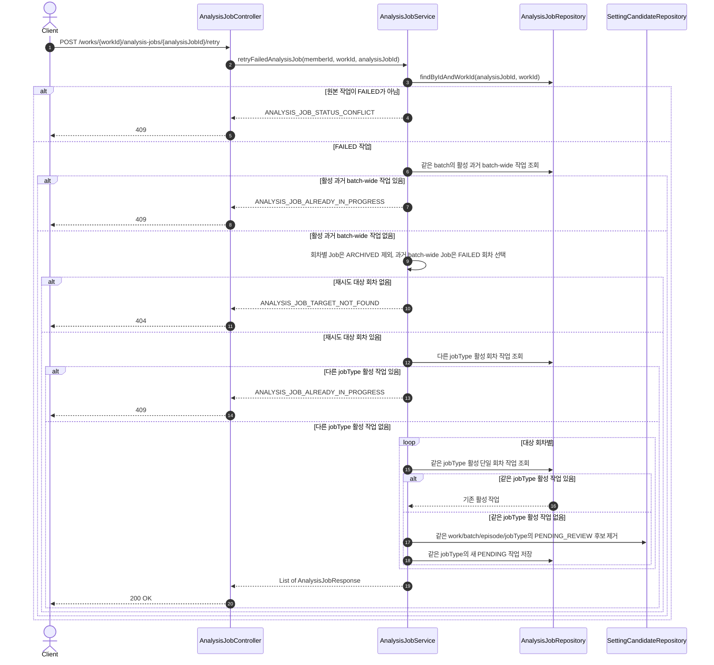
```mermaid
sequenceDiagram
    autonumber
    actor Client
    participant Controller as AnalysisJobController
    participant Service as AnalysisJobService
    participant JobRepo as AnalysisJobRepository
    participant CandidateRepo as SettingCandidateRepository

    Client->>Controller: POST /works/{workId}/analysis-jobs/{analysisJobId}/retry
    Controller->>Service: retryFailedAnalysisJob(memberId, workId, analysisJobId)
    Service->>JobRepo: findByIdAndWorkId(analysisJobId, workId)
    alt 원본 작업이 FAILED가 아님
        Service-->>Controller: ANALYSIS_JOB_STATUS_CONFLICT
        Controller-->>Client: 409
    else FAILED 작업
        Service->>JobRepo: 같은 batch의 활성 과거 batch-wide 작업 조회
        alt 활성 과거 batch-wide 작업 있음
            Service-->>Controller: ANALYSIS_JOB_ALREADY_IN_PROGRESS
            Controller-->>Client: 409
        else 활성 과거 batch-wide 작업 없음
            Service->>Service: 회차별 Job은 ARCHIVED 제외, 과거 batch-wide Job은 FAILED 회차 선택
            alt 재시도 대상 회차 없음
                Service-->>Controller: ANALYSIS_JOB_TARGET_NOT_FOUND
                Controller-->>Client: 404
            else 재시도 대상 회차 있음
                Service->>JobRepo: 다른 jobType 활성 회차 작업 조회
                alt 다른 jobType 활성 작업 있음
                    Service-->>Controller: ANALYSIS_JOB_ALREADY_IN_PROGRESS
                    Controller-->>Client: 409
                else 다른 jobType 활성 작업 없음
                    loop 대상 회차별
                        Service->>JobRepo: 같은 jobType 활성 단일 회차 작업 조회
                        alt 같은 jobType 활성 작업 있음
                            JobRepo-->>Service: 기존 활성 작업
                        else 같은 jobType 활성 작업 없음
                            Service->>CandidateRepo: 같은 work/batch/episode/jobType의 PENDING_REVIEW 후보 제거
                            Service->>JobRepo: 같은 jobType의 새 PENDING 작업 저장
                        end
                    end
                    Service-->>Controller: List of AnalysisJobResponse
                    Controller-->>Client: 200 OK
                end
            end
        end
    end
```

기존 `FAILED` 작업은 변경하지 않습니다. 회차별 실패 Job은 `Episode`의 현재 처리 상태와 분리해 재시도하지만 `ARCHIVED` 회차는 제외하고, 과거 batch-wide 실패 Job은 현재 `FAILED`인 대상 회차만 재시도합니다. 같은 `jobType`의 활성 작업은 멱등 반환하고 다른 `jobType`의 활성 작업은 409로 거절합니다. 새 Job을 실제 생성할 때만 같은 작품·batch·회차·`jobType`의 `PENDING_REVIEW` 후보를 대체하며, `CONFIRMED`·`DISMISSED` 및 다른 유형·회차 후보는 보존합니다.

## 분석 대상 회차 조회

분석 작업 생성 request는 `batchId`와 선택적인 `episodeId`를 받습니다. `UploadBatch`는 대상 탐색과 출처 표시를 위한 묶음이고, 실행 단위는 회차별 `AnalysisJob`입니다.

- 이 공개 범위 지정 계약은 지원하는 모든 `jobType`에 적용됩니다.
- `episodeId`가 있으면 검증한 한 회차 Job을 생성합니다.
- `episodeId`가 없으면 다음 관계를 따라 batch에 속한 보관되지 않은 회차를 선정하고 각각 Job을 생성합니다.

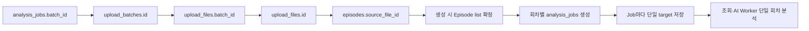
```mermaid
flowchart LR
    A["analysis_jobs.batch_id"] --> B["upload_batches.id"]
    B --> C["upload_files.batch_id"]
    C --> D["upload_files.id"]
    D --> E["episodes.source_file_id"]
    E --> F["생성 시 Episode list 확정"]
    F --> G["회차별 analysis_jobs 생성"]
    G --> H["Job마다 단일 target 저장"]
    H --> I["조회·AI Worker 단일 회차 분석"]
```

감지·업로드 단계의 `detectionOrder`는 분석 대상 조회에 사용하지 않습니다. `UploadBatch`, `UploadFile`, `Episode.sourceFileId` 관계는 생성 시 대상을 선정할 때만 사용하고, 이후에는 `analysis_job_episode_targets`를 사용합니다. 따라서 원본 파일 교체나 회차 보관 이후에도 과거 작업의 대상 목록은 유지됩니다.

## Worker 내부 API Polling

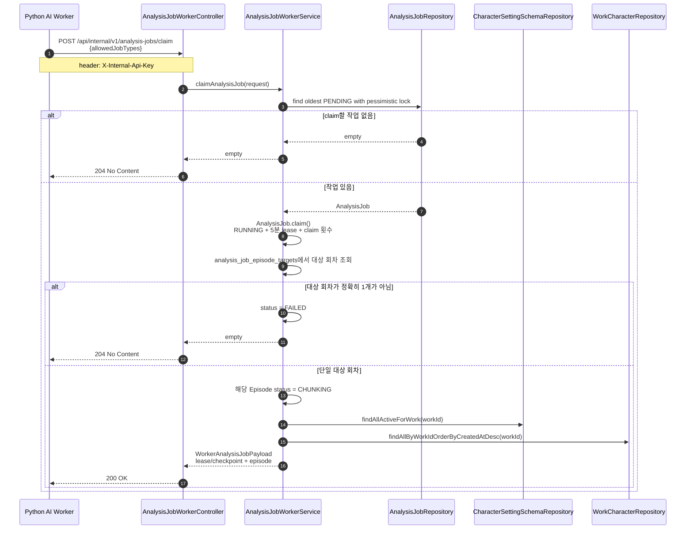
```mermaid
sequenceDiagram
    autonumber
    participant Worker as Python AI Worker
    participant Controller as AnalysisJobWorkerController
    participant Service as AnalysisJobWorkerService
    participant JobRepo as AnalysisJobRepository
    participant SchemaRepo as CharacterSettingSchemaRepository
    participant CharacterRepo as WorkCharacterRepository

    Worker->>Controller: POST /api/internal/v1/analysis-jobs/claim<br/>{allowedJobTypes}
    Note over Worker,Controller: header: X-Internal-Api-Key
    Controller->>Service: claimAnalysisJob(request)
    Service->>JobRepo: find oldest PENDING with pessimistic lock
    alt claim할 작업 없음
        JobRepo-->>Service: empty
        Service-->>Controller: empty
        Controller-->>Worker: 204 No Content
    else 작업 있음
        JobRepo-->>Service: AnalysisJob
        Service->>Service: AnalysisJob.claim()<br/>RUNNING + 5분 lease + claim 횟수
        Service->>Service: analysis_job_episode_targets에서 대상 회차 조회
        alt 대상 회차가 정확히 1개가 아님
            Service->>Service: status = FAILED
            Service-->>Controller: empty
            Controller-->>Worker: 204 No Content
        else 단일 대상 회차
            Service->>Service: 해당 Episode status = CHUNKING
            Service->>SchemaRepo: findAllActiveForWork(workId)
            Service->>CharacterRepo: findAllByWorkIdOrderByCreatedAtDesc(workId)
            Service-->>Controller: WorkerAnalysisJobPayload<br/>lease/checkpoint + episode
            Controller-->>Worker: 200 OK
        end
    end
```

Claim payload의 `characterSettingSchemas`는 `enabled = true`인 전역 schema와 현재 작품의 추가 schema를 `schemaKey` 오름차순으로 조회한 결과입니다. Registry row가 없으면 빈 배열이며, Worker에는 `schemaKey`, `displayName`, `attributePattern`, `aliases`, `valueType`만 노출합니다. `WORLD_SETTING_COMPARISON` claim에서는 캐릭터 관련 배열을 비우고 연결된 `worldSettingCandidateId`를 전달합니다.

## 상태 전이

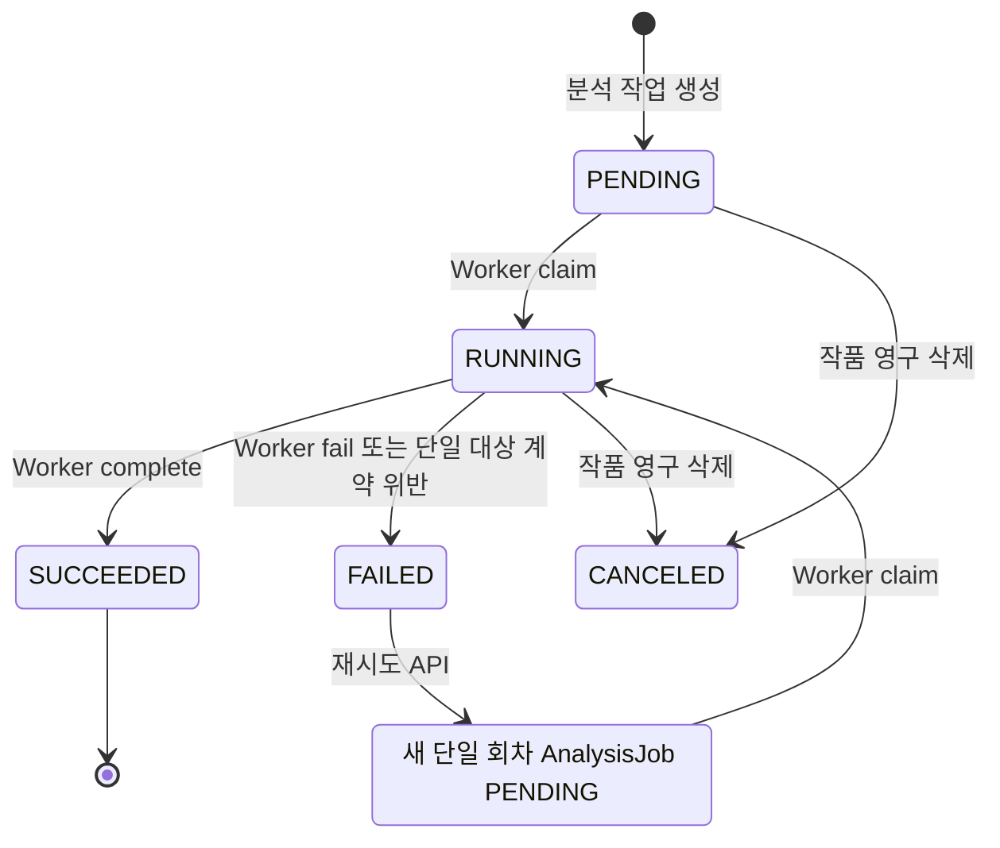
```mermaid
stateDiagram-v2
    [*] --> PENDING: 분석 작업 생성
    PENDING --> RUNNING: Worker claim
    RUNNING --> SUCCEEDED: Worker complete
    RUNNING --> FAILED: Worker fail 또는 단일 대상 계약 위반
    PENDING --> CANCELED: 작품 영구 삭제
    RUNNING --> CANCELED: 작품 영구 삭제
    SUCCEEDED --> [*]
    FAILED --> RETRY_PENDING: 재시도 API
    RETRY_PENDING: 새 단일 회차 AnalysisJob PENDING
    RETRY_PENDING --> RUNNING: Worker claim
```

Worker가 내부 claim API로 작업을 가져가면 `AnalysisJob.claim()`이 `RUNNING`, lease token/만료 시각, claim 횟수를 기록합니다. 이후 Worker는 `X-Worker-Lease-Token`을 보내 상태를 `SUCCEEDED` 또는 `FAILED`로 변경합니다. 만료된 lease는 checkpoint를 보존한 채 다시 `PENDING`으로 전환하며 세 번째 만료에는 `FAILED`로 종료합니다. 작품 영구 삭제는 활성 Job을 `CANCELED`로 바꾸고 lease를 제거하므로 이후 heartbeat·완료·실패 요청은 상태 검증에서 거절됩니다.
`FAILED` 이후 재시도는 기존 작업을 `PENDING`으로 되돌리는 전이가 아닙니다. `POST /analysis-jobs/{analysisJobId}/retry`가 실패 회차별로 새로운 `PENDING` 단일 회차 작업을 만듭니다.

화면에서는 같은 upload batch에 생성된 회차별 `AnalysisJob.status`를 집계하고, 각 응답의 단일 `episodes` 항목으로 `Episode.status`를 표시합니다. Worker progress는 `currentStep` 표시 문구와 `episodeStatus` enum을 함께 보내며, 백엔드는 문자열을 해석하지 않고 해당 Job의 회차에만 명시적 상태를 적용합니다. 한 Job이 실패해도 다음 회차 Job은 계속 claim할 수 있습니다.

## Episode 처리 상태

Notion에는 `Episode.processingStatus`라는 이름으로 정리되어 있으나, 현재 코드에서는 `Episode.status`와 `EpisodeStatus` enum을 사용합니다.

| 상태 | 의미 | 다음 상태 | 현재 코드 연결 |
| --- | --- | --- | --- |
| `UPLOADED` | 원문 저장 완료 | `CHUNKING`, `FAILED` | `Episode.create()`, `Episode.updateContent()`에서 설정 |
| `CHUNKING` | 원문 청킹 진행 중 | `CHUNKED`, `FAILED` | Worker claim 또는 progress의 `episodeStatus=CHUNKING`에서 설정 |
| `CHUNKED` | 청크 저장 완료 | `PREPROCESSING` | Worker progress의 `episodeStatus=CHUNKED`에서 설정 |
| `PREPROCESSING` | LLM 데이터 전처리 진행 중 | `PREPROCESSED`, `FAILED` | Worker progress의 `episodeStatus=PREPROCESSING`에서 설정 |
| `PREPROCESSED` | LLM 전처리 결과 저장 완료 | `ANALYZING` | Worker progress의 `episodeStatus=PREPROCESSED`에서 설정 |
| `ANALYZING` | AI 설정 추출 진행 중 | `ANALYZED`, `FAILED` | Worker progress의 `episodeStatus=ANALYZING`에서 설정 |
| `ANALYZED` | 설정 후보 생성 완료 | 없음 | Worker complete에서 대상 회차에 설정 |
| `FAILED` | 처리 실패 | 새 단일 회차 재시도 작업 | Worker fail에서 아직 분석 완료되지 않은 대상 회차에 설정 |
| `ARCHIVED` | 일반 조회/분석 대상 제외 | 복구 정책 확정 후 결정 | 회차 삭제 API가 `archive()`를 호출하며 Worker batch 대상에서 제외 |

## AnalysisJob 유형과 상태

Notion 설계의 `AnalysisJob.type`은 현재 분석 초안의 `jobType`에 해당합니다.

| 유형 | 의미 | 생성 시점 |
| --- | --- | --- |
| `SETTING_EXTRACTION` | 기존 회차 원고에서 캐릭터·세계관 설정 후보를 추출하고 세계관 후보를 최초 비교 | 기존 설정 구축용 회차 업로드 후 청킹 완료 시 |
| `BASELINE_CONSISTENCY_CHECK` | 기존 회차들에서 추출된 설정 후보끼리 충돌하는지 검수 | 기존 회차 설정 후보 저장 완료 후, 사용자 기준 설정 확정 전 |
| `EPISODE_VALIDATION` | 신규 회차가 기존 확정 설정과 충돌하는지 검수 | 신규 회차 검수용 업로드 후 청킹 완료 시 |
| `WORLD_SETTING_COMPARISON` | 세계관 후보 하나를 재비교하는 숨김 내부 작업 | 공개 `recompare` 요청 시 멱등 생성 |

현재 코드에는 `SETTING_EXTRACTION`, `EPISODE_VALIDATION`, 내부 전용 `WORLD_SETTING_COMPARISON`이 포함됩니다. `BASELINE_CONSISTENCY_CHECK`는 기존 원고 내부 정합성 검수 기능을 구현할 때 추가합니다.

Notion 기준 `AnalysisJob.status`

| 상태 | 의미 | 다음 상태 | 현재 코드 연결 |
| --- | --- | --- | --- |
| `PENDING` | 작업 생성 후 대기 | `RUNNING` | 분석 작업 생성 API에서 `AnalysisJob.create()`로 생성 |
| `RUNNING` | Worker 처리 중 | `SUCCEEDED`, `FAILED`, `CANCELED` | Worker claim API에서 `AnalysisJob.claim()`으로 lease를 발급하며 전환 |
| `SUCCEEDED` | 결과 저장 완료 | 없음 | Worker complete API에서 `AnalysisJob.succeed()`로 전환 |
| `FAILED` | 처리 실패 | 실패 회차별 새 `PENDING` 작업 | Worker fail API 또는 대상 회차 없음에서 `AnalysisJob.fail()`로 전환 |
| `CANCELED` | 작품 영구 삭제로 취소 | 없음 | 삭제 요청이 lease를 제거하고 Worker drain 뒤 작품 데이터와 함께 삭제 |

현재 `CANCELED`는 작품 전체 영구 삭제에만 사용하며 개별 분석 취소 API는 제공하지 않습니다.

## 현재 설정 후보 저장 흐름

현재 구현은 별도 `PreprocessedManuscriptChunk` 없이 Python Worker가 청크 원문을 LLM에 직접 넣습니다. 캐릭터 후보는 기존 방식대로 `setting_candidates`에 직접 저장하고, 세계관 후보와 비교 결과는 Spring 내부 API로 저장합니다.

1. Spring claim payload는 `analysisJobId`, `workId`, `batchId`, lease/checkpoint, episode S3 메타데이터, ID·이름·전체 활성 `STATUS(factKey/factValue)`를 가진 `knownCharacters`, `characterSettingSchemas`를 내려줍니다. STATUS provenance는 bulk로 조회해 legacy 표시값만 보완하며 내부 ID·이력·구조화 JSON은 보내지 않습니다.
2. Python Worker는 `contentS3Key`, `contentS3Version`으로 S3 원문을 읽습니다.
3. Worker는 원문을 정규화/청킹하고 `episode_chunks`를 저장합니다.
4. Worker는 chunk별 LLM 캐릭터 설정 후보를 추출합니다.
5. Worker는 LLM이 반환한 `evidence_spans[].quote`를 chunk 원문에서 다시 찾아 `start_offset`, `end_offset`을 보정합니다.
6. Worker는 `rawEntityMention`, `entityName`, `knownCharacters`를 비교해 `matchedCharacterId`, `matchStatus`를 계산합니다.
7. Worker는 같은 분석 작업 안의 동일 캐릭터 후보를 제거한 뒤 `PENDING_REVIEW`로 저장합니다. 매칭된 `SETTING`은 비교 `PENDING`, 미매칭 후보는 `WAITING_FOR_CHARACTER_MATCH`, 발견 후보는 `NOT_REQUIRED`로 명시합니다.
8. 캐릭터 비교 Worker는 후보를 한 건씩 claim하고 Spring context API에서 canonical slot과 관련 현재 snapshot을 받습니다. 일반 유형은 exact slot만, `STATUS`는 종료 관계 판단을 위해 exact slot을 먼저 두고 최근 생성된 source Fact 순으로 동종 slot 최대 30개를 함께 받습니다.
9. Worker가 `ADD/UPDATE/MERGE/REMOVE/HISTORY_ONLY/EXCLUDE/REVIEW_REQUIRED`와 시간 범위·최종값·제거 slot을 제안하면 Spring은 context token, operation 조합, schema 값, same-character current slot을 불신 검증해 저장합니다. 신규 `REMOVE`는 target 없이 현재 `STATUS` 제거 목록을 한 건 이상 보냅니다. 구버전의 순수 `REMOVE + 동일 canonical target`은 effective 제거 집합 한 건으로 해석하되 구 Java rollback을 위해 DB에는 target-only shape를 유지하고, target과 목록을 함께 보낸 전환 요청은 중복 제거한 target 없는 shape로 저장합니다. 회복·종료 후보 Fact와 원문 근거는 이력에 append하지만 후보 자체는 current snapshot에 넣지 않고 제거 목록의 snapshot·provenance만 한 트랜잭션에서 제거합니다. 파괴적 제거는 비교 완료와 사용자 확정 전 모두 정확한 `snapshotVersion`을 요구해 30건 비교 문맥 밖 변경도 stale로 막습니다. `EXCLUDE`는 비교 완료 트랜잭션에서 후보만 `DISMISSED + NOT_REQUIRED`로 자동 전환하고 Fact·현재 snapshot·이력을 만들지 않습니다. 이 완료 요청은 초기 분석과 숨김 재비교에서 같은 경계를 사용하며 중복 요청을 멱등 처리합니다. 모든 캐릭터 후보 비교가 종료되면 `CHARACTER_COMPARISONS_FINISHED` checkpoint를 기록합니다.

Java를 먼저 배포하면 구·신규 Worker 요청을 모두 받을 수 있습니다. 신규 AI가 target 없는 `REMOVE`를 쓰기 시작한 뒤에는 구 Java가 해당 미확정 후보를 적용할 수 없으므로, Java rollback 전 신규 shape의 `PENDING_REVIEW + COMPLETED` 후보를 모두 확정·재비교·forward repair 중 하나로 비운 뒤 Worker를 먼저 구버전으로 되돌려야 합니다.
10. Worker는 회차 원문에서 지속적인 세계관 속성을 추출하고 구조적으로 같은 후보를 제거한 뒤, lease가 보호하는 Spring 내부 API로 `world_setting_candidates`를 멱등 게시합니다.
11. Worker는 canonical 주체가 미해소된 세계관 후보와 같은 category의 기존 대상명 전체를 조회합니다. exact 이름 또는 `S*` LLM 선택 결과를 후보별 target ID 목록으로 Spring에 원자 저장하고, Spring은 같은 회차·분류·canonical 주체 key·정규화 raw scope 후보를 `WorldSettingComparisonBatch`로 묶습니다.
12. Worker는 batch를 claim한 뒤 고정 target의 현재 `properties_json`·version·exact target을 context로 가져오고, UUID 대신 요청 내부 `C*`·`T*` ref만 2차 LLM에 전달합니다. LLM은 독립 속성별 `ADD/UPDATE/MERGE/EXCLUDE` decision을 반환하며, 기존 root와 새 `ADD`를 공통 scope로 정리할 때는 `existingRootPropertyNamesToMove`에 이동할 root 이름을 명시합니다. Worker는 source coverage, 실제 root, 최종 경로 충돌, 범위명·설정명 중복과 합성 scope의 서로 다른 최종 child 2개 이상을 검증하고 실패하면 batch JSON 전체를 다시 생성합니다.
13. Spring은 batch complete에서 context ID·version·exact target, 모든 source의 정확한 1회 귀속, decision 조합과 최종 경로를 다시 검증합니다. root 이동 제안은 현재 이름·값을 `{settingName,beforeValue}` snapshot으로 결정에 저장하지만 이 시점에는 확정본을 이동하지 않습니다. 계약 검증 400은 외부 `WORLD_SETTING_COMPARISON_TARGET_INVALID`와 안전한 `context.reasonCode`를 반환하며, Worker는 이를 상위 `COMPARISON_VALIDATION_FAILED`와 source code/reason으로 분리해 batch 후보 전체 실패에 저장합니다. context stale 409는 최신 context로 batch 전체를 다시 비교하고, canonical 주체 stale은 기존 batch를 닫은 뒤 주체 해소부터 다시 수행합니다.
14. 모든 세계관 후보가 `COMPLETED` 또는 `FAILED`가 되면 `WORLD_COMPARISONS_FINISHED` checkpoint를 기록하고 complete API를 호출해 `AnalysisJob.status=SUCCEEDED`로 변경합니다.

현재 complete API는 checkpoint와 후보 상태를 검증하고 Backend token ledger 합계를 반영한 뒤 대상 회차의 `Episode.status`를 `ANALYZED`로 전환합니다. fail API는 아직 분석 완료되지 않은 대상 회차를 `FAILED`로 전환합니다. 숨김 `CHARACTER_FACT_COMPARISON`, `WORLD_SETTING_COMPARISON` Job은 연결 후보 한 건만 처리하며 회차 상태를 바꾸지 않습니다.

사용자 편집·캐릭터 재연결·stale confirm으로 재비교가 필요해지면 원 분석 Job이 아직 실행 중이어도 후보별 hidden `CHARACTER_FACT_COMPARISON` Job을 멱등 생성합니다. 활성 hidden Job이 소유한 후보는 원 분석 Job의 claim·완료 대기·실패 정리에서 제외해 이중 claim과 drain-checkpoint 사이 경쟁을 막습니다. hidden Job이 최대 시도까지 실패하면 아직 `PENDING`이거나 `PROCESSING`인 연결 후보를 `FAILED`로 귀결해 화면이 무한 대기하지 않게 합니다.

캐릭터 매칭 후속 TODO:

- adjacent chunk fallback으로 `나`, `그`, `그녀` 같은 지칭어 후보를 해소한 뒤 `matchStatus` 품질을 높입니다.
- `MATCHED`, `UNRESOLVED`, `AMBIGUOUS`별 Spring confirm 처리 정책은 `docs/character.md`의 캐릭터 매칭 상태 기반 confirm 정책을 따릅니다.
- Spring은 `UNRESOLVED` 후보의 첫 confirm에서 trim 후 exact-name 활성 캐릭터를 재사용하거나 새 캐릭터를 생성합니다. 기존 활성 캐릭터를 재사용하면 확정 후보와 같은 이름의 검토 대기 미해소 후보를 모두 `MATCHED`로, 이번 confirm에서 새 캐릭터를 만들면 모두 `AUTO_MATCHED_BY_NAME`으로 연결합니다. 같은 분석 claim의 신규 캐릭터 속성을 한 캐릭터로 모으면서 분석 시점부터 존재한 캐릭터 연결과 이번 확정에서 만든 캐릭터 연결을 화면에서 구분하기 위한 보정입니다.
- `AMBIGUOUS` 후보는 사용자가 character-match API로 `MATCHED` 또는 `UNRESOLVED` 상태로 해소한 뒤 confirm합니다.

## 후속 LLM 전처리와 검수 확장

LLM 전처리 입력은 다음 정보를 포함합니다.

- 작품 ID와 `Episode` ID
- 회차 번호, 제목, 문단 번호, 장면 번호 같은 위치 메타데이터
- `ManuscriptChunk` ID와 청크 순서
- `ManuscriptChunk` 원문 텍스트
- 작품 장르와 설정 추출 우선순위

LLM 전처리 출력은 다음 정보를 포함합니다.

- 청크 요약
- 등장 인물과 별칭 후보
- 설정 후보 유형: 캐릭터 상태, 아이템/스킬, 시간 경과, 사건 결과, 관계 변화
- 원문에서 설정 추출에 불필요한 노이즈 또는 메타 텍스트 표시
- 장면/문단 경계 보정 필요 여부
- 회차/청크 메타데이터 연결 정보
- 후속 설정 추출에 넘길 구조화된 입력 JSON

설정 후보 저장 규칙은 다음과 같습니다.

- Worker는 원문 청크와 LLM 전처리 결과를 함께 사용해 설정 후보를 추출할 수 있습니다.
- 추출 결과는 `SettingCandidate`에 `PENDING_REVIEW` 상태로 저장합니다.
- 후보에는 설정 유형, 설정 값, 신뢰도, 근거 청크, AI 원본 응답, 추출 작업 ID를 연결합니다.
- 저장이 끝나면 complete API를 호출해 `AnalysisJob.status=SUCCEEDED`, 대상 `Episode.status=ANALYZED`로 변경합니다.
- 여러 기존 회차의 설정 후보가 생성된 뒤에는 작품 단위 `BASELINE_CONSISTENCY_CHECK` 작업을 생성해 기존 원고 내부 충돌 후보를 탐지할 수 있습니다.

## 기존 원고 내부 정합성 검수

기존 회차 사이의 설정 충돌은 확정 오류가 아니라 사용자가 검토해야 하는 후보로 저장합니다.

검수 흐름은 다음과 같습니다.

1. 설정 후보 추출이 끝난 기존 회차들을 회차 번호 순서로 정렬합니다.
2. 캐릭터명, 별칭, 설정 유형, 설정 key를 기준으로 같은 의미의 후보를 묶습니다.
3. 시간 흐름상 자연스러운 변화인지, 근거 없는 충돌인지 비교합니다.
4. 충돌 가능성이 있으면 `ValidationReport.reportType=BASELINE_CONSISTENCY` 리포트를 생성합니다.
5. 개별 충돌 후보는 `ValidationFinding`으로 저장하고, 양쪽 근거 회차와 문단 위치를 모두 연결합니다.
6. 사용자는 후보를 `CONFIRMED`, `DISMISSED`, `FIXED`로 검토합니다.
7. 사용자가 정리한 결과만 `SettingSnapshot`에 기준 설정 또는 설정 변화 이력으로 반영합니다.

사용자 결정 기준

| 사용자 결정 | 처리 |
| --- | --- |
| 실제 오류로 확정 | `ValidationFinding.reviewStatus=CONFIRMED`로 변경하고 수정 대상 원고 또는 설정 후보를 표시 |
| 의도된 설정 변화로 판단 | `DISMISSED` 처리하거나 설정 변화 이력으로 `SettingSnapshot` 버전에 반영 |
| 원고 또는 설정 후보 수정 완료 | `FIXED` 처리하고 수정된 후보를 기준 설정 반영 대상으로 전환 |

## 신규 회차 검수

신규 회차 검수용 업로드도 원문 저장과 청킹까지는 기존 회차 업로드와 같은 흐름을 사용합니다.

다만 분석 작업은 `EPISODE_VALIDATION` 유형으로 만들고, AI 검수 전에 Router LLM 또는 규칙 기반 classifier가 신규 회차에서 검토가 필요한 설정 유형을 분류합니다.

근거 조회는 다음 데이터를 함께 사용합니다.

- 신규 회차의 문장 또는 문단 청크
- 해당 작품의 최신 `SettingSnapshot`
- Router LLM이 분류한 설정 유형
- 캐릭터명, 별칭, 설정 key 기준의 구조화 조회 결과
- pgvector 기반 관련 과거 원문 Top-K
- 과거 설정 후보와 사용자가 확정한 수정 이력

구조화 조회는 수치/상태 비교의 기준이고, 벡터 검색은 원문 맥락과 근거 문장을 찾기 위한 보조 수단입니다. 둘 중 하나만 사용하지 않습니다.

## 오류 리포트 데이터

`ValidationReport`는 기존 원고 내부 정합성 검수와 신규 회차 검수에서 공통으로 사용합니다. `reportType`으로 리포트 성격을 구분합니다.

| 리포트 유형 | 의미 |
| --- | --- |
| `BASELINE_CONSISTENCY` | 기존 회차들 사이의 설정 충돌 후보 |
| `EPISODE_VALIDATION` | 신규 회차와 확정 기준 설정 사이의 충돌 후보 |

`ValidationFinding.reviewStatus`

| 상태 | 의미 |
| --- | --- |
| `OPEN` | 사용자가 아직 확인하지 않은 오류 후보 |
| `CONFIRMED` | 사용자가 실제 오류로 판단 |
| `DISMISSED` | 사용자가 오류가 아니라고 판단 |
| `FIXED` | 사용자가 원고 수정 또는 설정 갱신을 완료 |

`ValidationFinding`은 최소한 다음 정보를 포함합니다.

- 오류 유형: 수치 불일치, 아이템/스킬 보유 여부 불일치, 시간 경과 불일치, 상태 변화 불일치
- 심각도: `LOW`, `MEDIUM`, `HIGH`
- 비교 대상 위치: 회차 번호, 문단 번호, 문장, 문자 offset
- 기존 근거 또는 반대 근거: 회차 번호, 문단 번호, 원문 문장, 연결된 설정 후보 또는 설정 스냅샷
- 비교 값: 신규 원고 값과 기존 기준 값, 또는 기존 회차 A의 값과 기존 회차 B의 값
- AI 수정 제안
- 사용자 검토 상태

## 실패 및 재시도 기준

| 단계 | 실패 원인 | 처리 |
| --- | --- | --- |
| 원문 저장 | 파일 형식 오류, 빈 원문, 권한 없음 | 동기 API에서 실패 응답 |
| 원본 파일 저장 | S3 업로드 실패, 파일 크기 초과 | 원본 파일 참조를 만들지 않고 업로드 실패 응답 |
| 청킹 | 텍스트 파싱 오류, 너무 긴 문단 | Worker fail API가 `AnalysisJob`과 아직 분석 완료되지 않은 대상 `Episode`를 `FAILED`로 변경합니다. |
| Worker claim | 내부 API 인증 실패, Worker가 작업 수신 실패 | 인증 실패는 401로 응답하고, 수신 실패 시 `AnalysisJob`은 `PENDING` 유지 |
| LLM 데이터 전처리 | LLM API 오류, 전처리 응답 스키마 오류, 장면/문단 매핑 실패 | Worker fail API가 작업과 대상 회차를 `FAILED`로 변경합니다. |
| AI 설정 추출 | LLM API 오류, 응답 스키마 오류, timeout | `AnalysisJob` 실패 처리, 재시도 가능 |
| 세계관 비교 중 사용자 사용량 부족 | Worker 예약 409 `AI_TOKEN_QUOTA_EXHAUSTED` | 첫 부족에서 같은 Job의 후속 비교를 중단합니다. 완료된 추출·비교는 보존하고 남은 후보만 재개 가능한 부분 중단으로 표시합니다. |
| 후보 저장 | DB 오류, 근거 청크 매핑 실패 | 작업 실패 처리, 중복 저장 방지를 위해 작업 단위 idempotency 필요 |
| 기존 원고 내부 검수 | 비교 대상 후보 부족, 회차 순서 누락, LLM 응답 스키마 오류 | `ValidationReport` 실패 처리 또는 근거 부족 리포트로 저장 |
| 근거 검색 | 임베딩 누락, 검색 결과 부족 | 구조화 설정만으로 검수하거나 리포트에 근거 부족 표시 |
| AI 검수 | LLM API 오류, 응답 스키마 오류 | `ValidationReport` 실패 처리, 재시도 가능 |
| 리포트 저장 | 일부 finding 저장 실패 | 트랜잭션으로 전체 롤백 후 재시도 |
| 사용자 검토 | 이미 처리된 후보 수정, 권한 없음 | 동기 API에서 실패 응답 |

현재 `AnalysisJob`에는 `retryCount`가 없습니다. 재시도 API는 기존 실패 작업을 되살리지 않고 대상 회차마다 같은 `jobType`의 새 단일 회차 작업을 생성합니다. 같은 유형의 활성 재시도 작업은 멱등 재사용하고 다른 유형의 활성 작업은 409로 거절합니다.
Worker 결과 저장은 같은 작업이 중복 실행되어도 `Episode`, `SettingCandidate`, `ValidationReport`가 중복 생성되지 않도록 작업 ID와 대상 회차 ID를 기준으로 멱등성을 보장해야 합니다.

토큰 부분 중단은 일반 전체 실패 재시도와 분리합니다. 배치 응답의 `worldSettingTokenInterruptedCandidateCount`와 `canResumeTokenInterruptedWorldSettingComparisons`로 중단 건수와 재개 가능 여부를 확인하고, 추가 사용량 지급 뒤 세계관 후보 일괄 재개 API를 호출합니다. API는 `PENDING_REVIEW + FAILED + AI_TOKEN_QUOTA_EXHAUSTED` 후보만 잠가 `PENDING`으로 되돌리고 후보별 숨김 비교 Job을 하나씩 생성합니다. 이미 완료·확정·제외되었거나 다른 실패 코드인 후보는 변경하지 않으며 반복 호출은 기존 활성 Job을 재사용합니다. 후보 목록은 `activeComparisonJobCount`로 해당 배치의 활성 세계관 비교 Job 수를 함께 반환해, 화면 재진입 후에도 일괄 재개 중인 `PENDING` 후보를 단건 재시도하지 않게 합니다. 미해결 토큰 중단 후보 또는 활성 숨김 비교 Job이 남아 있는 동안 같은 회차의 새 전체 분석 생성을 차단하며, 후보가 모두 완료·기각되고 활성 Job이 사라지면 실패한 원본 Job 이력은 유지한 채 새 분석 생성을 다시 허용합니다.

## 분석 배치 목록 페이지 조회

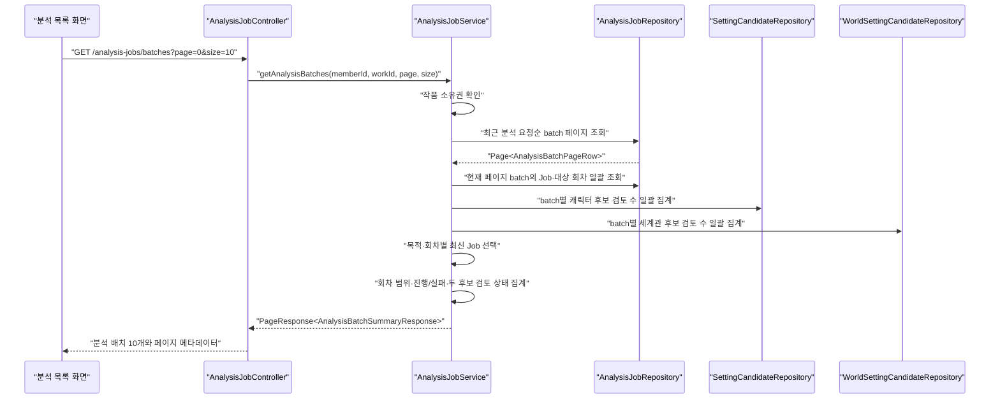
```mermaid
sequenceDiagram
    participant Client as "분석 목록 화면"
    participant Controller as "AnalysisJobController"
    participant Service as "AnalysisJobService"
    participant JobRepo as "AnalysisJobRepository"
    participant CandidateRepo as "SettingCandidateRepository"
    participant WorldCandidateRepo as "WorldSettingCandidateRepository"

    Client->>Controller: "GET /analysis-jobs/batches?page=0&size=10"
    Controller->>Service: "getAnalysisBatches(memberId, workId, page, size)"
    Service->>Service: "작품 소유권 확인"
    Service->>JobRepo: "최근 분석 요청순 batch 페이지 조회"
    JobRepo-->>Service: "Page<AnalysisBatchPageRow>"
    Service->>JobRepo: "현재 페이지 batch의 Job·대상 회차 일괄 조회"
    Service->>CandidateRepo: "batch별 캐릭터 후보 검토 수 일괄 집계"
    Service->>WorldCandidateRepo: "batch별 세계관 후보 검토 수 일괄 집계"
    Service->>Service: "목적·회차별 최신 Job 선택"
    Service->>Service: "회차 범위·진행/실패·두 후보 검토 상태 집계"
    Service-->>Controller: "PageResponse<AnalysisBatchSummaryResponse>"
    Controller-->>Client: "분석 배치 10개와 페이지 메타데이터"
```

재시도 전 `FAILED` Job과 재시도 후 `PENDING` Job이 같은 회차에 함께 있어도 최신 Job만 현재 상태에 포함합니다. 이 규칙은 과거 실패 이력을 삭제하지 않으면서 목록 카드가 현재 진행 상태를 표시하게 합니다. 현재 유효 Job이 작품 영구 삭제로 `CANCELED`되면 그룹과 배치도 완료가 아닌 `CANCELED`로 집계하고, 그룹 응답의 `canceledJobCount`로 취소 건수를 제공합니다.
