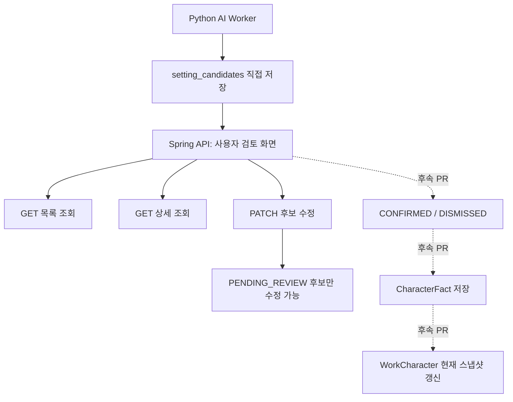
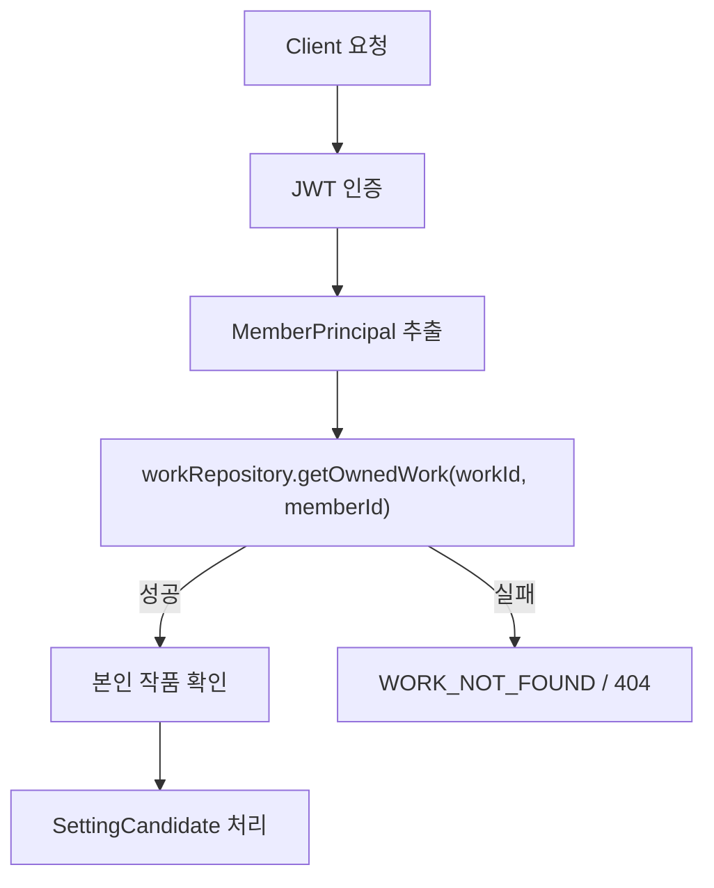
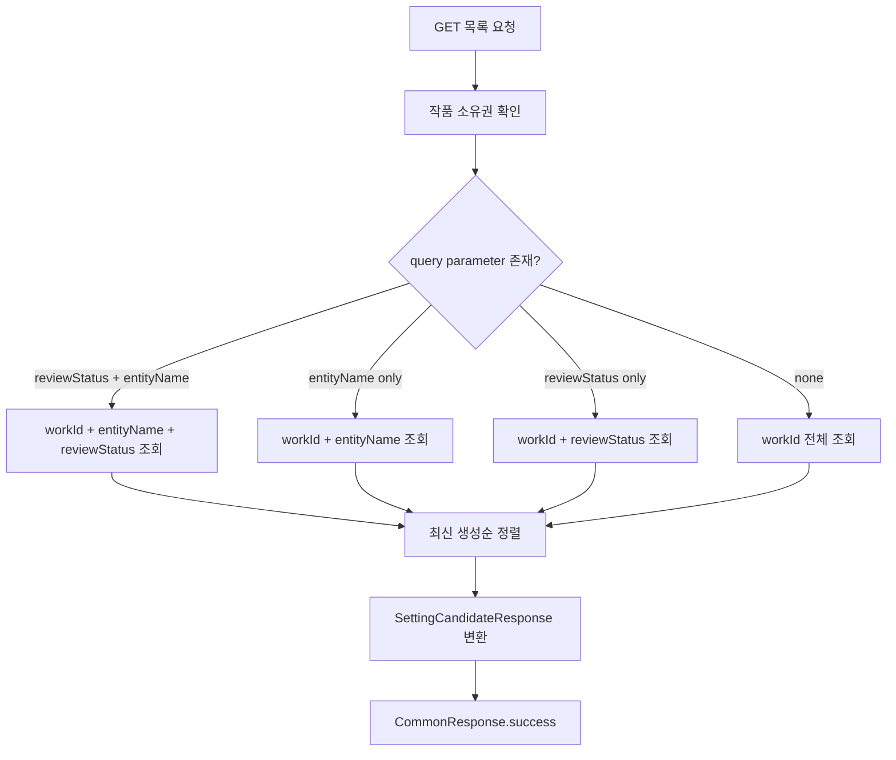
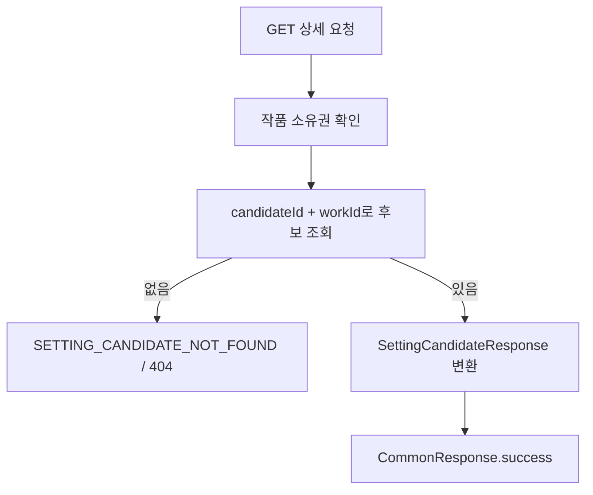
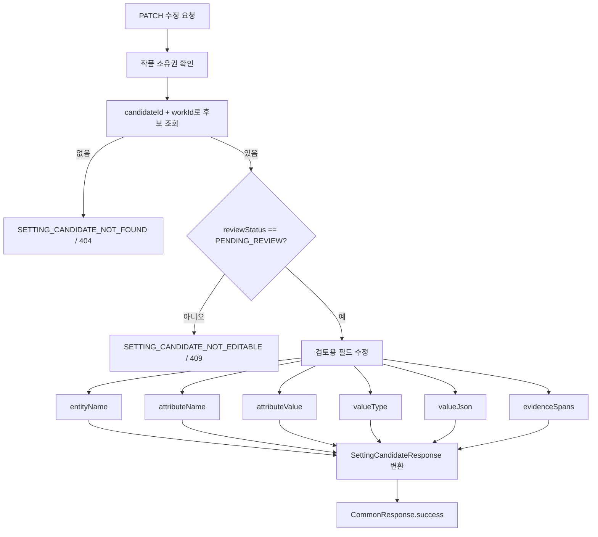

# Character Domain

## 목적

Character 도메인은 작품별 캐릭터 설정과 AI가 추출한 설정 후보를 저장합니다.

현재 범위에서는 Python AI Worker가 저장한 설정 후보를 사용자가 검토할 수 있도록 Spring 조회/수정 API를 제공합니다.

## 핵심 결정

### 작품에 속한 캐릭터

캐릭터는 전역 인물 사전이 아니라 특정 `Work` 안에 속한 설정입니다.

`WorkCharacter`는 작품별 캐릭터 대표/현재 설정을 저장합니다. 이름, 역할, 현재 나이, 현재 레벨처럼 화면 표시와 검색, 비교에 자주 쓰는 값은 일반 컬럼으로 둡니다.

### 일반 컬럼과 JSONB 분리

MVP에서 우선 관리할 캐릭터 설정은 숫자, 아이템, 스킬, 능력치, 시간/상태처럼 작품마다 구조가 달라질 수 있는 값입니다.

그래서 자주 조회하는 핵심 값은 일반 컬럼으로 두고, 작품마다 구조가 달라지는 상세값은 JSONB로 저장합니다.

- `profile_json`: 성별, 종족, 소속, 설명 등 프로필성 값
- `stats_json`: 근력, 민첩, 마력 같은 작품별 스탯
- `skills_json`: 스킬명, 분류, 레벨, 효과, 제한 조건
- `items_json`: 아이템명, 분류, 수량, 장착 여부
- `statuses_json`: 시간 상태, 상태 이상, 능력, 현재 타임라인 적용 여부

Java 타입은 `JsonNode`로 통일하고 Hibernate JSON 매핑을 사용합니다. AI 출력 구조를 과하게 평탄화하지 않고 보존하기 위한 선택입니다.

### AI 설정 후보

`SettingCandidate`는 AI가 추출한 사용자 검토 전 후보를 저장합니다.

후보에는 대상 캐릭터, 속성명, 표시용 값, 값 타입, 신뢰도, 검토 상태를 일반 컬럼으로 저장합니다. 실제 복합 값, 원문 근거 위치, AI 원본 응답은 JSONB로 보관합니다.

AI 결과는 바로 확정 설정으로 보지 않습니다. 사용자가 검토하기 전까지 `PENDING_REVIEW` 상태의 후보입니다.

후보 생성은 Python AI Worker가 DB에 직접 저장하는 흐름으로 둡니다. Spring은 사용자 검토 화면을 위해 후보 목록/상세 조회와 `PENDING_REVIEW` 후보의 내용 보정 API만 제공합니다.

### 캐릭터 설정 이력

`CharacterFact`는 캐릭터의 개별 설정 값과 변경 이력을 저장합니다.

`characters`가 현재 화면에 보여줄 확정된 대표/현재 스냅샷이라면, `character_facts`는 나이, 레벨, 스탯, 아이템, 스킬 같은 설정이 어느 회차에서 어떤 값으로 등장했는지 추적합니다.

AI Worker가 추출한 값은 먼저 `SettingCandidate`에 저장하고, 사용자가 승인한 값은 `CharacterFact`로 남긴 뒤, 필요하면 `WorkCharacter`의 현재 스냅샷 필드에도 반영합니다.

## 상태 모델

`CharacterStatus`

| 상태 | 의미 | 전이 시점 |
| --- | --- | --- |
| `ACTIVE` | 활성 | `WorkCharacter.create()`로 캐릭터 대표 설정을 만들 때 기본값으로 설정됩니다. |
| `ARCHIVED` | 보관됨 | `WorkCharacter.archive()`로 전환합니다. 복구 API는 아직 정의하지 않았습니다. |

`SettingCandidateReviewStatus`

| 상태 | 의미 | 전이 시점 |
| --- | --- | --- |
| `PENDING_REVIEW` | 검토 대기 | AI Worker가 추출한 후보를 `SettingCandidate.create()`로 저장할 때 기본값으로 설정됩니다. |
| `CONFIRMED` | 확정됨 | 사용자가 후보를 기준 설정에 반영하기로 하면 `SettingCandidate.confirm()`으로 전환합니다. |
| `DISMISSED` | 무시됨 | 사용자가 후보를 반영하지 않기로 하면 `SettingCandidate.dismiss()`로 전환합니다. |

검토 상태는 후보 단계의 `SettingCandidate`에만 둡니다. `WorkCharacter`와 `CharacterFact`는 사용자가 후보를 승인한 뒤 생성되는 대표 설정과 설정 이력이므로 별도 review status를 갖지 않습니다.

설정 후보 확정 후속 TODO:

- `SettingCandidate.CONFIRMED` 후 `CharacterFact`를 생성하는 API 흐름을 정의해야 합니다.
- 새 `CharacterFact`가 current가 될 때 기존 current fact를 언제 `markHistorical()`로 내릴지 결정해야 합니다.
- 후보는 `PENDING_REVIEW` 상태에서만 수정할 수 있습니다. 확정/무시 후 수정을 허용할지는 `CharacterFact` 반영 정책과 함께 별도로 결정합니다.

설정 후보 조회 응답 후속 TODO:

- FE 검토 화면에서 목록과 상세에 각각 필요한 데이터 범위를 먼저 확정해야 합니다.
- 현재 API는 목록/상세가 같은 응답 DTO를 사용합니다. 목록 화면에 `valueJson`, `evidenceSpans`, `rawAiResultJson` 같은 상세 필드가 필요하지 않다면 후속 PR에서 목록 요약 응답과 상세 응답을 분리합니다.
- 응답 분리 시 목록은 테이블/카드 렌더링에 필요한 값 중심으로 줄이고, 상세는 후보 편집과 근거 검토에 필요한 전체 값을 내려주는 방향을 우선 검토합니다.

`SettingEntityType`

| 유형 | 의미 |
| --- | --- |
| `CHARACTER` | 캐릭터 |

`SettingValueType`

| 유형 | 의미 |
| --- | --- |
| `STRING` | 문자열 |
| `NUMBER` | 숫자 |
| `BOOLEAN` | 참/거짓 |
| `JSON` | JSON |
| `UNKNOWN` | 알 수 없음 |

`CharacterFactType`

| 유형 | 의미 |
| --- | --- |
| `AGE` | 나이 |
| `LEVEL` | 레벨 |
| `STAT` | 스탯 |
| `SKILL` | 스킬 |
| `ITEM` | 아이템 |
| `STATUS` | 상태 |
| `TIME` | 시간 |

## DB 모델

`characters`

| 필드 | 설명 |
| --- | --- |
| `id` | 캐릭터 UUID |
| `work_id` | 캐릭터가 속한 작품 ID |
| `name` | 대표 이름 |
| `role_label` | 주인공, 조연, 적대자 등 역할 라벨 |
| `current_age` | 현재 나이 확정값 |
| `current_level` | 현재 레벨 확정값 |
| `profile_json` | 프로필 상세 JSONB |
| `stats_json` | 스탯 상세 JSONB |
| `skills_json` | 스킬 상세 JSONB |
| `items_json` | 아이템 상세 JSONB |
| `statuses_json` | 시간/상태/능력 상세 JSONB |
| `first_appearance_episode_id` | 최초 등장 회차 ID. 현재는 UUID 값으로 저장 |
| `status` | 캐릭터 보관 상태 |
| `created_at` | 생성 시각 |
| `updated_at` | 수정 시각 |

`character_facts`

| 필드 | 설명 |
| --- | --- |
| `id` | 캐릭터 설정 이력 UUID |
| `character_id` | 어떤 캐릭터의 설정인지 나타내는 FK |
| `fact_type` | 설정 유형. 예: AGE, LEVEL, STAT, SKILL, ITEM, STATUS, TIME |
| `fact_key` | 구체적인 설정 키. 예: age, level, strength, skill.흑염.level |
| `fact_value` | 확정된 표시값. 예: 17, 12, 35, OWNED |
| `normalized_value` | 비교를 쉽게 하기 위한 정규화 값 |
| `value_json` | 스킬/아이템/상태 이상처럼 복잡한 설정 값 JSONB |
| `source_episode_id` | 이 설정이 확인된 회차 ID |
| `source_chunk_id` | 이 설정이 확인된 청크 ID. 현재는 FK 없이 UUID 값으로 저장 |
| `extracted_by_job_id` | 이 설정을 추출한 분석 작업 ID |
| `confidence` | AI 추출 신뢰도 |
| `is_current` | 현재 기준으로 유효한 최신 설정인지 여부 |
| `effective_from_episode_no` | 이 설정이 몇 화부터 유효한지 |
| `created_at` | 생성 시각 |
| `updated_at` | 수정 시각 |

`setting_candidates`

| 필드 | 설명 |
| --- | --- |
| `id` | 설정 후보 UUID |
| `work_id` | 후보가 속한 작품 ID |
| `episode_id` | 후보가 추출된 회차 ID. 없을 수 있음 |
| `source_chunk_id` | 근거 청크 ID. 청킹 모델 구현 전까지 FK 없이 UUID 값으로 저장 |
| `analysis_job_id` | 후보를 만든 분석 작업 ID. 없을 수 있음 |
| `entity_type` | 설정 대상 유형 |
| `entity_name` | 캐릭터명 또는 대상명 |
| `attribute_name` | age, level, stats, skills, items 등 속성명 |
| `attribute_value` | 목록/검색 표시용 값 |
| `value_type` | 값 타입 |
| `value_json` | 복합 값 JSONB |
| `evidence_spans` | 원문 근거 위치와 인용문 JSONB |
| `confidence` | AI 신뢰도 |
| `review_status` | 후보 검토 상태 |
| `raw_ai_result_json` | AI 원본 응답 JSONB |
| `created_at` | 생성 시각 |
| `updated_at` | 수정 시각 |

## Repository

`WorkCharacterRepository`

- `findByWorkIdAndName(workId, name)`
- `findAllByWorkIdOrderByCreatedAtDesc(workId)`

`SettingCandidateRepository`

- `findAllByWorkIdOrderByCreatedAtDesc(workId)`
- `findAllByWorkIdAndReviewStatusOrderByCreatedAtDesc(workId, reviewStatus)`
- `findAllByWorkIdAndEntityNameOrderByCreatedAtDesc(workId, entityName)`
- `findAllByWorkIdAndEntityNameAndReviewStatusOrderByCreatedAtDesc(workId, entityName, reviewStatus)`
- `findByIdAndWorkId(candidateId, workId)`

`CharacterFactRepository`

- `findAllByWorkCharacterIdOrderByCreatedAtDesc(characterId)`
- `findAllByWorkCharacterIdAndIsCurrentTrueOrderByFactTypeAscFactKeyAsc(characterId)`
- `findAllByWorkCharacterIdAndFactTypeAndFactKeyOrderByEffectiveFromEpisodeNoDescCreatedAtDesc(characterId, factType, factKey)`

## HTTP API

설정 후보 API는 모두 로그인한 사용자의 본인 작품에서만 동작합니다. 다른 회원의 작품 접근은 기존 Work 정책과 동일하게 `WORK_NOT_FOUND`로 응답합니다.

| 메서드 | 경로 | 설명 |
| --- | --- | --- |
| `GET` | `/api/v1/works/{workId}/setting-candidates` | 설정 후보 목록을 최신 생성순으로 조회합니다. `reviewStatus`, `entityName` query parameter로 필터링할 수 있습니다. |
| `GET` | `/api/v1/works/{workId}/setting-candidates/{candidateId}` | 특정 설정 후보 상세를 조회합니다. |
| `PATCH` | `/api/v1/works/{workId}/setting-candidates/{candidateId}` | 검토 대기 후보의 `entityName`, `attributeName`, `attributeValue`, `valueType`, `valueJson`, `evidenceSpans`를 수정합니다. |

Spring API는 `SettingCandidate` 생성 API를 제공하지 않습니다. 후보 생성은 Python AI Worker가 담당하고, Spring은 사용자 검토 단계의 조회/수정부터 담당합니다.

### 설정 후보 검토 워크플로우

설정 후보 API는 다음 공통 접근 흐름을 먼저 통과합니다.

목록 조회는 query parameter 조합에 따라 Repository 조회 메서드를 선택합니다.

상세 조회는 후보가 요청 작품에 속하는지 함께 확인합니다.

수정 API는 사용자가 검토 화면에서 보정할 수 있는 필드만 변경합니다. AI 추출 출처와 검토 상태는 유지합니다.

수정 API에서 변경하지 않는 값은 `work`, `episode`, `sourceChunkId`, `analysisJob`, `entityType`, `confidence`, `reviewStatus`, `rawAiResultJson`입니다.

## 다른 도메인과의 연결

- `WorkCharacter`와 `SettingCandidate`는 모두 `work_id`로 작품에 속합니다.
- `CharacterFact`는 `character_id`로 `WorkCharacter`에 속합니다.
- `CharacterFact.source_episode_id`는 설정이 확인된 회차를 가리킬 수 있습니다.
- `CharacterFact.extracted_by_job_id`는 설정을 추출한 분석 작업을 가리킬 수 있습니다.
- `SettingCandidate.episode_id`는 후보가 나온 회차를 가리킬 수 있습니다.
- `SettingCandidate.analysis_job_id`는 후보를 만든 분석 작업을 가리킬 수 있습니다.
- `source_chunk_id`는 Notion 작업 흐름의 `ManuscriptChunk`와 연결될 예정이지만, 현재 청킹 Entity가 없으므로 FK를 강제하지 않습니다.

## 이번 범위에서 제외한 것

- 설정 후보 생성 API
- 설정 후보 확정/무시 API
- 확정 후보의 `CharacterFact` 반영 API
- AI Worker 연동과 실제 설정 추출 로직
- `ManuscriptChunk`, `PreprocessedManuscriptChunk`
- 검수 리포트 모델인 `ValidationReport`, `ValidationFinding`
- JSONB 내부 스키마의 DB 레벨 검증

## 이후 작업

- 캐릭터 목록/상세 API 정의
- 설정 후보 확정/무시 API 정의
- `ManuscriptChunk` 구현 후 `source_chunk_id` FK 여부 결정
- 후보 승인 시 `CharacterFact` 생성, 이전 current fact 비활성화, `WorkCharacter` 현재 스냅샷 갱신 정책 정의
- 신규 회차 검수에서 구조화 조회와 벡터 검색을 함께 사용하는 흐름 연결
