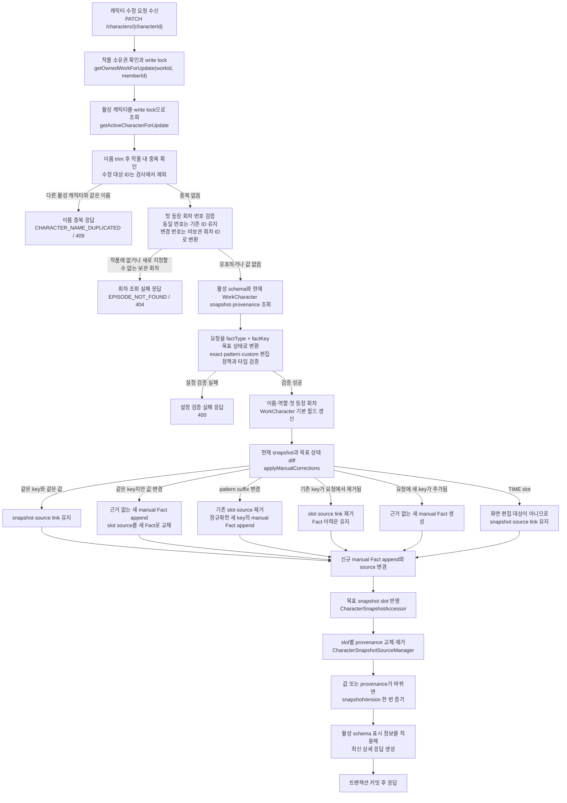
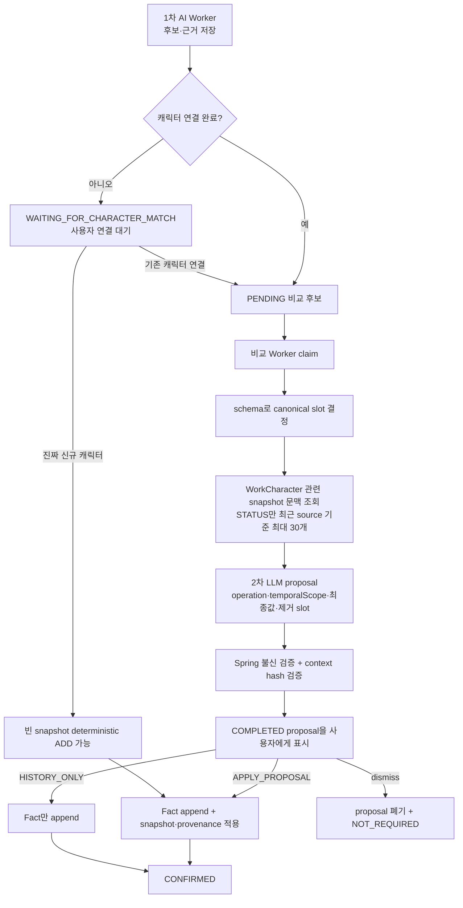
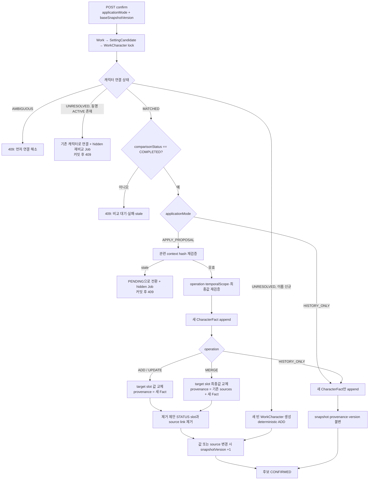
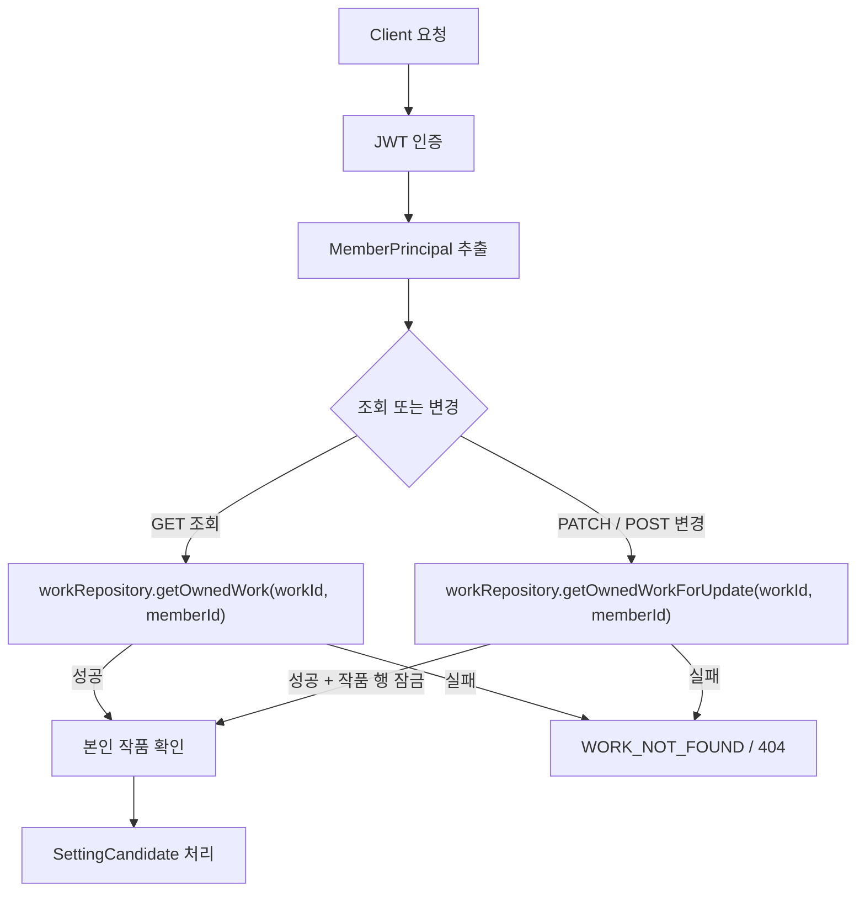
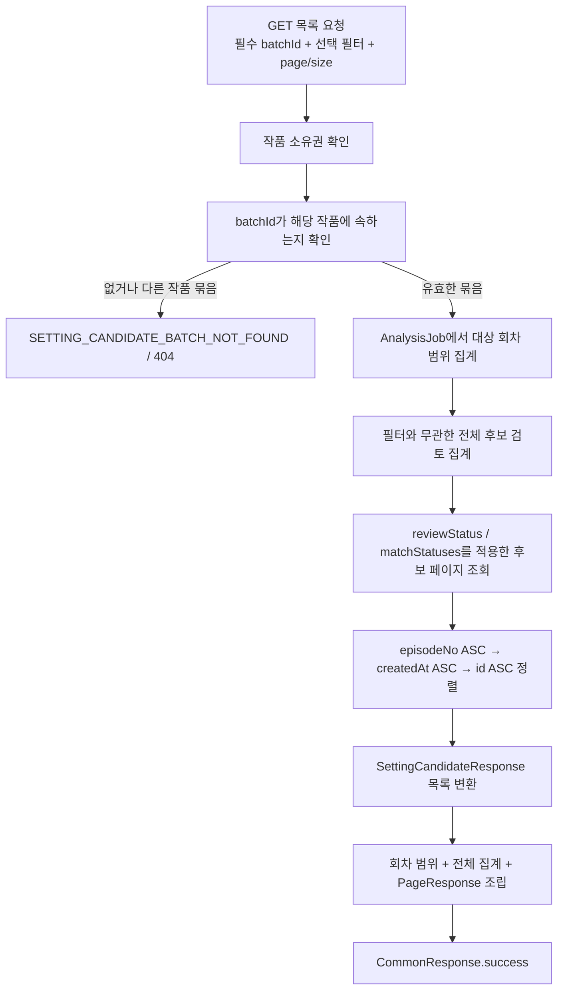
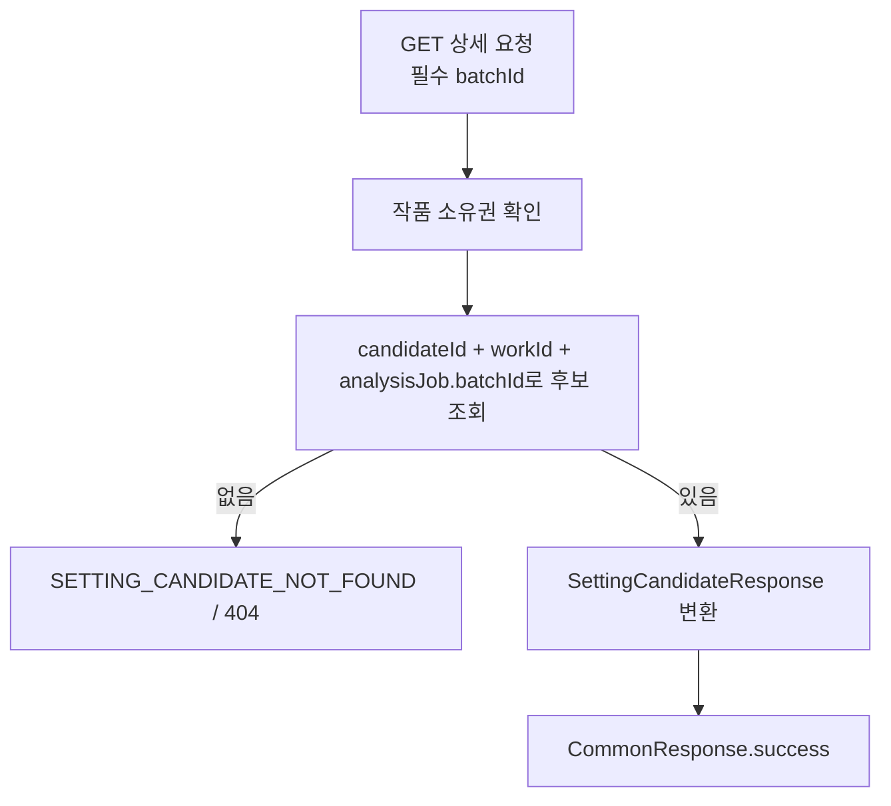
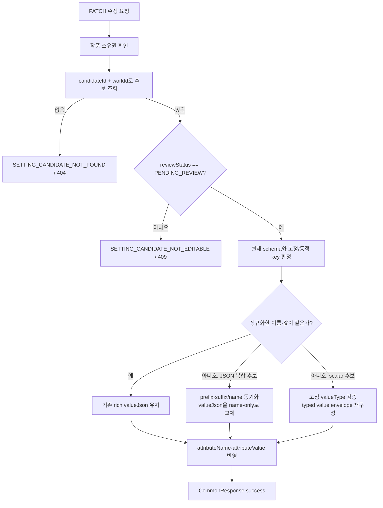
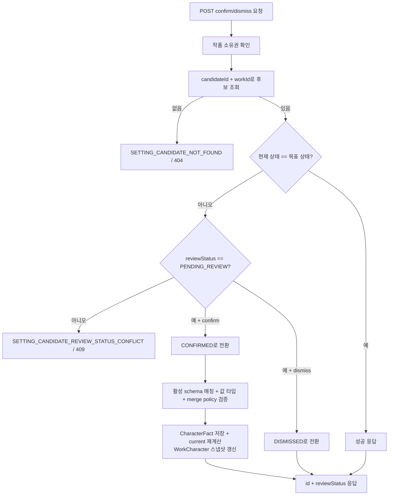

# Character Domain

## 목적

Character 도메인은 작품별 캐릭터 설정과 AI가 추출한 설정 후보를 저장합니다.

현재 범위에서는 Python AI Worker가 저장한 설정 후보를 사용자가 검토할 수 있도록 Spring 조회/수정/확정/무시 API를 제공하고, 확정된 후보를 캐릭터 설정 이력에 반영합니다. 설정DB 화면에서는 활성 캐릭터 목록·상세를 조회하고, 현재 설정 전체를 수정하거나 삭제 버튼으로 캐릭터를 보관할 수 있습니다.

## 핵심 결정

### 작품에 속한 캐릭터

캐릭터는 전역 인물 사전이 아니라 특정 `Work` 안에 속한 설정입니다.

`WorkCharacter`는 작품별 캐릭터 대표/현재 설정을 저장합니다. 이름, 역할, 현재 나이, 현재 레벨처럼 화면 표시와 검색, 비교에 자주 쓰는 값은 일반 컬럼으로 둡니다.

### 일반 컬럼과 JSONB 분리

MVP에서 우선 관리할 캐릭터 설정은 숫자, 아이템, 스킬, 능력치, 시간/상태처럼 작품마다 구조가 달라질 수 있는 값입니다.

그래서 자주 조회하는 핵심 값은 일반 컬럼으로 두고, 작품마다 구조가 달라지는 상세값은 JSONB로 저장합니다.

- `profile_json`: 현재 `PROFILE` slot map
- `stats_json`: 현재 `STAT` slot map
- `skills_json`: 현재 `SKILL` slot map
- `items_json`: 현재 `ITEM` slot map
- `statuses_json`: 현재 `STATUS`, 레거시 `TIME` slot map

현재값의 유일한 authority는 `WorkCharacter.currentAge/currentLevel`과 위 JSON snapshot입니다. `CharacterFact`는 current flag 없이 append-only 이력으로 남습니다. JSON entry는 사용자 구조화 값과 화면 표시값을 함께 보존하기 위해 내부 `__catchhole_snapshot` envelope에 `valueJson`과 `factValue`를 저장하지만 API에서는 envelope를 제거한 사용자 값만 반환합니다. 기존 raw entry는 그대로 읽고 provenance Fact로 표시값을 보완한 뒤 실제 수정 시 새 형식으로 점진 전환합니다.

### 캐릭터 설정 Schema Registry

`CharacterSettingSchema`는 캐릭터의 실제 능력치 값이나 작품 설정을 저장하지 않습니다. AI가 만든 `SettingCandidate.attributeName`을 canonical `schemaKey`로 해석하기 위한 이름, alias, pattern, 값 타입, 저장 정책을 보관합니다.

- `work_id = NULL`인 row는 모든 작품에 적용하는 전역 schema입니다.
- `work_id`가 있는 row는 해당 작품에 전역에 없는 key를 추가하는 schema입니다. 이번 범위에서는 같은 key override나 중복 병합을 지원하지 않습니다.
- Worker claim은 `enabled = true AND (work_id IS NULL OR work_id = :workId)`인 row를 `schema_key` 오름차순으로 제공합니다.
- Worker에는 `schemaKey`, `displayName`, `attributePattern`, `aliases`, `valueType`만 공개합니다. DB 식별자와 source, enabled, merge 정책은 백엔드 내부 정책입니다.
- Spring Backend는 비교 문맥 생성과 confirm에서 활성 전역/현재 작품 schema를 schemaKey 정확 일치 → 별칭 → 마지막이 `.*`로 끝나는 속성 패턴 순으로 매칭하고 `SettingValueType` enum과 지원 merge policy를 검증합니다. canonical `factType + factKey`는 AI가 임의로 바꿀 수 없습니다.

초기 전역 seed는 목적에 따라 구분합니다.

| source | 개수 | schema key | 목적 |
| --- | ---: | --- | --- |
| `SYSTEM_SEED` | 15 | 기존 공통 7개와 `profile`, `profile.gender`, `profile.species`, `profile.affiliation`, `profile.occupation`, `profile.eye_color`, `profile.description`, `profile.attribute` | 장르와 작품에 공통으로 사용할 최소 canonical schema와 프로필 설정 |
| `DEV_SEED` | 15 | `stats.physique`, `stats.mental`, `stats.supernatural`, `stats.item_level`, `stats.combat_power`, `stats.agility`, `stats.endurance`, `stats.soul_power`, `stats.magic_resistance`, `stats.physical_resistance`, `stats.natural_regeneration`, `stats.bone_strength`, `stats.energy`, `stats.perception`, `stats.mental_power` | 판타지 작품에서 수치형 스테이터스 추출을 검증하기 위한 POC schema |

판타지 POC의 이름과 alias는 《게임 속 바바리안》 공개 팬 아카이브의 [비요른 스테이터스](https://www.deokhu.com/status), [정수 도감](https://www.deokhu.com/essences)을 schema 이름 선정 근거로만 참고했습니다. 현재 수치, 장비·정수 목록, 파티 정보, 작품 설명은 seed에 저장하지 않습니다. `정신`과 `정신력`처럼 별도 능력치가 될 수 있는 표현도 alias로 강제 병합하지 않습니다.

적용된 seed를 승격하거나 alias를 수정할 때는 기존 Flyway migration을 고치지 않고 다음 migration에서 `UPDATE`합니다.

### AI 설정 후보

`SettingCandidate`는 AI가 추출한 사용자 검토 전 후보를 저장합니다.

후보에는 대상 캐릭터, 후보 종류, 신뢰도, 검토 상태를 일반 컬럼으로 저장합니다. `candidateKind=SETTING`은 속성명·표시용 값·값 타입·구조화 값을 함께 저장하고, `candidateKind=CHARACTER_DISCOVERY`는 원문에서 이름의 존재만 확인한 후보라서 설정 값 필드를 모두 `null`로 둡니다. 원문 근거 위치와 AI 원본 응답은 JSONB로 보관합니다.

예를 들어 `케닉의 넷째 아들 세룸은 나와라!`는 `entityName=세룸`, `rawEntityMention=케닉의 넷째 아들 세룸`인 발견 후보가 될 수 있습니다. 같은 문장에서 가족 관계가 활성 `profile.*` schema에 대응하면 별도의 `SETTING` 후보도 함께 생성할 수 있습니다.

AI 결과는 바로 확정 설정으로 보지 않습니다. 사용자가 검토하기 전까지 `PENDING_REVIEW` 상태의 후보입니다.

후보 생성은 Python AI Worker가 DB에 직접 저장하는 흐름으로 둡니다. Spring은 사용자 검토 화면을 위해 정규화한 캐릭터 이름별 그룹 목록, `PENDING_REVIEW` 후보의 내용 보정·단건 및 그룹 캐릭터 연결, 그룹 확정과 row 무시 상태 전이 API를 제공합니다.

### 설정 후보 값 정합성 정책

`attributeValue`는 검토 화면과 검색에 보여 줄 표시값이고, `valueJson.value`는 Fact와 snapshot에 반영할 구조화 대표값입니다. 결정적 scalar에서 두 표현이 다르면 사용자가 본 값과 실제 저장값이 달라지므로 다음 계약을 강제합니다.

- `NUMBER`: `attributeValue`는 `BigDecimal`로 해석 가능한 숫자 문자열이고 `valueJson.value`는 JSON number여야 하며, scale을 무시한 수치가 같아야 합니다. 예를 들어 `36.0`과 `36`은 같지만 `정신이 1 상승`과 `36`은 다릅니다.
- `BOOLEAN`: `attributeValue`는 소문자 `true` 또는 `false`이고 `valueJson.value`는 JSON boolean이며, 두 값이 같아야 합니다.
- `STRING`, `JSON`, `UNKNOWN`: 기존 표시 summary 정책과 구조화 property 검증을 유지합니다.
- Worker의 `ADD`/`UPDATE`/`MERGE` proposal도 `proposedFactValue`/`proposedValueJson.value`에 같은 scalar 정합성 검증을 적용합니다.

조회 응답은 현재 활성 schema와 저장된 후보를 평가한 `valueValidation`을 항상 포함합니다. `SETTING`은 `VALID` 또는 `INVALID`, 값이 없는 `CHARACTER_DISCOVERY`는 `NOT_APPLICABLE`입니다. `INVALID`에는 구조화된 `errorCode`, 사용자 문구 `message`, 현재 후보 수정 API로 복구할 수 있는지를 나타내는 `repairable`을 함께 내려줍니다. 이 상태는 DB 컬럼으로 저장하지 않고 응답 조립 시 파생하므로 migration이나 기존 후보 backfill을 하지 않습니다.

`INVALID` 후보는 목록에서 숨기지 않고 무시를 허용합니다. 표시값·구조화 값 계약 오류는 후보가 `PENDING_REVIEW`일 때만 `repairable=true`이며, 사용자가 유효한 표시값으로 저장하면 Backend가 typed `valueJson` envelope를 재구성하고 필요한 비교를 다시 대기시킵니다. 이미 확정·무시된 후보와 활성 schema 없음·모호성·타입 불일치는 현재 수정 API로 복구할 수 없으므로 `repairable=false`로 내려 수정 가능하다고 안내하지 않습니다. 두 경우 모두 2차 비교, Worker proposal 완료, 단건·그룹 확정은 fail-closed로 거절합니다.

### 설정 후보 편집 정책

후보 편집은 사용자가 AI 추출 결과를 확정하기 전에 후보 내용을 보정하는 단계입니다. 이 API는 후보 생성, 확정, 무시, `CharacterFact` 반영을 처리하지 않습니다.

- 편집 가능 상태는 `PENDING_REVIEW`로 제한합니다.
- `CONFIRMED`, `DISMISSED` 후보 수정 요청은 `SETTING_CANDIDATE_NOT_EDITABLE / 409`로 거절합니다.
- `CHARACTER_DISCOVERY` 후보는 편집할 설정 콘텐츠가 없으므로 일반 내용 수정 요청을 `SETTING_CANDIDATE_CONTENT_NOT_EDITABLE / 400`으로 거절합니다. 캐릭터 연결 변경과 확정/무시는 그대로 지원합니다.
- MVP 일반 후보 수정 API는 사용자에게 노출한 `attributeName`, `attributeValue`만 받습니다. 캐릭터 이름과 연결 상태는 단건 내용 수정이 아니라 캐릭터 연결 해소 API 또는 그룹 일괄 연결 API로 변경합니다. `valueType`, 중첩 JSON 속성, 원문 근거는 클라이언트가 보내거나 직접 편집하지 않습니다.
- 고정 exact/alias schema에 매칭된 후보는 설정명을 바꿀 수 없습니다. 동적 `.*` pattern 후보만 기존 prefix를 유지한 채 suffix를 바꿀 수 있습니다.
- 후보 응답의 `attributeNameEditable`, `attributeNamePrefix`는 현재 작품의 활성 schema를 같은 resolver로 해석한 서버 권위 편집 계약입니다. exact/alias는 `false/null`, pattern은 `true/<pattern prefix>`이며, 미매칭·타입 불일치·모호한 기존 후보는 조회를 막지 않고 `false/null`로 내려 안전하게 이름 편집만 잠급니다.
- 동적 suffix는 앞뒤 공백을 제거하고 내부 공백을 `_`로 정규화합니다. `skill.월광 참`은 `attributeName = skill.월광_참`으로 저장하며 사용자용 JSON 이름은 `월광 참`으로 맞춥니다.
- 새 동적 suffix가 공백 또는 `_`만으로 구성되면 거절합니다. 다만 Worker나 기존 데이터에 이미 이런 suffix가 저장된 pattern 후보는 편집 가능 상태로 응답하고, 사용자가 유효한 suffix로 교정하는 요청은 허용합니다.
- 정규화한 설정명과 표시값이 모두 기존과 의미상 같으면 AI가 만든 기존 `valueJson`을 그대로 유지합니다. 다만 동적 key의 공백→`_`, 표시값 앞뒤 공백 제거처럼 저장 문자열의 정규화만 필요한 경우에는 JSON을 축소하지 않고 해당 문자열만 갱신합니다.
- `SettingValueType.JSON`인 복합 후보의 설정명 또는 표시값이 실제로 바뀌면, 현재 후보의 `valueJson`을 `{"name":"<사용자 설정명>"}`으로 의도적으로 축소합니다. `level`, `effect`, `quantity`, `equipped`처럼 타입 계약이 없는 숨은 속성은 merge하거나 새 표시값에서 추측하지 않습니다.
- scalar 후보가 실제로 바뀌면 기존의 고정 `valueType`으로 표시값을 검증하고 typed `value` envelope를 다시 만듭니다. 동적 scalar key는 표시명 동기화를 위해 `name`도 함께 저장합니다.
- `valueType`, 출처 회차, 원문 표현, source chunk, `evidenceSpans`, `confidence`, `rawAiResultJson`, 검토 상태는 일반 내용 편집으로 변경하지 않습니다. `rawAiResultJson`은 최초 AI payload의 감사·디버깅 자료이며 confirm 시 현재 값 복원에 사용하지 않습니다.
- 모든 후보의 `valueJson` 컬럼이 JSONB이지만 여기서 말하는 복합 후보는 `SettingValueType.JSON` 후보입니다. 현재 기본 동적 복합 schema는 `skill.*`, `item.*`, `status.*`이며, 중첩 속성별 타입과 입력 UI를 정의하는 구조화 편집은 후속 범위입니다.
- 캐릭터 이름과 연결 대상 변경은 일반 후보 수정에서 처리하지 않습니다. 단건 캐릭터 연결 해소 API 또는 같은 이름 후보를 함께 처리하는 그룹 일괄 연결 API가 `entityName`, `matchedCharacterId`, `matchStatus`를 현재 결정 상태에 맞게 갱신하고, 필요한 비교 제안을 다시 생성합니다.
- 그룹 이름 수정은 현재 배치·정규화 이름의 모든 `PENDING_REVIEW` 후보 ID가 정확히 전달됐는지 잠금 뒤 검증하고 한 트랜잭션으로 변경합니다. 같은 이름의 과거 후보가 모두 확정·무시됐더라도 과거 상태를 되돌리지 않고 새 대기 그룹만 만듭니다.

확정/무시된 후보를 다시 편집하거나, 확정 후 `CharacterFact`에 이미 반영된 값을 수정하는 흐름은 이 정책에 포함하지 않습니다. 해당 요구가 생기면 후보 재오픈 또는 별도 정정 이력 정책을 먼저 정의합니다.

### 설정 후보 검토 상태 전이 정책

그룹 확정과 row 무시 API는 사용자의 검토 결정을 기록하는 단계입니다. 그룹 확정 API는 같은 이름의 남은 대기 후보 전체가 처음 `CONFIRMED`가 되는 경우 후보 종류에 맞춰 `WorkCharacter` 또는 `CharacterFact`에 반영합니다.

- `PENDING_REVIEW` 후보는 `CONFIRMED` 또는 `DISMISSED`로 전환할 수 있습니다.
- 이미 `CONFIRMED`인 후보에 다시 확정을 요청하거나, 이미 `DISMISSED`인 후보에 다시 무시를 요청하면 성공으로 처리합니다. 이때 `CharacterFact`는 중복 생성하지 않습니다.
- `CONFIRMED` 후보를 무시하거나 `DISMISSED` 후보를 확정하는 반대 상태 전이는 `SETTING_CANDIDATE_REVIEW_STATUS_CONFLICT / 409`로 거절합니다.
- 확정/무시 이후 재편집이나 재오픈은 별도 정책이 정해질 때까지 지원하지 않습니다.

### 설정 후보 확정 데이터 반영 정책

`candidateKind=SETTING` 후보는 캐릭터 연결 뒤 2차 비교를 거쳐야 합니다. 비교 Worker는 새 후보 자체를 신뢰하지 않고 Backend가 정한 canonical slot과 현재 snapshot 문맥을 받아 `ADD`, `UPDATE`, `MERGE`, `REMOVE`, `HISTORY_ONLY`, `EXCLUDE`, `REVIEW_REQUIRED` 중 하나를 제안합니다. AI는 제안만 하며 실제 상태 변경은 사용자 confirm 트랜잭션에서만 발생합니다.

- `PROFILE`, `STAT`, `SKILL`, `ITEM`, `AGE`, `LEVEL` 문맥은 canonical exact slot만 제공합니다. 다른 key 변경 때문에 불필요한 stale 재비교가 발생하지 않게 하기 위함입니다.
- `STATUS`는 exact slot을 먼저 넣고, 회복·해제에 따라 종료할 다른 현재 상태를 판단하도록 같은 캐릭터의 `STATUS`를 source Fact 생성 시각 최신순으로 최대 30개 제공합니다. 생성 시각이 같거나 없는 legacy slot은 `factKey`로 순서를 고정합니다.
- 문맥에는 snapshot의 `factValue`, `valueJson`을 함께 제공하고 hash에는 후보 의미값, canonical target, 선택한 현재값과 provenance Fact ID를 포함합니다. `snapshotVersion`은 감사·화면 동시성 정보이며 관련 없는 slot 변경을 stale로 만들지 않습니다.
- Worker complete에서 `ADD`는 target을 보내지 않고 Backend canonical slot을 사용합니다. `UPDATE`/`MERGE`/`REMOVE`는 canonical target을 정확히 다시 보내며, 나머지 operation은 target·제안값을 보내지 않습니다.
- 현재값을 추가·교체하는 `ADD`/`UPDATE`/`MERGE`에는 비어 있지 않은 `proposedFactValue`와 schema에 맞는 `proposedValueJson`이 필수입니다. `REMOVE`는 `PRESENT + STATUS`인 동일 canonical slot의 종료에만 사용하며 제안값과 추가 제거 목록을 보내지 않습니다. `PAST`/`HYPOTHETICAL`은 `HISTORY_ONLY` 또는 `REVIEW_REQUIRED`, `UNKNOWN`은 `REVIEW_REQUIRED`만 허용합니다. 다른 기존 slot 제거는 `PRESENT + STATUS + ADD/UPDATE/MERGE` 조합에서만 허용합니다.
- 후보 자체와 `ADD`/`UPDATE`/`MERGE` proposal은 schema 검증 직후 공통 값 validator를 통과해야 합니다. 후보가 `INVALID`이면 원 분석·hidden 비교 claim에서 제안을 비우고 `NOT_REQUIRED`로 격리해 다음 후보의 처리를 계속하며, 캐릭터 조회·생성, Fact append, snapshot 갱신 전에도 중단합니다.
- candidate 내용이나 캐릭터 매칭이 바뀌면 기존 proposal을 폐기하고 `PENDING` 또는 `WAITING_FOR_CHARACTER_MATCH`로 전환합니다. 재비교가 필요하면 원 분석 Job의 진행 상태와 관계없이 동일 후보의 활성 hidden `CHARACTER_FACT_COMPARISON` Job을 하나만 생성합니다.
- 활성 hidden Job이 있는 후보는 원 분석 Job의 claim·완료 대기·실패 정리 대상에서 제외합니다. 따라서 원 분석의 마지막 claim과 checkpoint 사이에 사용자가 후보를 바꾸더라도 원 분석과 hidden Worker가 같은 후보를 이중 처리하지 않으며, hidden Job이 claim 전후에 최종 실패하면 연결 후보도 `FAILED`로 전환해 영구 `PENDING`을 남기지 않습니다.
- `APPLY_PROPOSAL` confirm은 완료된 proposal과 관련 문맥 hash를 재검증합니다. 관련 slot이나 provenance가 달라졌다면 proposal을 `PENDING`으로 되돌리고 hidden Job을 만든 뒤 409를 반환합니다. 화면이 보낸 base version만 오래된 경우에는 proposal을 폐기하지 않고 재조회만 요구합니다.
- `HISTORY_ONLY` confirm은 Fact만 append하고 snapshot·provenance·version을 전혀 바꾸지 않으므로 current 문맥 hash와 base version stale 검사를 하지 않습니다.
- `EXCLUDE`는 confirm하지 않고 후보 무시 action을 사용합니다. `REVIEW_REQUIRED`는 `APPLY_PROPOSAL`을 막지만 사용자가 `HISTORY_ONLY`로 원문 이력을 보존할 수 있습니다.
- 실제로 새 `WorkCharacter`를 만드는 빈 snapshot에는 deterministic `ADD`를 허용합니다. `UNRESOLVED` 이름이 기존 `ACTIVE` 캐릭터와 같으면 먼저 `MATCHED + PENDING`으로 연결하고 비교가 끝난 뒤 다시 확정합니다. 동명 `ARCHIVED` 캐릭터는 명시적 충돌로 거절합니다.
- 확정 시 새 `CharacterFact`를 append합니다. `ADD`/`UPDATE`는 snapshot source를 새 Fact 하나로 교체하고 `MERGE`는 기존 source 목록 뒤에 새 Fact를 추가합니다. `REMOVE`는 후보 Fact를 이력으로 append한 뒤 동일한 현재 STATUS slot과 source link만 제거합니다. 제거된 snapshot slot의 과거 Fact와 원문 근거는 삭제하지 않습니다.
- snapshot 값 또는 provenance가 바뀌면 `snapshotVersion`을 같은 트랜잭션에서 정확히 한 번 증가시킵니다. `WorkCharacter.firstAppearanceEpisodeId`는 확정 순서가 아니라 가장 이른 업로드 회차 기준으로 유지합니다.

후보 편집과 confirm 이후 JSON 보존 범위:

| 경우 | 현재 `SettingCandidate.valueJson` | 새 `CharacterFact.valueJson` | 현재 snapshot | 최초 AI JSON |
| --- | --- | --- | --- | --- |
| 내용 미수정 또는 캐릭터 연결만 변경 | rich JSON 유지 | rich JSON 그대로 append | 비교 proposal이 제안한 최종 값 반영 | `rawAiResultJson`에 별도 보관 |
| JSON 복합 후보의 이름/값 실제 수정 | `{"name":"..."}`로 축소 | 수정된 후보 JSON append | 새 비교 결과를 받은 뒤 반영 | `rawAiResultJson`에만 보관 |
| 같은 key의 기존 snapshot이 있음 | 새 후보 값과 별도 유지 | 기존 Fact 행을 수정하지 않음 | `UPDATE`는 proposal로 교체, `MERGE`는 종합값과 복수 source 보존 | 모든 과거 Fact JSON은 타임라인에 유지 |

confirm은 `rawAiResultJson`에서 수정 전 속성을 복원하지 않습니다. 새 Fact는 confirm 시점 후보 값을 보존하고, snapshot은 2차 비교가 반환한 최종 표시값·구조화 값을 사용합니다.

### 캐릭터 현재 설정 수정·보관·복구 정책

- 기본 캐릭터 목록과 상세는 `ACTIVE` 상태만 조회합니다. 다른 작품 캐릭터와 `ARCHIVED` 캐릭터의 상세는 `CHARACTER_NOT_FOUND / 404`로 응답합니다.
- 보관함 목록은 `ARCHIVED` 상태만 조회하며 활성 목록과 동일한 페이지·정렬·첫 등장 회차 표시 계약을 사용합니다.
- 목록은 `page`(0부터 시작)와 `size`(1~24)를 받아 서버에서 페이징합니다. 활성 목록의 기본값은 `page=0`, `size=24`이고 보관함은 한 화면에 9개를 표시하기 위해 `page=0`, `size=9`를 사용합니다.
- 최근에 현재 설정이나 기본 정보가 변경된 캐릭터를 먼저 찾을 수 있도록 `updatedAt DESC, id DESC`로 정렬하며,
  `(work_id, status, updated_at DESC, id DESC)` 복합 인덱스를 사용합니다. 같은 수정 시각에는 `id DESC`가 페이지 순서를 고정합니다.
- 응답은 `content`, `page`, `size`, `totalElements`, `totalPages`, `hasNext`를 제공합니다.
- 목록의 `firstAppearanceEpisodeNo`는 첫 등장 회차가 없거나 현재 작품에서 유효한 회차를 찾지 못하면 `null`로 응답합니다. 해당 캐릭터만 값 없음으로 표시하며 목록 전체 조회는 실패시키지 않습니다.
- 카드 대표 속성은 우선 현재 레벨을 `레벨`로 제공합니다. 레벨이 없으면 대표 속성 표시명과 값을 모두 `null`로 둡니다. 장르별 대표 속성은 후속 정책입니다.
- 이름·역할·첫 등장 회차는 `WorkCharacter` 대표 필드에 반영합니다. 같은 작품의 다른 `ACTIVE` 캐릭터와 이름이 같으면 `CHARACTER_NAME_DUPLICATED / 409`로 거절하며, 보관 캐릭터와 같은 이름은 허용합니다.
- 캐릭터 직접 수정은 AI 후보를 기존 값에 병합하는 과정이 아니라 사용자가 편집 가능한 현재 설정의 최종 상태를 확정하는 과정입니다. 따라서 schema의 `mergePolicy`를 다시 적용하지 않고 `factType + factKey` entry 단위의 `REPLACE`로 처리합니다.
- 나이·레벨·프로필·스탯·스킬·아이템·상태는 기존 항목의 값 변경뿐 아니라 새 항목 추가와 기존 항목 제거도 지원합니다. 변경·추가된 `factType + factKey`마다 출처 후보와 회차가 없는 수동 정정 `CharacterFact`를 append하고 snapshot source를 새 Fact로 교체합니다. 제거는 snapshot과 source link만 지우며 이전 Fact는 수정하지 않습니다.
- 수정 요청은 편집 가능한 현재 설정 전체를 전달합니다. 값이 동일한 slot은 snapshot과 provenance를 그대로 유지하고, 기존 slot이 요청에서 빠지면 snapshot/source link에서만 제거합니다. 화면 편집 범위가 아닌 `TIME` slot은 요청과 비교하지 않고 유지합니다.
- 새 설정은 후보 확정과 같은 exact → alias → pattern 순서로 해석합니다. exact·alias는 canonical `schemaKey`, pattern은 사용자가 입력한 의미 있는 suffix key를 저장하며 canonicalize 후 같은 key는 중복으로 거절합니다.
- 상세 설정의 편집 메타데이터는 활성 schema를 기준으로 계산합니다. exact key는 key와 표시명을 잠그고, pattern key는 고정 prefix 뒤의 suffix와 표시명을 함께 바꿀 수 있으며, 레거시 `manual_`·미등록 custom key는 key를 유지한 채 표시명만 바꿀 수 있습니다.
- pattern suffix는 새로 추가하거나 이름을 바꿀 때 공백을 underscore로 정규화해 canonical key에 저장합니다. 화면 표시명과 새 `valueJson.name`은 suffix의 underscore를 공백으로 바꾼 값을 사용하므로 key와 이름이 서로 어긋나지 않습니다.
- 설정의 `value`는 JSON 설정에서도 사용자용 표시 문자열입니다. raw JSON으로 파싱하지 않으며, 세부 property가 `JSON` 타입이면 그 property 값만 정확히 하나의 완전한 JSON 값인지 검증합니다.
- 여러 설정 변경, 수동 Fact append, snapshot·provenance 교체와 version 증가는 같은 트랜잭션에서 처리합니다.
- 화면의 버튼과 API 동사는 `삭제`이지만 DB 행은 지우지 않습니다. `DELETE` 요청은 `WorkCharacter.status`만 `ACTIVE → ARCHIVED`로 바꾸며 `CharacterFact`, `SettingCandidate`, 원문 근거는 유지합니다.
- 복구 요청은 보관 캐릭터 행을 잠금 조회하고 다른 `ACTIVE` 캐릭터와의 이름 중복을 확인한 뒤 `ARCHIVED → ACTIVE`로 바꿉니다. 보관과 복구 모두 기존 설정 이력과 원문 근거를 수정하지 않습니다.
- 복구 대상이 이미 활성 상태이거나 다른 작품에 속하면 `CHARACTER_NOT_FOUND / 404`, 작품 안에서 같은 이름의 다른 `ACTIVE` 캐릭터가 있으면 `CHARACTER_NAME_DUPLICATED / 409`로 응답합니다. 보관 캐릭터끼리 같은 이름을 사용해도 복구를 막지 않습니다.

### 캐릭터 매칭 상태 기반 confirm 정책

`matchStatus`는 "AI 최초 판단값"으로 고정하지 않고, 현재 설정 후보가 어떤 캐릭터에 연결될 예정인지를 나타내는 상태로 봅니다.

Python Worker는 후보 생성 시 `rawEntityMention`, `entityName`, 기존 캐릭터 목록을 비교해 초기 `matchedCharacterId`, `matchStatus`를 계산합니다. 이후 사용자가 후보의 캐릭터 연결을 수정하면 `entityName`, `matchedCharacterId`, `matchStatus`도 현재 결정 상태에 맞게 함께 갱신합니다.

`CharacterFact`에는 `matchStatus`를 저장하지 않습니다. `CharacterFact`는 최종 확정된 `WorkCharacter`에 붙은 설정 이력만 표현합니다. AI가 처음 어떤 캐릭터로 판단했는지, 사용자가 어떻게 바꿨는지까지 추적해야 한다면 후속으로 `SettingCandidateReviewLog` 같은 별도 검토 이력 테이블을 설계합니다.

Worker claim은 분석 시작 시점의 기존 캐릭터 목록을 사용하므로, 같은 분석에서 처음 발견된 캐릭터의 여러 속성이 모두 `UNRESOLVED`로 저장될 수 있습니다. 그룹 confirm에서 캐릭터가 실제로 새로 생성되면 동일 그룹의 모든 후보를 그 캐릭터에 연결하고 빈 snapshot에서 회차·생성 순으로 deterministic `ADD`를 적용합니다. exact-name `ACTIVE` 캐릭터가 이미 있다면 그룹 후보를 먼저 `MATCHED + PENDING`으로 연결해 각각 2차 비교를 기다리며 즉시 확정하지 않습니다. 대소문자 변환, alias/fuzzy 매칭은 하지 않고 `AMBIGUOUS`, `CONFIRMED`, `DISMISSED` 후보도 자동 변경하지 않습니다.

후보 상태별 confirm 정책:

| 상태 | confirm 처리 |
| --- | --- |
| `MATCHED` + `matchedCharacterId` 있음 | 완료된 2차 비교 proposal이 있어야 확정합니다. 새 Fact append 뒤 선택한 적용 방식에 따라 snapshot/provenance를 갱신합니다. |
| `AUTO_MATCHED_BY_NAME` + `matchedCharacterId` 있음 | 자동 연결된 형제 후보도 기존 snapshot과 별도로 2차 비교한 뒤 확정합니다. |
| `UNRESOLVED` | 그룹 안 모든 후보가 같은 신규 이름이고 exact-name 활성 캐릭터가 없을 때 캐릭터 하나를 만들고 전부 deterministic `ADD`로 확정합니다. 활성 동명이 있으면 그룹 후보를 `MATCHED + PENDING`으로 바꾸고 hidden 비교 Job을 만든 뒤 재조회시킵니다. |
| `AMBIGUOUS` | 그대로는 confirm을 허용하지 않습니다. 사용자가 기존 캐릭터에 연결하거나 새 캐릭터로 확정해 `MATCHED` 또는 `UNRESOLVED` 상태로 해소한 뒤 confirm합니다. |

confirm 데이터 계약 위반으로 보고 거절할 조합:

| 조합 | 처리 |
| --- | --- |
| `MATCHED` 또는 `AUTO_MATCHED_BY_NAME`인데 `matchedCharacterId`가 없음 | `SETTING_CANDIDATE_MATCH_STATUS_CONFLICT / 409`로 confirm 거절 |
| `UNRESOLVED`인데 `matchedCharacterId`가 있음 | `SETTING_CANDIDATE_MATCH_STATUS_CONFLICT / 409`로 confirm 거절 |
| `UNRESOLVED` 후보의 `entityName`과 완전히 동일한 이름의 활성 캐릭터가 같은 작품에 이미 있음 | 기존 캐릭터에 연결하고 `PENDING` 비교 Job을 만든 뒤 이번 confirm은 409로 종료 |
| `UNRESOLVED` 후보의 `entityName`과 완전히 동일한 이름의 보관 캐릭터만 있음 | 이름 충돌을 명시적으로 반환하고 자동 복구·신규 생성을 하지 않음 |
| `AMBIGUOUS` 후보를 그대로 confirm하려는 경우 | `SETTING_CANDIDATE_MATCH_STATUS_CONFLICT / 409`로 confirm 거절 |
| `MATCHED` 후보의 `matchedCharacterId`가 존재하지 않거나, 다른 작품 소속이거나, 보관된 캐릭터를 가리킴 | `SETTING_CANDIDATE_MATCHED_CHARACTER_INVALID / 409`로 confirm 거절 |

사용자 캐릭터 연결 해소 액션:

| 액션 | 후보 결과 | 실제 캐릭터 생성 | 설정 콘텐츠 |
| --- | --- | --- | --- |
| 기존 캐릭터에 연결·다른 기존 캐릭터로 변경 | 선택 캐릭터 이름·ID, `MATCHED` | 없음 | 변경하지 않음 |
| 새 캐릭터 등록 예정 지정·이름 재변경 | 입력 이름, ID `null`, `UNRESOLVED` | 없음 | 변경하지 않음 |
| 후보 확정 | 현재 연결 상태에 따라 기존 캐릭터 사용 또는 신규 생성 | `UNRESOLVED`이고 활성 동명이 없을 때만 이 시점에 생성 | 현재 후보 콘텐츠로 Fact 생성 |
| 후보 무시 | `reviewStatus = DISMISSED` | 없음 | 변경하지 않음 |

`character-match` API는 모든 `PENDING_REVIEW` 후보에서 반복 호출할 수 있으며 검토 상태와 설정 콘텐츠를 변경하지 않습니다. 다만 캐릭터 연결이 달라지면 완료된 비교 proposal은 더 이상 유효하지 않으므로 폐기하고 새 대상 기준으로 재비교합니다. `CREATE_NEW`는 캐릭터를 즉시 생성하는 명령이 아니라 신규 등록 예정 상태를 지정하는 명령입니다.

현재 저장 구조에는 `AMBIGUOUS`가 어떤 기존 캐릭터 후보들과 겹쳐서 발생했는지에 대한 후보 목록이나 판단 사유를 보관하지 않습니다. 따라서 화면에서는 "연결할 캐릭터가 확실하지 않음" 정도로 안내하고, 사용자가 기존 캐릭터 연결 또는 새 캐릭터 확정 중 하나를 직접 선택하게 합니다.

캐릭터 연결 해소 API 요청 거절 케이스:

| 조합 | 처리 |
| --- | --- |
| 기존 캐릭터에 연결하는데 `matchedCharacterId`가 없음 | `SETTING_CANDIDATE_MATCHED_CHARACTER_REQUIRED / 400` |
| 새 캐릭터로 확정하는데 `entityName`이 비어 있음 | `SETTING_CANDIDATE_NEW_CHARACTER_NAME_REQUIRED / 400` |
| 새 캐릭터로 확정하는데 같은 작품에 완전히 동일한 이름의 `ACTIVE` 캐릭터가 이미 있음 | `SETTING_CANDIDATE_CHARACTER_NAME_DUPLICATED / 409` |
| `matchedCharacterId`가 존재하지 않거나, 다른 작품 소속이거나, 보관된 캐릭터를 가리킴 | `SETTING_CANDIDATE_MATCHED_CHARACTER_INVALID / 409` |

새 캐릭터로 확정할 때 같은 작품에 완전히 동일한 이름의 `ACTIVE` 캐릭터가 이미 있으면 거절합니다. 이 경우 사용자는 "기존 캐릭터에 연결" 액션을 사용해야 합니다. 동일 이름의 `ARCHIVED` 캐릭터는 새 캐릭터 확정과 이후 confirm을 막지 않습니다.

`MATCHED`, `AUTO_MATCHED_BY_NAME`, `UNRESOLVED` 후보도 사용자가 연결 판단을 바꿀 수 있습니다. 자동 연결 후보를 기존 캐릭터에 직접 다시 연결하면 `MATCHED`, 새 캐릭터 등록 예정으로 바꾸면 `UNRESOLVED`가 됩니다.

작중 시간 판단:

- `CharacterFact` 타임라인의 기본 정렬은 근거 회차와 생성 시각이며, 과거 행을 current/historical로 다시 분류하지 않습니다.
- 2차 비교는 후보 원문 근거와 `temporalScope=PRESENT/PAST/HYPOTHETICAL/UNKNOWN`을 사용해 snapshot 반영 가능성을 제한합니다. 회상·가정·불확실 서술은 자동 현재값 반영을 차단합니다.
- 더 정밀한 `narrativeTime`, `timelineOrder`, `effectiveAt`, `isFlashback` 메타데이터와 타임라인 재정렬은 후속 범위입니다.

JSON snapshot 계약과 후속 TODO:

- `statsJson`, `skillsJson`, `itemsJson`, `statusesJson`은 여러 현재 slot이 공존하는 `factKey -> 내부 envelope` object map입니다. 같은 slot의 값은 entry 전체를 교체하고 외부 응답은 envelope의 `factValue/valueJson`을 해제합니다.
- `REPLACE`와 `UPSERT_BY_NAME`은 모두 factKey를 식별자로 사용합니다. `valueJson.name`은 self-contained 표시 데이터이며 Backend 병합 식별자가 아닙니다.
- V20은 기존 `is_current=true` Fact 중 slot별 최신 한 건을 `character_snapshot_sources`로 backfill한 뒤 `is_current`를 제거합니다. 기존 raw snapshot은 읽기 호환하고 변경되는 slot부터 내부 envelope로 전환합니다.
- object 내부 deep merge, 삭제/비활성 표현, `UPSERT_BY_SLOT`, `APPEND`, `DERIVED` 실제 병합은 NVM-229 후속 정책으로 결정합니다.

### 캐릭터 설정 이력

`CharacterFact`는 캐릭터의 개별 설정 값과 변경 이력을 저장합니다.

`characters`가 현재 화면에 보여줄 확정된 대표/현재 스냅샷이라면, `character_facts`는 나이, 레벨, 스탯, 아이템, 스킬 같은 설정이 어느 회차에서 어떤 값으로 등장했는지 추적합니다.

confirm으로 생성된 Fact는 `setting_candidate_id`로 원본 후보를 연결합니다. 따라서 Fact의 구체적인 인용문과 offset은 연결된 `setting_candidates.evidence_spans`에서 정확히 조회합니다. V3 이전 Fact는 신뢰할 수 있는 후보를 추정해 backfill하지 않고 `NULL`로 유지하며, evidence JSON을 `character_facts`에 중복 저장하지 않습니다.

V12 이후 Python Worker는 후보를 만들 때 `setting_candidates.source_content_s3_key`에 분석
당시 `Episode.content_s3_key`도 함께 저장합니다. 회차 파일을 교체하면 Episode는 새 key를
가리키지만 과거 S3 객체는 보존되므로, CharacterFact 근거 API는 후보에 고정된 key를 읽어
offset 기준과 화면 원문이 어긋나지 않게 합니다. V12 이전 후보는 이 컬럼이 `NULL`이므로
현재 Episode key로 fallback합니다. 저장소 조회가 실패하면 API 전체를 실패시키지 않고
회차 정보와 `quote` 목록은 유지한 채 전체 원문만 `null`로 응답합니다.
근거 offset은 Python 원문 slice와 같은 Unicode code point 기준이며, 브라우저는 이를
UTF-16 인덱스로 변환한 뒤 `quote`와 실제 원문 범위가 같은 경우에만 하이라이트합니다.

AI Worker가 추출한 값은 먼저 `SettingCandidate`에 저장하고, 사용자가 승인한 값은 `CharacterFact`로 남긴 뒤, 필요하면 `WorkCharacter`의 현재 스냅샷 필드에도 반영합니다.

설정DB 검색은 `ACTIVE` 캐릭터의 `AGE`, `LEVEL`, `STAT`, `SKILL`, `ITEM`, `STATUS` Fact만 대상으로 합니다. 검색어는 앞뒤 공백을 제거한 뒤 `fact_key`, `fact_value`에 대소문자 구분 없이 부분 일치시키며, `%`, `_`, `\`는 와일드카드가 아닌 문자 그대로 처리합니다. `PROFILE`, `TIME`, 캐릭터명은 검색 대상이 아닙니다.

검색 결과는 현재 snapshot에 provenance로 기여하는 Fact 우선 → 적용 회차 내림차순(`NULL` 마지막) → 생성 시각 내림차순 → Fact ID 오름차순으로 정렬합니다. 상세 조회는 `source_episode_id`를 우선하고 없으면 연결된 후보의 `episode_id`를 출처로 사용하며, `evidence_spans[*].quote`만 저장 순서대로 응답합니다. `value_json`, `normalized_value`, AI 원본, 청크 원문과 offset은 사용자 응답에 포함하지 않습니다.

### 캐릭터 설정 이력 타임라인

타임라인은 현재값을 다시 계산하는 기능이 아니라, 사용자에게 확정된 append-only `CharacterFact` 전체를 캐릭터별 발생 순서로 보여주는 읽기 모델입니다. 따라서 새 entity나 중복 이력 테이블을 만들지 않고 기존 캐릭터 상세와 Fact·근거 조회 흐름을 재사용합니다. 화면 진입점도 별도 타임라인 탭이 아니라 캐릭터 DB 상세의 `변화 이력`이며, 별도 선택 화면 없이 같은 상세에서 현재 설정과 종류 전체를 고른 뒤 타임라인으로 전환합니다.

- 현재 세부 선택지는 기존 `GET /api/v1/works/{workId}/characters/{characterId}`의 snapshot 설정 key를 사용합니다. 별도 목록 DTO나 현재 key 전용 API를 추가하지 않습니다.
- 모달 요약은 `GET /api/v1/works/{workId}/characters/{characterId}/timeline/summary`를 사용합니다. 전체·유형별 Fact 개수, 캐릭터가 이력에서 가진 `factKey` facet, 현재 필터에서 Fact가 존재하는 회차, 회차 없는 수동 Fact 개수를 반환합니다. 세부 선택은 기존 상세 응답에서 끝내고, facet은 적용된 canonical key의 사용자용 표시명과 전체 이력 집계에 사용합니다. 상위 유형 전체 조회는 과거에만 존재한 key도 계속 포함합니다.
- 실제 이력은 같은 경로의 `GET` 요청으로 조회합니다. 기본 크기는 20개이며 응답의 불투명 `nextCursor`를 다음 요청에 그대로 전달합니다.
- 회차 바로가기는 첫 요청에만 `fromEpisodeNo`를 보내고, 이후에는 응답 cursor만 사용합니다. cursor와 `fromEpisodeNo`를 함께 보내거나 다른 캐릭터·정규화된 다중 선택의 cursor를 재사용하면 `CHARACTER_TIMELINE_CURSOR_INVALID / 400`으로 거절합니다.
- 기존 전체 보기의 단일 필터는 `factType=ALL|PROFILE|AGE|LEVEL|STAT|SKILL|ITEM|STATUS`를 유지합니다. `ALL`은 저장 enum이 아닌 조회 전용 값이며, 작중 시간 의미가 정해지지 않은 `TIME`은 MVP 타임라인에서 제외합니다.
- 종류별 보기는 상위 유형 목록 `factTypes`와 하위 canonical key 목록 `factKeys`를 사용합니다. 두 목록은 `factType IN (...) OR factKey IN (...)`로 결합하므로 `PROFILE` 전체와 `stats.strength` 같은 서로 다른 종류를 한 타임라인에서 함께 볼 수 있습니다.
- 종류별 필터는 중복 제거와 고정 정렬 후 cursor fingerprint에 결합합니다. `ALL`과 다른 다중 조건을 함께 보내거나, 기존 단일 `factType`의 `ALL` 이외 값과 다중 조건을 섞은 모호한 요청은 `CHARACTER_TIMELINE_FILTER_INVALID / 400`으로 거절합니다.
- `CharacterTimelineFactResponse.factKey`는 하위 선택의 안정적인 식별자입니다. 화면 표시명은 schema와 함께 바뀔 수 있으므로 요청 조건이나 URL 식별자로 사용하지 않습니다.
- 정렬은 출처 회차 오름차순 → 후보의 첫 원문 근거 offset 오름차순 → 생성 시각 오름차순 → Fact ID 오름차순입니다. 같은 청크 안에서 AI 배열 순서를 신뢰하지 않고 실제 원문 offset을 우선합니다.
- 출처 회차는 `CharacterFact.sourceEpisode`를 우선하고, 레거시 Fact만 연결 후보의 episode로 보완합니다. 이 규칙은 Fact 상세·타임라인·원문 근거 API가 `CharacterFactSourceResolver`를 함께 사용합니다.
- 회차가 없는 수동 Fact는 회차 Fact 뒤에 표시합니다. `fromEpisodeNo`로 이동해도 수동 Fact는 마지막에 포함됩니다.
- `hasEvidence=true`인 항목의 원문은 기존 `GET /api/v1/works/{workId}/character-facts/{characterFactId}/evidence`로 지연 조회합니다. 타임라인 응답에 전체 원문과 evidence span을 중복 포함하지 않습니다.

현재 cursor 내부 구현은 데이터 규모를 고려한 고정 정렬 + offset 방식입니다. cursor에는 캐릭터, 필터 fingerprint, 시작 회차와 offset이 결합되며 API 사용자는 내부 값을 해석하지 않아야 합니다. 동시 삽입이 잦거나 캐릭터별 Fact가 충분히 커지면 정렬 키 기반 keyset cursor로 교체하되 응답 계약은 유지합니다.

## 상태 모델

`CharacterStatus`

| 상태 | 의미 | 전이 시점 |
| --- | --- | --- |
| `ACTIVE` | 활성 | `WorkCharacter.create()`의 기본값이며 보관함 복구 시 `WorkCharacter.restore()`로 전환합니다. |
| `ARCHIVED` | 보관됨 | 화면의 삭제 요청에서 `WorkCharacter.archive()`로 전환합니다. |

`SettingCandidateReviewStatus`

| 상태 | 의미 | 전이 시점 |
| --- | --- | --- |
| `PENDING_REVIEW` | 검토 대기 | AI Worker가 추출한 후보를 `SettingCandidate.create()`로 저장할 때 기본값으로 설정됩니다. |
| `CONFIRMED` | 확정됨 | 사용자가 후보를 기준 설정에 반영하기로 하면 확정 API에서 `SettingCandidate.confirm()`으로 전환합니다. |
| `DISMISSED` | 무시됨 | 사용자가 후보를 반영하지 않기로 하면 무시 API에서 `SettingCandidate.dismiss()`로 전환합니다. |

검토 상태는 후보 단계의 `SettingCandidate`에만 둡니다. `WorkCharacter`와 `CharacterFact`는 사용자가 후보를 승인한 뒤 생성되는 대표 설정과 설정 이력이므로 별도 review status를 갖지 않습니다.

설정 후보 검토 목록은 필수 `batchId`로 한 번의 업로드 묶음을 선택합니다. 응답은 해당 묶음의
대상 회차 범위, 필터와 무관한 전체 검토 집계, 현재 필터를 적용한 후보 페이지를 함께 제공합니다.
대상 회차 범위는 후보가 아니라 `AnalysisJob.episode`를 기준으로 계산하므로 Worker가 후보를 하나도
만들지 않은 묶음도 시작·종료 회차와 회차 수를 표시할 수 있습니다.

- `totalCandidateCount`: 묶음 전체 후보 수
- `reviewedCandidateCount`: `CONFIRMED` 또는 `DISMISSED` 후보 수
- `pendingCandidateCount`: `PENDING_REVIEW` 후보 수
- `matchRequiredCandidateCount`: `PENDING_REVIEW + AMBIGUOUS` 후보 수

목록에는 `reviewStatus`, 복수 `matchStatuses` 필터를 선택적으로 적용하며, 집계는 이 필터의 영향을 받지
않습니다. 후보는 `episodeNo ASC, createdAt ASC, id ASC`로 고정 정렬해 페이지 사이 순서를
안정적으로 유지합니다. 근거 `startOffset` 정렬은 목록/상세 근거 계약을 분리하는 후속 작업에서
추가합니다.

설정 후보 조회 응답 후속 TODO:

- 현재 API는 목록/상세가 같은 응답 DTO를 사용하지만 목록 변환에서는 화면에 사용하지 않는 `rawAiResultJson`을 제외합니다. 신규 그룹 화면은 `includeLegacyCandidates=false`를 보내 deprecated 단건 페이지의 중복 직렬화를 생략하고, 값을 생략한 구형 클라이언트에는 한 릴리스 호환용 단건 페이지를 계속 반환합니다. 별도 목록 요약 DTO 분리는 후속 조회 단위입니다.
- 응답 분리 시 목록은 테이블/카드 렌더링에 필요한 값 중심으로 줄이고, 상세는 후보 편집과 근거 검토에 필요한 전체 값을 내려주는 방향을 우선 검토합니다.

`SettingEntityType`

| 유형 | 의미 |
| --- | --- |
| `CHARACTER` | 캐릭터 |

`SettingValueType`

| 유형 | 의미 |
| --- | --- |
| `STRING` | 문자열 |
| `NUMBER` | 숫자 |
| `BOOLEAN` | 참/거짓 |
| `JSON` | JSON |
| `UNKNOWN` | 알 수 없음 |

`CharacterFactType`

| 유형 | 의미 |
| --- | --- |
| `PROFILE` | 프로필 |
| `AGE` | 나이 |
| `LEVEL` | 레벨 |
| `STAT` | 스탯 |
| `SKILL` | 스킬 |
| `ITEM` | 아이템 |
| `STATUS` | 상태 |
| `TIME` | 시간 |

`CharacterSettingValueSemantics`

| 유형 | 한글 표시명 | 의미 |
| --- | --- | --- |
| `BASE_VALUE` | 기본값 | 원문에서 직접 확인한 계산 기준값 |
| `MODIFIER` | 보정값 | 기본값에 더하거나 빼는 장비·상태 효과 등의 값 |
| `DERIVED` | 파생값 | 다른 설정값을 이용해 계산한 결과값 |

`CharacterSettingMergePolicy`

| 유형 | 한글 표시명 | 의미 |
| --- | --- | --- |
| `REPLACE` | 값 교체 | 기존 값을 새 값으로 완전히 교체 |
| `UPSERT_BY_NAME` | 이름 기준 추가·갱신 | 현재 MVP에서는 동적 factKey entry 전체를 추가·교체. `valueJson.name` 기반 병합은 후속 정책 |
| `UPSERT_BY_SLOT` | 슬롯 기준 추가·갱신 | 현재 confirm 미지원(409). slot 병합은 후속 정책 |
| `APPEND` | 목록에 추가 | 현재 confirm 미지원(409). 목록 append는 후속 정책 |
| `DERIVED` | 파생값 계산 | 현재 confirm 미지원(409). 파생값 계산은 후속 정책 |

`CharacterSettingSchemaSource`

| 유형 | 한글 표시명 | 의미 |
| --- | --- | --- |
| `SYSTEM_SEED` | 시스템 기본 시드 | 장르와 작품에 공통으로 적용하는 기본 schema |
| `DEV_SEED` | 개발 검증 시드 | POC와 개발 검증을 위해 추가한 schema |

## DB 모델

`characters`

| 필드 | 설명 |
| --- | --- |
| `id` | 캐릭터 UUID |
| `work_id` | 캐릭터가 속한 작품 ID |
| `name` | 대표 이름 |
| `role_label` | 주인공, 조연, 적대자 등 역할 라벨 |
| `current_age` | 현재 나이 확정값 |
| `current_level` | 현재 레벨 확정값 |
| `profile_json` | nullable한 `PROFILE` slot의 현재 snapshot map |
| `stats_json` | nullable한 `STAT` slot의 현재 snapshot map |
| `skills_json` | nullable한 `SKILL` slot의 현재 snapshot map |
| `items_json` | nullable한 `ITEM` slot의 현재 snapshot map |
| `statuses_json` | nullable한 `STATUS`, `TIME` slot의 현재 snapshot map |
| `snapshot_version` | snapshot 값 또는 provenance가 바뀔 때 트랜잭션당 한 번 증가하는 버전 |
| `first_appearance_episode_id` | 최초 등장 회차 ID. 현재 회차 삭제는 `ARCHIVED` soft delete이며, 향후 물리 삭제 시 재계산/NULL 정책이 정해지지 않아 FK 없이 UUID 값으로 저장 |
| `status` | 캐릭터 보관 상태 |
| `created_at` | 생성 시각 |
| `updated_at` | 수정 시각 |

`character_facts`

| 필드 | 설명 |
| --- | --- |
| `id` | 캐릭터 설정 이력 UUID |
| `character_id` | 어떤 캐릭터의 설정인지 나타내는 FK |
| `setting_candidate_id` | 이 Fact로 승격된 원본 `setting_candidates.id` FK. V3 이전 Fact는 `NULL` |
| `fact_type` | 설정 유형. 예: PROFILE, AGE, LEVEL, STAT, SKILL, ITEM, STATUS, TIME |
| `fact_key` | snapshot entry 전체를 식별하는 설정 키. 예: age, level, stats.strength, skill.흑염, item.검은단검 |
| `fact_value` | 확정된 표시값. 예: 17, 12, 35, OWNED |
| `normalized_value` | 비교를 쉽게 하기 위한 정규화 값 |
| `value_json` | 프로필·스킬·아이템·상태 등을 구조화한 설정 값 JSONB |
| `source_episode_id` | 이 설정이 확인된 회차 ID |
| `source_chunk_id` | 이 설정이 확인된 `episode_chunks.id`. 재청킹 시 근거 보존 정책이 정해지지 않아 현재 FK 없이 저장 |
| `extracted_by_job_id` | 이 설정을 추출한 분석 작업 ID |
| `confidence` | AI 추출 신뢰도 |
| `effective_from_episode_no` | 이 설정이 몇 화부터 유효한지 |
| `created_at` | 생성 시각 |
| `updated_at` | 수정 시각 |

`CharacterFact`는 확정 관찰 이력을 append-only로 보존합니다. 기존 행의 값·근거·현재 여부를 수정하지 않으며, 현재 snapshot에 기여하는지는 아래 provenance 테이블로 판단합니다.

`character_snapshot_sources`

| 필드 | 설명 |
| --- | --- |
| `id` | provenance row UUID |
| `character_id` | snapshot 소유 캐릭터 FK |
| `fact_type`, `fact_key` | 현재 snapshot slot |
| `source_fact_id` | 이 slot 값을 구성한 `CharacterFact` FK |
| `source_order` | `MERGE`처럼 여러 Fact가 한 현재값을 구성할 때의 안정적인 순서 |
| `created_at`, `updated_at` | 생성·수정 시각 |

같은 캐릭터·slot에는 같은 source Fact와 같은 `source_order`를 중복 저장할 수 없습니다. 복합 FK로 source Fact의 캐릭터·유형·key가 provenance slot과 정확히 같음을 DB에서도 보장합니다.

`setting_candidates`

| 필드 | 설명 |
| --- | --- |
| `id` | 설정 후보 UUID |
| `work_id` | 후보가 속한 작품 ID |
| `episode_id` | 후보가 추출된 회차 ID. 없을 수 있음 |
| `source_chunk_id` | 근거 `episode_chunks.id`. 재청킹 시 근거 보존 정책이 정해지지 않아 현재 FK 없이 저장 |
| `analysis_job_id` | 후보를 만든 분석 작업 ID. 없을 수 있음 |
| `candidate_kind` | 후보 종류. 값이 있는 설정 후보는 `SETTING`, 이름 존재 확인 후보는 `CHARACTER_DISCOVERY` |
| `entity_type` | 설정 대상 유형 |
| `entity_name` | 캐릭터명 또는 대상명 |
| `raw_entity_mention` | 원문에 실제 등장한 대상 표현. 예: `나`, `프넬린의 두 번째 딸 아이나르` |
| `matched_character_id` | 기존 `characters.id`와 확실히 매칭된 경우 저장하는 캐릭터 FK |
| `match_status` | 캐릭터 연결 상태. `MATCHED`, `AUTO_MATCHED_BY_NAME`, `UNRESOLVED`, `AMBIGUOUS` |
| `attribute_name` | `age`, `level`, `stats.strength`, `skill.은월참`, `item.화염검`, `status.악령_깃들임` 등 속성명. 발견 후보는 `NULL` |
| `attribute_value` | 목록/검색 표시용 값. 발견 후보는 `NULL` |
| `value_type` | 값 타입. 발견 후보는 `NULL` |
| `value_json` | 복합 값 JSONB. 발견 후보는 `NULL` |
| `evidence_spans` | 원문 근거 위치와 인용문 JSONB |
| `confidence` | AI 신뢰도 |
| `review_status` | 후보 검토 상태 |
| `raw_ai_result_json` | AI 원본 응답 JSONB |
| `comparison_status` | `NOT_REQUIRED`, `WAITING_FOR_CHARACTER_MATCH`, `PENDING`, `PROCESSING`, `COMPLETED`, `FAILED`, `RECOMPARISON_REQUIRED` |
| `suggested_operation` | `ADD`, `UPDATE`, `MERGE`, `REMOVE`, `HISTORY_ONLY`, `EXCLUDE`, `REVIEW_REQUIRED` 제안 |
| `temporal_scope` | `PRESENT`, `PAST`, `HYPOTHETICAL`, `UNKNOWN` 판단 |
| `comparison_target_fact_type`, `comparison_target_fact_key` | 비교가 적용될 canonical snapshot slot |
| `proposed_fact_value`, `proposed_value_json` | 사용자에게 제안할 최종 표시값과 구조화 값 |
| `removed_snapshot_entries_json` | 현재 snapshot에서 제거하도록 제안한 slot 목록 |
| `comparison_reason` | 비교 판단 근거 |
| `comparison_base_snapshot_version` | 비교 시점 snapshot 버전. 감사·UI 충돌 안내용이며 stale 판정 자체는 관련 문맥 hash가 담당 |
| `comparison_context_hash` | 후보 의미와 관련 snapshot 값·provenance로 만든 64자 SHA-256 문맥 token |
| `raw_comparison_json`, `compared_at`, `comparison_error_message` | 원본 비교 응답·완료 시각·실패 원인 |
| `created_at` | 생성 시각 |
| `updated_at` | 수정 시각 |

`character_setting_schemas`

| 필드 | 설명 |
| --- | --- |
| `id` | registry row를 식별하는 UUID입니다. Worker claim에는 노출하지 않습니다. |
| `work_id` | 적용 범위를 정하는 작품 FK입니다. `NULL`이면 모든 작품에 적용하는 전역 schema이고, 값이 있으면 해당 작품에만 key를 추가합니다. 현재는 작품 schema가 같은 전역 `schema_key`를 override하거나 병합하지 않습니다. |
| `schema_key` | 입력 속성이 어느 schema인지 판별된 뒤 저장·비교에 사용할 canonical 논리 키입니다. 실제 DB 컬럼명이나 JSON 경로가 아닙니다. exact/alias 매칭에서는 `CharacterFact.factKey`로 사용하고, pattern 매칭에서는 실제 동적 `attributeName`을 factKey로 유지합니다. 예: `items.item`. |
| `attribute_pattern` | exact `schema_key`와 alias로 일치하지 않은 동적 `SettingCandidate.attributeName`을 이 schema로 분류하기 위한 nullable trailing `.*` 패턴입니다. 예: `item.*`. 병합 방식이나 저장 위치를 의미하지 않습니다. |
| `display_name` | Worker prompt와 화면에서 사람이 schema를 식별할 때 사용할 표시명입니다. 저장·비교 식별자로 사용하지 않습니다. |
| `fact_type` | 이 schema로 확정된 값을 저장할 상위 `CharacterFactType`입니다. 예: `PROFILE`, `ITEM`, `SKILL`, `STAT`. |
| `value_type` | Worker가 추출하고 Spring Backend가 confirm 시 후보의 `valueType`과 enum equality로 검증하는 자료형입니다. `STRING`, `NUMBER`, `BOOLEAN`, `JSON`, `UNKNOWN` 중 하나이며 Java의 `SettingValueType`을 재사용합니다. schema별 중첩 JSON 구조는 검증하지 않지만, 상세 편집에 공개되는 설정 유형의 `valueJson` 최상위 property는 전체 수정 요청으로 표현이 바뀌지 않고 왕복 가능한 key와 직접 문자열 값인지 확인합니다. 정수 대표 snapshot이 필요한 `AGE`, `LEVEL`은 확정 전에 실제 숫자 범위도 검증합니다. |
| `value_semantics` | 값이 원문에서 확인한 기준값(`BASE_VALUE`), 기준값에 적용하는 보정값(`MODIFIER`), 다른 값으로 계산한 파생값(`DERIVED`) 중 무엇인지 나타냅니다. |
| `merge_policy` | Resolver가 결정한 factKey entry의 새 값을 snapshot에 반영할 정책입니다. 현재 confirm은 `REPLACE`, `UPSERT_BY_NAME`만 entry 전체 교체로 지원하고 나머지는 409로 거절합니다. object 내부 deep merge는 하지 않습니다. |
| `aliases_json` | `schema_key`와 동일한 schema로 해석할 분류 경로 없는 별칭 문자열 배열입니다. 후보 속성명은 별칭 자체 또는 `schemaKey`와 같은 분류 경로를 붙인 값만 정확히 비교하며, 다른 분류 경로·대소문자 변환·부분 일치·fuzzy 매칭은 하지 않습니다. JSONB 배열만 허용하며 별칭이 없으면 `[]`를 저장합니다. |
| `source` | schema seed의 관리 출처입니다. 공통 기본값은 `SYSTEM_SEED`, 판타지 POC 검증값은 `DEV_SEED`이며 Worker 포함 여부를 결정하지 않습니다. |
| `enabled` | 활성 여부입니다. `true`인 전역 schema와 현재 작품 schema만 Worker claim과 confirm 매칭에 사용합니다. |
| `created_at` | registry row가 생성된 시각입니다. |
| `updated_at` | registry row가 마지막으로 수정된 시각입니다. |

전역 row는 `schema_key`, 작품 row는 `work_id + schema_key`가 각각 unique입니다. 활성 조회를 위해 `(work_id, enabled, schema_key)` 인덱스를 사용합니다.

`items.item` row는 다음처럼 읽습니다.

- `schema_key = items.item`: 아이템 설정을 저장·비교할 때 사용할 canonical 논리 키입니다.
- `attribute_pattern = item.*`: `item.검은단검`처럼 이름이 동적으로 달라지는 입력 속성을 이 row로 분류하는 패턴입니다.
- `merge_policy = UPSERT_BY_NAME`: 현재 MVP에서는 동적 factKey entry를 추가하거나 같은 factKey entry 전체를 교체합니다. `valueJson.name`은 표시 데이터입니다.

예를 들어 `attributeName = item.검은단검`, `valueJson = {"name":"검은단검","quantity":1}`인 후보는 비교 전에 `item.*` 패턴을 통해 `items.item` schema와 매칭됩니다. `matchedSchema`는 `items.item`이지만 canonical factKey는 동적 대상을 구분하기 위해 `item.검은단검`을 유지합니다. 사용자가 proposal을 확정하면 새 Fact를 append하고 `itemsJson["item.검은단검"]`과 provenance를 같은 트랜잭션에서 갱신합니다.

캐릭터 매칭 상태 기준:

- `MATCHED`: 기존 캐릭터 하나와 확실히 연결된 상태입니다. `matched_character_id`가 있어야 합니다.
- `AUTO_MATCHED_BY_NAME`: 이번 confirm 흐름에서 새로 생성한 캐릭터에 연결된 상태입니다. 최초 확정 후보와 자동 연결된 같은 이름 형제 후보가 모두 사용하며 `matched_character_id`가 있어야 합니다.
- `UNRESOLVED`: 아직 기존 캐릭터로 확정 연결되지 않은 상태입니다. 새 캐릭터일 가능성이 있습니다.
- `AMBIGUOUS`: 후보가 여러 명이거나 `나`, `그`, `그녀`, `주인공`처럼 지칭 대상이 문맥 의존적이라 기존 캐릭터 하나로 확정하지 못한 상태입니다. 단, Worker가 `entityName`을 기존 캐릭터 1명과 유일하게 매칭하면 `MATCHED`로 저장될 수 있습니다.
- `UNRESOLVED`, `AMBIGUOUS`에서는 `matched_character_id`를 비워두고 사용자 검토 또는 후속 resolver 대상으로 남깁니다.

## Repository

`WorkRepository`

- `findByIdForUpdate(id)`: `UNRESOLVED` 후보의 exact-name 캐릭터 조회와 신규 생성을 작품 단위로 직렬화합니다.
- `findByIdAndMemberIdForUpdate(id, memberId)`: 소유권을 확인하면서 작품 row를 잠가 캐릭터 이름 수정·복구의 중복 검사를 작품 단위로 직렬화합니다.

`WorkCharacterRepository`

- `findByIdAndWorkIdForUpdate(id, workId)`: 기존 캐릭터 confirm 시 pessimistic write lock으로 조회해 whole-map snapshot lost update를 방지합니다.
- `findByIdAndWorkIdAndStatus(id, workId, ACTIVE)`: 활성 캐릭터 상세 조회에 사용합니다.
- `findByIdAndWorkIdAndStatusForUpdate(id, workId, ACTIVE)`: 수정·삭제 대상 활성 캐릭터를 pessimistic write lock으로 조회합니다.
- `findAllByWorkIdAndStatusOrderByCreatedAtDesc(workId, ACTIVE)`: Worker claim에 전달할 활성 캐릭터만 조회합니다.
- `findAllByWorkIdAndStatusOrderByUpdatedAtDescIdDesc(workId, status, pageable)`: 활성 목록과 보관함을 상태별 최근 수정순으로 안정적으로 페이지 조회합니다.
- `findByWorkIdAndNameAndStatus(workId, name, ACTIVE)`: 후보 확정과 새 캐릭터 지정에서 동명 활성 캐릭터만 조회합니다.
- `existsByWorkIdAndNameAndStatusAndIdNot(workId, name, ACTIVE, id)`: 이름 수정·복구 대상 자신을 제외한 동명 활성 캐릭터 존재 여부를 확인합니다.
- `findAllByWorkIdOrderByCreatedAtDesc(workId)`: 상태와 무관한 작품 캐릭터 전체가 필요한 검증과 테스트에서 조회합니다.

`EpisodeRepository`

- `findAllByWorkIdAndIdIn(workId, ids)`: 캐릭터 카드의 첫 등장 회차 UUID를 같은 작품 범위에서 일괄 조회합니다. `firstAppearanceEpisodeId`는 화면에 표시할 회차 번호를 보관하지 않으므로 목록 응답을 만들 때 이 조회가 필요합니다.

`SettingCandidateRepository`

- `findAllByWorkIdOrderByCreatedAtDesc(workId)`
- `findAllByWorkIdAndReviewStatusOrderByCreatedAtDesc(workId, reviewStatus)`
- `findAllByWorkIdAndEntityNameOrderByCreatedAtDesc(workId, entityName)`
- `findAllByWorkIdAndEntityNameAndReviewStatusOrderByCreatedAtDesc(workId, entityName, reviewStatus)`
- `findAllByNormalizedEntityNameAndMatchState(...)`: 같은 작품의 trim 후 exact-name 후보를 entity/review/match 상태와 함께 조회해 형제 후보 자동 연결 범위를 제한합니다.
- `findByIdAndWorkId(candidateId, workId)`
- `findByIdAndWorkIdForUpdate(candidateId, workId)`: 사용자 mutation과 Worker claim/complete가 같은 후보 row lock을 사용해 비교 상태를 서로 덮어쓰지 않게 합니다.
- `findComparisonClaimCandidates(...)`: 원본 분석 Job에 속한 `PENDING_REVIEW + PENDING` 후보를 순서대로 claim합니다. 값 또는 schema가 `INVALID`인 후보는 `NOT_REQUIRED`로 격리하고 같은 claim에서 다음 정상 후보를 계속 찾습니다. hidden 비교 Job은 `AnalysisJob.settingCandidate` 한 건만 처리하며, 연결 후보가 `INVALID`이면 no-op 완료 가능한 `NOT_REQUIRED`로 전환합니다.

`CharacterFactRepository`

- `findAllByWorkCharacterIdOrderByCreatedAtDesc(characterId)`
- `findAllByWorkCharacterIdAndFactTypeAndFactKeyOrderByEffectiveFromEpisodeNoDescCreatedAtDesc(characterId, factType, factKey)`
- `search(...)`: `character_snapshot_sources`의 `EXISTS`로 현재 snapshot 기여 여부를 판정한 뒤 `ACTIVE` 캐릭터의 Fact를 키워드·유형·현재/과거 범위로 정확히 페이지 조회합니다. JPQL `LOWER ... LIKE ... ESCAPE`로 PostgreSQL과 H2에서 `%`, `_`, `\` literal 검색 의미를 맞추고 고정 정렬을 적용합니다.
- `findActiveByIdAndWorkId(characterFactId, workId, ACTIVE)`: Fact, 캐릭터, 직접 출처 회차, 원본 후보와 후보 회차를 함께 조회하며 보관 캐릭터 Fact는 제외합니다.

`CharacterSettingSchemaRepository`

- `findAllActiveForWork(workId)`: 활성 전역 schema와 해당 작품의 활성 추가 schema를 `schemaKey` 오름차순으로 조회합니다.

## Processor

`SettingCandidateSchemaResolver`

- Repository가 조회한 활성 schema를 입력받아 schemaKey 정확 일치 → 별칭 → 마지막이 `.*`로 끝나는 속성 패턴 순으로 매칭합니다.
- 정확히 하나의 schema가 결정되고 후보와 schema의 `SettingValueType`이 같을 때 `matchedSchema + factKey` 결과를 반환합니다.
- 매칭 없음, 같은 단계 복수 매칭, 값 타입 불일치는 `AppException`으로 fail-closed 처리하며 Repository 조회나 저장은 직접 수행하지 않습니다.

`CharacterSettingEditPolicyResolver`

- 캐릭터 상세의 snapshot slot key를 같은 `factType`의 활성 schema exact → pattern 순으로 해석해 직접 편집 정책을 반환합니다.
- exact는 key·표시명 잠금, pattern은 같은 prefix의 suffix 편집, 레거시 `manual_`·미등록 custom은 key 잠금과 표시명 편집으로 구분합니다.
- 후보 확정용 resolver와 달리 이미 저장된 custom Fact도 상세 조회·수정해야 하므로 schema 미매칭을 오류로 만들지 않습니다.

`CharacterSnapshotAccessor`

- `WorkCharacter` snapshot을 `(factType, factKey) -> CharacterSnapshotEntry(factValue, valueJson)`로 읽고 쓰는 유일한 경계입니다.
- 새로 쓰는 JSON slot은 표시값과 구조화 값을 함께 보존하는 내부 envelope를 사용합니다. V20 이전 raw JSON entry는 provenance source Fact의 `factValue`를 fallback으로 읽어 응답 호환성을 유지합니다.

`CharacterSnapshotSourceManager`

- snapshot slot별 provenance를 조회·교체·제거합니다. 같은 캐릭터와 같은 canonical slot의 Fact만 source로 허용합니다.
- snapshot 값 또는 source link가 바뀌면 두 변경을 합산해 `snapshot_version`을 트랜잭션당 정확히 한 번 증가시킵니다. `HISTORY_ONLY`는 snapshot·source·version을 모두 바꾸지 않습니다.

## HTTP API

캐릭터와 설정 후보 API는 모두 로그인한 사용자의 본인 작품에서만 동작합니다. 다른 회원의 작품 접근은 기존 Work 정책과 동일하게 `WORK_NOT_FOUND`로 응답합니다.

캐릭터 현재 설정 API:

| 메서드 | 경로 | 설명 |
| --- | --- | --- |
| `GET` | `/api/v1/works/{workId}/characters` | `ACTIVE` 캐릭터 카드 목록을 최신 생성순으로 조회합니다. |
| `GET` | `/api/v1/works/{workId}/characters/archived` | `ARCHIVED` 캐릭터 카드 목록을 최신 생성순으로 조회합니다. |
| `GET` | `/api/v1/works/{workId}/characters/{characterId}` | `WorkCharacter` snapshot과 slot별 provenance를 조합해 현재 설정을 조회합니다. `TIME`은 화면 목록에서 제외합니다. |
| `PATCH` | `/api/v1/works/{workId}/characters/{characterId}` | 기본 정보와 현재 설정 전체를 수정하고 변경된 설정을 수동 정정 Fact로 기록합니다. |
| `DELETE` | `/api/v1/works/{workId}/characters/{characterId}` | 삭제 버튼 요청을 처리하되 데이터를 지우지 않고 상태를 `ARCHIVED`로 전환합니다. |
| `PATCH` | `/api/v1/works/{workId}/characters/{characterId}/restore` | 보관된 캐릭터의 설정 이력을 유지한 채 상태를 `ACTIVE`로 복구합니다. |

상세 설정 항목은 canonical `key`, `displayName`, 편집 정책, 사용자용 `value`, `valueType`, 복합값의 `properties`, `sourceFacts[]`, `isSynthesized`를 제공합니다. `sourceFacts[]`에는 현재값을 구성한 모든 Fact의 ID·근거 여부·출처 회차가 들어갑니다. 기본 정보의 나이·레벨도 `currentAgeSourceFacts[]`, `currentLevelSourceFacts[]`를 제공합니다. 기존 `characterFactId`, `hasEvidence`, `currentAgeFact`, `currentLevelFact`는 첫 source를 가리키는 deprecated 호환 필드입니다. raw JSON snapshot과 내부 envelope는 응답하지 않습니다.

`characterFactId`는 아래 CharacterFact 상세 API의 식별자이며, `hasEvidence`는 연결된 후보에 저장된 인용문 존재 여부를 나타냅니다. 설정 검색 화면은 이 상세 API를 사용하며, 캐릭터 상세의 설정별 근거 진입점도 같은 API를 재사용할 수 있습니다.

설정 검색·상세 API:

| 메서드 | 경로 | 설명 |
| --- | --- | --- |
| `GET` | `/api/v1/works/{workId}/character-facts/search` | `q`, `factType`, `scope`, 0-based `page`, `size`로 `ACTIVE` 캐릭터의 확정 설정 이력을 페이지 검색합니다. |
| `GET` | `/api/v1/works/{workId}/character-facts/{characterFactId}` | 사용자용 Fact 값, 소유 캐릭터, 적용·출처 회차와 저장된 후보 근거 인용문을 조회합니다. |

- `factType`은 `ALL`, `AGE`, `LEVEL`, `STAT`, `SKILL`, `ITEM`, `STATUS`, `scope`는 `ALL`, `CURRENT`, `HISTORICAL`만 허용합니다.
- 검색 목록은 `characterFactId`, `factType`, `factTypeLabel`, 사용자용 `displayName`, nullable `factValue`, `contributesToCurrentSnapshot`, 캐릭터 식별자·이름, nullable 출처·적용 회차를 제공합니다. 기존 `isCurrent`는 같은 의미의 deprecated alias입니다.
- 상세는 목록 필드에 내부 식별용 `factKey`, nullable `sourceCandidateId`, `evidenceQuotes`를 더합니다. 화면에는 `factKey`를 노출하지 않고 `factTypeLabel`, `displayName`, `factValue`를 설정 유형·설정명·설정값으로 표시합니다. 직접 출처 회차가 없을 때만 후보 회차를 fallback으로 사용합니다.
- 다른 작품의 Fact, 존재하지 않는 Fact, `ARCHIVED` 캐릭터 Fact는 `CHARACTER_FACT_NOT_FOUND` 404로 처리합니다. 다른 회원의 작품 자체는 기존 정책대로 `WORK_NOT_FOUND` 404입니다.
- API와 공통 `PageResponse.page`는 0부터 시작합니다. 화면 URL이 1부터 시작하면 Front에서 API 호출 시 1을 빼서 변환합니다.

사용자용 `displayName`은 캐릭터 상세와 Fact 검색·상세에서 같은 정책으로 계산합니다. exact schema key는 registry의 한글 `displayName`, pattern key는 고정 prefix를 제거하고 underscore를 공백으로 바꾼 suffix, 레거시 `manual_`·미등록 custom key는 `valueJson.name`을 우선 사용하고 없으면 정규화한 key suffix를 사용합니다. 활성 schema가 없더라도 suffix fallback으로 빈 설정명을 응답하지 않습니다. 한 요청에서는 작품의 활성 schema를 한 번만 조회해 검색 결과 수만큼 추가 조회하지 않습니다.

`/character-facts/search`는 설정DB 검색의 MVP 구현입니다. 작품당 Fact 1만 건 미만을 전제로 사용자용 `displayName`, 내부 `factKey`, `factValue`를 검색합니다. exact schema의 `displayName`은 활성 registry에서 일치하는 `schemaKey`로 역매핑하고, 동적 설정명은 검색어 공백을 factKey의 underscore와 같은 구분자로 취급합니다. `factKey`와 `factValue`에는 `LOWER(...) LIKE LOWER(...)` 부분 일치를 적용하며, `%`, `_`, `\\`는 검색 와일드카드가 아니라 literal 문자로 처리합니다. 레거시 `manual_*` Fact의 `valueJson.name` 검색은 이번 범위에서 제외하며 해당 Fact도 `factKey`와 `factValue`로는 계속 검색합니다. 장소·세계관·타임라인·관계처럼 CharacterFact 밖의 설정 모델이 준비되면 결과 유형과 식별자를 구분하는 통합 설정 검색으로 확장합니다. 데이터 증가 또는 검색 p95가 200ms를 넘으면 `pg_trgm`이나 별도 검색 인덱스를 함께 검토합니다.

캐릭터 상세의 `characterFactId`와 `hasEvidence`는
`GET /api/v1/works/{workId}/character-facts/{characterFactId}/evidence`의 진입점입니다.
`hasEvidence=true`인 항목의 문서 버튼을 누르면 Fact에 연결된 후보의 인용문과 분석 당시
회차 원문을 조회합니다. 수동 Fact처럼 후보 연결이 없으면 출처·원문은 `null`, 근거 목록은
빈 배열로 응답합니다.

설정 후보 API:

| 메서드 | 경로 | 설명 |
| --- | --- | --- |
| `GET` | `/api/v1/works/{workId}/setting-candidates` | 필수 `batchId` 범위의 설정 후보를 `reviewStatus`, 복수 `matchStatuses`로 거른 뒤 정규화한 캐릭터 이름별로 묶어 그룹 페이지를 반환합니다. 묶음 전체 회차 범위와 검토 집계를 포함하며, `includeLegacyCandidates=false`이면 한 릴리스 호환용 단건 페이지를 생략합니다. |
| `GET` | `/api/v1/works/{workId}/setting-candidates/{candidateId}` | 필수 `batchId` 범위에 속한 특정 설정 후보 상세를 조회합니다. 다른 묶음 후보는 404로 숨깁니다. |
| `PATCH` | `/api/v1/works/{workId}/setting-candidates/{candidateId}` | `PENDING_REVIEW` 후보 한 건의 사용자용 설정명·표시값만 보정합니다. 캐릭터 식별 정보와 값 타입·최초 근거는 유지합니다. |
| `PATCH` | `/api/v1/works/{workId}/setting-candidates/group-character-match` | 같은 이름 그룹의 모든 대기 후보를 하나의 기존 캐릭터에 연결하거나 동일 이름의 신규 캐릭터 등록 예정 상태로 한 트랜잭션에서 변경합니다. |
| `POST` | `/api/v1/works/{workId}/setting-candidates/group-confirm` | 같은 이름 그룹의 모든 대기 후보와 후보별 적용 방식을 검증한 뒤 한 트랜잭션으로 확정합니다. 새 캐릭터 그룹은 캐릭터 하나만 생성합니다. |
| `POST` | `/api/v1/works/{workId}/setting-candidates/{candidateId}/confirm` | 구버전 클라이언트 호환용 단건 확정 API입니다. 신규 Frontend는 그룹 확정 API만 사용합니다. |
| `POST` | `/api/v1/works/{workId}/setting-candidates/{candidateId}/dismiss` | 설정 후보를 `DISMISSED` 상태로 전환합니다. |

Spring API는 `SettingCandidate` 생성 API를 제공하지 않습니다. 후보 생성은 Python AI Worker가 담당하고, Spring은 사용자 검토 단계의 조회/수정/확정/무시를 담당합니다.

캐릭터 연결 해소 API:

| 메서드 | 경로 | 설명 |
| --- | --- | --- |
| `PATCH` | `/api/v1/works/{workId}/setting-candidates/{candidateId}/character-match` | `PENDING_REVIEW` 후보의 캐릭터 연결 상태를 기존 캐릭터 연결 또는 새 캐릭터 확정으로 해소합니다. |

일반 후보 수정 API에서는 캐릭터 이름을 변경하지 않습니다. 한 후보만 연결을 바꾸려면 단건
`character-match`, 현재 이름 그룹 전체를 함께 바꾸려면 `group-character-match`를 사용합니다.
그룹 목록에서는 `미상` 그룹을 나머지 캐릭터 그룹 뒤에 반환합니다.

요청 예시:

```json
{
  "resolutionType": "MATCH_EXISTING",
  "matchedCharacterId": "0198a3f0-0000-7000-8000-000000000401"
}
```

```json
{
  "resolutionType": "CREATE_NEW",
  "entityName": "비요른 라프손"
}
```

### 캐릭터 현재 설정 직접 수정 상세 워크플로우

`PATCH /api/v1/works/{workId}/characters/{characterId}`는 화면에서 편집 가능한 기본 정보와 현재 설정 전체를 한 트랜잭션에서 반영합니다. 이 요청은 일부 필드만 합치는 일반적인 partial patch가 아니라, **사용자가 보낸 편집 가능 설정을 저장 후의 최종 목표 상태로 보는 전체 교체 요청**입니다. 다만 화면에서 수정하지 않는 `TIME` Fact는 교체 범위에서 제외합니다.

요청 예시:

```json
{
  "name": "수아",
  "roleLabel": "주인공",
  "currentAge": 23,
  "currentLevel": 15,
  "firstAppearanceEpisodeNo": 1,
  "profile": [
    {
      "key": "profile.gender",
      "value": "여성",
      "valueType": "STRING",
      "properties": []
    },
    {
      "key": "profile.manual_motto",
      "value": "끝까지 포기하지 않는다",
      "valueType": "STRING",
      "properties": [
        {"key": "name", "value": "좌우명", "valueType": "STRING"}
      ]
    }
  ],
  "stats": [
    {
      "key": "stats.strength",
      "value": "50",
      "valueType": "NUMBER",
      "properties": []
    }
  ],
  "skills": [],
  "items": [],
  "statuses": []
}
```

다섯 설정 목록은 모두 필수이며 빈 배열도 유효합니다. 예를 들어 `skills: []`는 기존 스킬을 유지하라는 뜻이 아니라 저장 후 스킬 snapshot이 비어 있다는 뜻입니다. 기존 Fact 이력은 그대로 두고 해당 `SKILL` slot과 source link만 제거합니다.


```mermaid
flowchart TD
    A["캐릭터 수정 요청 수신<br/>PATCH /characters/{characterId}"] --> B["작품 소유권 확인과 write lock<br/>getOwnedWorkForUpdate(workId, memberId)"]
    B --> C["활성 캐릭터를 write lock으로 조회<br/>getActiveCharacterForUpdate"]
    C --> D["이름 trim 후 작품 내 중복 확인<br/>수정 대상 ID는 검사에서 제외"]
    D -->|"다른 활성 캐릭터와 같은 이름"| X1["이름 중복 응답<br/>CHARACTER_NAME_DUPLICATED / 409"]
    D -->|"중복 없음"| E["첫 등장 회차 번호 검증<br/>동일 번호는 기존 ID 유지<br/>변경 번호는 비보관 회차 ID로 변환"]
    E -->|"작품에 없거나 새로 지정할 수 없는 보관 회차"| X2["회차 조회 실패 응답<br/>EPISODE_NOT_FOUND / 404"]
    E -->|"유효하거나 값 없음"| F["활성 schema와 현재 WorkCharacter snapshot·provenance 조회"]
    F --> G["요청을 factType + factKey 목표 상태로 변환<br/>exact·pattern·custom 편집 정책과 타입 검증"]
    G -->|"설정 검증 실패"| X3["설정 검증 실패 응답<br/>400"]
    G -->|"검증 성공"| H["이름·역할·첫 등장 회차<br/>WorkCharacter 기본 필드 갱신"]
    H --> I["현재 snapshot과 목표 상태 diff<br/>applyManualCorrections"]

    I -->|"같은 key와 같은 값"| I1["snapshot·source link 유지"]
    I -->|"같은 key지만 값 변경"| I2["근거 없는 새 manual Fact append<br/>slot source를 새 Fact로 교체"]
    I -->|"pattern suffix 변경"| I6["기존 slot·source 제거<br/>정규화한 새 key의 manual Fact append"]
    I -->|"기존 key가 요청에서 제거됨"| I3["slot·source link 제거<br/>Fact 이력은 유지"]
    I -->|"요청에 새 key가 추가됨"| I4["근거 없는 새 manual Fact 생성"]
    I -->|"TIME slot"| I5["화면 편집 대상이 아니므로<br/>snapshot·source link 유지"]

    I1 --> J["신규 manual Fact append와 source 변경"]
    I2 --> J
    I6 --> J
    I3 --> J
    I4 --> J
    I5 --> J
    J --> K["목표 snapshot slot 반영<br/>CharacterSnapshotAccessor"]
    K --> L["slot별 provenance 교체·제거<br/>CharacterSnapshotSourceManager"]
    L --> M["값 또는 provenance가 바뀌면<br/>snapshotVersion 한 번 증가"]
    M --> N["활성 schema 표시 정보를 적용해<br/>최신 상세 응답 생성"]
    N --> O["트랜잭션 커밋 후 응답"]
```

상세 처리 기준:

- `getOwnedWorkForUpdate`는 소유권을 확인하면서 `Work` 행에 pessimistic write lock을 획득합니다. 같은 작품의 이름 수정·복구 요청은 이 잠금을 먼저 획득하므로 서로 다른 캐릭터를 동시에 같은 이름으로 바꾸는 경쟁 요청도 중복 검사 전에 직렬화됩니다.
- `getActiveCharacterForUpdate`는 작품 잠금 다음에 동일 캐릭터의 수정·보관·후보 확정이 동시에 snapshot과 provenance를 바꾸지 않도록 `WorkCharacter` 행에 pessimistic write lock을 획득합니다. 잠금은 트랜잭션이 커밋되거나 롤백될 때까지 유지됩니다.
- `getArchivedCharacterForUpdate`도 복구 대상 행을 같은 순서로 잠금 조회해 동시에 같은 캐릭터를 복구하는 요청을 직렬화합니다.
- 이름은 앞뒤 공백을 제거한 뒤 `(workId, name, status = ACTIVE, id != characterId)`로 중복 검사합니다. `id != characterId`는 이름을 바꾸지 않고 저장할 때 자기 자신을 중복으로 판단하지 않기 위한 조건입니다. 보관 캐릭터끼리 또는 활성·보관 캐릭터 사이의 동명은 허용합니다.
- 복구도 다른 `ACTIVE` 캐릭터의 이름만 중복으로 판단합니다. 동명 활성 캐릭터가 생긴 뒤 과거 캐릭터를 복구하려면 먼저 활성 캐릭터의 이름을 변경하거나 해당 캐릭터를 보관해야 합니다.
- DB의 `(work_id, name)` 인덱스는 unique 제약이 아니지만, 정상 API의 이름 수정·복구와 신규 캐릭터 생성은 모두 작품 row 잠금을 먼저 획득해 이름 조회와 변경을 직렬화합니다. 따라서 같은 작품·이름의 `ACTIVE` 캐릭터는 최대 하나만 유지됩니다. DB에 직접 쓰는 운영 외 경로는 이 애플리케이션 잠금 규칙을 우회하므로 허용하지 않습니다.
- 첫 등장 회차 번호가 `null`이면 연결을 제거합니다. 요청 번호가 현재 참조 회차 번호와 같으면 회차가 보관되어도 기존 UUID를 유지하고, 번호를 변경할 때만 같은 작품의 `ARCHIVED`가 아닌 회차를 새 참조로 허용합니다. 따라서 보관 회차를 새로 지정하거나 같은 번호의 새 활성 회차로 변경 없이 갈아끼우는 것은 허용하지 않습니다. 이름·역할·첫 등장 회차는 Fact가 아니라 `WorkCharacter` 대표 필드에서 직접 관리합니다.
- `toDesiredFacts`는 `currentAge`, `currentLevel`, `profile`, `stats`, `skills`, `items`, `statuses`를 `(factType, factKey)` 기준의 목표 상태로 변환합니다. 나이와 레벨은 각각 `(AGE, age)`, `(LEVEL, level)`을 사용합니다. 나머지 설정 중 새 key는 `SettingCandidateSchemaResolver`로 exact → alias → pattern 순서로 canonicalize하고, `CharacterSettingEditPolicyResolver`로 편집 정책을 정한 뒤 유형별 prefix, schema 값 타입과 요청 내 중복 key를 검증합니다.
- exact 설정은 `schemaKey`와 schema 표시명을 서버 권위 값으로 사용하므로 두 이름을 클라이언트 property로 바꿀 수 없습니다. pattern 설정은 같은 schema의 prefix를 고정하고 suffix만 수정할 수 있습니다. 레거시 `manual_` key와 미등록 custom key는 실제 `factKey`를 잠그고 `properties.name`만 사용자 표시명으로 수정할 수 있습니다.
- pattern key를 새로 추가하거나 이름을 바꾸면 suffix 앞뒤 공백을 제거하고 내부 공백을 underscore로 바꿉니다. 예를 들어 `skill.서리 검술`은 `skill.서리_검술`로 저장하고 표시명과 `valueJson.name`은 `서리 검술`로 통일합니다. 기존 key를 수정하지 않은 저장은 레거시 key 표현만 바꾸기 위해 Fact를 교체하지 않습니다.
- exact·pattern 설정은 같은 key와 `factValue`이면 요청에서 숨은 property가 빠지거나 변조되어도 기존 `valueJson`과 근거를 그대로 유지합니다. custom 설정은 key, `factValue`, 표시명과 저장 타입까지 같아야 동일 값으로 봅니다. 이 no-op 판정은 클라이언트가 알 수 없는 `null`, primitive, `value` envelope, rich object의 표현 차이로 근거가 사라지는 것을 막습니다.
- 실제 추가·이름 변경·값 변경은 요청의 숨은 property를 기존 JSON과 merge하지 않습니다. JSON pattern/custom은 `{"name":"화면 표시명"}`, scalar pattern/custom은 `{"value":<선언 타입 값>,"name":"화면 표시명"}`, scalar exact는 `{"value":<선언 타입 값>}`만 새 Manual Fact에 저장합니다. 기존 `description`, `level`, `quantity` 같은 rich JSON은 과거 Fact에 그대로 남고 새 manual Fact에는 추측해 복사하지 않습니다.
- 요청 `properties`의 정확한 `value` key는 대표값 envelope와 충돌하므로 `CHARACTER_SETTING_KEY_INVALID / 400`으로 거절합니다. 그 밖의 property도 중복 key와 선언 타입의 파싱 가능 여부는 검증하지만, 실제 변경 시 `name` 외 숨은 property는 새 Fact 조립에 사용하지 않습니다.
- 직접 수정은 schema merge 정책의 적용 대상이 아닙니다. AI 후보 확정은 새 관찰값을 현재값에 반영하는 방법을 결정하기 위해 `REPLACE`, `UPSERT_BY_NAME`을 검증하지만, 직접 수정은 사용자가 최종 상태를 명시하므로 모든 편집 가능 설정을 `factType + factKey` entry 단위 `REPLACE`로 처리합니다. `valueJson` 내부 deep merge도 하지 않습니다.
- `AGE`, `LEVEL`은 snapshot과 화면의 기준인 `valueJson.value` 숫자를 우선 비교하고, 구조화 숫자가 없을 때만 숫자로 해석 가능한 `factValue`를 사용합니다. 따라서 `23세` 또는 `23.0`처럼 표시 문자열이 달라도 구조화 숫자가 `23`이면 기존 Fact와 근거를 유지합니다. 그 밖의 설정은 위 exact·pattern·custom no-op 기준을 사용하며 클라이언트가 수정할 수 없는 숨은 JSON 차이만으로 Fact를 교체하지 않습니다.
- 값이 같은 slot은 새 Fact를 만들거나 source link를 바꾸지 않으므로 기존 근거를 유지합니다. 값이 바뀌면 기존 Fact 행은 수정하지 않고 수동 Fact를 append한 뒤 해당 slot의 source link를 새 Fact로 교체합니다.
- 추가·변경된 값은 `CharacterMapper`가 `CharacterFact.createManual` 호출을 조립해 새 행으로 만듭니다. 새 수동 Fact는 `settingCandidate`, `sourceEpisode`, `sourceChunkId`, `extractedByJob`, `confidence`, `effectiveFromEpisodeNo`를 이전 Fact에서 복사하지 않고 `null`로 두므로 원문 근거가 표시되지 않습니다.
- 수동 Fact는 append 직후 해당 snapshot slot의 단일 provenance가 됩니다. 이후 AI proposal이 적용될 때도 회차 순서로 current를 자동 재선택하지 않고, 사용자가 확정한 proposal이 snapshot과 source link를 명시적으로 바꿉니다.
- 요청에서 빠진 편집 가능 slot은 snapshot과 source link에서 제거합니다. 반면 `TIME`은 현재 화면과 수정 DTO의 편집 범위가 아니므로 요청에 없어도 보존합니다.
- 기본 정보 수정, manual Fact append, snapshot·provenance 변경, `snapshotVersion` 증가와 상세 응답 생성은 모두 한 트랜잭션 안에서 실행됩니다. 어느 단계에서든 실패하면 앞 단계의 변경도 함께 롤백됩니다.

예를 들어 수정 전 snapshot과 provenance가 아래와 같다고 가정합니다.

| 설정 | 값 | source Fact |
| --- | --- | --- |
| `AGE / age` | `17` | 3화 AI Fact |
| `STAT / stats.strength` | `40` | 5화 AI Fact |
| `STAT / stats.agility` | `30` | 5화 AI Fact |
| `TIME / time.첫전투` | `7화` | 7화 AI Fact |

사용자가 나이를 `23`, 힘을 `50`으로 변경하고 민첩을 화면에서 제거한 전체 설정을 저장하면 다음과 같이 반영됩니다.

| 설정 | 반영 결과 |
| --- | --- |
| 기존 `AGE / age = 17` | Fact와 원문 근거는 그대로 보존, source link만 새 Fact로 교체 |
| 새 `AGE / age = 23` | 근거가 없는 manual Fact append 후 현재 source로 연결 |
| 기존 `STAT / stats.strength = 40` | Fact와 원문 근거는 그대로 보존, source link만 새 Fact로 교체 |
| 새 `STAT / stats.strength = 50` | 근거가 없는 manual Fact append 후 현재 source로 연결 |
| 기존 `STAT / stats.agility = 30` | 요청에서 빠졌으므로 snapshot·source link 제거, Fact 이력은 유지 |
| 기존 `TIME / time.첫전투 = 7화` | 화면 편집 범위 밖이므로 snapshot과 source 유지 |

최종 snapshot은 `currentAge=23`, `statsJson={"stats.strength":{"value":50}}`가 되며, 유지된 `TIME` entry는 `statusesJson`에 계속 포함됩니다. 과거 나이·힘·민첩 Fact와 각 원문 근거는 검색 가능한 이력으로 남습니다.

### 설정 후보 검토 워크플로우


```mermaid
flowchart TD
    A["1차 AI Worker<br/>후보·근거 저장"] --> B{"캐릭터 연결 완료?"}
    B -->|"아니오"| C["WAITING_FOR_CHARACTER_MATCH<br/>사용자 연결 대기"]
    B -->|"예"| D["PENDING 비교 후보"]
    C -->|"기존 캐릭터 연결"| D
    C -->|"진짜 신규 캐릭터"| E["빈 snapshot deterministic ADD 가능"]
    D --> F["비교 Worker claim"]
    F --> G["schema로 canonical slot 결정"]
    G --> H["WorkCharacter 관련 snapshot 문맥 조회<br/>STATUS만 최근 source 기준 최대 30개"]
    H --> I["2차 LLM proposal<br/>operation·temporalScope·최종값·제거 slot"]
    I --> J["Spring 불신 검증 + context hash 검증"]
    J --> K["COMPLETED proposal을 사용자에게 표시"]
    K -->|"APPLY_PROPOSAL"| L["Fact append + snapshot·provenance 적용"]
    K -->|"HISTORY_ONLY"| M["Fact만 append"]
    K -->|"dismiss"| N["proposal 폐기 + NOT_REQUIRED"]
    E --> L
    L --> O["CONFIRMED"]
    M --> O
```

### 확정 데이터 반영 상세 워크플로우

`confirm` API는 작품·후보·캐릭터 행을 정해진 순서로 잠그고 후보 상태 전이와 Fact/snapshot/provenance 반영을 같은 트랜잭션에서 처리합니다. 이미 `CONFIRMED`인 후보 재호출은 Fact를 중복 생성하지 않습니다.


```mermaid
flowchart TD
    A["POST confirm<br/>applicationMode + baseSnapshotVersion"] --> B["Work → SettingCandidate → WorkCharacter lock"]
    B --> C{"캐릭터 연결 상태"}
    C -->|"AMBIGUOUS"| X["409: 먼저 연결 해소"]
    C -->|"UNRESOLVED, 동명 ACTIVE 존재"| R["기존 캐릭터로 연결 + hidden 재비교 Job<br/>커밋 후 409"]
    C -->|"UNRESOLVED, 이름 신규"| D["새 빈 WorkCharacter 생성<br/>deterministic ADD"]
    C -->|"MATCHED"| E{"comparisonStatus == COMPLETED?"}
    E -->|"아니오"| X2["409: 비교 대기·실패·stale"]
    E -->|"예"| F{"applicationMode"}
    F -->|"HISTORY_ONLY"| G["새 CharacterFact만 append"]
    F -->|"APPLY_PROPOSAL"| H["관련 context hash 재검증"]
    H -->|"stale"| R2["PENDING으로 전환 + hidden Job<br/>커밋 후 409"]
    H -->|"유효"| I["operation·temporalScope·최종값 재검증"]
    I --> J["새 CharacterFact append"]
    J --> K{"operation"}
    K -->|"ADD / UPDATE"| L["target slot 값 교체<br/>provenance = 새 Fact"]
    K -->|"MERGE"| M["target slot 최종값 교체<br/>provenance = 기존 sources + 새 Fact"]
    K -->|"HISTORY_ONLY"| G
    L --> N["제거 제안 STATUS slot과 source link 제거"]
    M --> N
    N --> O["값 또는 source 변경 시 snapshotVersion +1"]
    D --> O
    G --> P["snapshot·provenance·version 불변"]
    O --> Q["후보 CONFIRMED"]
    P --> Q
```

상세 처리 기준:

- 후보 수정·연결·확정·재비교·무시는 `Work` 다음 `SettingCandidate` row lock을 획득하고, snapshot mutation은 `WorkCharacter`까지 잠급니다. Worker claim/complete도 같은 후보 lock을 사용하므로 사용자 변경과 AI 결과가 last-write-wins로 덮이지 않습니다.
- `SettingCandidateSchemaResolver`가 canonical `factType + factKey`와 값 타입을 결정합니다. 일반 slot은 exact key만 비교하고, 기존 상태의 종료 제안이 필요한 `STATUS`만 같은 캐릭터의 STATUS snapshot을 source Fact 생성 시각 최신순으로 최대 30개까지 제공합니다. 생성 시각이 같거나 없는 legacy slot은 `factKey`로 순서를 고정하며 exact slot은 항상 제한보다 우선합니다.
- context token은 후보 의미, canonical target, 선택된 snapshot의 `factValue/valueJson`과 source Fact ID로 계산합니다. 작품의 무관한 다른 slot 변경은 proposal을 stale로 만들지 않지만, 같은 slot 또는 관련 STATUS 값·provenance 변경은 `RECOMPARISON_REQUIRED`가 됩니다. `comparisonBaseSnapshotVersion`은 사용자 refetch용 감사 값이지 stale 판정 기준이 아닙니다.
- `PRESENT`만 snapshot에 반영할 수 있습니다. `PAST/HYPOTHETICAL`은 `HISTORY_ONLY` 또는 `REVIEW_REQUIRED`, `UNKNOWN`은 `REVIEW_REQUIRED`만 허용합니다. 동일 STATUS slot 종료는 `REMOVE`, 다른 slot 제거 제안은 `PRESENT + STATUS + ADD/UPDATE/MERGE` 조합에서만 가능합니다.
- `ADD/UPDATE/MERGE`는 nonblank `proposedFactValue`와 schema에 맞는 `proposedValueJson`이 필요합니다. `REMOVE`는 canonical target만 필요하며 최종값·추가 제거 목록을 가질 수 없습니다. `HISTORY_ONLY/EXCLUDE/REVIEW_REQUIRED`는 target·최종값·제거 목록을 가질 수 없습니다. Spring은 Worker completion과 사용자 confirm 양쪽에서 이를 검증합니다.
- `APPLY_PROPOSAL`은 `COMPLETED`의 `ADD/UPDATE/MERGE/REMOVE/HISTORY_ONLY`만 허용합니다. `EXCLUDE`는 기존 무시 API로 처리하고 `REVIEW_REQUIRED`는 일반 반영을 막습니다. 사용자는 둘 모두 `HISTORY_ONLY` 모드로 Fact 이력만 보존할 수 있습니다.
- `HISTORY_ONLY`는 현재 snapshot을 읽거나 stale/base version을 검사하지 않고 Fact만 append합니다. `WorkCharacter` 값, provenance, `snapshotVersion`은 모두 불변입니다.
- `MERGE`는 기존 source link 순서 뒤에 새 Fact를 붙여 여러 원문 근거를 보존합니다. 상세 응답의 `sourceFacts[]`와 기존 단건 evidence API로 모든 근거를 확인할 수 있습니다.
- `UNRESOLVED` 이름이 진짜 신규이고 빈 캐릭터를 만드는 경우에만 deterministic ADD를 같은 confirm 트랜잭션에서 허용합니다. 동일 이름의 기존 ACTIVE 캐릭터를 재사용하면 먼저 MATCHED로 연결하고 hidden 비교 Job을 만든 뒤 재시도를 요구합니다. 동명 ARCHIVED 캐릭터는 자동 복구하거나 중복 생성하지 않고 명시적 충돌로 거절합니다.
- 후보 편집·캐릭터 변경은 기존 proposal을 무효화하고 active hidden Job이 없을 때만 멱등 생성합니다. 활성 여부는 후보 잠금 뒤 Job을 다시 쓰기 잠그지 않는 non-locking 존재 조회로 확인해 Worker의 `Job → candidate` 잠금과 교착하지 않으며, DB partial unique index가 후보별 활성 Job 중복을 최종 방어합니다. `PROCESSING` 중 사용자 변경·무시는 409로 막습니다. obsolete hidden Job은 후보가 이미 무시되었거나 연결 대기로 바뀌면 정상 no-op 완료합니다.
- 새 Fact append, snapshot 값, provenance, version, 후보 `CONFIRMED` 전이는 한 트랜잭션입니다. 어느 단계에서든 실패하면 전부 롤백됩니다.

설정 후보 API는 다음 공통 접근 흐름을 먼저 통과합니다.


```mermaid
flowchart TD
    A["Client 요청"] --> B["JWT 인증"]
    B --> C["MemberPrincipal 추출"]
    C --> D{"조회 또는 변경"}
    D -->|"GET 조회"| E["workRepository.getOwnedWork(workId, memberId)"]
    D -->|"PATCH / POST 변경"| F["workRepository.getOwnedWorkForUpdate(workId, memberId)"]
    E -->|성공| G["본인 작품 확인"]
    F -->|성공 + 작품 행 잠금| G
    E -->|실패| H["WORK_NOT_FOUND / 404"]
    F -->|실패| H

    G --> I["SettingCandidate 처리"]
```

목록 조회는 작품과 업로드 묶음 소속을 먼저 확인한 뒤, 묶음 전체 집계와 필터된 페이지를 각각 조회합니다.


```mermaid
flowchart TD
    A["GET 목록 요청<br/>필수 batchId + 선택 필터 + page/size"] --> B["작품 소유권 확인"]
    B --> C["batchId가 해당 작품에 속하는지 확인"]
    C -->|없거나 다른 작품 묶음| X["SETTING_CANDIDATE_BATCH_NOT_FOUND / 404"]
    C -->|유효한 묶음| D["AnalysisJob에서 대상 회차 범위 집계"]
    D --> E["필터와 무관한 전체 후보 검토 집계"]
    E --> F["reviewStatus / matchStatuses를 적용한 후보 페이지 조회"]
    F --> G["episodeNo ASC → createdAt ASC → id ASC 정렬"]
    G --> H["SettingCandidateResponse 목록 변환"]
    H --> I["회차 범위 + 전체 집계 + PageResponse 조립"]
    I --> J["CommonResponse.success"]
```

상세 처리 기준:

- 다른 작품의 `batchId`도 존재 여부를 노출하지 않고 404로 응답합니다.
- 회차 범위는 후보가 아니라 같은 작품·묶음의 `AnalysisJob.episode`를 집계합니다.
- 전체·완료·대기·연결 필요 수는 `reviewStatus`, `matchStatuses` 필터와 무관합니다.
- 후보 페이지는 0부터 시작하고 기본 크기는 20, 허용 크기는 1~100입니다.
- 현재 정렬은 회차 번호, 후보 생성 시각, 후보 ID 순입니다. 근거 offset tie-break는 후속 범위입니다.

상세 조회는 후보가 요청 작품에 속하는지 함께 확인합니다.


```mermaid
flowchart TD
    A["GET 상세 요청<br/>필수 batchId"] --> B["작품 소유권 확인"]
    B --> C["candidateId + workId + analysisJob.batchId로 후보 조회"]

    C -->|없음| D["SETTING_CANDIDATE_NOT_FOUND / 404"]
    C -->|있음| E["SettingCandidateResponse 변환"]
    E --> F["CommonResponse.success"]
```

수정 API는 사용자가 검토 화면에서 설정명과 표시값만 보정합니다. 캐릭터 대상 변경은 캐릭터 연결 해소 API에서 처리하고, 값 타입·AI 추출 출처·원문 근거·신뢰도·검토 상태는 유지하며 `PENDING_REVIEW` 후보만 수정할 수 있습니다.


```mermaid
flowchart TD
    A["PATCH 수정 요청"] --> B["작품 소유권 확인"]
    B --> C["candidateId + workId로 후보 조회"]

    C -->|없음| D["SETTING_CANDIDATE_NOT_FOUND / 404"]
    C -->|있음| E{"reviewStatus == PENDING_REVIEW?"}

    E -->|아니오| F["SETTING_CANDIDATE_NOT_EDITABLE / 409"]
    E -->|예| G["현재 schema와 고정/동적 key 판정"]
    G --> H{"정규화한 이름·값이 같은가?"}
    H -->|예| I["기존 rich valueJson 유지"]
    H -->|아니오, JSON 복합 후보| J["prefix·suffix/name 동기화<br/>valueJson을 name-only로 교체"]
    H -->|아니오, scalar 후보| K["고정 valueType 검증<br/>typed value envelope 재구성"]

    I --> N["attributeName·attributeValue 반영"]
    J --> N
    K --> N
    N --> O["CommonResponse.success"]
```

수정 API에서 변경하지 않는 값은 `work`, `episode`, `sourceChunkId`, `analysisJob`, `entityType`, `entityName`, `rawEntityMention`, `matchedCharacterId`, `matchStatus`, `valueType`, `evidenceSpans`, `confidence`, `reviewStatus`, `rawAiResultJson`입니다.

무시 API는 후보의 검토 상태만 변경합니다. 처음 실행되는 확정 API는 같은 트랜잭션에서 schema 매칭·값 타입·merge policy 검증과 확정 데이터 반영까지 수행합니다.


```mermaid
flowchart TD
    A["POST confirm/dismiss 요청"] --> B["작품 소유권 확인"]
    B --> C["candidateId + workId로 후보 조회"]

    C -->|없음| D["SETTING_CANDIDATE_NOT_FOUND / 404"]
    C -->|있음| E{"현재 상태 == 목표 상태?"}

    E -->|예| F["성공 응답"]
    E -->|아니오| G{"reviewStatus == PENDING_REVIEW?"}

    G -->|아니오| H["SETTING_CANDIDATE_REVIEW_STATUS_CONFLICT / 409"]
    G -->|예 + confirm| I["CONFIRMED로 전환"]
    G -->|예 + dismiss| J["DISMISSED로 전환"]

    I --> L["활성 schema 매칭 + 값 타입 + merge policy 검증"]
    L --> M["CharacterFact 저장 + current 재계산<br/>WorkCharacter 스냅샷 갱신"]
    M --> K["id + reviewStatus 응답"]
    J --> K
    F --> K
```

## 다른 도메인과의 연결

- `WorkCharacter`와 `SettingCandidate`는 모두 `work_id`로 작품에 속합니다.
- `CharacterFact`는 `character_id`로 `WorkCharacter`에 속합니다.
- `CharacterFact.setting_candidate_id`는 confirm된 원본 `SettingCandidate`를 가리키며, 구체적인 원문 근거는 해당 후보의 `evidence_spans`에서 조회합니다.
- `CharacterFact.source_episode_id`는 설정이 확인된 회차를 가리킬 수 있습니다.
- `CharacterFact.extracted_by_job_id`는 설정을 추출한 분석 작업을 가리킬 수 있습니다.
- `SettingCandidate.episode_id`는 후보가 나온 회차를 가리킬 수 있습니다.
- `SettingCandidate.analysis_job_id`는 후보를 만든 분석 작업을 가리킬 수 있습니다.
- `source_chunk_id`는 현재 `episode_chunks` 식별자를 저장합니다. Worker가 재청킹할 때 기존 청크를 삭제하고 새 UUID로 교체하므로, 근거 청크 ID 안정화 또는 이력 보존 정책을 정하기 전까지 FK를 강제하지 않습니다.

## 이번 범위에서 제외한 것

- 설정 후보 생성 API
- 확정/무시된 후보 재편집 API
- Python AI Worker의 deterministic exact/alias/pattern attribute key 후처리와 JSON 복합값의 schema별 중첩 구조 검증
- Registry에 등록되지 않은 고정 속성을 자동으로 확정·반영하는 처리
- 분석 결과를 바탕으로 신규 `character_setting_schemas` row를 자동 생성하는 기능
- 부분 문자열 또는 fuzzy 방식의 alias 매칭
- LLM을 이용한 alias 자동 생성
- 사용자·관리자용 Schema Registry 조회·등록·수정·비활성화 기능
- `ManuscriptChunk`, `PreprocessedManuscriptChunk`
- 검수 리포트 모델인 `ValidationReport`, `ValidationFinding`
- 작중 시간 메타데이터 기반 current/snapshot 계산
- JSON entry 내부 deep merge와 삭제·비활성 표현
- `UPSERT_BY_SLOT`, `APPEND`, `DERIVED` merge policy 실제 반영
- `NUMBER`/`BOOLEAN` scalar envelope를 넘어서는 schema별 `valueJson` 중첩 구조와 JSONB DB 레벨 검증

## 이후 작업

- 보관된 캐릭터 목록과 1주 이내 복구 정책 및 API 정의
- 작품 장르·schema에 따른 카드 대표 속성 선정 정책
- 재청킹 시 청크 ID 안정화 또는 근거 이력 보존 방식을 정한 뒤 `source_chunk_id` FK 여부 결정
- 현재 `ARCHIVED` soft delete 이후 복구·표시 정책과, 향후 물리 삭제 시 최초 등장 회차를 재계산할지 `NULL`로 둘지 정한 뒤 `first_appearance_episode_id` FK와 삭제 동작 결정
- AI Worker 시간 메타데이터가 정해진 뒤 `episodeNo` 기준 current/snapshot 계산을 작중 시간 기준으로 확장
- NVM-229에서 JSON entry 내부 deep merge, 삭제·비활성 표현과 미지원 merge policy 결정
- 신규 회차 검수에서 구조화 조회와 벡터 검색을 함께 사용하는 흐름 연결
