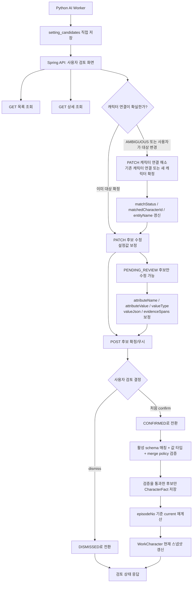
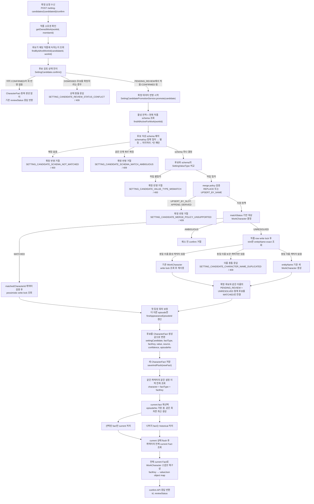
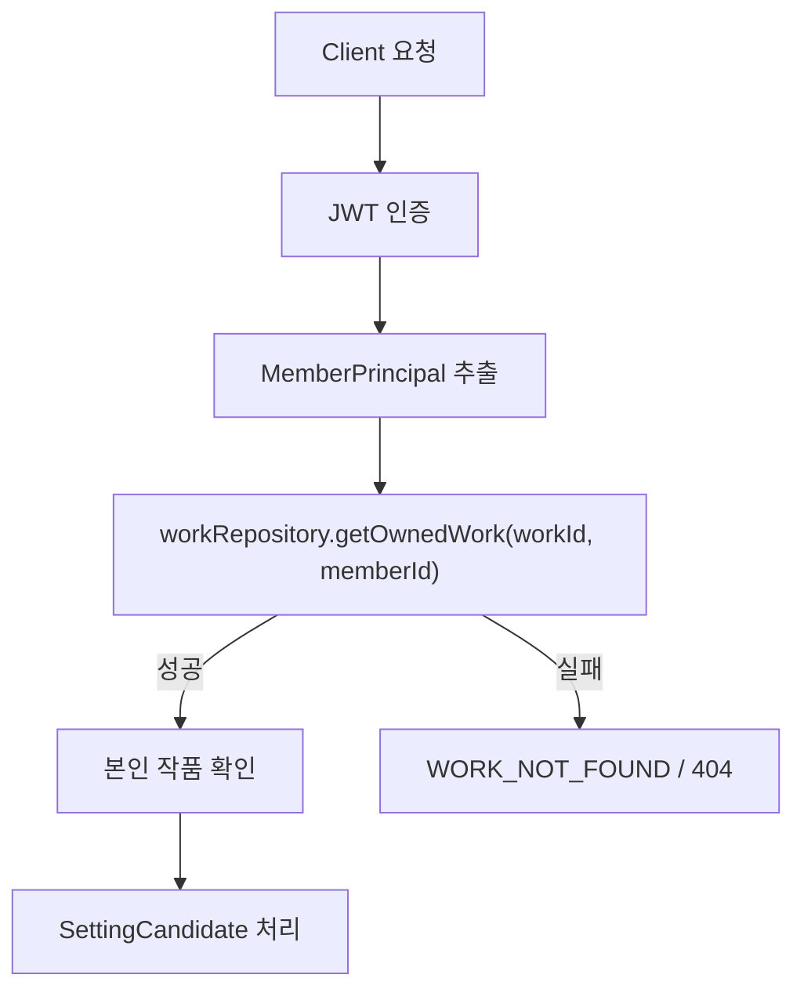
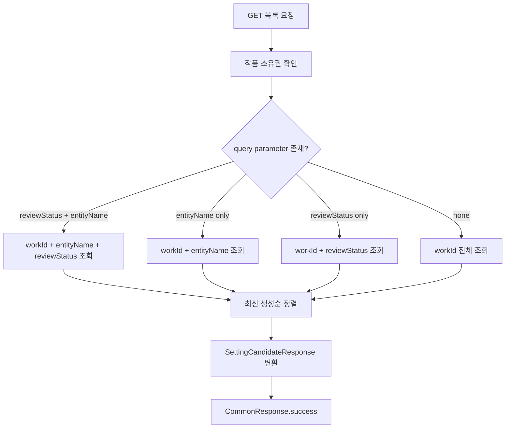
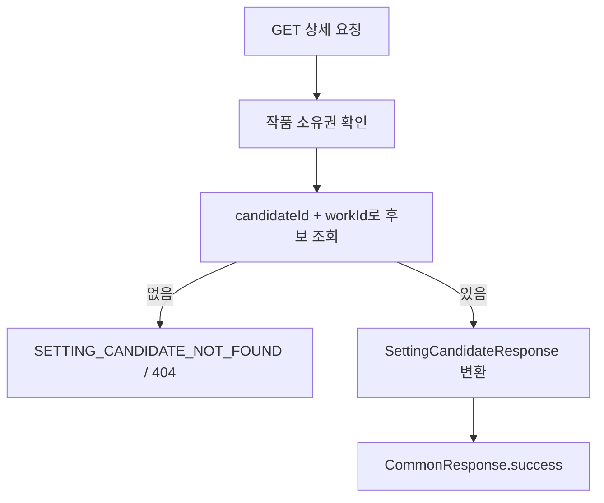
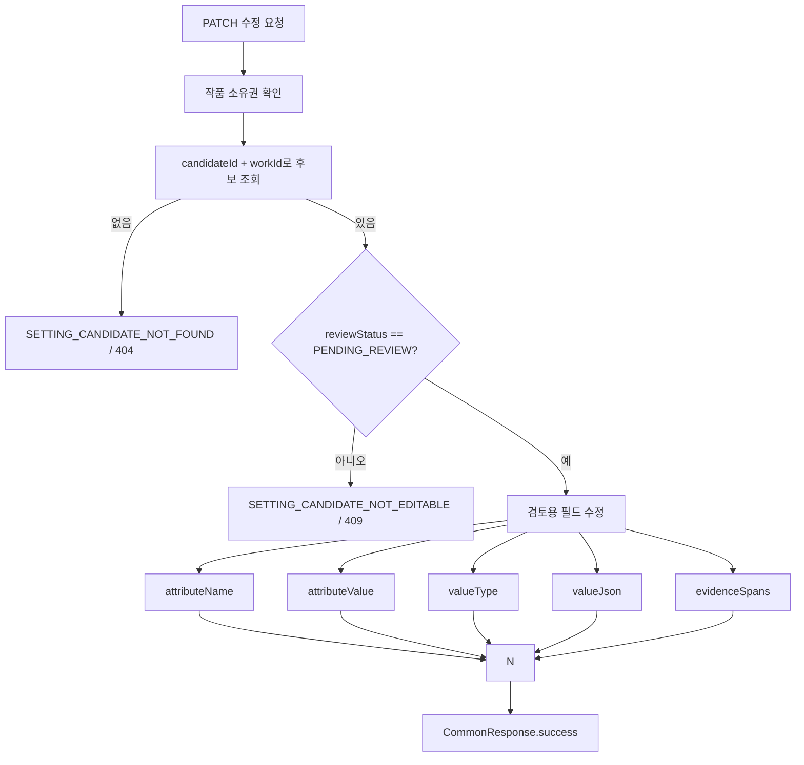
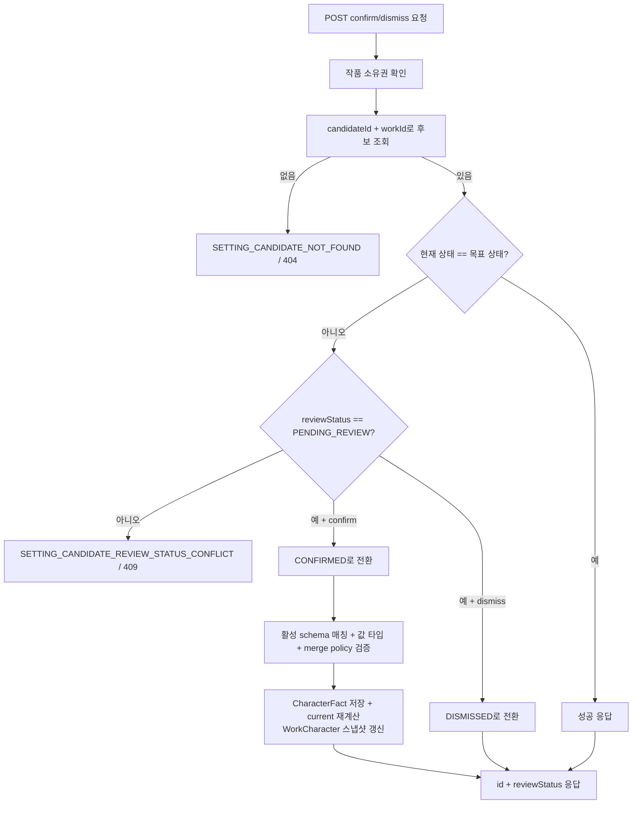

# Character Domain

## 목적

Character 도메인은 작품별 캐릭터 설정과 AI가 추출한 설정 후보를 저장합니다.

현재 범위에서는 Python AI Worker가 저장한 설정 후보를 사용자가 검토할 수 있도록 Spring 조회/수정/확정/무시 API를 제공하고, 확정된 후보를 캐릭터 설정 이력에 반영합니다.

## 핵심 결정

### 작품에 속한 캐릭터

캐릭터는 전역 인물 사전이 아니라 특정 `Work` 안에 속한 설정입니다.

`WorkCharacter`는 작품별 캐릭터 대표/현재 설정을 저장합니다. 이름, 역할, 현재 나이, 현재 레벨처럼 화면 표시와 검색, 비교에 자주 쓰는 값은 일반 컬럼으로 둡니다.

### 일반 컬럼과 JSONB 분리

MVP에서 우선 관리할 캐릭터 설정은 숫자, 아이템, 스킬, 능력치, 시간/상태처럼 작품마다 구조가 달라질 수 있는 값입니다.

그래서 자주 조회하는 핵심 값은 일반 컬럼으로 두고, 작품마다 구조가 달라지는 상세값은 JSONB로 저장합니다.

- `profile_json`: 성별, 종족, 소속, 설명 등 프로필성 값
- `stats_json`: nullable한 `STAT` factKey → current `CharacterFact.valueJson` object map
- `skills_json`: nullable한 `SKILL` factKey → current `CharacterFact.valueJson` object map
- `items_json`: nullable한 `ITEM` factKey → current `CharacterFact.valueJson` object map
- `statuses_json`: nullable한 `STATUS`, `TIME` factKey → current `CharacterFact.valueJson` object map

네 snapshot 컬럼은 metadata envelope 없이 raw `valueJson`을 entry 값으로 저장하고, 해당 그룹의 current Fact가 없으면 `null`로 둡니다. Java 타입은 `JsonNode`로 통일하고 Hibernate JSON 매핑을 사용합니다. AI 출력 구조를 과하게 평탄화하지 않고 보존하기 위한 선택입니다.

### 캐릭터 설정 Schema Registry

`CharacterSettingSchema`는 캐릭터의 실제 능력치 값이나 작품 설정을 저장하지 않습니다. AI가 만든 `SettingCandidate.attributeName`을 canonical `schemaKey`로 해석하기 위한 이름, alias, pattern, 값 타입, 저장 정책을 보관합니다.

- `work_id = NULL`인 row는 모든 작품에 적용하는 전역 schema입니다.
- `work_id`가 있는 row는 해당 작품에 전역에 없는 key를 추가하는 schema입니다. 이번 범위에서는 같은 key override나 중복 병합을 지원하지 않습니다.
- Worker claim은 `enabled = true AND (work_id IS NULL OR work_id = :workId)`인 row를 `schema_key` 오름차순으로 제공합니다.
- Worker에는 `schemaKey`, `displayName`, `attributePattern`, `aliases`, `valueType`만 공개합니다. DB 식별자와 source, enabled, merge 정책은 백엔드 내부 정책입니다.
- Spring Backend는 후보를 처음 confirm할 때 활성 전역/현재 작품 schema를 schemaKey 정확 일치 → 별칭 → 마지막이 `.*`로 끝나는 속성 패턴 순으로 매칭하고 `SettingValueType` enum과 지원 merge policy를 검증합니다. 검증된 Fact는 factKey별 current map snapshot으로 반영합니다.

초기 전역 seed는 목적에 따라 구분합니다.

| source | 개수 | schema key | 목적 |
| --- | ---: | --- | --- |
| `SYSTEM_SEED` | 7 | `age`, `level`, `stats.strength`, `stats.mana`, `statuses.condition`, `skills.skill`, `items.item` | 장르와 작품에 공통으로 사용할 최소 canonical schema |
| `DEV_SEED` | 15 | `stats.physique`, `stats.mental`, `stats.supernatural`, `stats.item_level`, `stats.combat_power`, `stats.agility`, `stats.endurance`, `stats.soul_power`, `stats.magic_resistance`, `stats.physical_resistance`, `stats.natural_regeneration`, `stats.bone_strength`, `stats.energy`, `stats.perception`, `stats.mental_power` | 판타지 작품에서 수치형 스테이터스 추출을 검증하기 위한 POC schema |

판타지 POC의 이름과 alias는 《게임 속 바바리안》 공개 팬 아카이브의 [비요른 스테이터스](https://www.deokhu.com/status), [정수 도감](https://www.deokhu.com/essences)을 schema 이름 선정 근거로만 참고했습니다. 현재 수치, 장비·정수 목록, 파티 정보, 작품 설명은 seed에 저장하지 않습니다. `정신`과 `정신력`처럼 별도 능력치가 될 수 있는 표현도 alias로 강제 병합하지 않습니다.

적용된 seed를 승격하거나 alias를 수정할 때는 기존 Flyway migration을 고치지 않고 다음 migration에서 `UPDATE`합니다.

### AI 설정 후보

`SettingCandidate`는 AI가 추출한 사용자 검토 전 후보를 저장합니다.

후보에는 대상 캐릭터, 속성명, 표시용 값, 값 타입, 신뢰도, 검토 상태를 일반 컬럼으로 저장합니다. 실제 복합 값, 원문 근거 위치, AI 원본 응답은 JSONB로 보관합니다.

AI 결과는 바로 확정 설정으로 보지 않습니다. 사용자가 검토하기 전까지 `PENDING_REVIEW` 상태의 후보입니다.

후보 생성은 Python AI Worker가 DB에 직접 저장하는 흐름으로 둡니다. Spring은 사용자 검토 화면을 위해 후보 목록/상세 조회, `PENDING_REVIEW` 후보의 내용 보정, 확정/무시 상태 전이 API를 제공합니다.

### 설정 후보 편집 정책

후보 편집은 사용자가 AI 추출 결과를 확정하기 전에 후보 내용을 보정하는 단계입니다. 이 API는 후보 생성, 확정, 무시, `CharacterFact` 반영을 처리하지 않습니다.

- 편집 가능 상태는 `PENDING_REVIEW`로 제한합니다.
- `CONFIRMED`, `DISMISSED` 후보 수정 요청은 `SETTING_CANDIDATE_NOT_EDITABLE / 409`로 거절합니다.
- 일반 후보 수정 API는 설정 내용 보정용으로 유지하고, 수정 가능한 필드는 `attributeName`, `attributeValue`, `valueType`, `valueJson`, `evidenceSpans`로 좁힙니다.
- `attributeName`, `attributeValue`는 저장 전에 앞뒤 공백을 제거합니다. `attributeValue`는 `null`이면 표시용 값을 비웁니다.
- `valueJson`, `evidenceSpans`는 요청 payload를 JSON으로 변환해 저장합니다. `null`이면 해당 JSONB 값을 비웁니다.
- 사용자가 일반 후보 수정 API의 요청 body로 직접 수정하지 않는 값은 `work`, `episode`, `sourceChunkId`, `analysisJob`, `entityType`, `entityName`, `rawEntityMention`, `matchedCharacterId`, `matchStatus`, `confidence`, `reviewStatus`, `rawAiResultJson`입니다.
- 캐릭터 대상 변경에 해당하는 `entityName`, `matchedCharacterId`, `matchStatus` 갱신은 일반 후보 수정 API가 아니라 캐릭터 연결 해소 API에서만 처리합니다.

확정/무시된 후보를 다시 편집하거나, 확정 후 `CharacterFact`에 이미 반영된 값을 수정하는 흐름은 이 정책에 포함하지 않습니다. 해당 요구가 생기면 후보 재오픈 또는 별도 정정 이력 정책을 먼저 정의합니다.

### 설정 후보 검토 상태 전이 정책

확정/무시 API는 사용자의 검토 결정을 기록하는 단계입니다. 확정 API는 후보가 처음 `CONFIRMED`가 되는 경우 확정 데이터를 `CharacterFact`와 `WorkCharacter`에 반영합니다.

- `PENDING_REVIEW` 후보는 `CONFIRMED` 또는 `DISMISSED`로 전환할 수 있습니다.
- 이미 `CONFIRMED`인 후보에 다시 확정을 요청하거나, 이미 `DISMISSED`인 후보에 다시 무시를 요청하면 성공으로 처리합니다. 이때 `CharacterFact`는 중복 생성하지 않습니다.
- `CONFIRMED` 후보를 무시하거나 `DISMISSED` 후보를 확정하는 반대 상태 전이는 `SETTING_CANDIDATE_REVIEW_STATUS_CONFLICT / 409`로 거절합니다.
- 확정/무시 이후 재편집이나 재오픈은 별도 정책이 정해질 때까지 지원하지 않습니다.

### 설정 후보 확정 데이터 반영 정책

`SettingCandidate.CONFIRMED` 후 확정 데이터는 `CharacterFact`로 저장하고, 현재 기준값은 `WorkCharacter` 스냅샷에 반영합니다.

- confirm 반영은 활성 전역/현재 작품 schema를 조회해 속성 매칭, 값 타입, merge policy 검증을 먼저 통과한 뒤 `matchStatus` 기준으로 대상 `WorkCharacter`를 결정합니다.
- `MATCHED` 후보는 `matchedCharacterId`의 기존 캐릭터를 사용합니다. `UNRESOLVED` 후보는 trim한 `entityName`과 exact-name인 활성 캐릭터가 있으면 재사용하고, 없으면 새 캐릭터를 생성합니다. 결정된 캐릭터는 확정 후보와 같은 이름의 검토 대기 미해소 형제 후보에도 자동 연결합니다.
- `AMBIGUOUS` 후보는 사용자 해소 전까지 confirm을 거절합니다.
- schema 매칭은 trim 후 대소문자를 유지한 exact → alias → pattern 순서입니다. alias는 bare 값 또는 `schemaKey`와 같은 namespace에서만 exact 비교하며 fuzzy/부분 일치를 허용하지 않습니다.
- exact/alias 매칭의 `factKey`는 canonical `schemaKey`이고, pattern 매칭은 trim한 원본 `attributeName`을 `factKey`로 유지합니다. `factType`은 matched schema에서 가져옵니다.
- 매칭 결과가 없으면 `SETTING_CANDIDATE_SCHEMA_NOT_MATCHED / 400`, 같은 단계에 여러 개면 `SETTING_CANDIDATE_SCHEMA_MATCH_AMBIGUOUS / 409`, 후보와 schema의 `SettingValueType`이 다르면 `SETTING_CANDIDATE_VALUE_TYPE_MISMATCH / 400`으로 거절합니다. `UPSERT_BY_SLOT`, `APPEND`, `DERIVED`는 `SETTING_CANDIDATE_MERGE_POLICY_UNSUPPORTED / 409`로 거절합니다.
- schema 매칭, 타입 검증, merge policy 검증은 캐릭터 조회/생성 전에 수행합니다. 실패하면 confirm 상태 전이까지 같은 트랜잭션에서 롤백되어 캐릭터와 `CharacterFact` 부수효과가 남지 않습니다.
- `MATCHED` 캐릭터는 pessimistic write lock으로 조회해 같은 캐릭터의 동시 confirm을 직렬화합니다.
- `CharacterFact.effectiveFromEpisodeNo`는 후보의 `episode.episodeNo`를 사용합니다. episode가 없으면 `null`로 저장하고 current 우선순위는 가장 낮게 봅니다.
- 같은 캐릭터의 같은 `factType + factKey`에서는 가장 큰 `effectiveFromEpisodeNo`를 가진 fact만 current로 둡니다. 같은 회차라면 나중에 생성된 fact가 current가 됩니다.
- `WorkCharacter.firstAppearanceEpisodeId`는 확정 순서가 아니라 가장 이른 업로드 회차 기준으로 유지합니다.
- current fact가 바뀌면 `currentAge`, `currentLevel`은 선택된 숫자 Fact로 갱신하고, 네 JSON snapshot은 모든 current Fact를 `factKey -> valueJson` object map으로 다시 조립해 일괄 교체합니다. 해당 타입의 current Fact가 없으면 컬럼을 `null`로 둡니다.
- `AGE`, `LEVEL`은 숫자 파싱에 성공한 경우에만 숫자 스냅샷을 갱신합니다. 파싱 실패 시 fact는 남기고 기존 숫자 스냅샷은 유지합니다.

### 캐릭터 매칭 상태 기반 confirm 정책

`matchStatus`는 "AI 최초 판단값"으로 고정하지 않고, 현재 설정 후보가 어떤 캐릭터에 연결될 예정인지를 나타내는 상태로 봅니다.

Python Worker는 후보 생성 시 `rawEntityMention`, `entityName`, 기존 캐릭터 목록을 비교해 초기 `matchedCharacterId`, `matchStatus`를 계산합니다. 이후 사용자가 후보의 캐릭터 연결을 수정하면 `entityName`, `matchedCharacterId`, `matchStatus`도 현재 결정 상태에 맞게 함께 갱신합니다.

`CharacterFact`에는 `matchStatus`를 저장하지 않습니다. `CharacterFact`는 최종 확정된 `WorkCharacter`에 붙은 설정 이력만 표현합니다. AI가 처음 어떤 캐릭터로 판단했는지, 사용자가 어떻게 바꿨는지까지 추적해야 한다면 후속으로 `SettingCandidateReviewLog` 같은 별도 검토 이력 테이블을 설계합니다.

Worker claim은 분석 시작 시점의 기존 캐릭터 목록을 사용하므로, 같은 분석에서 처음 발견된 캐릭터의 여러 속성이 모두 `UNRESOLVED`로 저장될 수 있습니다. 첫 후보가 confirm되면 Backend가 확정 후보와 같은 작품에서 trim 후 exact-name인 `PENDING_REVIEW + UNRESOLVED + CHARACTER` 후보를 새로 결정된 캐릭터에 연결합니다. 대소문자 변환, alias/fuzzy 매칭은 하지 않고 `AMBIGUOUS`, `CONFIRMED`, `DISMISSED` 후보도 자동 변경하지 않습니다. 이 연결과 캐릭터·Fact·snapshot 반영은 같은 confirm 트랜잭션에서 처리합니다.

후보 상태별 confirm 정책:

| 상태 | confirm 처리 |
| --- | --- |
| `MATCHED` + `matchedCharacterId` 있음 | `matchedCharacterId`의 기존 `WorkCharacter`에 `CharacterFact`를 생성합니다. `entityName`이 다르더라도 명시적으로 매칭된 캐릭터를 우선합니다. |
| `UNRESOLVED` | trim한 `entityName` 기준으로 같은 작품의 exact-name 활성 `WorkCharacter`를 재사용하고, 없으면 새로 생성합니다. 확정 후보 자체와 같은 작품·이름의 `PENDING_REVIEW + UNRESOLVED + CHARACTER` 후보를 해당 캐릭터에 `MATCHED`로 연결합니다. |
| `AMBIGUOUS` | 그대로는 confirm을 허용하지 않습니다. 사용자가 기존 캐릭터에 연결하거나 새 캐릭터로 확정해 `MATCHED` 또는 `UNRESOLVED` 상태로 해소한 뒤 confirm합니다. |

confirm 데이터 계약 위반으로 보고 거절할 조합:

| 조합 | 처리 |
| --- | --- |
| `MATCHED`인데 `matchedCharacterId`가 없음 | `SETTING_CANDIDATE_MATCH_STATUS_CONFLICT / 409`로 confirm 거절 |
| `UNRESOLVED`인데 `matchedCharacterId`가 있음 | `SETTING_CANDIDATE_MATCH_STATUS_CONFLICT / 409`로 confirm 거절 |
| `UNRESOLVED` 후보의 `entityName`과 완전히 동일한 이름의 활성 캐릭터가 같은 작품에 이미 있음 | 기존 활성 캐릭터를 pessimistic write lock으로 조회해 재사용 |
| `UNRESOLVED` 후보의 `entityName`과 완전히 동일한 이름의 보관 캐릭터만 있음 | `SETTING_CANDIDATE_CHARACTER_NAME_DUPLICATED / 409`로 confirm 거절 |
| `AMBIGUOUS` 후보를 그대로 confirm하려는 경우 | `SETTING_CANDIDATE_MATCH_STATUS_CONFLICT / 409`로 confirm 거절 |
| `MATCHED` 후보의 `matchedCharacterId`가 존재하지 않거나, 다른 작품 소속이거나, 보관된 캐릭터를 가리킴 | `SETTING_CANDIDATE_MATCHED_CHARACTER_INVALID / 409`로 confirm 거절 |

사용자 캐릭터 연결 해소 액션:

| 액션 | 결과 |
| --- | --- |
| 기존 캐릭터에 연결 | `entityName = 선택한 캐릭터 이름`, `matchedCharacterId = 선택한 캐릭터 ID`, `matchStatus = MATCHED` |
| 새 캐릭터로 확정 | `entityName = 사용자가 입력한 이름`, `matchedCharacterId = null`, `matchStatus = UNRESOLVED` |
| 후보 무시 | 기존 `dismiss` API로 `reviewStatus = DISMISSED` 전환 |

프론트에서는 `AMBIGUOUS` 후보에 "기존 캐릭터에 연결" 액션을 제공하고, 모달에서 기존 캐릭터를 선택하면 `character-match` API를 호출해 캐릭터명을 고정합니다. 이후 `attributeName`, `attributeValue`, `valueType`, `valueJson`, `evidenceSpans` 같은 설정값 보정은 일반 후보 수정 API로 처리합니다.

현재 저장 구조에는 `AMBIGUOUS`가 어떤 기존 캐릭터 후보들과 겹쳐서 발생했는지에 대한 후보 목록이나 판단 사유를 보관하지 않습니다. 따라서 화면에서는 "연결할 캐릭터가 확실하지 않음" 정도로 안내하고, 사용자가 기존 캐릭터 연결 또는 새 캐릭터 확정 중 하나를 직접 선택하게 합니다.

캐릭터 연결 해소 API 요청 거절 케이스:

| 조합 | 처리 |
| --- | --- |
| 기존 캐릭터에 연결하는데 `matchedCharacterId`가 없음 | `SETTING_CANDIDATE_MATCHED_CHARACTER_REQUIRED / 400` |
| 새 캐릭터로 확정하는데 `entityName`이 비어 있음 | `SETTING_CANDIDATE_NEW_CHARACTER_NAME_REQUIRED / 400` |
| 새 캐릭터로 확정하는데 같은 작품에 완전히 동일한 이름의 캐릭터가 이미 있음 | `SETTING_CANDIDATE_CHARACTER_NAME_DUPLICATED / 409` |
| `matchedCharacterId`가 존재하지 않거나, 다른 작품 소속이거나, 보관된 캐릭터를 가리킴 | `SETTING_CANDIDATE_MATCHED_CHARACTER_INVALID / 409` |

새 캐릭터로 확정할 때 같은 작품에 완전히 동일한 이름의 캐릭터가 이미 있으면 거절합니다. 이 경우 사용자는 "기존 캐릭터에 연결" 액션을 사용해야 합니다.

`MATCHED`, `UNRESOLVED` 후보도 사용자가 AI 판단을 바꿀 수 있습니다. 예를 들어 AI가 기존 캐릭터와 매칭한 후보라도 사용자가 새 캐릭터로 판단할 수 있고, AI가 신규 후보로 본 값이라도 사용자가 기존 캐릭터와 같은 인물이라고 판단할 수 있습니다.

작중 시간 정렬 후속 TODO:

- 현재 current/snapshot 기준은 작중 시간이 아니라 업로드 회차 번호입니다.
- 웹소설은 회상, 과거편, 프롤로그 등으로 회차 순서와 작중 시간 순서가 다를 수 있습니다.
- 후속 AI Worker가 `narrativeTime`, `timelineOrder`, `effectiveAt`, `isFlashback` 같은 시간 메타데이터를 어떤 형태로 줄지 정한 뒤 current 판단과 snapshot 갱신 기준을 확장합니다.

JSON snapshot 계약과 후속 TODO:

- `statsJson`, `skillsJson`, `itemsJson`, `statusesJson`은 여러 current Fact가 공존하는 `factKey -> valueJson` object map입니다. 같은 factKey의 current가 바뀌면 해당 entry 전체를 교체합니다.
- `REPLACE`와 `UPSERT_BY_NAME`은 모두 factKey를 식별자로 사용합니다. `valueJson.name`은 self-contained 표시 데이터이며 Backend 병합 식별자가 아닙니다.
- 별도 migration이나 일괄 backfill은 하지 않습니다. 기존 단일 object/array snapshot은 다음 성공 confirm에서 전체 current Fact 기준 map 또는 `null`로 정규화합니다.
- object 내부 deep merge, 삭제/비활성 표현, `UPSERT_BY_SLOT`, `APPEND`, `DERIVED` 실제 병합은 NVM-229 후속 정책으로 결정합니다.

### 캐릭터 설정 이력

`CharacterFact`는 캐릭터의 개별 설정 값과 변경 이력을 저장합니다.

`characters`가 현재 화면에 보여줄 확정된 대표/현재 스냅샷이라면, `character_facts`는 나이, 레벨, 스탯, 아이템, 스킬 같은 설정이 어느 회차에서 어떤 값으로 등장했는지 추적합니다.

confirm으로 생성된 Fact는 `setting_candidate_id`로 원본 후보를 연결합니다. 따라서 Fact의 구체적인 인용문과 offset은 연결된 `setting_candidates.evidence_spans`에서 정확히 조회합니다. V3 이전 Fact는 신뢰할 수 있는 후보를 추정해 backfill하지 않고 `NULL`로 유지하며, evidence JSON을 `character_facts`에 중복 저장하지 않습니다.

AI Worker가 추출한 값은 먼저 `SettingCandidate`에 저장하고, 사용자가 승인한 값은 `CharacterFact`로 남긴 뒤, 필요하면 `WorkCharacter`의 현재 스냅샷 필드에도 반영합니다.

## 상태 모델

`CharacterStatus`

| 상태 | 의미 | 전이 시점 |
| --- | --- | --- |
| `ACTIVE` | 활성 | `WorkCharacter.create()`로 캐릭터 대표 설정을 만들 때 기본값으로 설정됩니다. |
| `ARCHIVED` | 보관됨 | `WorkCharacter.archive()`로 전환합니다. 복구 API는 아직 정의하지 않았습니다. |

`SettingCandidateReviewStatus`

| 상태 | 의미 | 전이 시점 |
| --- | --- | --- |
| `PENDING_REVIEW` | 검토 대기 | AI Worker가 추출한 후보를 `SettingCandidate.create()`로 저장할 때 기본값으로 설정됩니다. |
| `CONFIRMED` | 확정됨 | 사용자가 후보를 기준 설정에 반영하기로 하면 확정 API에서 `SettingCandidate.confirm()`으로 전환합니다. |
| `DISMISSED` | 무시됨 | 사용자가 후보를 반영하지 않기로 하면 무시 API에서 `SettingCandidate.dismiss()`로 전환합니다. |

검토 상태는 후보 단계의 `SettingCandidate`에만 둡니다. `WorkCharacter`와 `CharacterFact`는 사용자가 후보를 승인한 뒤 생성되는 대표 설정과 설정 이력이므로 별도 review status를 갖지 않습니다.

설정 후보 조회 응답 후속 TODO:

- FE 검토 화면에서 목록과 상세에 각각 필요한 데이터 범위를 먼저 확정해야 합니다.
- 현재 API는 목록/상세가 같은 응답 DTO를 사용합니다. 목록 화면에 `valueJson`, `evidenceSpans`, `rawAiResultJson` 같은 상세 필드가 필요하지 않다면 후속 PR에서 목록 요약 응답과 상세 응답을 분리합니다.
- 응답 분리 시 목록은 테이블/카드 렌더링에 필요한 값 중심으로 줄이고, 상세는 후보 편집과 근거 검토에 필요한 전체 값을 내려주는 방향을 우선 검토합니다.

`SettingEntityType`

| 유형 | 의미 |
| --- | --- |
| `CHARACTER` | 캐릭터 |

`SettingValueType`

| 유형 | 의미 |
| --- | --- |
| `STRING` | 문자열 |
| `NUMBER` | 숫자 |
| `BOOLEAN` | 참/거짓 |
| `JSON` | JSON |
| `UNKNOWN` | 알 수 없음 |

`CharacterFactType`

| 유형 | 의미 |
| --- | --- |
| `AGE` | 나이 |
| `LEVEL` | 레벨 |
| `STAT` | 스탯 |
| `SKILL` | 스킬 |
| `ITEM` | 아이템 |
| `STATUS` | 상태 |
| `TIME` | 시간 |

`CharacterSettingValueSemantics`

| 유형 | 한글 표시명 | 의미 |
| --- | --- | --- |
| `BASE_VALUE` | 기본값 | 원문에서 직접 확인한 계산 기준값 |
| `MODIFIER` | 보정값 | 기본값에 더하거나 빼는 장비·상태 효과 등의 값 |
| `DERIVED` | 파생값 | 다른 설정값을 이용해 계산한 결과값 |

`CharacterSettingMergePolicy`

| 유형 | 한글 표시명 | 의미 |
| --- | --- | --- |
| `REPLACE` | 값 교체 | 기존 값을 새 값으로 완전히 교체 |
| `UPSERT_BY_NAME` | 이름 기준 추가·갱신 | 현재 MVP에서는 동적 factKey entry 전체를 추가·교체. `valueJson.name` 기반 병합은 후속 정책 |
| `UPSERT_BY_SLOT` | 슬롯 기준 추가·갱신 | 현재 confirm 미지원(409). slot 병합은 후속 정책 |
| `APPEND` | 목록에 추가 | 현재 confirm 미지원(409). 목록 append는 후속 정책 |
| `DERIVED` | 파생값 계산 | 현재 confirm 미지원(409). 파생값 계산은 후속 정책 |

`CharacterSettingSchemaSource`

| 유형 | 한글 표시명 | 의미 |
| --- | --- | --- |
| `SYSTEM_SEED` | 시스템 기본 시드 | 장르와 작품에 공통으로 적용하는 기본 schema |
| `DEV_SEED` | 개발 검증 시드 | POC와 개발 검증을 위해 추가한 schema |

## DB 모델

`characters`

| 필드 | 설명 |
| --- | --- |
| `id` | 캐릭터 UUID |
| `work_id` | 캐릭터가 속한 작품 ID |
| `name` | 대표 이름 |
| `role_label` | 주인공, 조연, 적대자 등 역할 라벨 |
| `current_age` | 현재 나이 확정값 |
| `current_level` | 현재 레벨 확정값 |
| `profile_json` | 프로필 상세 JSONB |
| `stats_json` | nullable한 `STAT` factKey → current `CharacterFact.valueJson` object map |
| `skills_json` | nullable한 `SKILL` factKey → current `CharacterFact.valueJson` object map |
| `items_json` | nullable한 `ITEM` factKey → current `CharacterFact.valueJson` object map |
| `statuses_json` | nullable한 `STATUS`, `TIME` factKey → current `CharacterFact.valueJson` object map |
| `first_appearance_episode_id` | 최초 등장 회차 ID. 회차 hard delete 시 처리 정책이 정해지지 않아 현재 FK 없이 UUID 값으로 저장 |
| `status` | 캐릭터 보관 상태 |
| `created_at` | 생성 시각 |
| `updated_at` | 수정 시각 |

`character_facts`

| 필드 | 설명 |
| --- | --- |
| `id` | 캐릭터 설정 이력 UUID |
| `character_id` | 어떤 캐릭터의 설정인지 나타내는 FK |
| `setting_candidate_id` | 이 Fact로 승격된 원본 `setting_candidates.id` FK. V3 이전 Fact는 `NULL` |
| `fact_type` | 설정 유형. 예: AGE, LEVEL, STAT, SKILL, ITEM, STATUS, TIME |
| `fact_key` | snapshot entry 전체를 식별하는 설정 키. 예: age, level, stats.strength, skill.흑염, item.검은단검 |
| `fact_value` | 확정된 표시값. 예: 17, 12, 35, OWNED |
| `normalized_value` | 비교를 쉽게 하기 위한 정규화 값 |
| `value_json` | 스킬/아이템/상태 이상처럼 복잡한 설정 값 JSONB |
| `source_episode_id` | 이 설정이 확인된 회차 ID |
| `source_chunk_id` | 이 설정이 확인된 `episode_chunks.id`. 재청킹 시 근거 보존 정책이 정해지지 않아 현재 FK 없이 저장 |
| `extracted_by_job_id` | 이 설정을 추출한 분석 작업 ID |
| `confidence` | AI 추출 신뢰도 |
| `is_current` | 현재 기준으로 유효한 최신 설정인지 여부 |
| `effective_from_episode_no` | 이 설정이 몇 화부터 유효한지 |
| `created_at` | 생성 시각 |
| `updated_at` | 수정 시각 |

`setting_candidates`

| 필드 | 설명 |
| --- | --- |
| `id` | 설정 후보 UUID |
| `work_id` | 후보가 속한 작품 ID |
| `episode_id` | 후보가 추출된 회차 ID. 없을 수 있음 |
| `source_chunk_id` | 근거 `episode_chunks.id`. 재청킹 시 근거 보존 정책이 정해지지 않아 현재 FK 없이 저장 |
| `analysis_job_id` | 후보를 만든 분석 작업 ID. 없을 수 있음 |
| `entity_type` | 설정 대상 유형 |
| `entity_name` | 캐릭터명 또는 대상명 |
| `raw_entity_mention` | 원문에 실제 등장한 대상 표현. 예: `나`, `프넬린의 두 번째 딸 아이나르` |
| `matched_character_id` | 기존 `characters.id`와 확실히 매칭된 경우 저장하는 캐릭터 FK |
| `match_status` | 기존 캐릭터 매칭 상태. `MATCHED`, `UNRESOLVED`, `AMBIGUOUS` |
| `attribute_name` | `age`, `level`, `stats.strength`, `skill.은월참`, `item.화염검`, `status.악령_깃들임` 등 속성명 |
| `attribute_value` | 목록/검색 표시용 값 |
| `value_type` | 값 타입 |
| `value_json` | 복합 값 JSONB |
| `evidence_spans` | 원문 근거 위치와 인용문 JSONB |
| `confidence` | AI 신뢰도 |
| `review_status` | 후보 검토 상태 |
| `raw_ai_result_json` | AI 원본 응답 JSONB |
| `created_at` | 생성 시각 |
| `updated_at` | 수정 시각 |

`character_setting_schemas`

| 필드 | 설명 |
| --- | --- |
| `id` | registry row를 식별하는 UUID입니다. Worker claim에는 노출하지 않습니다. |
| `work_id` | 적용 범위를 정하는 작품 FK입니다. `NULL`이면 모든 작품에 적용하는 전역 schema이고, 값이 있으면 해당 작품에만 key를 추가합니다. 현재는 작품 schema가 같은 전역 `schema_key`를 override하거나 병합하지 않습니다. |
| `schema_key` | 입력 속성이 어느 schema인지 판별된 뒤 저장·비교에 사용할 canonical 논리 키입니다. 실제 DB 컬럼명이나 JSON 경로가 아닙니다. exact/alias 매칭에서는 `CharacterFact.factKey`로 사용하고, pattern 매칭에서는 실제 동적 `attributeName`을 factKey로 유지합니다. 예: `items.item`. |
| `attribute_pattern` | exact `schema_key`와 alias로 일치하지 않은 동적 `SettingCandidate.attributeName`을 이 schema로 분류하기 위한 nullable trailing `.*` 패턴입니다. 예: `item.*`. 병합 방식이나 저장 위치를 의미하지 않습니다. |
| `display_name` | Worker prompt와 화면에서 사람이 schema를 식별할 때 사용할 표시명입니다. 저장·비교 식별자로 사용하지 않습니다. |
| `fact_type` | 이 schema로 확정된 값을 저장할 상위 `CharacterFactType`입니다. 예: `ITEM`, `SKILL`, `STAT`. |
| `value_type` | Worker가 추출하고 Spring Backend가 confirm 시 후보의 `valueType`과 enum equality로 검증하는 자료형입니다. `STRING`, `NUMBER`, `BOOLEAN`, `JSON`, `UNKNOWN` 중 하나이며 Java의 `SettingValueType`을 재사용합니다. `valueJson` 내부 node 구조까지 검증하는 값은 아닙니다. |
| `value_semantics` | 값이 원문에서 확인한 기준값(`BASE_VALUE`), 기준값에 적용하는 보정값(`MODIFIER`), 다른 값으로 계산한 파생값(`DERIVED`) 중 무엇인지 나타냅니다. |
| `merge_policy` | Resolver가 결정한 factKey entry의 새 값을 snapshot에 반영할 정책입니다. 현재 confirm은 `REPLACE`, `UPSERT_BY_NAME`만 entry 전체 교체로 지원하고 나머지는 409로 거절합니다. object 내부 deep merge는 하지 않습니다. |
| `aliases_json` | `schema_key`와 동일한 schema로 해석할 분류 경로 없는 별칭 문자열 배열입니다. 후보 속성명은 별칭 자체 또는 `schemaKey`와 같은 분류 경로를 붙인 값만 정확히 비교하며, 다른 분류 경로·대소문자 변환·부분 일치·fuzzy 매칭은 하지 않습니다. JSONB 배열만 허용하며 별칭이 없으면 `[]`를 저장합니다. |
| `source` | schema seed의 관리 출처입니다. 공통 기본값은 `SYSTEM_SEED`, 판타지 POC 검증값은 `DEV_SEED`이며 Worker 포함 여부를 결정하지 않습니다. |
| `enabled` | 활성 여부입니다. `true`인 전역 schema와 현재 작품 schema만 Worker claim과 confirm 매칭에 사용합니다. |
| `created_at` | registry row가 생성된 시각입니다. |
| `updated_at` | registry row가 마지막으로 수정된 시각입니다. |

전역 row는 `schema_key`, 작품 row는 `work_id + schema_key`가 각각 unique입니다. 활성 조회를 위해 `(work_id, enabled, schema_key)` 인덱스를 사용합니다.

`items.item` row는 다음처럼 읽습니다.

- `schema_key = items.item`: 아이템 설정을 저장·비교할 때 사용할 canonical 논리 키입니다.
- `attribute_pattern = item.*`: `item.검은단검`처럼 이름이 동적으로 달라지는 입력 속성을 이 row로 분류하는 패턴입니다.
- `merge_policy = UPSERT_BY_NAME`: 현재 MVP에서는 동적 factKey entry를 추가하거나 같은 factKey entry 전체를 교체합니다. `valueJson.name`은 표시 데이터입니다.

예를 들어 `attributeName = item.검은단검`, `valueJson = {"name":"검은단검","quantity":1}`인 후보는 confirm 시 `item.*` 패턴을 통해 `items.item` schema와 매칭됩니다. `matchedSchema`는 `items.item`이지만 `CharacterFact.factKey`는 동적 대상을 구분하기 위해 `item.검은단검`을 유지합니다. 타입과 merge policy 검증을 통과하면 `itemsJson["item.검은단검"]`에 current Fact의 `valueJson` 전체를 저장합니다.

캐릭터 매칭 상태 기준:

- `MATCHED`: 기존 캐릭터 하나와 확실히 연결된 상태입니다. `matched_character_id`가 있어야 합니다.
- `UNRESOLVED`: 아직 기존 캐릭터로 확정 연결되지 않은 상태입니다. 새 캐릭터일 가능성이 있습니다.
- `AMBIGUOUS`: 후보가 여러 명이거나 `나`, `그`, `그녀`, `주인공`처럼 지칭 대상이 문맥 의존적이라 기존 캐릭터 하나로 확정하지 못한 상태입니다. 단, Worker가 `entityName`을 기존 캐릭터 1명과 유일하게 매칭하면 `MATCHED`로 저장될 수 있습니다.
- `UNRESOLVED`, `AMBIGUOUS`에서는 `matched_character_id`를 비워두고 사용자 검토 또는 후속 resolver 대상으로 남깁니다.

## Repository

`WorkRepository`

- `findByIdForUpdate(id)`: `UNRESOLVED` 후보의 exact-name 캐릭터 조회와 신규 생성을 작품 단위로 직렬화합니다.

`WorkCharacterRepository`

- `findByIdAndWorkIdForUpdate(id, workId)`: 기존 캐릭터 confirm 시 pessimistic write lock으로 조회해 whole-map snapshot lost update를 방지합니다.
- `findByWorkIdAndName(workId, name)`
- `findAllByWorkIdOrderByCreatedAtDesc(workId)`

`SettingCandidateRepository`

- `findAllByWorkIdOrderByCreatedAtDesc(workId)`
- `findAllByWorkIdAndReviewStatusOrderByCreatedAtDesc(workId, reviewStatus)`
- `findAllByWorkIdAndEntityNameOrderByCreatedAtDesc(workId, entityName)`
- `findAllByWorkIdAndEntityNameAndReviewStatusOrderByCreatedAtDesc(workId, entityName, reviewStatus)`
- `findAllByNormalizedEntityNameAndMatchState(...)`: 같은 작품의 trim 후 exact-name 후보를 entity/review/match 상태와 함께 조회해 형제 후보 자동 연결 범위를 제한합니다.
- `findByIdAndWorkId(candidateId, workId)`

`CharacterFactRepository`

- `findAllByWorkCharacterIdOrderByCreatedAtDesc(characterId)`
- `findAllByWorkCharacterIdAndIsCurrentTrueOrderByFactTypeAscFactKeyAsc(characterId)`
- `findAllByWorkCharacterIdAndFactTypeAndFactKeyOrderByEffectiveFromEpisodeNoDescCreatedAtDesc(characterId, factType, factKey)`

`CharacterSettingSchemaRepository`

- `findAllActiveForWork(workId)`: 활성 전역 schema와 해당 작품의 활성 추가 schema를 `schemaKey` 오름차순으로 조회합니다.

## Processor

`SettingCandidateSchemaResolver`

- Repository가 조회한 활성 schema를 입력받아 schemaKey 정확 일치 → 별칭 → 마지막이 `.*`로 끝나는 속성 패턴 순으로 매칭합니다.
- 정확히 하나의 schema가 결정되고 후보와 schema의 `SettingValueType`이 같을 때 `matchedSchema + factKey` 결과를 반환합니다.
- 매칭 없음, 같은 단계 복수 매칭, 값 타입 불일치는 `AppException`으로 fail-closed 처리하며 Repository 조회나 저장은 직접 수행하지 않습니다.

`CharacterSnapshotAssembler`

- 호출자가 제공한 current Fact를 `STAT`, `SKILL`, `ITEM`, `STATUS/TIME`별 `factKey -> raw valueJson` object map으로 조립하며 entry 내부를 deep merge하지 않습니다.
- `AGE`, `LEVEL`은 일반 컬럼 대상이므로 제외하고, current Fact가 없는 JSON 그룹은 `null`을 반환합니다.

## HTTP API

설정 후보 API는 모두 로그인한 사용자의 본인 작품에서만 동작합니다. 다른 회원의 작품 접근은 기존 Work 정책과 동일하게 `WORK_NOT_FOUND`로 응답합니다.

| 메서드 | 경로 | 설명 |
| --- | --- | --- |
| `GET` | `/api/v1/works/{workId}/setting-candidates` | 설정 후보 목록을 최신 생성순으로 조회합니다. `reviewStatus`, `entityName` query parameter로 필터링할 수 있습니다. |
| `GET` | `/api/v1/works/{workId}/setting-candidates/{candidateId}` | 특정 설정 후보 상세를 조회합니다. |
| `PATCH` | `/api/v1/works/{workId}/setting-candidates/{candidateId}` | `PENDING_REVIEW` 후보의 `attributeName`, `attributeValue`, `valueType`, `valueJson`, `evidenceSpans`만 보정합니다. 캐릭터 대상 변경은 캐릭터 연결 해소 API에서 처리합니다. |
| `POST` | `/api/v1/works/{workId}/setting-candidates/{candidateId}/confirm` | 설정 후보를 `CONFIRMED` 상태로 전환하고, 처음 확정되는 후보는 schema, 값 타입, merge policy 검증 후 캐릭터 설정 이력과 현재 스냅샷에 반영합니다. |
| `POST` | `/api/v1/works/{workId}/setting-candidates/{candidateId}/dismiss` | 설정 후보를 `DISMISSED` 상태로 전환합니다. |

Spring API는 `SettingCandidate` 생성 API를 제공하지 않습니다. 후보 생성은 Python AI Worker가 담당하고, Spring은 사용자 검토 단계의 조회/수정/확정/무시를 담당합니다.

캐릭터 연결 해소 API:

| 메서드 | 경로 | 설명 |
| --- | --- | --- |
| `PATCH` | `/api/v1/works/{workId}/setting-candidates/{candidateId}/character-match` | `PENDING_REVIEW` 후보의 캐릭터 연결 상태를 기존 캐릭터 연결 또는 새 캐릭터 확정으로 해소합니다. |

요청 예시:

```json
{
  "resolutionType": "MATCH_EXISTING",
  "matchedCharacterId": "0198a3f0-0000-7000-8000-000000000401"
}
```

```json
{
  "resolutionType": "CREATE_NEW",
  "entityName": "비요른 라프손"
}
```

### 설정 후보 검토 워크플로우


```mermaid
flowchart TD
    A["Python AI Worker"] --> B["setting_candidates 직접 저장"]
    B --> C["Spring API: 사용자 검토 화면"]

    C --> D["GET 목록 조회"]
    C --> E["GET 상세 조회"]
    C --> M{"캐릭터 연결이 확실한가?"}
    M -->|"AMBIGUOUS 또는 사용자가 대상 변경"| N["PATCH 캐릭터 연결 해소<br/>기존 캐릭터 연결 또는 새 캐릭터 확정"]
    M -->|"이미 대상 확정"| F["PATCH 후보 수정<br/>설정값 보정"]
    N --> O["matchStatus / matchedCharacterId / entityName 갱신"]
    O --> F
    F --> G["POST 후보 확정/무시"]

    F --> H["PENDING_REVIEW 후보만 수정 가능"]
    H --> P["attributeName / attributeValue / valueType<br/>valueJson / evidenceSpans 보정"]
    P --> G
    G --> I{"사용자 검토 결정"}
    I -->|"처음 confirm"| I1["CONFIRMED로 전환"]
    I -->|"dismiss"| I2["DISMISSED로 전환"]
    I1 --> V["활성 schema 매칭 + 값 타입 + merge policy 검증"]
    V --> J["검증을 통과한 후보만 CharacterFact 저장"]
    J --> K["episodeNo 기준 current 재계산"]
    K --> L["WorkCharacter 현재 스냅샷 갱신"]
    I2 --> R["검토 상태 응답"]
    L --> R
```

### 확정 데이터 반영 상세 워크플로우

`confirm` API는 후보 상태 전이와 확정 데이터 반영을 같은 트랜잭션에서 처리합니다. 단, 이미 `CONFIRMED`인 후보 재호출은 성공 응답만 반환하고 `CharacterFact`를 다시 만들지 않습니다.

아래 흐름은 현재 confirm 반영 순서를 보여줍니다. schema 매칭, 값 타입, merge policy 검증을 먼저 통과한 뒤 `matchStatus` 기준으로 캐릭터를 결정하고 전체 current Fact로 snapshot을 재구성합니다.


```mermaid
flowchart TD
    A["확정 요청 수신<br/>POST /setting-candidates/{candidateId}/confirm"] --> B["작품 소유권 확인<br/>getOwnedWork(workId, memberId)"]
    B --> C["후보가 해당 작품에 속하는지 조회<br/>findByIdAndWorkId(candidateId, workId)"]
    C --> D["후보 검토 상태 전이<br/>SettingCandidate.confirm()"]

    D -->|"이미 CONFIRMED라 새 반영 없음"| Z["CharacterFact 중복 생성 없이<br/>기존 reviewStatus 응답 반환"]
    D -->|"DISMISSED 후보를 확정하려는 경우"| X["상태 충돌 응답<br/>SETTING_CANDIDATE_REVIEW_STATUS_CONFLICT / 409"]
    D -->|"PENDING_REVIEW에서 처음 CONFIRMED 됨"| E["확정 데이터 반영 시작<br/>SettingCandidatePromotionService.promote(candidate)"]

    E --> S["활성 전역 + 현재 작품 schema 조회<br/>findAllActiveForWork(workId)"]
    S --> R["후보 속성 schema 해석<br/>schemaKey 정확 일치 → 별칭 → 마지막이 .*인 패턴"]
    R -->|"매칭 없음"| Y["확정 반영 거절<br/>SETTING_CANDIDATE_SCHEMA_NOT_MATCHED / 400"]
    R -->|"같은 단계 복수 매칭"| Y2["확정 반영 거절<br/>SETTING_CANDIDATE_SCHEMA_MATCH_AMBIGUOUS / 409"]
    R -->|"schema 하나 결정"| V["후보와 schema의 SettingValueType 비교"]
    V -->|"타입 불일치"| Y3["확정 반영 거절<br/>SETTING_CANDIDATE_VALUE_TYPE_MISMATCH / 400"]
    V -->|"타입 일치"| MP["merge policy 검증<br/>REPLACE 또는 UPSERT_BY_NAME"]
    MP -->|"UPSERT_BY_SLOT, APPEND, DERIVED"| Y4["확정 반영 거절<br/>SETTING_CANDIDATE_MERGE_POLICY_UNSUPPORTED / 409"]
    MP -->|"지원 정책"| F["matchStatus 기반 대상 WorkCharacter 결정"]
    F -->|"MATCHED"| F1["matchedCharacterId 캐릭터 검증 후<br/>pessimistic write lock 조회"]
    F -->|"UNRESOLVED"| F2["작품 row write lock 후<br/>trim한 entityName exact 조회"]
    F -->|"AMBIGUOUS"| F3["해소 전 confirm 거절"]
    F2 -->|"동일 이름 활성 캐릭터 있음"| F5["기존 WorkCharacter<br/>write lock 조회 후 재사용"]
    F2 -->|"동일 이름 캐릭터 없음"| F4["entityName 기준 새 WorkCharacter 생성"]
    F2 -->|"동일 이름 보관 캐릭터만 있음"| W["이름 충돌 응답<br/>SETTING_CANDIDATE_CHARACTER_NAME_DUPLICATED / 409"]
    F5 --> H["확정 후보와 같은 이름의<br/>PENDING_REVIEW + UNRESOLVED 형제 후보를 MATCHED로 연결"]
    F4 --> H
    F1 --> I["첫 등장 회차 보정<br/>더 이른 episode면 firstAppearanceEpisodeId 갱신"]
    H --> I

    I --> J["후보를 CharacterFact 생성값으로 변환<br/>settingCandidate, factType, factKey, value, source, confidence, episodeNo"]
    J --> K["새 CharacterFact 저장<br/>saveAndFlush(newFact)"]
    K --> L["같은 캐릭터의 같은 설정 이력 전체 조회<br/>character + factType + factKey"]
    L --> M2["current fact 재선택<br/>episodeNo 가장 큼, 같은 회차면 최신 생성"]
    M2 --> N2["선택된 fact만 current 처리"]
    M2 --> O2["나머지 fact는 historical 처리"]
    N2 --> FL["current 상태 flush 후<br/>캐릭터의 전체 current Fact 조회"]
    O2 --> FL
    FL --> P["전체 current Fact로 WorkCharacter 스냅샷 재구성<br/>factKey → valueJson object map"]
    P --> Q["confirm API 응답 반환<br/>id, reviewStatus"]
```

상세 처리 기준:

- `SettingCandidateSchemaResolver`는 앞뒤 공백을 제거한 `attributeName`을 schemaKey 정확 일치 → 별칭 → 마지막이 `.*`로 끝나는 속성 패턴 순으로 해석합니다. 정확 일치/별칭의 factKey는 기준 `schemaKey`, 속성 패턴의 factKey는 공백을 제거한 원본 속성명입니다.
- matched schema의 `factType`을 `CharacterFact`에 사용하고, 후보와 schema의 `SettingValueType` enum이 다르거나 merge policy가 `REPLACE`, `UPSERT_BY_NAME`이 아니면 캐릭터를 결정하기 전에 거절합니다.
- 매칭 없음·복수 매칭·타입 불일치·미지원 정책을 포함해 확정 반영 중 오류가 발생하면 후보 상태 전이, 신규 캐릭터 생성, `CharacterFact` 생성이 같은 트랜잭션에서 함께 롤백됩니다.
- 후보 캐릭터 결정은 `matchStatus`를 기준으로 수행합니다. `MATCHED`는 `matchedCharacterId`를 사용합니다. `UNRESOLVED`는 작품 row를 pessimistic write lock으로 잡은 뒤 trim한 `entityName` exact-name 활성 캐릭터를 재사용하거나 새 캐릭터를 생성하고, 확정 후보와 같은 작품·이름의 `PENDING_REVIEW + UNRESOLVED + CHARACTER` 후보를 `MATCHED`로 연결합니다. `AMBIGUOUS`와 이미 검토된 후보는 자동 변경하지 않습니다.
- `mapper.toWorkCharacter(candidate)`와 `mapper.toCharacterFact(...)`가 Entity factory를 호출합니다. `toCharacterFact`는 원본 후보를 `settingCandidate`로 연결해 `evidenceSpans`를 역추적할 수 있게 하며, service는 `Entity.create()` 파라미터를 직접 조립하지 않습니다.
- `saveAndFlush(newFact)` 후 같은 `character + factType + factKey`의 전체 이력을 다시 조회합니다. confirm 순서와 회차 순서가 다를 수 있기 때문입니다.
- `selectCurrentFact`는 `effectiveFromEpisodeNo`가 가장 큰 fact를 current로 고릅니다. `effectiveFromEpisodeNo = null`인 fact는 가장 오래된 값으로 봅니다.
- 같은 회차의 같은 key는 `createdAt`이 늦은 fact를 current로 보고, 생성 시각까지 같으면 방금 저장한 `newFact`를 우선합니다.
- `updateFirstAppearance`는 `firstAppearanceEpisodeId`가 비어 있으면 후보 episode로 채우고, 기존 첫 등장 회차보다 더 이른 episode 후보가 확정되면 더 이른 episode로 갱신합니다.
- `WorkCharacter.applyCurrentFact(currentFact)`는 `AGE`, `LEVEL` 일반 컬럼을 갱신합니다.
- current 상태를 명시적으로 flush한 뒤 전체 current Fact를 조회하고, `CharacterSnapshotAssembler`가 `STAT`, `SKILL`, `ITEM`, `STATUS/TIME`별 factKey object map을 조립합니다. 네 JSON 컬럼은 빈 그룹의 `null`까지 포함해 한 번에 교체합니다.

설정 후보 API는 다음 공통 접근 흐름을 먼저 통과합니다.


```mermaid
flowchart TD
    A["Client 요청"] --> B["JWT 인증"]
    B --> C["MemberPrincipal 추출"]
    C --> D["workRepository.getOwnedWork(workId, memberId)"]
    D -->|성공| E["본인 작품 확인"]
    D -->|실패| F["WORK_NOT_FOUND / 404"]

    E --> G["SettingCandidate 처리"]
```

목록 조회는 query parameter 조합에 따라 Repository 조회 메서드를 선택합니다.


```mermaid
flowchart TD
    A["GET 목록 요청"] --> B["작품 소유권 확인"]
    B --> C{"query parameter 존재?"}

    C -->|reviewStatus + entityName| D["workId + entityName + reviewStatus 조회"]
    C -->|entityName only| E["workId + entityName 조회"]
    C -->|reviewStatus only| F["workId + reviewStatus 조회"]
    C -->|none| G["workId 전체 조회"]

    D --> H["최신 생성순 정렬"]
    E --> H
    F --> H
    G --> H

    H --> I["SettingCandidateResponse 변환"]
    I --> J["CommonResponse.success"]
```

상세 조회는 후보가 요청 작품에 속하는지 함께 확인합니다.


```mermaid
flowchart TD
    A["GET 상세 요청"] --> B["작품 소유권 확인"]
    B --> C["candidateId + workId로 후보 조회"]

    C -->|없음| D["SETTING_CANDIDATE_NOT_FOUND / 404"]
    C -->|있음| E["SettingCandidateResponse 변환"]
    E --> F["CommonResponse.success"]
```

수정 API는 사용자가 검토 화면에서 설정 내용만 보정할 수 있는 필드만 변경합니다. 캐릭터 대상 변경은 캐릭터 연결 해소 API에서 처리하고, AI 추출 출처, 신뢰도, 검토 상태는 유지하며 `PENDING_REVIEW` 후보만 수정할 수 있습니다.


```mermaid
flowchart TD
    A["PATCH 수정 요청"] --> B["작품 소유권 확인"]
    B --> C["candidateId + workId로 후보 조회"]

    C -->|없음| D["SETTING_CANDIDATE_NOT_FOUND / 404"]
    C -->|있음| E{"reviewStatus == PENDING_REVIEW?"}

    E -->|아니오| F["SETTING_CANDIDATE_NOT_EDITABLE / 409"]
    E -->|예| G["검토용 필드 수정"]

    G --> I["attributeName"]
    G --> J["attributeValue"]
    G --> K["valueType"]
    G --> L["valueJson"]
    G --> M["evidenceSpans"]

    I --> N
    J --> N
    K --> N
    L --> N
    M --> N

    N --> O["CommonResponse.success"]
```

수정 API에서 변경하지 않는 값은 `work`, `episode`, `sourceChunkId`, `analysisJob`, `entityType`, `confidence`, `reviewStatus`, `rawAiResultJson`입니다.

무시 API는 후보의 검토 상태만 변경합니다. 처음 실행되는 확정 API는 같은 트랜잭션에서 schema 매칭·값 타입·merge policy 검증과 확정 데이터 반영까지 수행합니다.


```mermaid
flowchart TD
    A["POST confirm/dismiss 요청"] --> B["작품 소유권 확인"]
    B --> C["candidateId + workId로 후보 조회"]

    C -->|없음| D["SETTING_CANDIDATE_NOT_FOUND / 404"]
    C -->|있음| E{"현재 상태 == 목표 상태?"}

    E -->|예| F["성공 응답"]
    E -->|아니오| G{"reviewStatus == PENDING_REVIEW?"}

    G -->|아니오| H["SETTING_CANDIDATE_REVIEW_STATUS_CONFLICT / 409"]
    G -->|예 + confirm| I["CONFIRMED로 전환"]
    G -->|예 + dismiss| J["DISMISSED로 전환"]

    I --> L["활성 schema 매칭 + 값 타입 + merge policy 검증"]
    L --> M["CharacterFact 저장 + current 재계산<br/>WorkCharacter 스냅샷 갱신"]
    M --> K["id + reviewStatus 응답"]
    J --> K
    F --> K
```

## 다른 도메인과의 연결

- `WorkCharacter`와 `SettingCandidate`는 모두 `work_id`로 작품에 속합니다.
- `CharacterFact`는 `character_id`로 `WorkCharacter`에 속합니다.
- `CharacterFact.setting_candidate_id`는 confirm된 원본 `SettingCandidate`를 가리키며, 구체적인 원문 근거는 해당 후보의 `evidence_spans`에서 조회합니다.
- `CharacterFact.source_episode_id`는 설정이 확인된 회차를 가리킬 수 있습니다.
- `CharacterFact.extracted_by_job_id`는 설정을 추출한 분석 작업을 가리킬 수 있습니다.
- `SettingCandidate.episode_id`는 후보가 나온 회차를 가리킬 수 있습니다.
- `SettingCandidate.analysis_job_id`는 후보를 만든 분석 작업을 가리킬 수 있습니다.
- `source_chunk_id`는 현재 `episode_chunks` 식별자를 저장합니다. Worker가 재청킹할 때 기존 청크를 삭제하고 새 UUID로 교체하므로, 근거 청크 ID 안정화 또는 이력 보존 정책을 정하기 전까지 FK를 강제하지 않습니다.

## 이번 범위에서 제외한 것

- 설정 후보 생성 API
- 확정/무시된 후보 재편집 API
- Python AI Worker의 deterministic exact/alias/pattern 후처리와 schema 기반 `valueJson` 내부 구조 검증
- Registry에 등록되지 않은 고정 속성을 자동으로 확정·반영하는 처리
- 분석 결과를 바탕으로 신규 `character_setting_schemas` row를 자동 생성하는 기능
- 부분 문자열 또는 fuzzy 방식의 alias 매칭
- LLM을 이용한 alias 자동 생성
- 사용자·관리자용 Schema Registry 조회·등록·수정·비활성화 기능
- `ManuscriptChunk`, `PreprocessedManuscriptChunk`
- 검수 리포트 모델인 `ValidationReport`, `ValidationFinding`
- 작중 시간 메타데이터 기반 current/snapshot 계산
- JSON entry 내부 deep merge와 삭제·비활성 표현
- `UPSERT_BY_SLOT`, `APPEND`, `DERIVED` merge policy 실제 반영
- enum 타입 검증을 넘어서는 `valueJson` 내부 구조와 JSONB DB 레벨 검증

## 이후 작업

- 캐릭터 목록/상세 API 정의
- 재청킹 시 청크 ID 안정화 또는 근거 이력 보존 방식을 정한 뒤 `source_chunk_id` FK 여부 결정
- 회차 hard delete 시 최초 등장 회차를 재계산할지 `NULL`로 둘지 정한 뒤 `first_appearance_episode_id` FK와 삭제 동작 결정
- AI Worker 시간 메타데이터가 정해진 뒤 `episodeNo` 기준 current/snapshot 계산을 작중 시간 기준으로 확장
- NVM-229에서 JSON entry 내부 deep merge, 삭제·비활성 표현과 미지원 merge policy 결정
- 신규 회차 검수에서 구조화 조회와 벡터 검색을 함께 사용하는 흐름 연결
