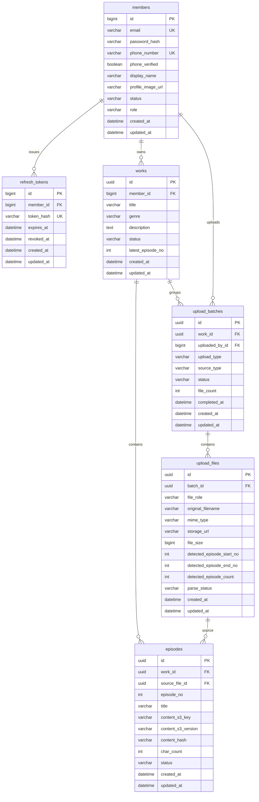
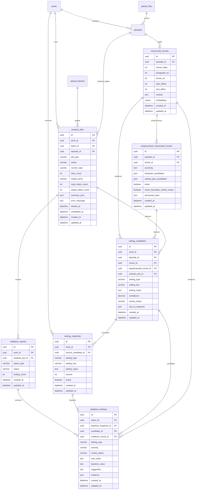

# Backend ERD

이 문서는 Notion에 정리한 ERD를 현재 백엔드 JPA Entity 기준으로 옮긴 문서입니다.

DB 컬럼과 관계는 코드가 기준입니다. Notion 원본과 다르면 이 문서에는 현재 구현을 우선 기록하고, 차이는 해당 도메인 문서의 이후 작업에 남깁니다.

## 관계 요약

## 테이블별 책임

| 테이블 | 책임 |
| --- | --- |
| `members` | 로그인 주체인 회원 계정. 이메일과 휴대폰 번호는 각각 unique입니다. |
| `refresh_tokens` | refresh token 세션. token 원문은 저장하지 않고 `token_hash`만 저장합니다. |
| `works` | 회원이 소유한 작품. 회차/업로드/분석 작업의 최상위 리소스입니다. |
| `episodes` | 작품에 속한 회차 메타데이터. 원문은 S3에 저장하고 DB에는 key/version/hash/글자 수만 둡니다. |
| `upload_batches` | 한 번의 업로드 요청 단위. 업로드 유형, 소스, 전체 처리 상태를 기록합니다. |
| `upload_files` | batch에 포함된 개별 파일. 원본 파일 S3 위치와 파싱 결과를 기록합니다. |

## Notion 기반 후속 AI 분석 ERD

아래 모델은 Notion의 “흐름 정리 - 임준우” 문서에 있던 분석/검수 설계를 백엔드 ERD 초안으로 옮긴 것입니다.

현재 `main` 코드에 모두 구현된 Entity는 아니며, `Episode`, `UploadFile`, `UploadBatch`처럼 이미 구현된 모델과 이어질 후속 분석 모델을 구분하기 위한 설계 초안입니다.

### 후속 모델 책임

| 모델 | 책임 |
| --- | --- |
| `manuscript_chunks` | 회차 원문을 문단/장면/길이 기준으로 나눈 분석 단위. 원문 위치와 pgvector 검색용 embedding을 보존합니다. |
| `preprocessed_manuscript_chunks` | LLM 전처리 결과. 청크 요약, 등장인물 후보, 설정 유형 후보, 노이즈 여부, 장면 경계 보정 필요 여부를 저장합니다. |
| `analysis_jobs` | Python AI Worker에 전달되는 비동기 작업 단위. 작업 목적, 상태, 재시도 횟수, 실패 사유, 토큰 수를 추적합니다. |
| `setting_candidates` | AI가 추출한 설정 후보. 설정 유형, 값, 신뢰도, 근거 청크, 원본 AI 응답, 검토 상태를 저장합니다. |
| `setting_snapshots` | 사용자가 확정한 기준 설정 또는 설정 변화 이력. 신규 회차 검수의 구조화 기준입니다. |
| `validation_reports` | 기존 원고 내부 정합성 검수와 신규 회차 검수 리포트의 묶음입니다. |
| `validation_findings` | 개별 충돌 후보. 오류 유형, 심각도, 양쪽 근거, 비교 값, AI 수정 제안, 사용자 검토 상태를 저장합니다. |

### Notion 용어와 현재 코드 매핑

| Notion 용어 | 현재/예상 백엔드 모델 |
| --- | --- |
| `OriginalManuscriptFile` | 현재 `upload_files`가 원본 파일 참조 역할을 담당합니다. |
| `Episode.processingStatus` | 현재 코드에서는 `episodes.status` / `EpisodeStatus`입니다. |
| `AnalysisJob.type` | 현재 분석 초안에서는 `analysis_jobs.job_type` / `AnalysisJobType`입니다. |
| `ValidationReport.reportType` | 후속 리포트 모델의 `report_type`으로 둡니다. |
| `ValidationFinding.reviewStatus` | 후속 finding 모델의 `review_status`로 둡니다. |

## 주요 설계 결정

- 회원이 소유한 리소스는 `works.member_id`를 루트로 접근 제어합니다.
- 회차 원문 전문은 DB에 저장하지 않습니다. `episodes.content_s3_key`를 통해 S3에서 조회합니다.
- 업로드 원본 파일과 회차 원문은 분리 저장합니다. 원본 파일은 `upload_files.storage_url`, 회차 원문은 `episodes.content_s3_key`에 연결됩니다.
- `episodes.source_file_id`는 해당 회차가 어떤 업로드 파일에서 파생되었는지 추적하는 선택 연결입니다.
- `upload_batches`는 이후 분석 작업의 대상 단위로 재사용할 수 있도록 `work_id`, `upload_type`, `file_count`, `status`를 유지합니다.
- 후속 분석 모델에서는 구조화 조회(`setting_snapshots`, `setting_candidates`)와 벡터 검색(`manuscript_chunks.embedding`)을 함께 사용합니다. 구조화 조회는 수치/상태 비교 기준이고, 벡터 검색은 원문 맥락과 근거 문장을 찾는 보조 수단입니다.

## 현재 코드와 추가 검토가 필요한 부분

- `episodes.source_file_id`는 코드상 FK 어노테이션 없이 UUID 값으로 저장합니다. 실제 DB 제약을 강제할지 여부는 마이그레이션 도입 시 결정합니다.
- 회차 번호 unique 제약은 현재 DB 제약이 아니라 서비스에서 `work_id + episode_no` 중복을 검사합니다.
- 후속 ERD의 `manuscript_chunks`, `preprocessed_manuscript_chunks`, `setting_candidates`, `setting_snapshots`, `validation_reports`, `validation_findings`는 아직 현재 `main` 기준 Entity가 아닙니다.
- Notion 설계의 `AnalysisJob.status`에는 `CANCELED`가 있지만, 현재 분석 문서 초안은 `PENDING`, `RUNNING`, `SUCCEEDED`, `FAILED`만 포함합니다. 취소 정책이 필요해질 때 enum을 확장합니다.
