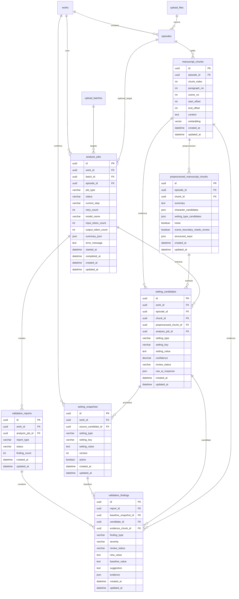

# Backend ERD

이 문서는 Notion에 정리한 ERD를 현재 Flyway schema와 백엔드 JPA Entity 기준으로 옮긴 문서입니다.

DB 컬럼과 관계는 Flyway migration이 기준입니다. JPA Entity와 Python SQLAlchemy 모델은 migration 결과에 맞춰 매핑하며, Notion 원본과 다르면 이 문서에는 현재 구현을 우선 기록합니다.

## 관계 요약

```mermaid
erDiagram
    members ||--o{ refresh_tokens : issues
    members ||--o{ member_legal_records : acknowledges
    legal_documents ||--o{ member_legal_records : is_acknowledged_by
    members ||--o{ works : owns
    members ||--o{ upload_batches : uploads
    members ||--o| ai_token_accounts : has_quota
    members ||--o{ ai_token_grants : receives
    members ||--o{ ai_token_usages : consumes
    members ||--o{ ai_token_extension_requests : requests
    members ||--o{ feedbacks : submits
    works ||--o{ episodes : contains
    episodes ||--o{ episode_chunks : splits
    episodes ||--o| episode_source_purge_requests : queues_previous_source_cleanup
    works ||--o{ upload_batches : groups
    works ||--o{ analysis_jobs : runs
    works ||--o{ ai_token_usages : meters
    works ||--o{ characters : has
    works ||--o{ setting_candidates : extracts
    works ||--o{ world_settings : defines
    works ||--o{ world_setting_candidates : extracts
    works o|--o{ character_setting_schemas : optionally_scopes
    characters ||--o{ character_facts : records
    characters ||--o{ character_snapshot_sources : owns_current_provenance
    character_facts ||--o{ character_snapshot_sources : contributes_to_snapshot
    upload_batches ||--o{ upload_files : contains
    upload_files ||--o{ episodes : source
    upload_batches ||--o{ analysis_jobs : targets
    episodes ||--o{ analysis_jobs : optional_target
    analysis_jobs ||--o{ analysis_job_episode_targets : snapshots
    episodes ||--o{ analysis_job_episode_targets : included
    episodes ||--o{ setting_candidates : optional_source
    episodes ||--o{ world_setting_candidates : source
    episodes ||--o{ character_facts : optional_source
    analysis_jobs ||--o{ setting_candidates : creates
    analysis_jobs ||--o{ world_setting_candidates : creates
    analysis_jobs ||--o{ character_facts : extracts
    analysis_jobs ||--o{ character_fact_comparison_batches : runs
    works ||--o{ character_fact_comparison_batches : owns
    episodes o|--o{ character_fact_comparison_batches : optional_source
    characters ||--o{ character_fact_comparison_batches : compares
    character_fact_comparison_batches o|--o{ setting_candidates : groups
    setting_candidates o|--o{ analysis_jobs : hidden_comparison_job
    analysis_jobs ||--o{ ai_token_usages : records
    ai_token_extension_requests o|--o| ai_token_grants : produces_on_approval
    ai_token_extension_requests o|--o{ feedbacks : rewards
    world_settings o|--o{ world_setting_candidates : comparison_target
    members o|--o{ world_setting_candidates : reviews

    members {
        bigint id PK
        varchar email UK
        varchar password_hash
        varchar phone_number UK
        boolean phone_verified
        datetime age_requirement_confirmed_at
        varchar display_name
        varchar profile_image_url
        varchar status
        varchar role
        datetime created_at
        datetime updated_at
    }

    refresh_tokens {
        bigint id PK
        bigint member_id FK
        varchar token_hash UK
        datetime expires_at
        datetime revoked_at
        datetime created_at
        datetime updated_at
    }

    member_legal_records {
        bigint id PK
        bigint member_id FK
        bigint legal_document_id FK
        varchar document_type
        varchar document_version
        varchar action_type
        datetime recorded_at
        datetime created_at
        datetime updated_at
    }

    legal_documents {
        bigint id PK
        varchar document_type
        varchar locale
        varchar document_version
        varchar title
        text content_markdown
        varchar content_hash
        varchar status
        date effective_date
        datetime published_at
        datetime retired_at
        datetime created_at
        datetime updated_at
    }

    ai_token_accounts {
        bigint member_id PK,FK
        bigint granted_tokens
        bigint used_tokens
        bigint reserved_tokens
        datetime created_at
        datetime updated_at
    }

    ai_token_grants {
        uuid id PK
        bigint member_id FK
        uuid extension_request_id FK,UK
        bigint amount
        varchar grant_type
        varchar note
        datetime created_at
        datetime updated_at
    }

    ai_token_usages {
        uuid request_id PK
        bigint member_id FK
        uuid work_id FK
        uuid analysis_job_id FK
        varchar purpose
        int attempt
        varchar model_name
        varchar status
        varchar outcome
        bigint reserved_tokens
        bigint input_tokens
        bigint cached_input_tokens
        bigint output_tokens
        datetime created_at
        datetime updated_at
    }

    ai_token_extension_requests {
        uuid id PK
        bigint member_id FK
        varchar feedback
        varchar request_context
        varchar request_source
        varchar status
        bigint reviewed_by_member_id
        datetime reviewed_at
        bigint granted_amount
        varchar rejection_reason
        datetime created_at
        datetime updated_at
    }

    feedbacks {
        uuid id PK
        bigint member_id FK
        varchar content
        varchar page_path
        uuid reward_request_id FK
        datetime created_at
        datetime updated_at
    }

    works {
        uuid id PK
        bigint member_id FK
        varchar title
        varchar genre
        text description
        int latest_episode_no
        datetime created_at
        datetime updated_at
    }

    episodes {
        uuid id PK
        uuid work_id FK
        uuid source_file_id FK
        int episode_no
        varchar title
        varchar content_s3_key
        varchar content_s3_version
        varchar content_hash
        datetime content_updated_at
        int char_count
        varchar status
        datetime created_at
        datetime updated_at
    }

    episode_source_purge_requests {
        uuid id PK
        uuid episode_id FK,UK
        uuid work_id
        uuid previous_source_file_id
        int previous_episode_no
        varchar previous_content_key
        varchar previous_source_storage_url
        varchar retained_content_key
        varchar status
        datetime requested_at
        datetime processing_started_at
        int attempt_count
        varchar last_error_code
        datetime created_at
        datetime updated_at
    }

    episode_chunks {
        uuid id PK
        uuid episode_id FK
        int chunk_index
        text chunk_text
        int start_offset
        int end_offset
        int paragraph_start_index
        int paragraph_end_index
        jsonb metadata_json
        vector embedding
        varchar embedding_model
        varchar embedding_version
        datetime embedded_at
        datetime created_at
        datetime updated_at
    }

    analysis_jobs {
        uuid id PK
        uuid work_id FK
        uuid batch_id FK
        uuid episode_id FK
        uuid setting_candidate_id FK
        varchar job_type
        varchar status
        varchar current_step
        varchar model_name
        int input_token_count
        int output_token_count
        text summary_json
        text error_message
        varchar failure_code
        datetime started_at
        datetime completed_at
        datetime created_at
        datetime updated_at
    }

    analysis_job_episode_targets {
        uuid analysis_job_id PK,FK
        uuid episode_id PK,FK
    }

    characters {
        uuid id PK
        uuid work_id FK
        varchar name
        varchar role_label
        int current_age
        int current_level
        jsonb profile_json
        jsonb stats_json
        jsonb skills_json
        jsonb items_json
        jsonb statuses_json
        bigint snapshot_version
        uuid first_appearance_episode_id
        varchar status
        datetime created_at
        datetime updated_at
    }

    character_facts {
        uuid id PK
        uuid character_id FK
        uuid setting_candidate_id FK
        varchar fact_type
        varchar fact_key
        text fact_value
        text normalized_value
        jsonb value_json
        uuid source_episode_id FK
        uuid source_chunk_id
        uuid extracted_by_job_id FK
        decimal confidence
        int effective_from_episode_no
        datetime created_at
        datetime updated_at
    }

    character_snapshot_sources {
        uuid id PK
        uuid character_id FK
        varchar fact_type
        varchar fact_key
        uuid source_fact_id FK
        int source_order
        datetime created_at
        datetime updated_at
    }

    setting_candidates {
        uuid id PK
        uuid work_id FK
        uuid episode_id FK
        uuid source_chunk_id
        uuid analysis_job_id FK
        uuid character_comparison_batch_id FK
        varchar character_comparison_candidate_ref
        varchar candidate_kind
        varchar entity_type
        varchar entity_name
        varchar raw_entity_mention
        uuid matched_character_id FK
        varchar match_status
        varchar attribute_name
        text attribute_value
        varchar value_type
        jsonb value_json
        jsonb evidence_spans
        decimal confidence
        varchar review_status
        jsonb raw_ai_result_json
        varchar comparison_status
        varchar suggested_operation
        varchar temporal_scope
        varchar comparison_target_fact_type
        varchar comparison_target_fact_key
        varchar resolved_canonical_fact_key
        jsonb comparison_dependency_candidate_ids
        text proposed_fact_value
        jsonb proposed_value_json
        jsonb removed_snapshot_entries_json
        text comparison_reason
        bigint comparison_base_snapshot_version
        varchar comparison_context_hash
        jsonb raw_comparison_json
        datetime compared_at
        text comparison_error_message
        varchar comparison_failure_code
        datetime created_at
        datetime updated_at
    }

    character_fact_comparison_batches {
        uuid id PK
        uuid work_id FK
        uuid source_episode_id FK
        uuid analysis_job_id FK
        uuid matched_character_id FK
        varchar canonical_fact_type
        varchar status
        int candidate_count
        bigint base_snapshot_version
        varchar context_hash
        varchar completion_hash
        jsonb raw_completion_json
        varchar failure_code
        text error_message
        datetime created_at
        datetime updated_at
    }

    world_settings {
        uuid id PK
        uuid work_id FK
        varchar category
        varchar subject_name
        varchar normalized_subject_name
        jsonb properties_json
        bigint version
        datetime created_at
        datetime updated_at
    }

    world_setting_candidates {
        uuid id PK
        uuid work_id FK
        uuid source_episode_id FK
        uuid analysis_job_id FK
        varchar category
        varchar subject_name
        varchar scope_name
        varchar setting_name
        text extracted_value
        jsonb evidence_spans
        decimal extraction_confidence
        jsonb raw_extraction_json
        uuid target_world_setting_id FK
        varchar suggested_operation
        varchar proposed_scope_name
        varchar proposed_setting_name
        text before_value
        text proposed_value
        text comparison_reason
        bigint base_world_setting_version
        jsonb raw_comparison_json
        datetime compared_at
        varchar comparison_status
        text comparison_error_message
        varchar comparison_failure_code
        varchar comparison_source_error_code
        varchar comparison_source_reason_code
        varchar review_status
        varchar final_operation
        varchar final_category
        varchar final_subject_name
        varchar final_scope_name
        varchar final_setting_name
        text final_value
        text review_note
        bigint reviewed_by FK
        datetime reviewed_at
        bigint applied_world_setting_version
        datetime created_at
        datetime updated_at
    }

    character_setting_schemas {
        uuid id PK
        uuid work_id FK
        varchar schema_key
        varchar attribute_pattern
        varchar display_name
        varchar fact_type
        varchar value_type
        varchar value_semantics
        varchar merge_policy
        jsonb aliases_json
        varchar source
        boolean enabled
        datetime created_at
        datetime updated_at
    }

    upload_batches {
        uuid id PK
        uuid work_id FK
        bigint member_id FK
        varchar upload_type
        varchar source_type
        varchar status
        int file_count
        datetime completed_at
        datetime created_at
        datetime updated_at
    }

    upload_files {
        uuid id PK
        uuid batch_id FK
        varchar file_role
        varchar original_filename
        varchar mime_type
        varchar storage_url
        varchar content_storage_url
        bigint file_size
        int detected_episode_start_no
        int detected_episode_end_no
        int detected_episode_count
        varchar parse_status
        datetime created_at
        datetime updated_at
    }
```

## 테이블별 책임

| 테이블 | 책임 |
| --- | --- |
| `members` | 로그인 주체인 회원 계정. 이메일과 휴대폰 번호는 각각 unique입니다. |
| `refresh_tokens` | refresh token 세션. token 원문은 저장하지 않고 `token_hash`만 저장합니다. |
| `legal_documents` | 이용약관·개인정보처리방침의 locale별 불변 Markdown 원문·SHA-256·버전과 `DRAFT/PUBLISHED/RETIRED` 게시 수명주기를 저장합니다. 종류+locale별 현재 `PUBLISHED`는 한 건만 허용합니다. |
| `member_legal_records` | 회원가입 때 실제로 표시한 `legal_document_id` FK와 문서 종류·버전·행위·서버 시각 snapshot을 append-only 이력으로 저장합니다. AI 원고 처리와 GA4·Meta 고지는 개인정보처리방침 원문에 포함하며 별도 동의 행을 만들지 않습니다. |
| `ai_token_accounts` | 회원별 누적 지급·사용·처리 중 예약량의 현재 합계를 한 행에 저장합니다. |
| `ai_token_grants` | 최초 기본 지급과 운영 추가 지급 이력을 저장합니다. 승인으로 만든 `MANUAL` 지급은 nullable unique `extension_request_id`로 원본 요청을 연결하고, 요청 삭제 시 연결만 `NULL`로 바꿉니다. |
| `ai_token_usages` | AI provider 요청 UUID별 예약·정산·해제 상태와 input/cached input/output 사용량을 기록합니다. |
| `ai_token_extension_requests` | 사용량 부족 요청과 일반 의견 1회 보상 요청의 피드백·출처·컨텍스트·운영 처리 상태를 저장합니다. 회원당 `PENDING`은 출처 전체에서 한 건, `GENERAL_FEEDBACK_REWARD`는 전체 상태에서 한 건만 허용합니다. |
| `feedbacks` | 로그인 회원의 일반 의견을 요청마다 저장합니다. `reward_request_id`는 nullable FK이며 이미 있는 보상 요청을 여러 의견이 공유할 수 있고, 요청 삭제 시 `NULL`로 바꿉니다. |
| `works` | 회원이 소유한 작품. 회차/업로드/분석 작업의 최상위 리소스입니다. |
| `episodes` | 작품에 속한 회차 메타데이터. 원문은 S3에 저장하고 DB에는 key/version/hash/글자 수만 둡니다. |
| `episode_source_purge_requests` | 회차 수정·파일 교체의 이전 원문과 회차 삭제 원문·파생 데이터를 재시도 가능하게 정리하는 활성 요청입니다. 교체 요청만 `retained_content_key`에 새 원문 key를 저장하며 완료 즉시 요청을 삭제합니다. |
| `episode_chunks` | 회차 원문 청크와 위치 정보, `vector(1536)` 임베딩 및 재생성 판단 메타데이터를 저장합니다. `(episode_id, chunk_index)`는 unique입니다. |
| `upload_batches` | 한 번의 업로드 요청 단위. 업로드 유형, 소스, 전체 처리 상태를 기록합니다. |
| `upload_files` | batch에 포함된 개별 파일. 원본 S3 위치, 설정집 편집용 텍스트 위치와 파싱 결과를 기록합니다. |
| `analysis_jobs` | 작품 단위 AI 분석 작업. 작업 유형, 상태, 대상 batch/episode, 결과 메타데이터를 기록합니다. |
| `analysis_job_episode_targets` | 분석 작업 생성 시 확정한 대상 회차 스냅샷. 이후 원본 교체·회차 보관과 무관하게 과거 작업 대상을 유지합니다. |
| `character_fact_comparison_batches` | 같은 분석 Job·캐릭터 ID·canonical FactType의 후보를 원문 순서로 묶은 2차 비교 실행입니다. context/completion hash, 원자 완료 상태와 typed failure를 보존하며 후보에는 묶음 내부 참조와 선행 후보 의존성만 저장합니다. |
| `characters` | 작품별 캐릭터 대표/현재 설정의 유일한 authority. 핵심 조회 값은 일반 컬럼, 상세 설정은 내부 표시값 envelope를 포함한 JSONB, 변경 동시성은 `snapshot_version`으로 관리합니다. |
| `character_facts` | 캐릭터별 설정 관찰과 원문 근거를 append-only로 저장하는 타임라인. 현재값 여부를 행에 기록하지 않습니다. |
| `character_snapshot_sources` | 현재 snapshot의 `(character, factType, factKey)` slot을 구성하는 한 개 이상의 source Fact를 순서와 함께 연결합니다. |
| `setting_candidates` | AI가 추출한 검토 전 후보와 2차 비교 proposal·관련 문맥 hash를 보존합니다. `SETTING`은 설정 값을, `CHARACTER_DISCOVERY`는 이름과 근거만 보존합니다. |
| `character_setting_schemas` | AI의 `attributeName`을 canonical key로 해석하기 위한 전역/작품별 alias·pattern·값 타입·정책 registry입니다. 실제 캐릭터 값은 저장하지 않습니다. |
| `world_settings` | 작품별 현재 세계관 확정본. 한 행은 분류·대상 하나이며 루트 문자열 leaf와 선택적 1단계 범위 object를 담은 JSONB, 충돌 검사용 version을 저장합니다. |
| `world_setting_candidates` | 회차에서 추출한 세계관 속성 후보. 선택적 `scope_name`과 설정명의 전체 경로, 1차 추출, 2차 비교 제안, 사용자 최종 결정과 적용 버전을 한 행에 보존합니다. |
| `world_setting_comparison_batches` | 같은 canonical 주체·원본 범위로 묶인 후보들의 2차 비교 실행, context snapshot, 완료 hash와 상태를 보존합니다. |
| `world_setting_comparison_decisions` | 여러 후보를 하나의 canonical 설정안으로 정리한 권위 레코드입니다. 기존 root 이동의 이름·값 snapshot과 실제 적용 WorldSetting version도 저장합니다. |
| `world_setting_comparison_decision_sources` | batch 안의 원본 후보와 canonical decision 사이의 순서 있는 provenance membership입니다. |

### AI 토큰 추가 요청과 일반 의견 제약

- `ai_token_extension_requests.request_source` 허용값은 `QUOTA_EXHAUSTION`, `GENERAL_FEEDBACK_REWARD`입니다. V34 이전 요청은 전자로 backfill됩니다.
- `QUOTA_EXHAUSTION`은 `REQUEST_BLOCKED`, `ANALYSIS_FAILED`, `ANALYSIS_INTERRUPTED` 중 하나와만 결합하고, `GENERAL_FEEDBACK_REWARD`는 `GENERAL_FEEDBACK`과만 결합합니다.
- `uk_ai_token_extension_requests_member_pending`은 한 회원의 두 출처를 통틀어 `PENDING` 행을 하나만 허용합니다. `uk_ai_token_extension_requests_member_feedback_reward`는 상태와 무관하게 일반 의견 보상 요청을 회원당 하나만 허용합니다.
- `feedbacks.content`는 앞뒤 공백을 제외한 35~1,000자입니다. nullable `page_path`는 `/`로 시작하는 1~255자 내부 경로이며 `?`, `#`를 포함할 수 없습니다.
- `feedbacks.member_id`는 회원 삭제 시 의견을 cascade 삭제합니다. `reward_request_id`는 보상 요청 삭제 시 `NULL`로 바꾸어 의견 본체를 유지합니다.

## Notion 기반 후속 AI 분석 ERD

아래 모델은 Notion의 “흐름 정리 - 임준우” 문서에 있던 분석/검수 설계를 백엔드 ERD 초안으로 옮긴 것입니다.

현재 `main` 코드에 모두 구현된 Entity는 아니며, `Episode`, `UploadFile`, `UploadBatch`, `AnalysisJob`, `WorkCharacter`, `CharacterFact`, `SettingCandidate`처럼 이미 구현된 모델과 이어질 후속 분석 모델을 구분하기 위한 설계 초안입니다.

```mermaid
erDiagram
    works ||--o{ episodes : contains
    upload_files ||--o{ episodes : source
    episodes ||--o{ manuscript_chunks : splits
    manuscript_chunks ||--o{ preprocessed_manuscript_chunks : preprocesses
    manuscript_chunks ||--o{ setting_candidates : evidence
    preprocessed_manuscript_chunks ||--o{ setting_candidates : extracts
    works ||--o{ analysis_jobs : runs
    upload_batches ||--o{ analysis_jobs : targets
    episodes ||--o{ analysis_jobs : optional_target
    analysis_jobs ||--o{ setting_candidates : extracts
    analysis_jobs ||--o{ validation_reports : creates
    works ||--o{ setting_snapshots : confirms
    setting_candidates ||--o{ setting_snapshots : promotes
    validation_reports ||--o{ validation_findings : contains
    setting_snapshots ||--o{ validation_findings : baseline
    setting_candidates ||--o{ validation_findings : candidate
    manuscript_chunks ||--o{ validation_findings : evidence

    manuscript_chunks {
        uuid id PK
        uuid episode_id FK
        int chunk_index
        int paragraph_no
        int scene_no
        int start_offset
        int end_offset
        text content
        vector embedding
        datetime created_at
        datetime updated_at
    }

    preprocessed_manuscript_chunks {
        uuid id PK
        uuid episode_id FK
        uuid chunk_id FK
        text summary
        json character_candidates
        json setting_type_candidates
        boolean noise
        boolean scene_boundary_needs_review
        json structured_input
        datetime created_at
        datetime updated_at
    }

    analysis_jobs {
        uuid id PK
        uuid work_id FK
        uuid batch_id FK
        uuid episode_id FK
        varchar job_type
        varchar status
        varchar current_step
        int retry_count
        varchar model_name
        int input_token_count
        int output_token_count
        json summary_json
        text error_message
        datetime started_at
        datetime completed_at
        datetime created_at
        datetime updated_at
    }

    setting_candidates {
        uuid id PK
        uuid work_id FK
        uuid episode_id FK
        uuid chunk_id FK
        uuid preprocessed_chunk_id FK
        uuid analysis_job_id FK
        varchar setting_type
        varchar setting_key
        text setting_value
        decimal confidence
        varchar review_status
        json raw_ai_response
        datetime created_at
        datetime updated_at
    }

    setting_snapshots {
        uuid id PK
        uuid work_id FK
        uuid source_candidate_id FK
        varchar setting_type
        varchar setting_key
        text setting_value
        int version
        boolean active
        datetime created_at
        datetime updated_at
    }

    validation_reports {
        uuid id PK
        uuid work_id FK
        uuid analysis_job_id FK
        varchar report_type
        varchar status
        int finding_count
        datetime created_at
        datetime updated_at
    }

    validation_findings {
        uuid id PK
        uuid report_id FK
        uuid baseline_snapshot_id FK
        uuid candidate_id FK
        uuid evidence_chunk_id FK
        varchar finding_type
        varchar severity
        varchar review_status
        text new_value
        text baseline_value
        text suggestion
        json evidence
        datetime created_at
        datetime updated_at
    }
```

### 후속 모델 책임

| 모델 | 책임 |
| --- | --- |
| `manuscript_chunks` | 회차 원문을 문단/장면/길이 기준으로 나눈 분석 단위. 원문 위치와 pgvector 검색용 embedding을 보존합니다. |
| `preprocessed_manuscript_chunks` | LLM 전처리 결과. 청크 요약, 등장인물 후보, 설정 유형 후보, 노이즈 여부, 장면 경계 보정 필요 여부를 저장합니다. |
| `analysis_jobs` | Python AI Worker에 전달되는 비동기 작업 단위. 작업 목적, 상태, 재시도 횟수, 마지막 실패 사유, 토큰 수를 추적합니다. |
| `setting_candidates` | AI가 추출한 설정 후보. 설정 유형, 값, 신뢰도, 근거 청크, 원본 AI 응답, 검토 상태를 저장합니다. |
| `setting_snapshots` | 사용자가 확정한 기준 설정 또는 설정 변화 이력. 신규 회차 검수의 구조화 기준입니다. |
| `validation_reports` | 기존 원고 내부 정합성 검수와 신규 회차 검수 리포트의 묶음입니다. |
| `validation_findings` | 개별 충돌 후보. 오류 유형, 심각도, 양쪽 근거, 비교 값, AI 수정 제안, 사용자 검토 상태를 저장합니다. |

### Notion 용어와 현재 코드 매핑

| Notion 용어 | 현재/예상 백엔드 모델 |
| --- | --- |
| `OriginalManuscriptFile` | 현재 `upload_files`가 원본 파일 참조 역할을 담당합니다. |
| `Episode.processingStatus` | 현재 코드에서는 `episodes.status` / `EpisodeStatus`입니다. |
| `AnalysisJob.type` | 현재 분석 초안에서는 `analysis_jobs.job_type` / `AnalysisJobType`입니다. |
| `SettingCandidate` | 현재 `setting_candidates`가 AI 설정 후보 저장 역할을 담당합니다. `source_chunk_id`는 `episode_chunks` 식별자를 저장하지만 현재 DB FK는 강제하지 않습니다. |
| `SettingSnapshot` | 캐릭터 중심 MVP에서는 현재 `character_facts`가 설정 변화 이력과 current 기준값 역할을 우선 담당합니다. |
| `ValidationReport.reportType` | 후속 리포트 모델의 `report_type`으로 둡니다. |
| `ValidationFinding.reviewStatus` | 후속 finding 모델의 `review_status`로 둡니다. |

## 주요 설계 결정

- 회원이 소유한 리소스는 `works.member_id`를 루트로 접근 제어합니다.
- 회차 원문 전문은 DB에 저장하지 않습니다. `episodes.content_s3_key`를 통해 S3에서 조회합니다.
- 업로드 원본 파일과 파생 원문은 분리 저장합니다. 원본 파일은 `upload_files.storage_url`, 설정집 편집용 현재 텍스트는 `upload_files.content_storage_url`, 회차 원문은 `episodes.content_s3_key`에 연결됩니다. 회차 삭제·수정·교체로 업로드 원본을 파기하면 `storage_url`은 `null`로 비우며, 다회차 단일 파일의 형제 회차는 분리된 `content_s3_key`를 계속 사용합니다.
- 회차 수정·파일 교체는 새 원문 참조와 정리 요청을, 회차 삭제는 `ARCHIVED` tombstone과 정리 요청을 먼저 커밋하고 S3 객체를 나중에 파기합니다. 실패 요청은 스케줄러가 재시도하며, 완료 전에는 같은 회차의 추가 변경과 분석 생성을 막습니다. 파생 후보 정리는 후보 검토 API와 같은 Work 잠금 아래에서 최신 검토 상태를 다시 확인합니다.
- `episodes.source_file_id`는 해당 회차가 어떤 업로드 파일에서 파생되었는지 추적하는 nullable FK입니다. 현재 업로드 파일 삭제 API가 없으므로 기본 `NO ACTION`으로 원본 추적 관계를 보호합니다.
- `upload_batches`는 이후 분석 작업의 대상 단위로 재사용할 수 있도록 `work_id`, `upload_type`, `file_count`, `status`를 유지합니다.
- 캐릭터 설정은 `setting_candidates`, `character_facts`, `characters`로 나누어 저장합니다. AI 추출 후보는 `setting_candidates`, 회차별 확정/검토 이력은 `character_facts`, 화면 표시용 현재 스냅샷은 `characters`가 담당합니다.
- `character_setting_schemas.work_id`가 `NULL`이면 전역 schema이고 값이 있으면 해당 작품의 추가 schema입니다. 전역과 작품 범위에서 각각 `schema_key` 중복을 막으며, 작품 schema override와 중복 병합은 현재 지원하지 않습니다.
- 현재 registry는 공통·프로필 `SYSTEM_SEED` 15개와 판타지 POC `DEV_SEED` 15개를 모두 활성 전역 schema로 둡니다. source는 선정 근거를 구분할 뿐 Worker 적용 여부를 나누지 않습니다.
- 화면 표시와 구조화 조회에 자주 쓰는 값은 일반 컬럼으로 두고, 프로필/스탯/스킬/아이템/상태 상세값과 AI 원본 응답은 JSONB로 보존합니다.
- 분석 흐름에서는 구조화 조회(`character_facts`, `setting_candidates`)와 벡터 검색(`episode_chunks.embedding`)을 함께 사용합니다. 구조화 조회는 수치/상태 비교 기준이고, 벡터 검색은 원문 맥락과 근거 문장을 찾는 보조 수단입니다.

## 현재 코드와 추가 검토가 필요한 부분

- 회차 번호 unique 제약은 현재 DB 제약이 아니라 서비스에서 `work_id + episode_no` 중복을 검사합니다.
- 후속 ERD의 `manuscript_chunks`, `preprocessed_manuscript_chunks`, `setting_snapshots`, `validation_reports`, `validation_findings`는 아직 현재 `main` 기준 Entity가 아닙니다. 캐릭터 중심 MVP의 설정 이력은 우선 `character_facts`로 구현합니다.
- `characters.first_appearance_episode_id`는 원문이 파기된 `ARCHIVED` Episode tombstone을 계속 참조할 수 있습니다. 향후 Episode 행 물리 삭제 시 재계산 또는 `NULL` 처리 정책이 정해지지 않아 현재 FK를 강제하지 않습니다.
- `setting_candidates.source_chunk_id`와 `character_facts.source_chunk_id`는 `episode_chunks`를 가리키지만 현재 DB FK를 강제하지 않습니다. Worker가 재청킹 시 기존 청크를 삭제하고 새 UUID로 교체하므로, 청크 ID 안정화 또는 근거 이력 보존 정책을 정한 뒤 다시 검토합니다.
- `AnalysisJob.status`의 `CANCELED`는 작품 영구 삭제로 중단된 작업의 terminal 상태이며 Worker lease와 토큰 예약을 함께 정리합니다.
