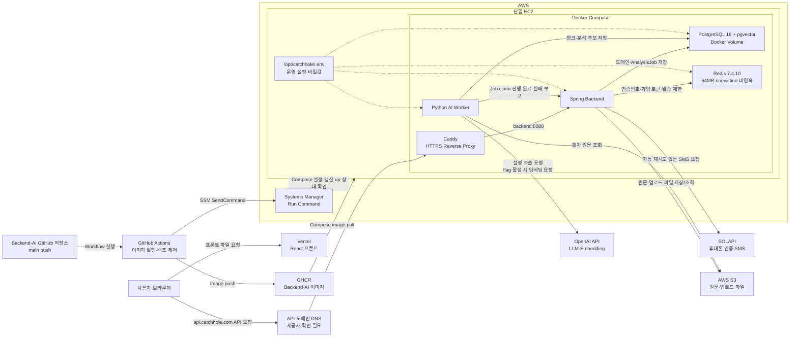
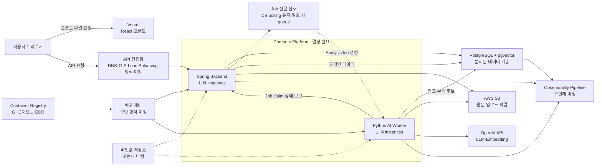

# Infrastructure Flow

CatchHole의 현재 운영 인프라 구성과 스케일링 전략, 향후 인프라 선택지와 단계별 전환 기준을 정리합니다.

이 문서는 두 상태를 명확히 구분합니다.

- **현재 구조(As-Is)**: 저장소의 코드, Docker Compose, GitHub Actions, 배포 문서에서 확인되는 구성
- **발전 방향(To-Be)**: 아직 구현되지 않은 개선 방향과 결정이 필요한 인프라 선택지

AWS Console에서 수동으로 만든 리소스는 저장소만으로 확인할 수 없습니다. Route 53 Hosted Zone, CloudWatch 기본 지표처럼 코드 밖에서 존재할 수 있는 리소스는 현재 구조에 단정해서 포함하지 않고 `확인 필요`로 표시합니다.

## 1. 현재 구조(As-Is)

### 1.1 구성 요약

현재 운영 배포 정의는 단일 EC2에서 다음 컨테이너를 Docker Compose로 실행합니다.

- Caddy
- Spring Backend
- Python AI Worker
- PostgreSQL 16 + pgvector
- Redis 7.4.10 (휴대폰 인증 단기 상태, 비영속)

프론트엔드는 Vercel에 별도로 배포하고, 회차 원문과 업로드 파일은 AWS S3에 저장합니다. 휴대폰 인증 SMS는 SOLAPI로 발송합니다. Backend와 AI 이미지는 GHCR에 발행하며, GitHub Actions는 AWS Systems Manager Run Command를 사용해 EC2의 Compose 배포를 실행합니다.

### 1.2 사용자 요청 흐름

1. 사용자 브라우저가 Vercel에서 프론트 정적 파일을 받습니다.
2. 프론트 코드는 `VITE_API_BASE_URL`로 설정된 `https://api.catchhole.com`에 API를 직접 호출합니다.
3. API 도메인의 DNS가 EC2의 공개 진입점으로 요청을 전달합니다. DNS 제공자가 Route 53인지는 저장소에서 확인할 수 없습니다.
4. Caddy가 80/443 포트에서 HTTPS 연결을 처리하고 Docker 내부의 `backend:8080`으로 요청을 전달합니다.
5. Spring Backend가 인증, 작품·회차·업로드·분석 작업 같은 사용자-facing API를 처리합니다.
6. 구조화된 도메인 데이터와 `AnalysisJob` 상태는 EC2 내부 PostgreSQL 컨테이너에 저장합니다.
7. 회차 원문과 업로드 파일은 S3에 저장하고 DB에는 S3 key, version, hash 같은 메타데이터만 저장합니다.

신규 가입은 Spring이 Redis에서 전화번호·IP·전체 발송량을 원자적으로 제한하고 SOLAPI로 SMS를 한 번 요청한 뒤, 확인된 1회용 가입 토큰에서 전화번호를 조회해 처리합니다. Redis 장애 시 SMS를 보내지 않으며 Redis 재시작 시 진행 중 인증은 초기화됩니다. 기존 로그인·refresh token 흐름은 PostgreSQL을 사용하므로 유지됩니다.

Vercel은 Backend 요청을 중계하는 서버가 아닙니다. 브라우저가 Vercel과 Backend API에 각각 요청합니다.

### 1.3 AI 분석 흐름

1. Spring Backend가 회차별 `AnalysisJob`을 `PENDING` 상태로 생성합니다.
2. Python AI Worker가 Spring 내부 API를 polling해 가장 오래된 Job 하나를 claim합니다.
3. Spring이 Job을 `RUNNING`으로 바꾸고 단일 회차의 S3 메타데이터, 기존 캐릭터, 활성 설정 schema를 Worker에 전달합니다.
4. Worker가 S3에서 회차 원문을 읽습니다.
5. Worker가 원문 청킹과 LLM 설정 후보 추출을 수행하고, `EMBEDDING_GENERATION_ENABLED=true`일 때만 embedding을 생성합니다. MVP 기본값은 `false`입니다.
6. Worker가 `episode_chunks`, `setting_candidates` 같은 분석 산출물을 PostgreSQL에 직접 저장합니다.
7. Worker가 진행, 성공, 실패 상태를 Spring 내부 API로 보고합니다.
8. Spring이 `AnalysisJob`과 대상 `Episode` 상태를 갱신합니다.

`AnalysisJob`은 별도 서버나 AWS 서비스가 아니라 PostgreSQL에 저장되는 Backend 도메인 데이터입니다.

### 1.4 배포 흐름

```mermaid
flowchart LR
    PUSH["main 브랜치 push"]
    TEST["Backend 또는 AI 테스트"]
    BUILD["Docker 이미지 빌드"]
    GHCR["GHCR<br/>main·short SHA"]
    DISPATCH["Backend 배포 Workflow 실행<br/>AI는 repository dispatch"]
    AUTH["AWS 인증<br/>OIDC 또는 access key"]
    SSM["SSM SendCommand"]
    PULL["EC2에서 Compose pull"]
    UP["Compose up -d"]
    HEALTH["api.catchhole.com<br/>Actuator health 확인"]

    PUSH --> TEST
    TEST --> BUILD
    BUILD --> GHCR
    GHCR --> DISPATCH
    DISPATCH --> AUTH
    AUTH --> SSM
    SSM --> PULL
    PULL --> UP
    UP --> HEALTH
```

- Backend와 AI 이미지는 각각의 저장소에서 GHCR에 발행합니다.
- Backend 이미지 발행 성공 또는 AI 이미지 발행 repository dispatch가 EC2 배포 Workflow를 실행합니다.
- GitHub Actions는 OIDC role을 우선 지원하고, 설정되지 않은 경우 AWS access key를 사용할 수 있습니다.
- 배포는 SSH가 아니라 SSM `AWS-RunShellScript`로 수행합니다.
- EC2는 `/opt/catchhole/.env`를 유지하고, Workflow는 Compose와 Caddy 설정을 갱신한 뒤 이미지를 pull합니다.
- 배포 후 `https://api.catchhole.com/actuator/health`를 최대 150초 동안 확인합니다.

### 1.5 비밀값과 AWS 권한

현재 저장소가 정의하는 비밀값 관리 방식은 다음과 같습니다.

| 위치 | 저장 대상 |
| --- | --- |
| GitHub Secrets | AWS 배포 role/access key, EC2 instance ID, AI 저장소의 Backend dispatch token |
| EC2 `/opt/catchhole/.env` | DB·Redis 비밀번호, JWT·휴대폰 인증 HMAC secret, SOLAPI API 자격 증명·발신번호, 내부 API key, LLM API key, 운영 이미지·도메인·공통 `APP_TIMEZONE`, AI 임베딩 생성 flag 설정 |
| EC2 IAM Role | SSM managed node 등록과 S3 접근 권한 |

AWS Secrets Manager 또는 Systems Manager Parameter Store에서 애플리케이션 비밀값을 읽는 구성은 아직 없습니다.

### 1.6 현재 구현 여부

| 구성요소 | 저장소 기준 상태 | 근거 또는 비고 |
| --- | --- | --- |
| Vercel Frontend | 사용 중 | Front README와 배포 URL |
| EC2 | 운영 배포 정의 존재 | `deploy/EC2_DEPLOYMENT.md` |
| Docker Compose | 구현됨 | `deploy/compose.prod.yml` |
| Caddy | 구현됨 | `deploy/Caddyfile` |
| PostgreSQL + pgvector | 구현됨 | EC2의 Compose 컨테이너와 named volume |
| Redis | 구현됨 | EC2 Compose 내부 전용, 64MB `noeviction`, 비영속 |
| SOLAPI | 애플리케이션 연동 구현됨 | 개인 계정·API key·등록 발신번호·선불 잔액을 준비하고 애플리케이션의 일 20건·월 200건 제한을 배포 전 확인 |
| AWS S3 | 애플리케이션 연동 구현됨 | Spring AWS SDK, Python boto3 |
| GHCR | 구현됨 | Backend·AI 이미지 발행 Workflow |
| GitHub Actions | 구현됨 | 테스트, 이미지 발행, EC2 배포 |
| AWS Systems Manager | 배포 경로 구현됨 | `aws ssm send-command` |
| GitHub Actions OIDC | 선택 경로 구현됨 | `AWS_ROLE_TO_ASSUME`이 있을 때 사용 |
| Route 53 | 확인 필요 | API 도메인은 있으나 DNS 제공자/IaC 없음 |
| CloudWatch 애플리케이션 관측 | 미구현 | 로그 전송, Dashboard, Alarm 정의 없음 |
| Secrets Manager / Parameter Store | 미구현 | 운영 비밀값은 EC2 `.env` 사용 |
| RDS | 미구현 | PostgreSQL은 EC2 Compose 컨테이너 |
| S3 VPC Endpoint | 확인 필요 | 저장소에 VPC/IaC 정의 없음 |
| ECS / ALB / ACM / ECR | 미구현 | 관련 배포 정의 없음 |
| SQS 분석 큐 | 미구현 | 환경변수 placeholder만 있고 현재는 DB polling |
| Terraform / CDK | 미구현 | 인프라 코드 디렉터리 없음 |

### 1.7 현재 구조의 주요 한계

- EC2 한 대의 장애가 Caddy, Backend, Worker, DB 장애로 동시에 이어집니다.
- PostgreSQL 데이터가 EC2 Docker volume에 있어 자동 백업과 시점 복구가 보장되지 않습니다.
- 애플리케이션 로그와 Job 상태를 중앙에서 검색하거나 알람으로 받을 수 없습니다.
- 운영 비밀값 갱신과 rotation이 EC2 `.env` 수동 관리에 의존합니다.
- DNS, 네트워크, IAM, S3 정책 같은 인프라 상태가 IaC로 재현되지 않습니다.
- `main` 이미지 태그 배포는 현재 실행 버전 식별과 즉시 rollback을 어렵게 합니다.
- Worker가 종료되면 `RUNNING` Job을 자동 회수하는 lease·heartbeat 정책이 아직 없습니다.
- CAPTCHA가 없어 공격자가 휴대폰 인증 전체 일일 한도 20건을 소진할 수 있습니다.
- Redis 재시작 시 진행 중 휴대폰 인증과 아직 소비하지 않은 가입 토큰이 초기화됩니다.

## 2. 발전 방향(To-Be, 선택지 검토 중)

### 2.1 확정된 설계 원칙

향후 인프라 제품을 선택하기 전에 다음 원칙을 먼저 고정합니다.

- Spring Backend와 AI Worker는 서로 독립적으로 배포하고 확장할 수 있어야 합니다.
- Spring은 사용자 API와 `AnalysisJob` 상태 전이의 source of truth를 유지합니다.
- Worker는 외부에 사용자-facing API를 노출하지 않고 Spring 내부 API로 Job을 claim하고 상태를 보고합니다.
- 원문은 로컬 디스크가 아니라 S3에 저장해 인스턴스 교체와 수평 확장에 영향을 받지 않게 합니다.
- Backend는 로컬 HTTP session이나 로컬 파일에 사용자 상태를 저장하지 않는 stateless 구성을 유지합니다.
- PostgreSQL은 애플리케이션 인스턴스 장애와 분리하고 자동 백업·복구 절차를 갖춥니다.
- 모니터링 구현체와 무관하게 로그, 메트릭, 알람의 필수 계약을 먼저 정의합니다.
- 배포 이미지는 immutable SHA 또는 digest로 식별하고 직전 성공 버전으로 되돌릴 수 있어야 합니다.
- 실제 병목이 확인되기 전에는 ECS, SQS, EKS 같은 운영 복잡도를 확정하지 않습니다.

CloudWatch는 현재 목표 모니터링 구현체가 아닙니다. ECS도 확정된 실행 환경이 아니라 EC2 유지·확장안과 비교할 후보입니다.

### 2.2 플랫폼 중립 논리 구조

향후 제품 선택과 무관하게 필요한 논리적 경계는 다음과 같습니다.

이 구조도에서 `1..N`은 즉시 여러 인스턴스를 실행한다는 의미가 아니라, 코드와 데이터 소유권이 수평 확장을 막지 않아야 한다는 의미입니다.

### 2.3 Compute Platform 선택지

| 선택지 | 장점 | 비용·운영 부담 | 적합한 시점 |
| --- | --- | --- | --- |
| 단일 EC2 + Compose 유지 | 현재 자산 재사용, 가장 단순한 배포와 낮은 초기 비용 | 단일 장애점, Backend·Worker 독립 확장 어려움 | MVP와 초기 트래픽 |
| Backend·Worker EC2 분리 | 서비스별 크기와 배포 분리, 기존 Compose 경험 재사용 | 인스턴스·배포·장애 복구를 직접 관리 | Worker 자원 사용이 Backend에 영향을 주기 시작할 때 |
| EC2 Auto Scaling + Load Balancer | 수평 확장과 호스트 제어 가능 | AMI, Docker runtime, 배포와 용량 정책을 팀이 운영 | 안정적인 장기 부하와 인프라 운영 역량이 있을 때 |
| ECS Fargate | Backend·Worker 독립 배포, task 단위 교체·확장 | 네트워크/NAT, task definition, 비용과 학습 부담 | 배포 빈도·가용성·수평 확장 요구가 EC2 운영 비용보다 커질 때 |

ECS를 선택하기 전에는 최소한 다음을 비교합니다.

- 월별 baseline 비용과 트래픽 증가 시 비용
- Worker의 CPU·메모리·실행 시간 분포
- OpenAI API 호출을 위한 outbound 네트워크 구성과 비용
- 배포 빈도, 무중단 배포와 rollback 요구
- 팀이 감당할 수 있는 운영·디버깅 복잡도

ECS를 선택하면 ALB/ACM이 Caddy 역할을 대체할 수 있습니다. EC2를 유지하면 현재 Caddy를 계속 사용할 수 있습니다.

## 3. 스케일링 전략

### 3.1 먼저 측정할 기준

인스턴스 수나 서비스를 먼저 늘리지 않고 다음 baseline을 수집합니다.

| 영역 | 측정값 |
| --- | --- |
| 사용자 API | 평균·최대 RPS, 동시 요청 수, p50/p95/p99 응답 시간, 5xx 비율 |
| 업로드 | 파일 크기 분포, 동시 업로드 수, 요청당 메모리와 처리 시간 |
| AnalysisJob | 시간당 생성량, PENDING 개수, 가장 오래된 대기 시간 |
| Worker | 회차당 p50/p95 처리 시간, CPU·메모리, 성공·실패율 |
| LLM | provider 지연, 429/5xx, timeout, token과 비용 |
| PostgreSQL | CPU, active connection, lock wait, I/O, slow query |
| S3 | put/get 지연과 오류율 |

스케일링 정책은 예상치가 아니라 이 측정값과 서비스 목표를 기준으로 결정합니다.

### 3.2 Spring Backend 확장

Spring 수평 확장의 전제는 다음과 같습니다.

- access token은 요청마다 검증하고 서버 로컬 session에 의존하지 않습니다.
- refresh token과 도메인 상태는 PostgreSQL을 source of truth로 사용합니다.
- 업로드 원문과 생성 파일은 EC2 로컬 디스크가 아니라 S3에 저장합니다.
- 모든 인스턴스가 같은 Flyway schema와 API 계약을 사용합니다.
- readiness와 liveness를 분리해 새 인스턴스가 준비된 뒤에만 트래픽을 받습니다.
- 인스턴스 수를 늘릴 때 `인스턴스 수 × DB connection pool`이 PostgreSQL connection 한도를 넘지 않게 합니다.
- 중복 요청이 발생할 수 있는 생성·업로드 API는 idempotency 또는 도메인 중복 방지 규칙을 갖춥니다.

확장 순서는 다음을 기본으로 합니다.

1. slow query, 불필요한 외부 호출, 메모리 사용을 먼저 최적화합니다.
2. 단일 인스턴스 CPU·메모리를 수직 확장합니다.
3. Backend와 Worker가 자원을 경쟁하면 실행 환경을 분리합니다.
4. 단일 Backend 용량 또는 가용성 요구를 넘을 때 Load Balancer 뒤에 Backend를 수평 확장합니다.

### 3.3 AI Worker 확장

Worker는 CPU 사용률보다 **Job 대기량과 가장 오래된 대기 시간**을 기준으로 확장합니다.

여러 Worker를 실행하기 전에 다음 기능이 필요합니다.

- 같은 Job을 두 Worker가 동시에 처리하지 않는 atomic claim
- Worker 종료 후 `RUNNING` Job을 회수할 lease와 heartbeat
- claim 소유자가 아닌 Worker의 늦은 완료 보고를 막는 fencing 또는 claim token
- 재시도 횟수, backoff, 최대 시도 횟수와 최종 실패 기준
- 청크와 분석 후보 저장의 idempotency
- 동일 회차의 활성 Job 중복 생성 방지

현재 pessimistic lock 기반 claim은 단일 Worker에서 단순하고 안전하지만, Worker 수가 늘면 claim 경합과 대기 시간을 측정해야 합니다. 실제 병목이 확인되면 non-blocking claim 방식 또는 외부 queue를 검토합니다.

Worker 확장 신호 예시는 다음과 같습니다.

- 가장 오래된 `PENDING` Job 시간이 서비스 목표를 지속적으로 초과
- Job 생성률이 완료율보다 일정 시간 이상 높음
- Worker 한 개의 처리 시간이 안정적이지만 대기열만 증가
- LLM 429가 증가하지 않는 범위에서 동시 실행 여유가 있음

LLM provider rate limit이 병목이면 Worker 수만 늘려도 처리량이 증가하지 않으므로 전역 동시성 제한과 backoff를 먼저 적용합니다.

### 3.4 PostgreSQL과 pgvector 확장

- 애플리케이션과 DB 장애를 분리하기 위해 PostgreSQL을 Compute 인스턴스 밖으로 이전합니다.
- 별도 EC2와 RDS PostgreSQL 같은 관리형 DB는 호스팅 후보이며, 비용·백업·운영 정책을 비교해 구현 방식을 확정합니다.
- connection 수, slow query, lock wait, index 사용률을 확인한 뒤 인스턴스 크기와 index를 조정합니다.
- Backend와 Worker별 connection pool budget을 나누고 전체 상한을 문서화합니다.
- vector 검색은 데이터 크기와 recall/latency 측정 후 적절한 pgvector index와 검색 파라미터를 선택합니다.
- read replica, connection proxy, read/write 경로 분리는 실제 병목이 확인된 뒤 도입합니다.
- Flyway는 계속 schema 변경의 단일 주체로 유지합니다.

### 3.5 업로드와 S3 경로 확장

현재는 Backend가 multipart 파일을 받아 검증하고 S3에 저장합니다. Backend 네트워크나 메모리가 병목이 되면 다음 순서로 검토합니다.

1. 파일 크기·동시 업로드·메모리 사용량을 측정합니다.
2. streaming과 multipart 제한이 실제 요청 특성에 맞는지 확인합니다.
3. 필요하면 Backend가 권한과 key를 발급하고 브라우저가 presigned URL로 S3에 직접 업로드하는 구조를 검토합니다.
4. 직접 업로드를 도입해도 업로드 확정, 소유권 검증, metadata 저장은 Spring이 담당합니다.

### 3.6 Job Queue 확장 기준

SQS 같은 외부 queue는 다음 조건이 실제로 발생할 때 검토합니다.

- Worker 수 증가로 DB claim 경합이 병목이 됨
- burst 트래픽에서 Job 생성량이 Worker 처리량을 크게 초과함
- visibility timeout, DLQ, 지수 backoff 같은 queue 운영 기능이 필요함
- DB 장애와 Job 전달 경로를 분리해야 함

외부 queue 도입 전까지는 PostgreSQL `AnalysisJob` + Spring claim API를 유지합니다. 외부 queue를 도입하더라도 `AnalysisJob`은 사용자 상태와 이력의 source of truth로 남기고 queue는 전달 신호 역할만 담당합니다.

## 4. 모니터링·관측성 방향

### 4.1 구현체 결정 상태

CloudWatch를 애플리케이션 모니터링 구현체로 사용하지 않습니다. 현재 대체 제품이나 self-hosted stack은 아직 결정하지 않았으며, 제품 선택 전에 수집 계약을 먼저 고정합니다.

현재 Spring은 `/actuator/prometheus`를 제공하지만, Python Worker의 메트릭 노출과 로그 수집 파이프라인은 별도 설계가 필요합니다.

### 4.2 수집 계약

- 로그는 구조화된 형식으로 출력하고 `timestamp`, `level`, `service`, `environment`, `requestId`를 공통 필드로 둡니다.
- 분석 로그에는 `analysisJobId`, `workId`, `episodeId`를 포함해 Backend와 Worker 흐름을 연결합니다.
- 원문, JWT, refresh token, DB 비밀번호, 내부 API key, LLM API key는 로그에 남기지 않습니다.
- 메트릭은 Backend와 Worker가 같은 이름·단위 규칙을 사용하고 Prometheus/OpenTelemetry 호환 방식을 우선 검토합니다.
- trace를 도입하면 브라우저 요청 → Spring → DB/S3와 Worker → Spring/LLM 구간의 context 전달 기준을 함께 정의합니다.
- Dashboard보다 먼저 알람 대상과 대응 runbook을 정의합니다.

### 4.3 필수 지표와 알람

| 영역 | 필수 지표·알람 |
| --- | --- |
| API | p95 응답 시간, 5xx 비율, health/readiness 실패 |
| AnalysisJob | PENDING 개수, 가장 오래된 대기 시간, 장시간 RUNNING |
| Worker | claim 성공/실패, Job 처리 시간, 마지막 성공 시각, 프로세스 재시작 |
| LLM | 429/5xx, timeout, provider 지연, token과 비용 |
| PostgreSQL | connection 사용률, lock wait, slow query, storage 여유 |
| S3 | put/get 실패와 권한 오류 |
| 배포 | 새 버전 health 실패, rollback 발생 |

구현체 후보는 별도 ADR에서 수집 방식, 보존 기간, 운영 비용, 알림 채널과 함께 비교합니다. 이 문서는 특정 모니터링 제품을 미리 확정하지 않습니다.

## 5. 단계별 전환 계획

### 5.1 1단계: 현재 구조 baseline과 복구 능력 확보

- 실제 AWS 리소스와 DNS 제공자를 확인해 inventory 작성
- 모니터링 구현체 ADR 작성
- Backend·Worker 구조화 로그와 필수 메트릭 계측
- API 장애, 장시간 PENDING/RUNNING Job 알람과 runbook 구성
- PostgreSQL 자동 `pg_dump`와 복구 훈련
- GHCR `main` 대신 short SHA/digest 배포와 직전 버전 rollback
- Worker lease, heartbeat, stale Job 회수 구현

### 5.2 2단계: 데이터와 비밀값 분리

- PostgreSQL 분리를 전제로 별도 호스트와 RDS PostgreSQL + pgvector 중 호스팅 방식을 ADR로 결정
- 자동 백업, 보존 기간, 삭제 방지, 복구 훈련 구성
- S3 Versioning과 Lifecycle 정책 확정
- EC2 `.env`를 대체할 비밀값 저장소 결정
- VPC, Security Group, DB, S3 정책을 Terraform 또는 CDK 중 하나로 관리

이 단계까지는 EC2 + Caddy + Spring + Worker 구조를 유지할 수 있습니다.

### 5.3 3단계: Compute Platform 결정

- 수집한 Backend·Worker 부하와 월 비용을 기준으로 EC2 확장안과 ECS Fargate를 비교
- 선택 결과, Caddy/Load Balancer, container registry, 내부 서비스 통신, 배포 전략을 ADR로 확정
- 선택한 플랫폼에서 Backend와 Worker를 독립 배포
- health check 기반 무중단 배포와 자동 또는 수동 rollback 검증

### 5.4 4단계: 수평 확장과 queue 판단

- Backend는 RPS·지연·가용성 목표를 기준으로 수평 확장
- Worker는 Job 대기 시간과 처리율을 기준으로 수평 확장
- DB connection budget과 provider rate limit을 함께 조정
- DB polling의 측정 결과가 외부 queue 도입 조건을 충족할 때 queue ADR 작성

## 6. 미결정 사항

| 주제 | 현재 상태 | 결정에 필요한 근거 |
| --- | --- | --- |
| Compute Platform | EC2 유지·분리·Auto Scaling과 ECS Fargate 비교 필요 | 부하, 배포 빈도, 가용성, 월 비용, 팀 운영 역량 |
| 모니터링 | CloudWatch 미사용, 대체 구현체 미정 | 로그·메트릭·trace 요구, 보존 기간, 비용, 알림 채널 |
| PostgreSQL Hosting | Compute와 분리 확정, 호스팅 방식 미정 | 데이터 중요도, 복구 목표, 비용 |
| DNS | 제공자 확인 필요 | 현재 계정 inventory와 IaC 범위 |
| 비밀값 저장소 | EC2 `.env` 사용 중 | rotation, 런타임 주입, 비용과 운영 방식 |
| Container Registry | GHCR 사용 중 | Compute Platform과 IAM 통합 방식 |
| Job Queue | DB polling 사용 중 | claim 경합, queue depth, retry·DLQ 요구 |

## 7. 문서 갱신 규칙

- 현재 구조는 저장소 코드 또는 실제 AWS 계정에서 확인된 항목만 기록합니다.
- 제안만 존재하는 리소스를 현재 구조에 표시하지 않습니다.
- Compute Platform과 모니터링 구현체처럼 결정되지 않은 항목은 후보와 판단 기준으로 기록하고 목표 구조로 확정하지 않습니다.
- 스케일링 변경은 부하 측정값, 병목, 목표 지표를 근거로 기록합니다.
- 인프라 구현이 완료되면 같은 PR에서 이 문서의 구현 여부, Mermaid, 전환 단계를 갱신합니다.
- Docker Compose, GitHub Actions, 환경변수, IAM, 네트워크, 데이터 저장 위치가 바뀌면 관련 배포 문서와 함께 갱신합니다.
- AWS Console에서 수동으로 만든 리소스는 가능하면 IaC로 옮기고, 옮기기 전까지 생성 위치와 책임자를 runbook에 기록합니다.

## 8. 관련 파일

- `deploy/compose.prod.yml`
- `deploy/Caddyfile`
- `deploy/.env.example`
- `deploy/EC2_DEPLOYMENT.md`
- `.github/workflows/publish-image.yml`
- `.github/workflows/deploy-ec2.yml`
- `docs/analysis-workflow.md`
- `docs/database-migration.md`
