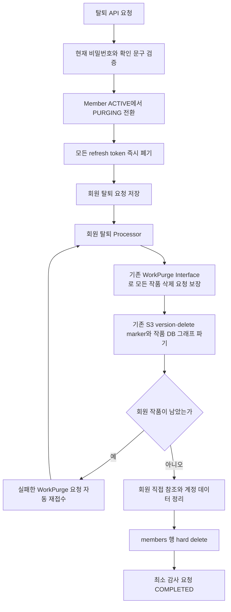

# 회원 즉시 탈퇴와 영구 파기

## 제품 계약

회원 탈퇴는 유예 기간이나 복구 기능을 제공하지 않는 즉시 영구 삭제 요청입니다. 다만 S3 객체 version과 delete marker, 작품 DB 그래프를 한 HTTP 트랜잭션 안에서 모두 지울 수 없으므로 `즉시`의 범위를 다음처럼 나눕니다.

- 요청 커밋 즉시 회원을 `PURGING`으로 전환하고 모든 refresh token을 폐기합니다.
- 이후 요청의 JWT가 유효해도 DB의 회원 상태가 `ACTIVE`가 아니므로 인증을 거절합니다.
- 실제 작품·S3·회원 행은 내구성 있는 요청을 따라 비동기로 파기합니다.
- 모든 작품 파기가 끝나기 전에는 회원 행을 삭제하지 않습니다.
- 최종 상태를 `DELETED`로 저장하지 않고 회원 행 자체를 hard delete합니다. 따라서 완료 뒤 같은 이메일과 휴대폰 번호로 다시 가입할 수 있습니다.

`MemberStatus.DELETED`는 기존 데이터 호환을 위해 enum에 남아 있지만 이 탈퇴 흐름에서는 사용하지 않습니다.

## API

```http
DELETE /api/v1/members/me
Authorization: Bearer <access-token>
Content-Type: application/json

{
  "currentPassword": "password123",
  "confirmation": "회원 탈퇴"
}
```

- `currentPassword`는 현재 비밀번호와 일치해야 합니다.
- `confirmation`은 공백을 포함해 정확히 `회원 탈퇴`여야 합니다.
- 접수 성공은 `202 Accepted`이며 refresh token 삭제 쿠키를 함께 반환합니다.
- 같은 시점에 들어온 중복 요청은 회원 row 잠금과 회원별 unique 요청으로 같은 `requestId`를 반환합니다.

```json
{
  "success": true,
  "message": "회원 탈퇴 요청이 접수되었습니다.",
  "data": {
    "requestId": "2dc78f64-44ec-4f18-b391-363d03700adc",
    "status": "REQUESTED",
    "requestedAt": "2026-08-24T16:30:00"
  },
  "error": null,
  "timestamp": "2026-08-24T16:30:00"
}
```

탈퇴 접수 뒤에는 인증이 차단되므로 사용자용 상태 조회·수동 재시도 API를 제공하지 않습니다. 운영자는 최소 감사 row와 로그로 진행 상태를 확인합니다.

## 처리 흐름



### 기존 작품 삭제 기능 재사용

회원 탈퇴는 별도의 S3 삭제 구현을 만들지 않습니다. `MemberWorkPurgeCoordinator` Interface가 다음 세부사항을 기존 WorkPurge Module 안에 감춥니다.

1. 회원의 남은 작품마다 기존 `WorkPurgeRequest`가 존재하는지 확인합니다.
2. 요청이 없으면 기존 작품 삭제와 동일하게 작품을 `PURGING`으로 바꾸고 활성 분석 작업·lease·AI token 예약을 정리합니다.
3. 기존 `WorkPurgeProcessor`가 `works/{workId}/`, `upload-batches/{batchId}/` 아래의 현재 객체, 과거 version, delete marker를 파기합니다.
4. S3 파기가 완전 성공한 경우에만 기존 `WorkPurgeDataRepository`가 작품 DB 그래프를 자식부터 삭제합니다.
5. 탈퇴 중 `FAILED` 또는 `PARTIAL_FAILED`가 된 작품 요청은 사용자 호출 없이 다시 `REQUESTED`로 전환합니다.

이미 사용자가 작품 삭제를 요청한 상태라면 기존 요청을 그대로 이어서 사용합니다.

## 상태와 재시도

회원 상태는 `ACTIVE → PURGING → 회원 행 삭제`로 전이합니다. `PURGING`은 사용자에게 복구 가능한 탈퇴 대기 상태가 아니라, 추가 데이터 생성을 막으면서 물리 파기를 마칠 때까지 유지하는 기술적 잠금 상태입니다.

`member_withdrawal_requests`는 `REQUESTED → PROCESSING → COMPLETED`로 전이합니다. 작품 파기를 기다리는 동안 `PROCESSING`을 유지하고 `next_attempt_at` 이후 다시 확인합니다. 조정 트랜잭션이 실패하면 내부 예외 문구 대신 `MEMBER_WITHDRAWAL_PROCESSING_FAILED`만 기록하고 자동 재시도합니다.

여러 Backend 인스턴스가 같은 요청을 선택해도 요청 row와 회원 row의 비관적 잠금으로 한 트랜잭션만 상태를 변경합니다. 매 처리 뒤 `next_attempt_at`을 앞으로 옮겨 오래 걸리는 한 회원이 배치의 나머지 회원을 계속 가로막지 않게 합니다.

## 최종 DB 정리와 감사 정보

작품 수가 0이 된 뒤 다음 순서로 회원 직접 참조를 제거합니다.

1. 다른 데이터의 `reviewed_by` 회원 참조를 `NULL`로 익명화합니다.
2. refresh token, AI token 사용·지급·계정, 가입 시 법률 문서 확인 기록을 삭제합니다.
3. `members` 행을 hard delete합니다.

작품과 회원 탈퇴의 완료 감사 row에는 원래의 숫자 회원 ID가 남지만 회원 FK는 두지 않습니다. 이메일, 휴대폰 번호, 비밀번호 hash, 표시 이름, 원고, S3 key는 포함하지 않습니다. 완료 시점부터 기본 365일 뒤 정리하며 이 기간은 출시 전 법무 검토 대상입니다.

## 운영 설정

| 환경변수 | 기본값 | 의미 |
| --- | --- | --- |
| `MEMBER_WITHDRAWAL_SCHEDULING_ENABLED` | `true` | 탈퇴 조정 Scheduler 활성화 |
| `MEMBER_WITHDRAWAL_FIXED_DELAY_MS` | `10000` | 처리 대상 조회 간격 |
| `MEMBER_WITHDRAWAL_RETRY_DELAY` | `10s` | 작품 대기·실패 뒤 다음 확인 간격 |
| `MEMBER_WITHDRAWAL_BATCH_SIZE` | `10` | 한 실행에서 확인할 회원 수 |
| `MEMBER_WITHDRAWAL_AUDIT_RETENTION` | `365d` | 완료 감사 row 보존 기간 |
| `MEMBER_WITHDRAWAL_CLEANUP_CRON` | `0 30 3 * * *` | 만료 감사 row 정리 시각 |

test profile에서는 Scheduler를 끄고 Processor를 테스트에서 명시적으로 호출합니다. 작품 파기 실행 간격과 Worker drain, S3 실패 처리는 기존 `WORK_PURGE_*` 설정을 그대로 따릅니다.

## 운영 확인

1. 탈퇴 API 응답이 `202`이고 refresh token 삭제 쿠키가 포함됐는지 확인합니다.
2. 같은 access token으로 보호 API를 다시 호출했을 때 `401`인지 확인합니다.
3. `member_withdrawal_requests`가 `PROCESSING`, 각 `work_purge_requests`가 최종 `COMPLETED`로 전이하는지 확인합니다.
4. 모든 작품 prefix에서 현재 객체, 과거 version, delete marker가 0건인지 기존 작품 삭제 절차로 확인합니다.
5. 작품·회원 직접 참조 데이터와 `members` 행이 없고 최소 감사 row만 남았는지 확인합니다.
6. 같은 이메일과 휴대폰 번호로 새 회원을 만들 수 있는지 확인합니다.
