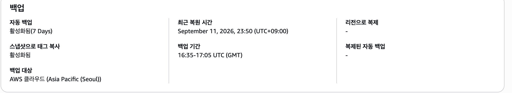
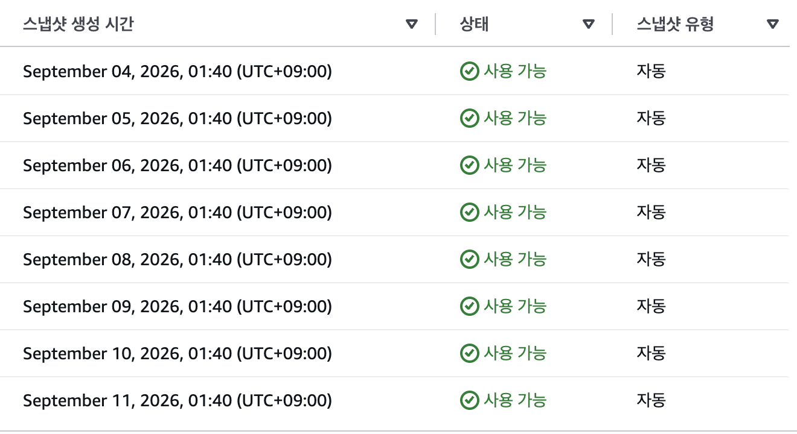

# RDS 백업·삭제 보호 정책과 점검 결과

관련: [#172 / T2](https://github.com/catchhole-soma/catchhole-backend-java/issues/172) · [Epic #119](https://github.com/catchhole-soma/catchhole-backend-java/issues/119) · [기존 운영 현황](operations-status-2026-09-10.md)

서울 리전 운영 RDS의 백업·삭제 보호를 점검한 기록이다. 기존 설정은 유지하며, 실제 운영 DB 삭제·복원은 수행하지 않았다.

## 1. 보호 목표

| 항목 | 기준 | 근거·확인 상태 |
| --- | --- | --- |
| RPO | **15분 이내** | 사용자 수정·추가·확정 정보는 S3 원문에서 재생성할 수 없어 백업으로 보호한다. 최근 커밋 데이터의 손실 허용 시간을 기준으로 한다. |
| RTO | **2시간 이내** | 기존 PR의 목표 유지. 장애 발생부터 DB 복원·API/Worker 연결 전환·정상 동작 확인까지이며 미실측이다. |
| 자동 백업 보존 | **7일 유지** | 최근 일주일 내 복구 시점 확보. 현재 설정과 일치한다. |
| 삭제 보호 | **활성 유지** | 인스턴스 삭제 방지. SQL 오삭제와 백업 삭제를 막는 기능은 아니다. |

2026-09-11 기존 PR에 기록된 목표를 유지한다. RTO 12시간 변경안은 리뷰 코멘트에서 별도 논의하며 아직 반영하지 않는다. 기존 2시간 계획의 구간 예산은 감지·대응 15분, DB 복원 60분, 전환·검증 30분, 여유 15분이며 실제 소요 시간은 #175에서 확인한다.

RPO 점검은 **확인 시각 − LatestRestorableTime ≤ 15분**으로 한다. 값이 없거나 갱신이 멈추면 정상으로 판단하지 않는다. 단일 관측은 지속적인 RPO 충족·복구 성공의 증거가 아니다. [AWS 시점 복구 안내](https://docs.aws.amazon.com/AmazonRDS/latest/UserGuide/USER_PIT.html)

목표는 서울 리전의 백업과 API·Worker를 사용할 수 있는 DB 장애 기준이다. 리전 전체 장애와 S3·Redis 상태 복원은 포함하지 않는다. 알림·담당자 응답 체계는 #174, 격리 복원 훈련은 #175에서 검증한다. 격리 복원만으로 운영 전환을 포함한 전체 RTO를 입증하지 않는다.

## 2. 확인 결과와 증거

**2026-09-11 23:22–23:23 KST**, 기존 PR 작성자가 AWS 콘솔에서 읽기 전용으로 확인한 기록이다. 당시 CLI는 SSO 세션 만료로 사용하지 않았다.

| 확인 항목 | 관측값 | 판단 |
| --- | --- | --- |
| 운영 DB 상태 | `available`, PostgreSQL 16.14, `db.t4g.small`, Single-AZ, gp3 30GiB | 조회 시점 사용 가능. 복원 소요 시간의 증거는 아님 |
| 자동 백업 | 상태 `active`, 보존 기간 **7일** | 선택한 보존 기준과 일치 |
| 백업 시간대 | **16:35–17:05 UTC / 01:35–02:05 KST** | 유지 |
| 가장 빠른 복원 가능 시점 | **2026-09-04 23:20 KST** | 콘솔 분 단위 표시 |
| 최근 복원 가능 시점 | **2026-09-11 23:20 KST** | 23:22 KST 조회 시 표시상 약 2분 차이, 15분 기준 이내 |
| 시스템 스냅샷 | **8개**, 모두 `available`·완료 | 9월 4일~11일 각각 01:40경 생성된 자동 백업 |
| 최신 자동 스냅샷 | **2026-09-11 01:40:05 KST 생성** | 상세 이벤트에 01:40 생성 시작·01:43 생성 완료 표시 |
| 삭제 보호 | **활성** | DB → 구성의 `삭제 방지 활성화됨` 확인. 실제 삭제 시험 없음 |
| 암호화 | **활성**, AWS 관리 키 `aws/rds` | 키 식별자·ARN은 공개 기록에서 제외 |

### 추가 확인 화면

2026-09-12 문서 검토에서 사용자 제공 화면을 대조했다. 정확한 캡처 시각은 미확인이다. 백업 화면의 최근 복원 시점은 **2026-09-11 23:50 KST**이며, 기존 23:22 관측과 별개로 기록한다. 캡처 시각이 없어 이 화면의 RPO 충족 여부는 판정하지 않는다.

백업·스냅샷·삭제 보호 증거 보기

백업 7일·백업 창·23:50 복원 시점·태그 복사 활성·서울 리전·리전 간 복제 없음. 확인일: 2026-09-12

9월 4~11일 약 01:40 KST 자동 스냅샷 8개, 모두 사용 가능. 확인일: 2026-09-12.

삭제 방지 활성화. 확인일: 2026-09-12

## 3. 계획 삭제 시 보관 절차

2026-09-12 검토에서 최종 스냅샷 **14일 보관 후 담당자가 검토·수동 삭제**, 삭제 후 자동 백업 **기본 미보관**으로 정했다. 최종 스냅샷에는 RDS 자동 백업처럼 보존 일수를 지정하는 설정이 없으므로, 현재는 자동화가 아닌 운영 절차로 적용한다.

1. 삭제 대상·사유·실행자·검토자와 데이터 보존 요구를 기록하고 팀의 삭제 승인을 받는다. 서비스 이전·종료 및 최종 쓰기 중단을 확인한다.
2. 승인된 삭제 시점에만 삭제 보호를 해제하고 **최종 스냅샷 생성을 필수**로 선택한다. 생성할 수 없는 상태라면 삭제를 중단하고 복구 원본을 확인한다.
3. 삭제 요청 화면에서 **자동 백업 보관 옵션을 선택하지 않는다.** 평소 운영 DB의 자동 백업 7일 설정을 끄거나 변경하는 것은 아니다. 데이터 손상 의심 등 최종 스냅샷 이전의 PITR이 필요하면 삭제 전에 예외 보관을 검토한다. 미보관 시 해당 자동 백업을 이용한 과거 시점 복구 경로는 사라진다.
4. 최종 스냅샷의 `available` 상태를 확인하고 이름·생성 시각·사유·보관 책임자·예정 삭제일을 기록한다. 예외로 보관한 자동 백업은 복원 가능 범위·만료도 확인한다.
5. 보관 책임자는 **생성 후 14일째** 복구 필요성을 검토하고, 필요가 없으면 **RDS → 스냅샷 → 수동 → 대상 스냅샷 → 삭제**에서 직접 삭제한 뒤 결과를 기록한다. 연장 시 사유·다음 검토일을 남긴다. 삭제 작업을 시작할 때 책임자와 검토일을 지정하며, 자동 삭제 작업은 구성하지 않았다.

최종 스냅샷은 자동 백업 7일 보존과 별개이며 보관 비용이 발생할 수 있다. [AWS 삭제·백업 보관 안내](https://docs.aws.amazon.com/AmazonRDS/latest/UserGuide/USER_DeleteInstance.html)

## 4. 확인 경로와 접근 권한

[서울 리전 RDS 콘솔](https://ap-northeast-2.console.aws.amazon.com/rds/home?region=ap-northeast-2)에서 운영 계정과 대상 DB를 확인한다.

| 목적 | 콘솔 경로 | 대표 권한 |
| --- | --- | --- |
| 백업·복원 가능 시점 | 자동 백업 → 현재 리전 → 운영 DB | `rds:DescribeDBInstanceAutomatedBackups`, `rds:DescribeDBInstances` |
| 자동·수동 스냅샷 | 스냅샷 → 시스템 / 수동 | `rds:DescribeDBSnapshots` |
| 삭제 보호·백업 설정 | 데이터베이스 → 운영 DB → 구성 / 유지 관리 및 백업 | `rds:DescribeDBInstances` |
| 시점 복원(#175) | 자동 백업 → 운영 DB → 작업 → 특정 시점으로 복원 | `rds:RestoreDBInstanceToPointInTime` |
| 삭제 후 보관한 자동 백업 | 자동 백업 → 보유 | `rds:DescribeDBInstanceAutomatedBackups` |

**현재 로그인한 운영 SSO 역할로 백업 조회·T4 알림 설정·T5 복원 작업을 진행할 수 있다.** 2026-09-12 제공 화면에서 `AdministratorAccess` 연결을 확인했으며, 별도 조직 정책 등 제한이 없다는 전제다. 콘솔 조회는 성공했고 실제 복원은 T5에서 검증한다. 역할·계정·사용자 식별 화면은 공개 자료에 포함하지 않는다. [관리자 정책의 허용 범위](https://docs.aws.amazon.com/aws-managed-policy/latest/reference/AdministratorAccess.html)

다른 팀원의 접근은 각자 확인하며, #174 자동 수집에는 별도 실행 역할과 알림 권한이 필요하다. #175는 복원 방식에 따라 `rds:RestoreDBInstanceFromDBSnapshot`, 네트워크·태그·KMS·훈련 자원 정리 권한과 SCP 등의 제한을 추가 확인한다. 위 표는 전체 IAM 정책이 아니다. [RDS 권한 목록](https://docs.aws.amazon.com/service-authorization/latest/reference/list_rds.html)

## 5. 변경·영향과 남은 확인

| 항목 | 변경 전 → 후 | 적용 시점·영향·추가 비용 |
| --- | --- | --- |
| 자동 백업 보존 | 7일 → 7일 | 설정 변경 없음 |
| 백업 창 | UTC 16:35–17:05 → 유지 | 설정 변경 없음 |
| 삭제 보호 | 활성 → 활성 | 설정 변경 없음 |
| 삭제 후 보관 절차 | 자동 백업 동시 보관·최종 스냅샷 기간 미정 → 3절 기준 | 문서만 수정. 실제 삭제·스냅샷 생성 없음 |

보존·삭제 보호 설정이 기준과 일치해 재설정하지 않았다. AWS 설정 적용 시점은 **해당 없음**, 이번 점검으로 발생한 운영 영향·추가 비용은 **없음**이다. 향후 스냅샷 보관과 #175 임시 DB 비용은 해당 작업에서 확인한다. 문서 머지는 기존 Workflow에 따라 이미지 발행·API 배포를 실행할 수 있다.

- **리뷰에서 논의:** RTO 2시간 유지 또는 12시간 변경. 합의 결과를 문서·#172에 기록한다.
- **#174:** 백업 지연 수집·알림, 담당자·야간 수신·미응답 대응과 실행 역할 확인.
- **#175:** 격리 복원 권한·성공·소요 시간 확인. 운영 전환 등 미측정 구간은 구분해 기록.
- **#172 마무리:** 문서 검토 후 결과·PR 링크와 Epic #119 상태 반영. 미확인 항목은 완료로 표시하지 않는다.
