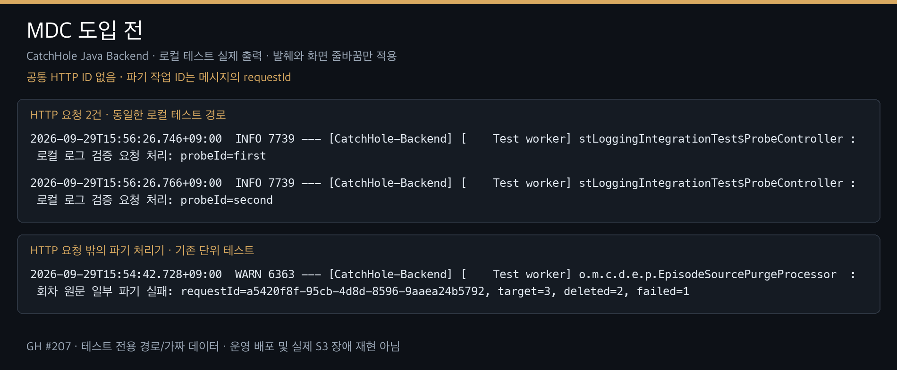
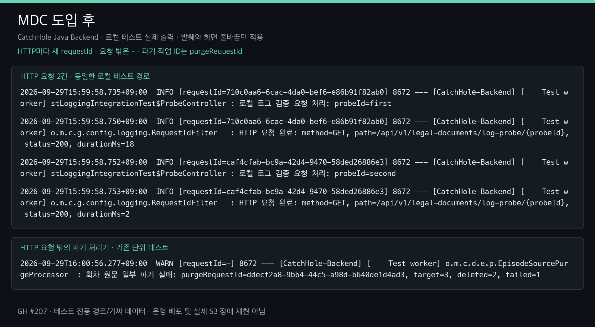

# HTTP 요청 로그 조회

HTTP 요청마다 서버가 UUID를 생성해 SLF4J MDC의 `requestId`와 응답 헤더 `X-Request-ID`에 넣는다. 클라이언트가 보낸 같은 이름의 헤더는 사용하지 않는다. 응답 본문의 기존 `requestId`는 삭제·탈퇴 작업 ID이며 HTTP 요청 ID와 다르다.

## 적용 범위

- `RequestLoggingConfig`에서 공통 Servlet 필터를 한 번 등록한다. Spring Boot의 `SecurityFilterProperties.order - 1`로 일반 JWT·Worker 내부 API 보안 체인보다 먼저 실행한다.
- 별도 관리 포트에도 동일 설정을 적용한다. API context의 component scan과 `META-INF/spring/org.springframework.boot.actuate.autoconfigure.web.ManagementContextConfiguration.imports`가 각 서버에 필터를 한 번씩 등록한다. 관리 서버는 별도 context라 API의 Servlet 필터 등록을 자동 상속하지 않는다.
- 동기 Servlet REQUEST와 ERROR dispatch를 지원한다. request attribute에 보관한 UUID를 ERROR 처리에서도 재사용하고 완료 로그는 원래 REQUEST에서 한 번 남긴다. 필터 밖으로 전파된 예외는 완료 상태를 500으로 기록한다.
- `finally`에서 MDC의 `requestId`만 제거한다. 다른 MDC 키는 지우지 않는다. Spring Boot 기본 콘솔 패턴의 level에 `[requestId=...]`를 추가하며 HTTP 문맥 밖에서는 `-`로 표시한다.
- 성공·400·401·403·애플리케이션 500 응답에 헤더를 반환한다. 허용된 CORS origin에는 `X-Request-ID`를 노출한다. Servlet 필터에 진입하기 전 프록시·컨테이너에서 거절한 요청은 적용 대상이 아니다.
- 완료 로그는 method, path, status, durationMs를 기록한다. MVC에 도달한 요청은 매핑 템플릿을 쓰고, 인증 거절처럼 템플릿이 없는 요청은 쿼리를 제외한 URI를 쓴다. 요청/응답 본문, 인증 헤더, 쿠키, 쿼리, 원고는 공통 로그에 추가하지 않는다.
- 정상 `/healthz`, `/actuator/health`, `/actuator/prometheus`는 완료 로그를 생략한다. 400 이상 실패는 기록하며 세 경로 모두 응답 헤더는 유지한다. 나머지 내부 API도 완료 로그를 남긴다.
- 예상하지 못한 예외는 `GlobalExceptionHandler`에서 원인과 stack trace를 ERROR로 남긴다. 기존 공통 오류 응답은 유지하며 일반 4xx를 일괄 ERROR로 기록하지 않는다.

## HTTP ID와 작업 ID

삭제·파기 로그의 업무 ID는 `purgeRequestId`, 회원 탈퇴 조정은 `withdrawalRequestId`로 표기한다. DB 컬럼, DTO 필드, API URL은 바꾸지 않는다.

- HTTP 안에서 커밋 직후 동기 파기를 수행하면 HTTP requestId와 purgeRequestId가 함께 보인다.
- HTTP가 종료된 뒤 스케줄러가 재시도하면 requestId는 `-`, purgeRequestId는 기존 작업 ID다.
- 사용자가 API로 같은 작업을 재시도하면 새 HTTP requestId와 기존 작업 ID가 함께 보인다.

MDC는 스레드 문맥이다. 현재 일반 API는 동기 처리하며, 별도 스레드·Python Worker·분산 추적·Servlet 비동기 완료는 지원하지 않는다. 비동기 MVC를 추가할 때는 AsyncListener의 완료 시점과 별도 스레드 전파/정리를 함께 설계한다. 프레임워크 내부 별도 스레드 로그에도 HTTP ID가 없을 수 있다.

## 배포 후 운영 확인

이번 구현 검증은 로컬 test profile에서 수행했다. 운영 배포와 아래 운영 조회 검증은 아직 수행하지 않았다. 로그 저장 위치와 journald 보관 정책은 변경하지 않는다.

응답 헤더 확인:

```bash
curl -sS -D - -o /dev/null https://<API_HOST>/actuator/health
```

받은 X-Request-ID를 아래 값에 넣는다. 정상 health 요청은 완료 로그를 생략하므로, 로그 연결 검증에는 기존 읽기 전용 API를 호출하고 그 응답 ID를 사용한다.

```bash
cd /opt/catchhole
sudo -u ubuntu docker compose --env-file api.env -f compose.api.prod.yml logs --since=10m backend | rg -F 'requestId=<X-Request-ID>'
sudo journalctl CONTAINER_NAME=catchhole-backend-1 --since '10 minutes ago' --no-pager -o cat | rg -F 'requestId=<X-Request-ID>'
```

삭제 작업의 여러 시도를 찾을 때는 `purgeRequestId=<작업 UUID>`로 검색한다. 서버에 rg가 없으면 `grep -F`를 쓴다.

## 로컬 검증과 비교 자료

```bash
./gradlew test --tests '*RequestLoggingIntegrationTest' --tests '*RequestIdFilterTest'
./gradlew test bootJar
```

비교 자료는 `docs/logging/`에 저장한다. 테스트 전용 경로와 가짜 입력을 사용한 실제 출력의 발췌이며 운영 장애 재현이나 운영 로그가 아니다. 파기 경고는 기존 처리기의 단위 테스트 출력으로, S3 실패 원인·재시도 정책 변경을 의미하지 않는다.

2026-09-29 비교 이미지 생성 시 검증 결과: 변경 전 1,246개(실패 0, 건너뜀 66), 변경 후 1,257개(실패 0, 건너뜀 66). `./gradlew test bootJar --offline --console=plain` 성공. 신규 11개는 필터 수명 7개와 실제 보안 체인 MockMvc 4개다. 기본 로그 패턴이 적용된 test profile에서 캡처했으며 테스트 전용으로 Redis health만 비활성화했다.

HTTP 발췌는 `RequestLoggingIntegrationTest.correlatesResponseAndLogs`, 파기 발췌는 `EpisodeSourcePurgeProcessorTest.purgeKeepsRequestForRetryAndStopsBeforeDatabaseCleanupWhenStorageIsIncomplete`의 실제 출력이다. 변경 전 HTTP 발췌는 필터 추가 전 헤더 누락을 확인한 실패 테스트 출력이고, 변경 후는 전체 테스트 성공 실행의 출력이다. 기준 코드는 `1d9ce179`다. 이미지에서는 줄바꿈만 적용했고 타임스탬프·UUID·로그 본문은 바꾸지 않았다. 두 실행의 파기 UUID는 독립적으로 생성된 가짜 테스트 값이다.

원문: [도입 전](logging/mdc-before.txt), [도입 후](logging/mdc-after.txt).





최신 main `203ad95a` 반영 후 PR 최종 검증: 1,263개 중 1,197개 통과, 실패 0, 건너뜀 66. 신규 검증은 필터 수명 9개, MockMvc 4개, 기존 운영 메트릭 테스트에 추가한 실제 prod HTTP 검증 1개다. 별도 API·관리 서버 모두 X-Request-ID를 반환하고 운영 로그 패턴·503 기록 및 정상 /healthz 완료 로그 생략을 확인했다. 운영 서버에 배포하거나 접속한 검증은 아니다.

로컬 폴더의 중복 빌드 파일 영향을 피하기 위해 buildDirectory와 Gradle 프로젝트 캐시만 `/tmp`로 분리하여 `test bootJar`를 실행했다. 실행한 명령은 `./gradlew --init-script /tmp/gh207-build-dir.gradle --project-cache-dir /tmp/gh207-gradle-cache test bootJar --offline --console=plain`이다. init script는 `layout.buildDirectory`만 임시 경로로 변경하며, 코드·테스트 내용은 동일하다. CI에서는 기존 `./gradlew test bootJar`를 사용한다.
