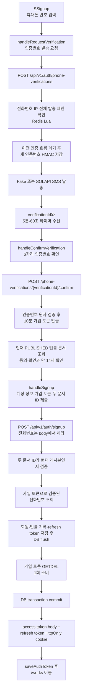
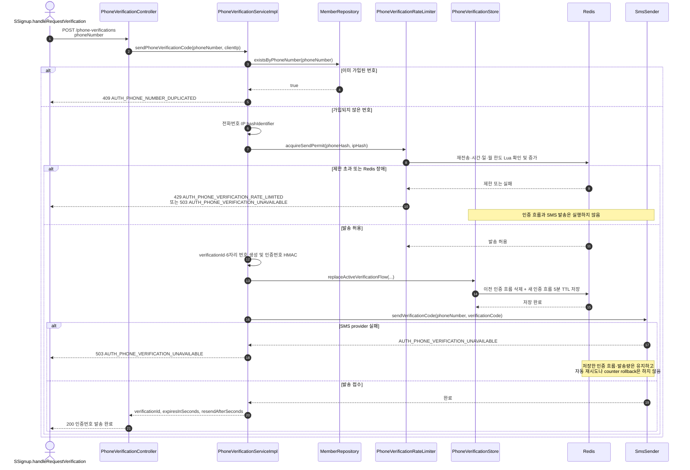
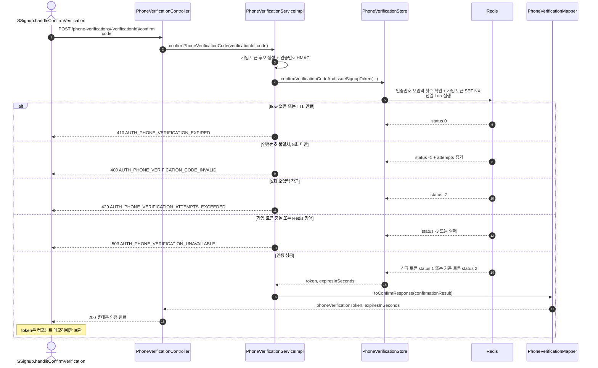
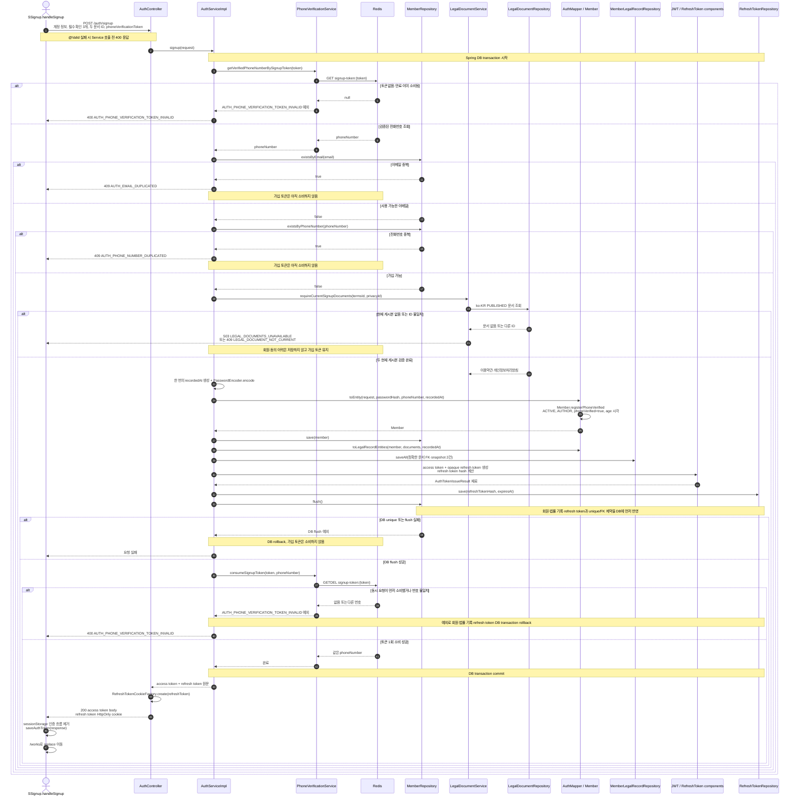

# Signup Workflow

휴대폰 인증번호 발송부터 인증 완료, 회원·refresh token 저장과 자동 로그인 응답까지 실제 코드 호출 순서를 정리합니다.

API 요청·응답과 오류 코드는 [Auth](auth.md)를, 사용자가 보는 화면 전환과 상태는 Frontend의 `docs/screen-flow.md`를 기준으로 확인합니다. 이 문서는 Controller, Service, Redis, DB 사이의 실행 순서와 트랜잭션 경계를 따라가는 용도입니다.

## 코드 진입점

| 단계 | 코드 | 주요 메서드 |
| --- | --- | --- |
| Frontend 폼 | `CatchHole-Front/src/app/components/catchhole/SSignup.tsx` | `handleRequestVerification`, `handleConfirmVerification`, `handleSignup` |
| 인증 API 진입 | [`PhoneVerificationController`](../src/main/java/org/monitoring/catchholebackend/domain/auth/controller/PhoneVerificationController.java) | `requestPhoneVerification`, `confirmPhoneVerification` |
| 인증 유스케이스 | [`PhoneVerificationServiceImpl`](../src/main/java/org/monitoring/catchholebackend/domain/auth/service/PhoneVerificationServiceImpl.java) | `sendPhoneVerificationCode`, `confirmPhoneVerificationCode`, `getVerifiedPhoneNumberBySignupToken`, `consumeSignupToken` |
| 인증 값 생성·HMAC | [`PhoneVerificationHasher`](../src/main/java/org/monitoring/catchholebackend/domain/auth/phone/PhoneVerificationHasher.java), [`PhoneVerificationCodeGenerator`](../src/main/java/org/monitoring/catchholebackend/domain/auth/phone/PhoneVerificationCodeGenerator.java), [`PhoneVerificationTokenGenerator`](../src/main/java/org/monitoring/catchholebackend/domain/auth/phone/PhoneVerificationTokenGenerator.java) | `hashIdentifier`, `hashVerificationCode`, `generate` |
| 발송 제한 | [`PhoneVerificationRateLimiter`](../src/main/java/org/monitoring/catchholebackend/domain/auth/phone/PhoneVerificationRateLimiter.java) | `acquireSendPermit` |
| Redis 인증 상태 | [`PhoneVerificationStore`](../src/main/java/org/monitoring/catchholebackend/domain/auth/phone/PhoneVerificationStore.java) | `replaceActiveVerificationFlow`, `confirmVerificationCodeAndIssueSignupToken`, `findPhoneNumberBySignupToken`, `consumeSignupToken` |
| SMS 발송 | [`SmsSender`](../src/main/java/org/monitoring/catchholebackend/domain/auth/sms/SmsSender.java) | `sendVerificationCode` |
| 회원가입 API 진입 | [`AuthController`](../src/main/java/org/monitoring/catchholebackend/domain/auth/controller/AuthController.java) | `signup`, `tokenResponse` |
| 회원가입 유스케이스 | [`AuthServiceImpl`](../src/main/java/org/monitoring/catchholebackend/domain/auth/service/AuthServiceImpl.java) | `signup`, `validateSignupUniqueness`, `issueTokens` |
| 현재 법률 문서 검증 | [`LegalDocumentServiceImpl`](../src/main/java/org/monitoring/catchholebackend/domain/legal/service/LegalDocumentServiceImpl.java) | `getCurrentDocuments`, `requireCurrentSignupDocuments` |
| 회원 조립 | [`AuthMapper`](../src/main/java/org/monitoring/catchholebackend/domain/auth/mapper/AuthMapper.java), [`Member`](../src/main/java/org/monitoring/catchholebackend/domain/member/entity/Member.java) | `toEntity`, `registerPhoneVerified` |
| 로그인 토큰 발급 | [`JwtTokenProvider`](../src/main/java/org/monitoring/catchholebackend/domain/auth/token/JwtTokenProvider.java), [`RefreshTokenGenerator`](../src/main/java/org/monitoring/catchholebackend/domain/auth/token/RefreshTokenGenerator.java), [`TokenHashProvider`](../src/main/java/org/monitoring/catchholebackend/domain/auth/token/TokenHashProvider.java), [`RefreshTokenCookieFactory`](../src/main/java/org/monitoring/catchholebackend/domain/auth/token/RefreshTokenCookieFactory.java) | `generateAccessToken`, `generate`, `hash`, `create` |

## 전체 흐름

## 인증번호 발송 코드 흐름

## 인증번호 확인 코드 흐름

## 최종 회원가입 트랜잭션 흐름

## 상세 처리 기준

1. 회원가입 요청에는 전화번호가 없습니다. `AuthServiceImpl.signup()`이 가입 토큰으로 Redis에서 조회한 번호만 `Member.phoneNumber`에 사용하므로 클라이언트가 인증하지 않은 번호를 제출할 수 없습니다.
2. 가입 토큰은 중복 검증 전에 조회하지만 DB 저장 전에는 삭제하지 않습니다. 회원과 refresh token을 flush한 다음 `GETDEL`이 성공해야 DB transaction을 commit할 수 있습니다.
3. Redis는 JPA transaction에 참여하지 않습니다. 현재 구현은 DB unique 제약을 먼저 flush하고 Redis 토큰을 소비한 뒤 추가 DB 변경 없이 commit해 두 저장소 사이의 실패 가능 구간을 줄이지만, 분산 transaction처럼 완전히 원자적인 commit을 제공하지는 않습니다.
4. 같은 가입 토큰의 동시 요청은 Redis `GETDEL` 성공을 하나로 제한하고, 실패한 요청은 `AppException`으로 DB transaction을 rollback 합니다. 이메일·전화번호 unique 제약은 동시에 다른 토큰을 사용한 가입까지 막는 최종 방어선입니다.
5. 인증번호 확인을 동시에 호출하면 Redis Lua가 최초 가입 토큰 하나만 만들고 이후 요청에는 같은 토큰을 반환합니다.
6. Redis rate limit과 인증 흐름 저장이 모두 성공한 뒤 SMS를 한 번 호출합니다. SMS timeout이나 provider 오류에서는 중복 문자와 이중 비용을 피하기 위해 자동 재시도하지 않습니다.
7. 가입 성공 응답 자체가 로그인 결과입니다. access token은 응답 body, refresh token은 원문을 DB에 남기지 않고 hash만 저장한 뒤 `HttpOnly` 쿠키로 전달합니다.
8. Front는 현재 게시 문서 묶음에서 확인한 두 ID를 보내고 Backend는 버전 문자열을 신뢰하지 않습니다. 두 ID 모두 가입 시점의 현재 `PUBLISHED` 문서여야 하며 교체된 문서는 409로 다시 확인받습니다.
9. 이용약관 동의, 개인정보처리방침 확인과 만 14세 이상 확인은 모두 필수입니다. 두 법률 기록과 `members.age_requirement_confirmed_at`은 같은 `recordedAt`을 사용해 한 가입 사건으로 추적합니다.
