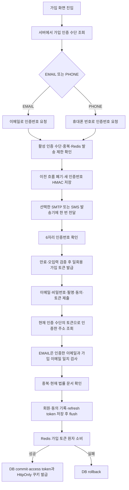

# Signup Workflow

가입은 서버가 지정한 인증 수단을 확인한 뒤 발송 → 코드 확인 → 일회용 가입 토큰 제출 → 회원 생성과 자동 로그인 순서로 진행한다. 기본값은 `SIGNUP_VERIFICATION_METHOD=EMAIL`이다. PHONE 모드의 상세 SMS 구현은 [Phone Signup Workflow](phone-signup-workflow.md), 발송 설정·요금은 [이메일 발송](email-delivery.md)을 참고한다.

## 1. 인증 수단과 발송

`GET /api/v1/auth/signup-policy`는 `SignupPolicyResponse.verificationMethod`를 반환하고 응답 캐시를 금지한다. 프론트는 정책 조회 실패 시 발송·가입을 막고 재시도를 제공한다. 각 인증 서비스는 `SignupVerificationPolicy.requireMethod()`를 먼저 호출하여 비활성 채널 요청을 409로 거절한다.

EMAIL 요청은 `POST /api/v1/auth/email-verifications`의 `email` 필드다. `EmailAddressNormalizer`는 저장·비교용 주소를 trim하고 대소문자는 보존한다. 발송 제한용 식별자는 도메인만 소문자로 바꾸며, 로그인/DB에 저장하는 주소를 임의로 합치지 않는다. `EmailVerificationRateLimiter`는 주소·IP·전체 한도를 Redis Lua로 원자 확인하고 증가한다. 성공하면 `EmailVerificationStore`가 같은 주소의 이전 코드와 가입 토큰을 폐기하고, 새 인증 흐름을 저장한 뒤 `EmailSender`를 호출한다.

- OTP: SecureRandom 6자리, HMAC-SHA256만 Redis에 저장, 5분 유효.
- 재전송: 같은 주소 최소 60초 뒤. 새 코드를 발급하면 이전 코드·토큰은 즉시 무효.
- 주소: 시간 5회·KST 일 10회. IP: 시간 10회·KST 일 20회. 전체: KST 일 100회·월 3,000회.
- Redis 장애면 발송하지 않음. SMTP 실패·timeout에서도 발송량을 되돌리거나 자동 재시도하지 않음.
- 응답: `verificationId`, `expiresInSeconds=300`, `resendAfterSeconds=60`. 429는 `Retry-After` 제공.

## 2. 코드 확인

`POST /api/v1/auth/email-verifications/{verificationId}/confirm`에 `code`를 보낸다. Redis Lua가 원래 코드 만료시각, 코드 HMAC, 오입력 횟수를 확인한다. 오입력 5회면 현재 흐름은 잠긴다. 성공하면 `emailVerificationToken`과 `expiresInSeconds`를 반환한다.

동시 확인도 같은 토큰 하나만 발급한다. 재확인에서도 코드 일치를 검사하고 코드의 최초 5분 만료나 토큰의 최초 10분 만료를 연장하지 않는다. 코드 확인 성공 이후에는 코드가 만료돼도 이미 발급된 가입 토큰의 남은 10분 유효기간 안에 가입할 수 있다. 토큰은 프론트 메모리에만 보관하며 이메일을 바꾸면 진행 상태·토큰과 진행 중 요청의 늦은 응답을 폐기한다.

## 3. 가입 트랜잭션

`AuthServiceImpl.signup()`은 서버 설정으로 인증 수단을 선택한다. EMAIL에는 `emailVerificationToken`, PHONE에는 `phoneVerificationToken`이 필수다. 다른 채널의 토큰은 대체 증거로 인정하지 않는다.

1. 토큰에 연결된 인증 이메일/번호를 조회한다. EMAIL은 가입 요청 이메일과 정확히 일치해야 한다.
2. 이메일 중복과, PHONE인 경우 전화번호 중복을 검사한다. DB unique 제약은 동시 가입의 최종 방어선이며 중복 제약 실패는 409로 변환한다.
3. 현재 게시된 두 법률 문서 ID를 검증하고 같은 서버 시각으로 연령 확인과 동의 기록을 저장한다.
4. EMAIL은 `Member.registerEmailVerified()`로 전화번호 NULL, 전화 인증 false, 이메일 인증 true 회원을 생성한다. PHONE은 기존 생성 경로를 유지한다.
5. 회원·동의 기록·refresh token을 DB에 저장하고 flush한다.
6. EMAIL은 Redis Lua compare-and-delete, PHONE은 기존 GETDEL로 토큰을 한 번 소비한다. 소비 실패는 DB transaction을 rollback한다.
7. 성공하면 access token을 body에, refresh token을 HttpOnly 쿠키에 반환해 자동 로그인한다.

DB와 Redis는 단일 분산 트랜잭션이 아니다. Redis 소비 성공 후 DB commit 자체가 실패하는 희소 장애에서는 토큰이 소비될 수 있으며 사용자는 재인증해야 한다. 이메일·전화번호는 최종 가입 토큰에서 검증한 값만 사용한다.

## 4. 기존 회원과 운영 전환

V42 migration은 전화번호를 선택값으로 만들고 `email_verified`를 추가한다. 기존 회원의 이메일 인증은 false로 시작하지만 기존 로그인·refresh·작품 접근은 계속 허용한다. 회원 탈퇴는 회원 row를 물리 삭제하므로 새 이메일 인증 상태도 함께 제거된다.

운영 배포 전에 SMTP 계정과 별도 해시 secret을 준비한다. 전환 동안에는 새 Backend를 먼저 `PHONE`으로 배포해 새 정책 API를 제공하고, 두 모드를 지원하는 Front를 배포한 다음 Backend를 `EMAIL`로 재기동한다. 열려 있던 가입 창에서 정책 오류가 발생하면 재조회·재인증하도록 안내한다. 기존 로그인 세션에는 인증 수단 전환을 강제하지 않는다.

향후 신규 가입만 PHONE으로 전환할 수 있으며 V42 schema는 유지한다. 기존 이메일 회원에게 전화번호를 추가 요청하는 제품 흐름은 이번 범위 밖이다.
