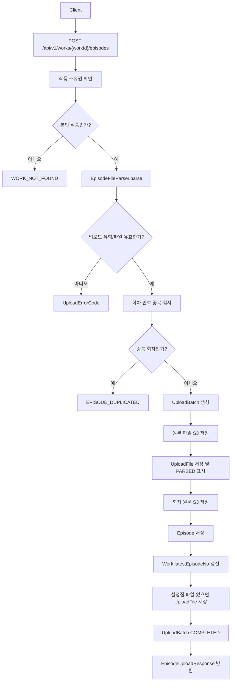
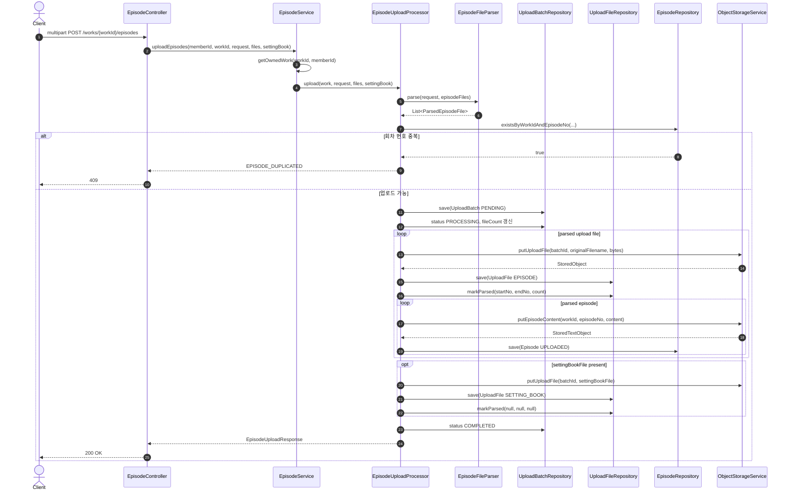
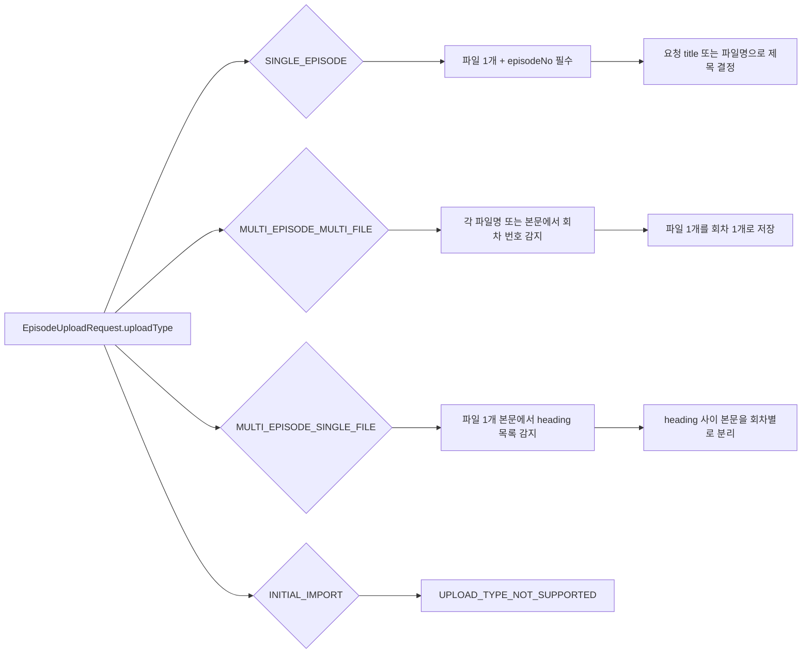
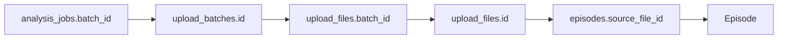

# Upload Episode Workflow

회차 업로드 API가 `UploadBatch`, `UploadFile`, `Episode`를 어떻게 함께 생성하는지 정리합니다.

도메인별 필드 설명은 [Upload](upload.md), [Episode](episode.md)를 기준으로 확인합니다.

## 전체 흐름



## Sequence



## 업로드 유형별 파싱



## 저장 경로

```text
원본 업로드 파일:
upload-batches/{batchId}/{randomUUID}-{originalFilename}

회차 원문:
works/{workId}/episodes/{episodeNo}.txt
```

## 분석 작업과의 연결

분석 작업은 `batchId`를 입력으로 받도록 설계되어 있습니다.

회차 업로드가 끝나면 다음 관계로 분석 대상을 찾을 수 있습니다.


