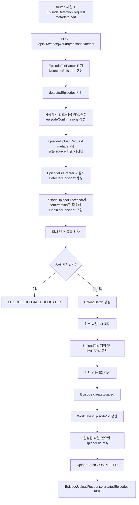
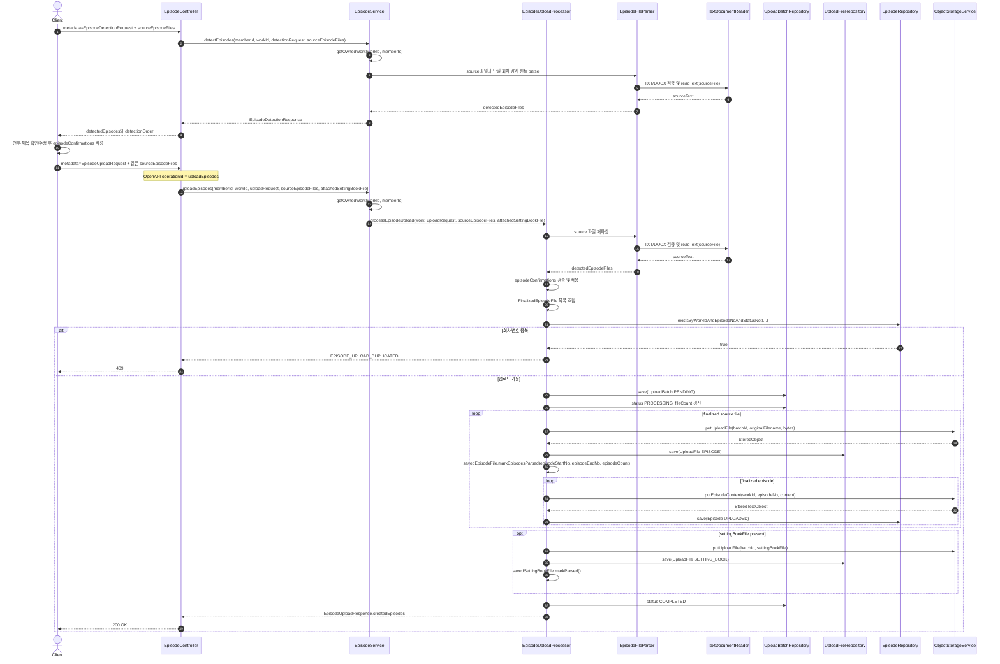
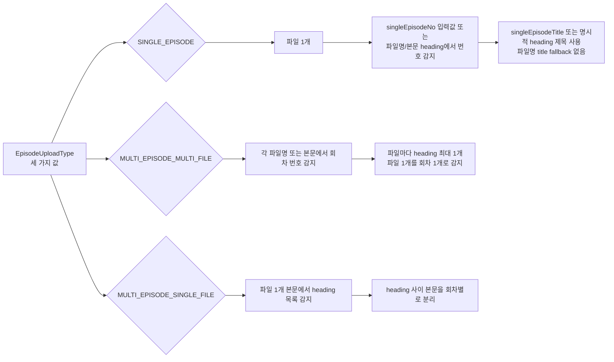
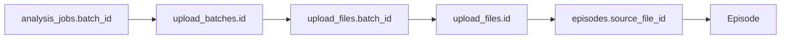

# Upload Episode Workflow

회차 업로드 API가 `UploadBatch`, `UploadFile`, `Episode`를 어떻게 함께 생성하는지 정리합니다.

도메인별 필드 설명은 [Upload](upload.md), [Episode](episode.md)를 기준으로 확인합니다.

## 전체 흐름


```mermaid
flowchart TD
    A["source 파일 + EpisodeDetectionRequest<br/>metadata part"] --> B["POST /api/v1/works/{workId}/episodes/detect"]
    B --> C["EpisodeFileParser 감지<br/>DetectedEpisode* 생성"]
    C --> D["detectedEpisodes 반환"]
    D --> E["사용자가 번호·제목 확인/수정<br/>episodeConfirmations 작성"]
    E --> F["EpisodeUploadRequest metadata와<br/>같은 source 파일 재전송"]
    F --> G["EpisodeFileParser 재감지<br/>DetectedEpisode* 생성"]
    G --> H["EpisodeUploadProcessor가<br/>confirmation을 적용해 FinalizedEpisode* 조립"]
    H --> I["회차 번호 중복 검사"]
    I --> J{"중복 회차인가?"}
    J -- "예" --> K["EPISODE_UPLOAD_DUPLICATED"]
    J -- "아니오" --> L["UploadBatch 생성"]
    L --> M["원본 파일 S3 저장"]
    M --> N["UploadFile 저장 및 PARSED 표시"]
    N --> O["회차 원문 S3 저장"]
    O --> P["Episode created/saved"]
    P --> Q["Work.latestEpisodeNo 갱신"]
    Q --> R["설정집 파일 있으면 UploadFile 저장"]
    R --> S["UploadBatch COMPLETED"]
    S --> T["EpisodeUploadResponse.createdEpisodes 반환"]
```

## Sequence


```mermaid
sequenceDiagram
    autonumber
    actor Client
    participant Controller as EpisodeController
    participant Service as EpisodeService
    participant Processor as EpisodeUploadProcessor
    participant Parser as EpisodeFileParser
    participant Reader as TextDocumentReader
    participant BatchRepo as UploadBatchRepository
    participant FileRepo as UploadFileRepository
    participant EpisodeRepo as EpisodeRepository
    participant Storage as ObjectStorageService

    Client->>Controller: metadata=EpisodeDetectionRequest + sourceEpisodeFiles
    Controller->>Service: detectEpisodes(memberId, workId, detectionRequest, sourceEpisodeFiles)
    Service->>Service: getOwnedWork(workId, memberId)
    Service->>Parser: source 파일과 단일 회차 감지 힌트 parse
    Parser->>Reader: TXT/DOCX 검증 및 readText(sourceFile)
    Reader-->>Parser: sourceText
    Parser-->>Service: detectedEpisodeFiles
    Service-->>Controller: EpisodeDetectionResponse
    Controller-->>Client: detectedEpisodes와 detectionOrder
    Client->>Client: 번호·제목 확인/수정 후 episodeConfirmations 작성
    Client->>Controller: metadata=EpisodeUploadRequest + 같은 sourceEpisodeFiles
    Note over Controller: OpenAPI operationId = uploadEpisodes
    Controller->>Service: uploadEpisodes(memberId, workId, uploadRequest, sourceEpisodeFiles, attachedSettingBookFile)
    Service->>Service: getOwnedWork(workId, memberId)
    Service->>Processor: processEpisodeUpload(work, uploadRequest, sourceEpisodeFiles, attachedSettingBookFile)
    Processor->>Parser: source 파일 재파싱
    Parser->>Reader: TXT/DOCX 검증 및 readText(sourceFile)
    Reader-->>Parser: sourceText
    Parser-->>Processor: detectedEpisodeFiles
    Processor->>Processor: episodeConfirmations 검증 및 적용
    Processor->>Processor: FinalizedEpisodeFile 목록 조립
    Processor->>EpisodeRepo: existsByWorkIdAndEpisodeNoAndStatusNot(...)
    alt 회차 번호 중복
        EpisodeRepo-->>Processor: true
        Processor-->>Controller: EPISODE_UPLOAD_DUPLICATED
        Controller-->>Client: 409
    else 업로드 가능
        Processor->>BatchRepo: save(UploadBatch PENDING)
        Processor->>BatchRepo: status PROCESSING, fileCount 갱신
        loop finalized source file
            Processor->>Storage: putUploadFile(batchId, originalFilename, bytes)
            Storage-->>Processor: StoredObject
            Processor->>FileRepo: save(UploadFile EPISODE)
            Processor->>Processor: savedEpisodeFile.markEpisodesParsed(episodeStartNo, episodeEndNo, episodeCount)
            loop finalized episode
                Processor->>Storage: putEpisodeContent(workId, episodeNo, content)
                Storage-->>Processor: StoredTextObject
                Processor->>EpisodeRepo: save(Episode UPLOADED)
            end
        end
        opt settingBookFile present
            Processor->>Storage: putUploadFile(batchId, settingBookFile)
            Processor->>FileRepo: save(UploadFile SETTING_BOOK)
            Processor->>Processor: savedSettingBookFile.markParsed()
        end
        Processor->>BatchRepo: status COMPLETED
        Processor-->>Controller: EpisodeUploadResponse.createdEpisodes
        Controller-->>Client: 200 OK
    end
```

Parser는 원본 파일과 단일 회차 감지 힌트를 `DetectedEpisode*`로 변환하며 `episodeConfirmations`를 받지 않습니다. 다회차 confirmation의 필수 여부·개수·`detectionOrder`·회차 번호 오름차순 검증과 `DetectedEpisode* + confirmation → FinalizedEpisode*` 조립은 Processor 책임입니다. 따라서 감지 API와 최종 업로드 API가 같은 파일을 다시 파싱하더라도 사용자가 확정한 번호·제목이 parser 결과로 덮어써지지 않습니다.

## 업로드 유형별 파싱


```mermaid
flowchart LR
    A["EpisodeUploadType<br/>세 가지 값"] --> B{"SINGLE_EPISODE"}
    A --> C{"MULTI_EPISODE_MULTI_FILE"}
    A --> D{"MULTI_EPISODE_SINGLE_FILE"}

    B --> B1["파일 1개"]
    B1 --> B2["singleEpisodeNo 입력값 또는<br/>파일명/본문 heading에서 번호 감지"]
    B2 --> B3["singleEpisodeTitle 또는 명시적 heading 제목 사용<br/>파일명 title fallback 없음"]

    C --> C1["각 파일명 또는 본문에서 회차 번호 감지"]
    C1 --> C2["파일마다 heading 최대 1개<br/>파일 1개를 회차 1개로 감지"]

    D --> D1["파일 1개 본문에서 heading 목록 감지"]
    D1 --> D2["heading 사이 본문을 회차별로 분리"]
```

## 저장 경로

```text
원본 업로드 파일:
upload-batches/{batchId}/{randomUUID}-{originalFilename}

회차 원문:
works/{workId}/episodes/{episodeNo}.txt
```

## 분석 작업과의 연결

업로드 저장과 분석 작업 생성은 별도 요청입니다. 회차 업로드 응답의 `batchId`를 사용해 `POST /api/v1/works/{workId}/analysis-jobs`를 호출합니다. 최초 분석은 `episodeId=null`인 배치 전체 작업이며, 파일 변경 뒤 특정 회차만 재분석할 때는 같은 요청에 `episodeId`를 전달합니다.

회차 업로드가 끝나면 다음 관계로 분석 대상을 찾을 수 있습니다.


```mermaid
flowchart LR
    A["analysis_jobs.batch_id"] --> B["upload_batches.id"]
    B --> C["upload_files.batch_id"]
    C --> D["upload_files.id"]
    D --> E["episodes.source_file_id"]
    E --> F["Episode"]
```

배치 전체 활성 작업은 같은 배치의 새 분석을 막습니다. 회차 대상 활성 작업은 동일 회차의 중복 요청만 막으므로, 같은 배치 안의 서로 다른 회차는 각각 재분석할 수 있습니다. Worker의 claim·complete·fail 결과는 작업 대상 회차 상태에도 반영됩니다.

설정집 원본은 회차 업로드에 선택 첨부할 수 있지만 프런트 화면에서는 독립 저장 결과로 취급합니다. 단독 재시도는 `/api/v1/works/{workId}/setting-books`를 사용하며 설정집 저장 성공 여부가 이미 생성된 회차 분석을 취소하지 않습니다.
