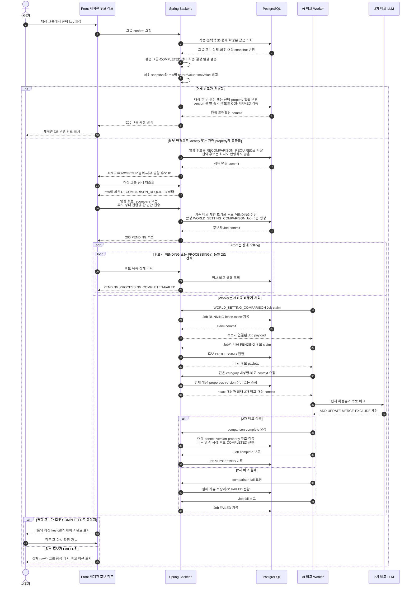

# World Setting Domain

이 문서는 NVM-260 세계관 설정 MVP와 NVM-268의 세계관 property 범위 경로 확장을 포함한 Backend 구현 계약을 정의합니다. 세계관 설정은 작품에서 지속적으로 활용되는 불변에 가까운 설정을 대상으로 하며, 캐릭터 타임라인과 캐릭터 설정 후보는 기존 `domain/character` 계약을 그대로 사용합니다. `scopeName`은 세계관에만 있는 경로 계약이며 캐릭터 테이블에는 추가하지 않습니다.

## 추출 범위

세계관 설정 분류는 다음 일곱 가지로 고정합니다.

| enum | 화면 표시 | 설명 |
| --- | --- | --- |
| `RACE` | 종족 | 종족의 생활 환경, 신체·문화적 특징, 사회 구조 |
| `FACTION` | 세력 | 국가, 길드, 종교, 조직의 목적·관계·구조 |
| `LOCATION` | 장소 | 지속적으로 등장하는 지역·건물·공간의 특징과 규칙 |
| `MONSTER` | 몬스터 | 몬스터 종의 생태, 능력, 약점, 서식지 |
| `POWER_SYSTEM` | 마법 및 능력 체계 | 마법, 무공, 초능력 등의 사용 조건·단계·제약 |
| `WORLD_RULE_HISTORY` | 작품 내 규칙과 역사 | 세계의 공통 법칙, 제도, 역사적 사건과 그 영향 |
| `IMPORTANT_ITEM` | 중요한 아이템 | 반복적으로 활용되는 유물·무기·도구의 기원과 속성 |

지속 가능한 일반 설정은 포함하고, 특정 시점의 소유·날씨·우발 사건처럼 쉽게 바뀌는 사실은 제외합니다.

- 포함: 마법 사용자는 반드시 마력 적성 검사를 받아야 한다.
- 포함: 바바리안은 혹한 지역에서 살아가는 전투 종족이다.
- 포함: 화염검은 용의 심장으로 제작된 유물이다.
- 제외: 수아가 현재 화염검을 들고 있다.
- 제외: 오늘 왕궁에 비가 내렸다.
- 제외: 몬스터 한 마리가 골목에서 나타났다.

## 저장 모델

MVP에서는 `world_settings`와 `world_setting_candidates` 두 테이블만 사용합니다. 별도의 `world_setting_facts`, 삭제·보관·복원 테이블, 전체 변경 이력 테이블은 만들지 않습니다.

### `world_settings`

한 행은 `작품 + 분류 + 대상` 하나의 현재 확정본입니다. 예를 들어 `종족 / 바바리안` 행의 `properties_json`에 `서식지`, `특징`, `사회 구조`를 누적합니다.

| 컬럼 | 의미 |
| --- | --- |
| `id` | 세계관 설정 UUID |
| `work_id` | 소유 작품 FK |
| `category` | 세계관 분류 |
| `subject_name` | 사용자에게 표시하는 대상명 |
| `normalized_subject_name` | 동일 대상 중복 판정용 정규화 이름 |
| `properties_json` | 루트 leaf 또는 선택적 1단계 범위 object에 저장한 JSON object |
| `version` | 동시 수정과 후보 확정 기준 버전 |
| `created_at` | 생성 시각 |
| `updated_at` | 마지막 수정 시각 |

저장 규칙은 다음과 같습니다.

- 유일 조건은 `work_id + category + normalized_subject_name`입니다.
- `properties_json`의 최상위는 JSON object입니다. 최상위 문자열 value는 루트 property이고, 최상위 object value는 선택적 1단계 범위입니다. 범위 안의 value는 문자열이며 2단계 이상 범위는 허용하지 않습니다.
- property 식별자는 `scopeName + settingName` 전체 경로입니다. `1층/출몰 규칙`과 `2층/출몰 규칙`은 함께 저장할 수 있지만 같은 전체 경로는 중복할 수 없습니다. 같은 최상위 key를 문자열 leaf와 범위 object로 동시에 사용하는 충돌도 거절합니다.
- 외부 API는 중첩 JSON을 그대로 노출하지 않고 `{scopeName, settingName, value}` 목록으로 평탄화해 반환합니다. `scopeName=null`은 루트 property입니다.

```json
{
  "폐쇄 시점": "300년 전",
  "1층": {
    "출몰 규칙": "동쪽에서 고블린이 출몰한다."
  },
  "2층": {
    "출몰 규칙": "중앙부에서 언데드가 출몰한다."
  }
}
```
- 단일 설정 변경은 설정명 한 개만, 대상 그룹 후보 확정은 선택된 여러 설정명만 변경하며 JSON 전체를 교체하지 않습니다.
- 실제 내용이 변경될 때 `version`을 증가시킵니다. 같은 최종 대상의 여러 key를 한 트랜잭션으로 확정하면 하나의 revision으로 보고 그 대상의 version을 한 번 증가시킵니다.
- `subject_name`과 설정명은 앞뒤 공백만 제거하고 내부 공백은 보존합니다. `북부 설원`, `사회 구조`를 `북부설원`, `사회구조`로 바꾸지 않습니다.
- `normalized_subject_name`은 trim한 대상명을 Unicode NFC와 소문자로 정규화한 중복 판정 값입니다. 표시에는 원래의 `subject_name`을 사용합니다.
- 사용자의 직접 추가·수정은 후보를 만들지 않고 이 테이블에 바로 반영합니다.
- 직접 입력의 동일 분류·대상 또는 동일 대상 내 범위+설정명 전체 경로 중복은 Backend가 전체 DB 기준으로 최종 검증하고, Frontend는 서버 오류를 표시합니다.
- 작품 자체를 hard delete하면 해당 작품의 `world_settings`와 `world_setting_candidates`는 FK cascade로 함께 정리합니다. 세계관 대상 하나의 삭제·보관·복원 API는 MVP에서 제공하지 않습니다.

### `world_setting_candidates`

한 행은 한 회차에서 추출한 `대상 하나의 설정 속성 하나`입니다. 1차 LLM 추출 결과와 2차 LLM 비교 제안, 사용자 최종 결정을 같은 행에 보존합니다.

#### 1차 추출

| 컬럼 | 의미 |
| --- | --- |
| `id` | 후보 UUID |
| `work_id` | 소유 작품 FK |
| `source_episode_id` | 근거 원문 회차 FK |
| `analysis_job_id` | 후보를 생성한 분석 작업 FK |
| `category` | 1차 추출 분류 |
| `subject_name` | 1차 추출 대상명 |
| `scope_name` | 1차 추출의 선택적 1단계 범위. 루트면 `NULL` |
| `setting_name` | 1차 추출 설정명 |
| `extracted_value` | 1차 추출 설정값 |
| `evidence_spans` | 원문 인용문과 offset JSON 배열 |
| `extraction_confidence` | 1차 추출 신뢰도 |
| `raw_extraction_json` | 1차 LLM 원본 응답 |

MVP의 후보 출처는 회차 원문만 지원하므로 `source_type`, `source_setting_book_id`는 두지 않습니다. 설정집 원문 추출은 후속 범위입니다.

`evidence_spans`와 원문 회차는 1차 추출 결과의 일부이며 2차 비교·재비교에서 수정하지 않습니다. 2차 LLM에는 1차 후보 값과 저장된 근거를 전달하되, 2차 응답은 반영 방식·제안값·비교 이유만 갱신합니다. 원고가 바뀌어 1차 결과가 무효가 된 경우에는 기존 근거를 재사용하지 않고 새 분석 후보와 근거를 생성합니다.

#### 2차 비교 제안

| 컬럼 | 의미 |
| --- | --- |
| `target_world_setting_id` | 비교 대상으로 선택한 확정본 FK. 신규 대상이면 `NULL` |
| `matched_scope_name` | 2차 비교가 참조한 기존 속성 범위. 루트면 `NULL` |
| `matched_property_name` | 2차 비교가 참조한 기존 속성명 |
| `consolidation_status` | 여러 1차 추출값의 정리 결과. `SINGLE`, `MERGED`, `CONFLICT` |
| `suggested_operation` | 2차 LLM이 제안한 반영 방식 |
| `comparison_review_reason` | 사용자 판단이 필요한 구조화된 사유. 현재 `SCOPE_UNRESOLVED` |
| `proposed_scope_name` | 비교 후 제안하는 최종 범위 |
| `proposed_setting_name` | 비교 후 제안하는 최종 설정명 |
| `before_value` | 비교 당시 같은 설정명의 기존 값. 신규 속성이면 `NULL` |
| `proposed_value` | 비교 후 제안하는 최종 설정값 |
| `comparison_reason` | 제안 근거 설명 |
| `base_world_setting_version` | 비교에 사용한 확정본 버전. 신규 대상이면 `NULL` |
| `raw_comparison_json` | 2차 LLM 원본 응답 |
| `compared_at` | 비교 완료 시각 |

2차 비교 제안은 다음 다섯 가지입니다. 사용자 최종 결정인 `final_operation`은
`ADD`, `UPDATE`, `MERGE`, `EXCLUDE` 네 가지로만 유지합니다.

| enum | 의미 |
| --- | --- |
| `ADD` | 신규 대상 또는 기존 대상의 신규 설정 속성 추가 |
| `UPDATE` | 기존 설정 속성을 새로운 사실로 교체 |
| `MERGE` | 기존 사실과 신규 사실을 종합한 제안값으로 교체 |
| `EXCLUDE` | 지속 가능한 세계관 설정이 아니거나 반영할 필요가 없어 제외 |
| `REVIEW_REQUIRED` | 후보 범위가 없지만 다른 범위의 동명 속성과 관련될 수 있어 사용자가 범위를 결정해야 함 |

`scope_name=NULL` 후보와 같은 이름의 속성이 특정 scope 아래에만 있으면 기존 scope를
자동 상속하지 않습니다. Worker는 기존 경로를 `matched_scope_name + matched_property_name`에
보존하고 `REVIEW_REQUIRED + SCOPE_UNRESOLVED`로 비교를 완료합니다. 후보는
`PENDING_REVIEW + COMPLETED`로 남으며 이 결과만으로 `WorldSetting`, property, version을
변경하지 않습니다. 사용자가 기존 scoped 경로의 `UPDATE/MERGE`, root `ADD`, 또는
`EXCLUDE` 중 concrete 결정을 저장한 뒤에만 확정할 수 있습니다.

`ADD`, `UPDATE`, `MERGE`, `EXCLUDE`의 실제 비교 경로 검증은 완화하지 않습니다.
특히 `UPDATE/MERGE`와 기존 속성을 참조하는 `EXCLUDE`는 후보의 추출 scope와 기존 속성
scope가 같아야 합니다. 후보와 같은 root 경로가 이미 있으면 그 경로를 우선 비교하며
scope 미확정으로 처리하지 않습니다.

`UPDATE`와 `MERGE`는 DB에서 모두 해당 설정명 한 개를 최종값으로 교체합니다. 두 enum은 2차 LLM의 판단 의미와 검토 기록을 구분하기 위해 유지하며, Backend가 문자열을 임의로 합성하지 않습니다.

`consolidation_status`는 기존 DB 반영 방식과 별개입니다. 추출값 하나는 `SINGLE`, 서로 보완되는 여러 값은 `MERGED`, 동시에 참일 수 없어 하나로 정할 수 없는 값은 `CONFLICT`입니다. `CONFLICT`는 `proposed_value`에 모든 추출값을 보존하며, 사용자가 최종값을 수정했다는 `conflictResolved=true` 결정 없이 `ADD`·`UPDATE`·`MERGE`로 반영할 수 없습니다. 후보 제외는 최종값을 정하는 작업이 아니므로 그대로 허용합니다.

후보 목록 요약의 `conflictCandidateCount`는 검토 대기이면서 비교가 완료된 `CONFLICT` 후보 수입니다. 재비교 대기·처리 실패 개수와 겹치지 않으며, 후보를 확정하거나 제외하면 집계에서 빠집니다.

#### 상태 및 사용자 최종 결정

| 컬럼 | 의미 |
| --- | --- |
| `comparison_status` | 2차 비교 진행 상태 |
| `comparison_error_message` | 비교 실패 이유 |
| `comparison_failure_code` | 사용자용 상위 비교 실패 분류 |
| `comparison_source_error_code` | 내부 Worker가 보존한 Spring 원본 오류 코드. 공개 후보 응답에는 미노출 |
| `comparison_source_reason_code` | Spring 비교 계약 검증의 안전한 enum 분기. 공개 후보 응답에는 미노출 |
| `review_status` | 사용자 검토 상태 |
| `final_operation` | 사용자가 최종 선택한 반영 방식 |
| `final_category` | 사용자가 확정한 분류 |
| `final_subject_name` | 사용자가 확정한 대상명 |
| `final_scope_name` | 사용자가 확정한 선택적 범위 |
| `final_setting_name` | 사용자가 확정한 설정명 |
| `final_value` | 사용자가 확정한 설정값 |
| `review_note` | 사용자 검토 메모 |
| `reviewed_by` | 최종 결정 회원 FK |
| `reviewed_at` | 최종 결정 시각 |
| `applied_world_setting_version` | 확정 반영 뒤 세계관 설정 버전 |
| `created_at` | 생성 시각 |
| `updated_at` | 마지막 수정 시각 |

비교 상태는 다음과 같습니다.

| enum | 의미 |
| --- | --- |
| `PENDING` | 1차 추출 뒤 2차 비교 대기 |
| `PROCESSING` | 2차 비교 진행 중 |
| `COMPLETED` | 비교 제안 생성 완료 |
| `FAILED` | 비교 실패. `comparison_error_message`에 이유 저장 |
| `RECOMPARISON_REQUIRED` | 비교 뒤 외부 변경으로 대상 identity 또는 관련 설정 문맥이 달라져 재비교 필요 |

검토 상태는 `PENDING_REVIEW`, `CONFIRMED`, `DISMISSED`를 사용합니다. `COMPLETED` 후보만 일반 확정할 수 있으며, 비교 실패·처리 중·재비교 필요 후보는 확정하지 않습니다. `REVIEW_REQUIRED` 제안은 `COMPLETED`이지만 concrete `final_operation`을 먼저 저장하지 않으면 그룹 확정 대상이 되지 않습니다.

### 대상 후보 그룹

저장 단위는 계속 `world_setting_candidates` 한 행이지만 조회·검토·확정에서는 같은 `batch_id + category + normalized subject_name`의 미검토 후보를 한 대상 그룹으로 묶습니다. 별도 그룹 테이블은 만들지 않고 후보 ID와 상태는 key row별로 유지합니다.

- Worker는 게시 전에 같은 `category + normalized subject_name + normalized scope_name + normalized setting_name`의 추출값을 후보 하나로 통합합니다. 통합 후보는 여러 1차 원문 근거와 raw 추출 결과를 모두 보존하며, 2차 비교는 보완값만 최종 문자열 하나로 정리하고 서로 다른 값은 `CONFLICT`로 남깁니다. 같은 설정명이라도 범위가 다르면 별도 후보입니다.
- Backend는 Worker 게시와 그룹 확정 모두에서 동일 최종 대상 안의 범위+설정명 전체 경로 중복을 다시 검증합니다. 서로 다른 최종 대상의 같은 경로는 허용하며, 같은 대상에서 중복이면 `WORLD_SETTING_CANDIDATE_SETTING_NAME_DUPLICATED`를 반환하고 일부 설정을 반영하지 않습니다.
- 그룹 목록은 분류·정식 대상명·안정적인 `groupKey`, 변경 key 개수, 반영 방식별 개수, 근거 회차 합집합, 후보 row를 제공합니다.
- 작가의 개별 row 수정안은 분류·대상을 포함한 모든 최종 결정 필드를 해당 후보 하나에 즉시 저장하고, header 일괄 수정안은 같은 현재 그룹의 모든 미확정 후보의 최종 분류·대상을 한 트랜잭션으로 저장합니다. 둘 다 후보의 1차 추출 identity나 2차 LLM 제안을 덮어쓰지 않고 `final*` 초안만 갱신하며 비교 Job을 만들거나 후보를 `PENDING`으로 되돌리지 않습니다. 이후 조회·필터·그룹 key는 저장된 최종 분류·대상을 우선 사용합니다.
- 그룹 상태는 후보 상태를 집계합니다. 하나라도 `FAILED`, `RECOMPARISON_REQUIRED`, `PENDING`, `PROCESSING`이면 그룹 확정을 잠급니다.
- key 존재·값 변경은 해당 후보 row의 재비교 사유이고, 대상 생성·삭제·분류·대상명 변경은 그룹 전체 재비교 사유입니다.
- 같은 그룹 확정 트랜잭션이 만든 대상 생성과 다른 key 변경은 외부 변경이 아니므로 선택된 나머지 후보를 재비교하지 않습니다.

## 후보 확정 규칙

세계관 대상 그룹 화면은 선택된 후보들을 한 요청과 단일 트랜잭션으로 처리합니다. 기존 단일 후보 확정 API를 Frontend가 순차 호출해 그룹 확정을 흉내 내지 않습니다.

1. 작품과 요청의 모든 후보를 일정한 순서로 잠금 조회합니다.
2. 모든 후보가 같은 `batch_id + category + normalized subject_name` 그룹인지, `PENDING_REVIEW + COMPLETED`인지 검증합니다.
3. `CONFLICT` 후보를 반영한다면 사용자가 최종값을 수정했다는 명시적 결정을 검증합니다.
4. 요청 후보를 최종 분류·대상별로 나누고, 어떤 property도 변경하기 전에 모든 최종 대상을 일정한 순서로 잠금 조회합니다.
5. 요청 후보별 최종 identity·operation·설정명·값과 각 최종 대상의 `before_value`·설정 존재 상태를 모두 검증합니다.
6. 작가가 수정하지 않은 제안이 외부 변경과 충돌하면 요청 후보를 하나도 반영하지 않고 영향 후보를 `RECOMPARISON_REQUIRED`로 전환합니다. 작가가 직접 수정한 결정은 LLM 재비교 대신 현재 DB에서 병합 가능 여부만 검증합니다.
7. 충돌이 없고 최종 대상이 없으면 해당 대상의 `ADD` 선택들을 위해 확정 대상을 한 번만 생성합니다.
8. 최종 대상별 property를 모두 추가하거나 교체하고, 실제 변경이 있으면 각 변경 대상의 `world_settings.version`을 한 번 증가시킵니다.
9. 함께 처리한 후보에 최종 결정을 기록하고, `ADD`·`UPDATE`·`MERGE`는 각자 실제 반영한 대상과 최종 적용 버전을 연결해 `CONFIRMED`, `EXCLUDE`는 확정본을 바꾸지 않고 `DISMISSED`로 전환합니다.
10. 모든 변경을 함께 commit하거나 모두 rollback합니다.

세부 동작은 다음과 같습니다.

- `ADD`: 최초 snapshot에 확정본이 없으면 새 행을 한 번 만들고 선택된 `ADD` 설정들을 함께 추가합니다. 확정본이 있으면 snapshot에 없던 설정만 추가합니다.
- `UPDATE`, `MERGE`: 같은 설정명을 `final_value`로 교체합니다.
- `EXCLUDE`: 확정본을 변경하지 않고 후보를 `DISMISSED`로 전환합니다.
- 그룹 확정 요청은 반영 작업과 `EXCLUDE`를 함께 받을 수 있습니다. 반영할 property와 제외할 후보를 한 트랜잭션에서 검증하며, 모두 `EXCLUDE`여도 정상 처리합니다.
- 그룹 제외 요청은 같은 그룹의 선택 후보들을 한 트랜잭션에서 `DISMISSED`로 전환하며 확정본을 변경하지 않습니다.
- 선택 후보 안에서 같은 최종 대상·범위·설정명이 중복되면 부분 적용하지 않고 요청 충돌로 거절합니다.
- 같은 최종 요청을 반복하면 이미 반영된 결과를 반환하는 멱등 동작으로 처리합니다.
- 이미 확정한 후보를 제외하거나 이미 제외한 후보를 확정하는 반대 상태 전이는 충돌입니다.

### 충돌 판정

행 전체 버전만으로 충돌시키지 않고 그룹 검증 시작 시점의 최초 대상 snapshot과 후보별 관련 설정을 기준으로 판정합니다. 검증이 끝난 뒤 같은 그룹 트랜잭션이 적용한 변경은 다음 후보의 충돌 판정에 다시 사용하지 않습니다.

- 현재 값이 `before_value`와 같으면 정상 반영합니다.
- 현재 값이 이미 `final_value`와 같으면 중복 반영 없이 확정 완료로 처리합니다.
- `ADD`이고 해당 설정명이 아직 없으면 정상 반영합니다.
- 같은 설정명이 비교 뒤 제3의 값으로 바뀌었으면 후보를 `RECOMPARISON_REQUIRED`로 전환하고 반영하지 않습니다.
- 신규 대상 비교 뒤 동일 분류·대상이 외부 요청으로 먼저 생성되었으면 그룹 전체를 `RECOMPARISON_REQUIRED`로 전환합니다.
- 대상이 삭제되거나 분류·정규화 대상 identity가 바뀌었으면 그룹 전체를 `RECOMPARISON_REQUIRED`로 전환합니다.
- 수정하지 않은 `ADD` 대상 key가 외부에서 생기거나 `UPDATE`·`MERGE` 대상 key가 사라졌으면 해당 row를 `RECOMPARISON_REQUIRED`로 전환합니다.
- 작가가 수정한 `ADD`의 전체 경로가 이미 있으면 `WORLD_SETTING_CANDIDATE_ADD_PATH_DUPLICATED`, 수정한 `UPDATE`·`MERGE`의 전체 경로가 없으면 `WORLD_SETTING_CANDIDATE_UPDATE_PATH_NOT_FOUND`로 즉시 거절하고 LLM 재비교 상태로 바꾸지 않습니다. 루트 key와 범위명 역할이 충돌하면 `WORLD_SETTING_PROPERTY_PATH_CONFLICT`를 반환합니다.
- 같은 그룹 요청의 첫 `ADD`가 대상을 만들거나 다른 key를 변경한 것은 선택된 나머지 row의 재비교 사유가 아닙니다.
- 같은 행의 다른 설정명만 변경된 경우에는 버전이 달라도 현재 후보를 정상 반영합니다.

충돌 응답은 409 오류 코드와 함께 `scope=ROW|GROUP`, 충돌 사유, 영향 후보 ID 목록을 제공합니다. 그룹 확정은 부분 성공을 허용하지 않으므로 row 범위 충돌이어도 해당 요청의 선택 후보는 하나도 반영하지 않습니다.

### 확정 및 재비교 통합 시퀀스

아래 흐름은 사용자가 비교 완료 후보를 확정한 시점부터 정상 반영 또는 충돌 재비교를 거쳐 다시 검토할 때까지의 전체 경계를 보여줍니다.



상세 처리 기준:

- `world_settings.version`이 달라졌다는 이유만으로 재비교하지 않습니다. 확정 대상 property의 현재값이 `before_value` 또는 사용자가 확정하려는 `final_value`와 호환되는지 확인합니다.
- 그룹 확정은 최종 대상별 현재 상태로 선택 후보 전체를 먼저 검증합니다. 같은 요청에서 같은 최종 대상의 첫 `ADD`가 만든 대상이나 다른 key 변경은 나머지 선택 후보의 stale context로 판단하지 않습니다.
- 신규 대상 비교 뒤 외부 요청으로 동일 identity의 대상이 생기거나, 수정하지 않은 `ADD` 대상 property가 생기거나 `UPDATE`·`MERGE` 대상 property가 사라진 경우에는 자동 보정하지 않고 영향 범위에 맞춰 재비교합니다.
- 작가가 직접 바꾼 최종 결정은 2차 LLM에 다시 보내지 않습니다. Backend가 최종 분류·대상으로 현재 대상을 조회한 뒤 `ADD=경로 없음`, `UPDATE/MERGE=경로 있음`, 루트·범위 경로 무충돌을 결정적으로 검증하고 성공할 때만 반영합니다.
- Backend는 `RECOMPARISON_REQUIRED` 상태를 먼저 commit한 뒤 Controller에서 409로 변환하므로, Front가 409를 받은 직후 상세를 재조회하면 저장된 충돌 상태를 확인할 수 있습니다.
- `recompare` 요청은 LLM을 동기 호출하지 않습니다. 후보를 `PENDING`으로 되돌리고 활성 재비교 Job을 최대 하나만 만든 뒤 즉시 응답합니다.
- Front는 한 번의 `RECOMPARISON_REQUIRED` 전환에서 재비교 요청을 한 번만 보내고, 후보가 해당 상태를 벗어나면 guard를 해제합니다.
- 비교 Worker는 DB UUID를 LLM에 전달하지 않고 요청 안에서만 유효한 참조를 사용합니다. Backend가 대상 ID, context version, property 존재 여부와 `before_value`를 다시 검증한 뒤 결과를 저장합니다.
- 재비교 Worker는 저장된 1차 `evidence_spans`를 읽기 전용으로 전달하며 comparison 완료 요청으로 근거를 변경하지 않습니다.

## AI와 Backend 책임 경계

- 1차 LLM은 회차 원문에서 후보 속성과 근거를 추출합니다.
- Backend는 1차 `evidence_spans`를 후보 원본으로 보존하고 2차 비교·재비교 payload에 읽기 전용 문맥으로 전달합니다.
- 공개 후보·상세 API는 JSONB의 Jackson 2 `JsonNode`를 그대로 노출하지 않고 Mapper에서 `quote`, `startOffset`, `endOffset`의 명시적 근거 응답 목록으로 변환합니다.
- 2차 LLM은 현재 세계관 확정본과 비교해 `ADD`, `UPDATE`, `MERGE`, `EXCLUDE` 중 하나와 제안값·이유를 만들며 1차 원문 quote·회차·offset을 생성하거나 변경하지 않습니다.
- 2차 비교 이유는 검토 화면에 그대로 표시하는 사용자 문장입니다. Worker 내부의 `S*`·`T*` 참조, UUID, key, version, operation enum 대신 실제 대상명·설정명을 사용합니다.
- 기존 속성과 의미가 같아 제외하는 후보는 Worker가 대상 ID와 매칭 속성명을 함께 보내고, Backend가 해당 속성의 실제 값을 `before_value`에 저장합니다. 특정 기존 속성과 비교하지 않은 일시적 사건 등의 제외는 `before_value`가 없으며 Frontend에서 `비교 대상 없음`으로 구분합니다.
- LLM은 `world_settings`를 직접 변경하지 않습니다. Backend의 사용자 확정 트랜잭션만 확정본을 변경합니다.
- 의미상 중복과 병합 필요성은 2차 LLM 제안 영역입니다. 유일키, 동일 설정명, 버전과 상태 전이 같은 구조적 무결성은 Backend가 담당합니다.
- 초기 `SETTING_EXTRACTION` Job은 캐릭터 후보 저장 뒤 세계관 후보 게시와 비교를 내부 stage로 실행합니다. 후보별 비교 실패는 해당 후보를 `FAILED`로 남기고 나머지 후보와 Job 완료를 계속합니다.
- Worker는 같은 category의 대상명 목록만 먼저 받고, exact 대상 또는 LLM이 선택한 최대 3개 대상의 상세 properties와 version만 조회합니다. LLM prompt에는 UUID 대신 요청 안에서만 유효한 짧은 참조를 사용합니다.
- Backend는 lease, 작품·분류·후보 소유권, exact 대상, 비교 문맥의 ID·version, 설정명 존재 여부를 검증하고 `beforeValue`와 `baseWorldSettingVersion`을 산출합니다. AI가 보낸 과거값이나 version을 신뢰하지 않습니다.
- 비교 요청 계약이 틀리면 외부 `error.code=WORLD_SETTING_COMPARISON_TARGET_INVALID`는 유지하고 `ErrorResponse.context.reasonCode`에 `WorldSettingComparisonValidationReason` enum 분기를 제공합니다. Worker는 이를 `comparisonFailureCode=COMPARISON_VALIDATION_FAILED`와 내부 source code/reason으로 분리 저장하며 같은 LLM 결과를 재생성하지 않습니다.
- 사용자의 재비교 요청은 후보를 `PENDING`으로 되돌리고 별도 `WORLD_SETTING_COMPARISON` Job을 멱등 생성합니다. 이 Job은 공개 분석 목록·진행률·회차 실행 잠금에서 제외되며 AI comparison runner가 비동기로 claim합니다.
- 캐릭터 후보는 기존 SQLAlchemy 저장 흐름을 유지합니다. 세계관 후보 생성과 비교 상태 전이는 아래 Spring 내부 API로만 수행하며 AI Worker가 `world_settings` 또는 `world_setting_candidates`를 직접 수정하지 않습니다.

## Frontend 연결 계약

- 기존 `/setting-review` 안에서 캐릭터 후보와 세계관 후보를 탭으로 구분합니다.
- 전체 진행률은 캐릭터 후보와 세계관 후보를 합산하며, 양쪽의 미검토 후보가 모두 없어야 검토 완료가 됩니다.
- 세계관 탭의 왼쪽 목록은 `분류 + 대상` 그룹, 오른쪽 상세는 설정 항목별 기존값·제안값·1차 원문 근거와 AI 비교 판단을 제공합니다.
- 각 설정 row는 체크박스 없이 자체 `제외` 버튼으로 즉시 제외하며, 하단에는 남은 검토 대기 row 전체를 처리하는 `모두 확정`만 둡니다.
- `모두 확정`은 남은 row를 한 트랜잭션에서 적용하므로, 예전 체크박스 부분 확정 때문에 신규 대상의 나머지 row를 `RECOMPARISON_REQUIRED`로 바꾸던 후처리는 사용하지 않습니다. 대상·속성이 비교 이후 외부에서 변경된 실제 stale 문맥의 재비교는 유지합니다.
- 일반 수정 모달은 해당 row 하나의 분류·대상·범위·설정명·반영 방식·값을 전용 후보 결정 API로 즉시 저장하고, header 일괄 수정은 모든 미확정 row의 분류·대상만 한 요청으로 저장합니다. 분류·대상이 바뀌면 row는 새 그룹으로 이동하고 Frontend가 그 그룹을 자동 선택합니다. 수정 저장은 후보 비교 상태를 유지하며 재비교 API를 호출하지 않습니다.
- `EXCLUDE`는 사용자 화면에서 `반영하지 않음` 제안으로 표시하고 그룹 확정에 포함할 수 있습니다. 모두 제외인 경우와 반영·제외가 섞인 경우를 버튼 문구로 구분합니다.
- 그룹 안 한 row라도 비교 대기·처리·실패·재비교 필요이면 그룹 확정을 잠그고, 이전 diff와 1차 원문 근거는 유지합니다.
- `RECOMPARISON_REQUIRED`는 row 또는 그룹 범위로 표시하고 Frontend가 영향 후보마다 상태 전환당 한 번 자동 재비교합니다.
- 재비교가 완료돼도 자동 확정하지 않고 최신 diff를 다시 표시해 사용자의 명시적 확정을 요구합니다.
- Dashboard 설정 DB에는 설정집(`worldrules`)과 별개의 `worldsettings` 탭을 둡니다.
- 세계관 DB는 대상 목록과 상세를 분리하고, 대상명·설정명·설정값 검색, 분류 필터, 정렬, 페이지, 직접 추가·수정을 지원합니다.

## API

모든 API는 Bearer access token과 로그인 회원 소유의 `workId`를 사용합니다. 타인 작품과 그 하위 세계관 리소스는 `WORK_NOT_FOUND` 또는 도메인 404로 숨깁니다.

확정 세계관 API:

| Method | Path | 역할 |
| --- | --- | --- |
| `GET` | `/api/v1/works/{workId}/world-settings` | `q`, `category`, `sort`, `page`, `size`로 대상명·설정명·설정값을 페이지 조회 |
| `GET` | `/api/v1/works/{workId}/world-settings/{worldSettingId}` | 현재 문자열 properties와 후보 확정 근거·이력 조회 |
| `POST` | `/api/v1/works/{workId}/world-settings` | 분류·대상명·첫 설정을 직접 추가 |
| `PATCH` | `/api/v1/works/{workId}/world-settings/{worldSettingId}/identity` | 현재 version과 함께 분류·대상명 수정 |
| `POST` | `/api/v1/works/{workId}/world-settings/{worldSettingId}/properties` | 현재 version과 함께 설정 한 개 추가 |
| `PATCH` | `/api/v1/works/{workId}/world-settings/{worldSettingId}/properties` | 기존 설정명, 새 설정명·값과 현재 version으로 설정 한 개 수정 |

세계관 후보 API:

| Method | Path | 역할 |
| --- | --- | --- |
| `GET` | `/api/v1/works/{workId}/world-setting-candidates` | 필수 `batchId`와 검토 상태·분류·제안 작업 필터로 집계와 페이지 조회 |
| `GET` | `/api/v1/works/{workId}/world-setting-candidates/{candidateId}` | 필수 `batchId` 범위의 후보 상세 조회 |
| `PATCH` | `/api/v1/works/{workId}/world-setting-candidates/decisions` | 후보별 최종 결정 초안을 즉시 저장하고 변경된 그룹 key 반환 |
| `POST` | `/api/v1/works/{workId}/world-setting-candidates/{candidateId}/recompare` | 실패·충돌 후보를 비교 대기로 되돌림 |
| `POST` | `/api/v1/works/{workId}/world-setting-candidates/batches/{batchId}/resume-token-interrupted` | 토큰 부족으로 중단된 미검토 후보만 배치 단위로 재개 |
| `POST` | `/api/v1/works/{workId}/world-setting-candidates/group-confirm` | 같은 대상 그룹의 선택 후보 결정을 한 트랜잭션으로 검증·확정 |
| `POST` | `/api/v1/works/{workId}/world-setting-candidates/group-dismiss` | 같은 대상 그룹의 선택 후보를 한 트랜잭션으로 제외 |
| `POST` | `/api/v1/works/{workId}/world-setting-candidates/{candidateId}/confirm` | 최종 작업·값을 속성 단위로 원자 반영 |
| `POST` | `/api/v1/works/{workId}/world-setting-candidates/{candidateId}/dismiss` | 확정본 변경 없이 후보 제외 |

대상 그룹 화면은 수정 저장에 `decisions`, 최종 반영과 제외에 `group-confirm`·`group-dismiss`를 사용합니다. `decisions` 요청은 일반 수정일 때 후보 하나, 일괄 수정일 때 같은 현재 그룹의 모든 미확정 후보를 전달하고, 저장된 최종 분류·대상을 기준으로 새 `groupKey`를 반환합니다. Frontend는 이 응답으로 행을 새 그룹에 즉시 표시합니다. `group-confirm`은 현재 그룹의 서버 저장 최종 결정을 한 트랜잭션으로 검증·반영합니다. 여러 최종 대상에 반영하는 하위 호환 요청에서는 그룹 응답의 단일 `worldSettingId`·`appliedWorldSettingVersion`이 `null`이며 각 후보 응답이 실제 연결 대상을 제공합니다. 그룹 충돌 응답은 영향 범위·사유·후보 ID를 포함하며 부분 성공을 반환하지 않습니다.

구현 계층 책임은 다음과 같이 유지합니다.

- Controller는 HTTP 요청·공통 envelope와 Service가 반환한 재비교 결과의 409 `ErrorResponse.context` 변환만 담당합니다.
- Service는 작품·묶음 소유권, 후보·확정본 잠금, 그룹 원자성, ROW/GROUP 충돌 판정과 트랜잭션을 조율합니다.
- Mapper는 후보·그룹·그룹 액션 응답의 단순 투영과 그룹 표시 상태 계산을 담당하며 Repository 조회나 상태 전이를 수행하지 않습니다.
- Repository는 필터 조회와 일정한 순서의 잠금 조회만 제공하고 DTO 조립이나 확정 정책을 포함하지 않습니다.

`ErrorResponse.context`는 구조화된 도메인 문맥이 있을 때만 사용합니다. 그룹 재비교 409는 `scope`, `reason`, `reasonMessage`, `affectedCandidateIds`를 제공하고, 내부 comparison 계약 400은 안전한 `reasonCode`를 제공합니다. Frontend와 Worker는 오류 메시지 문자열을 파싱하지 않습니다.

`recompare`는 HTTP 요청 안에서 LLM을 호출하지 않습니다. 후보를 `PENDING`으로 되돌리고 활성 재비교 Job을 하나만 생성하며, 별도 Worker가 이를 claim해 `PROCESSING → COMPLETED/FAILED`를 저장합니다.

토큰 부족은 `comparisonFailureCode=AI_TOKEN_QUOTA_EXHAUSTED`로 일반 네트워크·provider·비교 검증 실패와 구분합니다. 목록·상세의 `comparisonErrorMessage`는 내부 예외 원문이 아니라 코드별 사용자 메시지이며, 배치 목록은 `tokenInterruptedComparisonCount`와 `canResumeTokenInterruptedComparisons`를 제공합니다. 분석 배치 요약도 같은 중단 수와 재개 가능 여부를 노출해 전체 성공과 부분 중단을 구분합니다.

배치 재개는 작품과 후보를 잠근 뒤 `PENDING_REVIEW + FAILED + AI_TOKEN_QUOTA_EXHAUSTED`인 후보만 기존 ID와 1차 근거 그대로 `PENDING`으로 전환합니다. `COMPLETED`, `CONFIRMED`, `DISMISSED`, 다른 실패 코드의 후보는 건드리지 않습니다. 같은 후보의 활성 숨김 비교 Job이 있으면 새 Job을 만들지 않으므로 반복 호출해도 멱등입니다.

내부 AI Worker API:

| Method | Path | 역할 |
| --- | --- | --- |
| `PUT` | `/api/internal/v1/analysis-jobs/{jobId}/world-setting-candidates` | 1차 추출 후보 전체 게시 및 `WORLD_CANDIDATES_PUBLISHED` checkpoint 반영 |
| `POST` | `/api/internal/v1/analysis-jobs/{jobId}/world-setting-comparisons/claim-next` | Job 소유의 다음 `PENDING` 후보를 `PROCESSING`으로 claim |
| `GET` | `/api/internal/v1/analysis-jobs/{jobId}/world-setting-subjects` | 같은 작품·category의 대상 ID와 이름 페이지 조회 |
| `POST` | `/api/internal/v1/analysis-jobs/{jobId}/world-setting-candidates/{candidateId}/comparison-context` | 최대 3개 대상의 properties·version과 exact 대상 조회 |
| `POST` | `/api/internal/v1/analysis-jobs/{jobId}/world-setting-candidates/{candidateId}/comparison-complete` | 문맥 version과 제안 구조 검증 후 비교 결과 저장 |
| `POST` | `/api/internal/v1/analysis-jobs/{jobId}/world-setting-candidates/{candidateId}/comparison-fail` | 상위 `failureCode`와 선택적 `sourceErrorCode`/`sourceReasonCode`를 분리해 후보별 비교 실패 저장 |

모든 내부 endpoint는 `X-Internal-Api-Key`와 claim 응답의 `X-Worker-Lease-Token`을 함께 검증합니다. lease는 5분이며 Worker heartbeat가 갱신합니다. 만료 Job은 최대 3회까지 마지막 checkpoint부터 재개하고, 비교 중이던 후보와 예약 토큰을 복구합니다.
