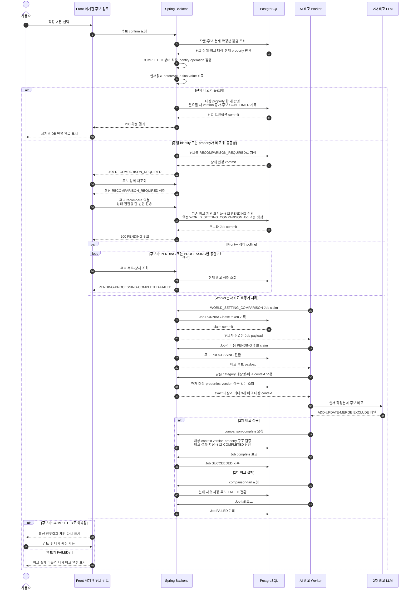

# World Setting Domain

이 문서는 NVM-260 세계관 설정 MVP의 Backend 구현 계약을 정의합니다. 세계관 설정은 작품에서 지속적으로 활용되는 불변에 가까운 설정을 대상으로 하며, 캐릭터 타임라인과 캐릭터 설정 후보는 기존 `domain/character` 계약을 그대로 사용합니다.

## 추출 범위

세계관 설정 분류는 다음 일곱 가지로 고정합니다.

| enum | 화면 표시 | 설명 |
| --- | --- | --- |
| `RACE` | 종족 | 종족의 생활 환경, 신체·문화적 특징, 사회 구조 |
| `FACTION` | 세력 | 국가, 길드, 종교, 조직의 목적·관계·구조 |
| `LOCATION` | 장소 | 지속적으로 등장하는 지역·건물·공간의 특징과 규칙 |
| `MONSTER` | 몬스터 | 몬스터 종의 생태, 능력, 약점, 서식지 |
| `POWER_SYSTEM` | 마법 및 능력 체계 | 마법, 무공, 초능력 등의 사용 조건·단계·제약 |
| `WORLD_RULE_HISTORY` | 작품 내 규칙과 역사 | 세계의 공통 법칙, 제도, 역사적 사건과 그 영향 |
| `IMPORTANT_ITEM` | 중요한 아이템 | 반복적으로 활용되는 유물·무기·도구의 기원과 속성 |

지속 가능한 일반 설정은 포함하고, 특정 시점의 소유·날씨·우발 사건처럼 쉽게 바뀌는 사실은 제외합니다.

- 포함: 마법 사용자는 반드시 마력 적성 검사를 받아야 한다.
- 포함: 바바리안은 혹한 지역에서 살아가는 전투 종족이다.
- 포함: 화염검은 용의 심장으로 제작된 유물이다.
- 제외: 수아가 현재 화염검을 들고 있다.
- 제외: 오늘 왕궁에 비가 내렸다.
- 제외: 몬스터 한 마리가 골목에서 나타났다.

## 저장 모델

MVP에서는 `world_settings`와 `world_setting_candidates` 두 테이블만 사용합니다. 별도의 `world_setting_facts`, 삭제·보관·복원 테이블, 전체 변경 이력 테이블은 만들지 않습니다.

### `world_settings`

한 행은 `작품 + 분류 + 대상` 하나의 현재 확정본입니다. 예를 들어 `종족 / 바바리안` 행의 `properties_json`에 `서식지`, `특징`, `사회 구조`를 누적합니다.

| 컬럼 | 의미 |
| --- | --- |
| `id` | 세계관 설정 UUID |
| `work_id` | 소유 작품 FK |
| `category` | 세계관 분류 |
| `subject_name` | 사용자에게 표시하는 대상명 |
| `normalized_subject_name` | 동일 대상 중복 판정용 정규화 이름 |
| `properties_json` | `설정명: 설정값` 형태의 JSON object |
| `version` | 동시 수정과 후보 확정 기준 버전 |
| `created_at` | 생성 시각 |
| `updated_at` | 마지막 수정 시각 |

저장 규칙은 다음과 같습니다.

- 유일 조건은 `work_id + category + normalized_subject_name`입니다.
- `properties_json`의 최상위는 JSON object이고 MVP의 key와 value는 모두 문자열입니다.
- 설정을 추가·수정하거나 후보를 확정할 때 JSON 전체를 교체하지 않고 대상 설정명 한 개만 변경합니다.
- 실제 내용이 변경될 때마다 `version`을 증가시킵니다.
- `subject_name`과 설정명은 앞뒤 공백만 제거하고 내부 공백은 보존합니다. `북부 설원`, `사회 구조`를 `북부설원`, `사회구조`로 바꾸지 않습니다.
- `normalized_subject_name`은 trim한 대상명을 Unicode NFC와 소문자로 정규화한 중복 판정 값입니다. 표시에는 원래의 `subject_name`을 사용합니다.
- 사용자의 직접 추가·수정은 후보를 만들지 않고 이 테이블에 바로 반영합니다.
- 직접 입력의 동일 분류·대상 또는 동일 대상 내 설정명 중복은 Backend가 전체 DB 기준으로 최종 검증하고, Frontend는 서버 오류를 표시합니다.
- 작품 자체를 hard delete하면 해당 작품의 `world_settings`와 `world_setting_candidates`는 FK cascade로 함께 정리합니다. 세계관 대상 하나의 삭제·보관·복원 API는 MVP에서 제공하지 않습니다.

### `world_setting_candidates`

한 행은 한 회차에서 추출한 `대상 하나의 설정 속성 하나`입니다. 1차 LLM 추출 결과와 2차 LLM 비교 제안, 사용자 최종 결정을 같은 행에 보존합니다.

#### 1차 추출

| 컬럼 | 의미 |
| --- | --- |
| `id` | 후보 UUID |
| `work_id` | 소유 작품 FK |
| `source_episode_id` | 근거 원문 회차 FK |
| `analysis_job_id` | 후보를 생성한 분석 작업 FK |
| `category` | 1차 추출 분류 |
| `subject_name` | 1차 추출 대상명 |
| `setting_name` | 1차 추출 설정명 |
| `extracted_value` | 1차 추출 설정값 |
| `evidence_spans` | 원문 인용문과 offset JSON 배열 |
| `extraction_confidence` | 1차 추출 신뢰도 |
| `raw_extraction_json` | 1차 LLM 원본 응답 |

MVP의 후보 출처는 회차 원문만 지원하므로 `source_type`, `source_setting_book_id`는 두지 않습니다. 설정집 원문 추출은 후속 범위입니다.

#### 2차 비교 제안

| 컬럼 | 의미 |
| --- | --- |
| `target_world_setting_id` | 비교 대상으로 선택한 확정본 FK. 신규 대상이면 `NULL` |
| `suggested_operation` | 2차 LLM이 제안한 반영 방식 |
| `proposed_setting_name` | 비교 후 제안하는 최종 설정명 |
| `before_value` | 비교 당시 같은 설정명의 기존 값. 신규 속성이면 `NULL` |
| `proposed_value` | 비교 후 제안하는 최종 설정값 |
| `comparison_reason` | 제안 근거 설명 |
| `base_world_setting_version` | 비교에 사용한 확정본 버전. 신규 대상이면 `NULL` |
| `raw_comparison_json` | 2차 LLM 원본 응답 |
| `compared_at` | 비교 완료 시각 |

반영 방식은 다음 네 가지입니다.

| enum | 의미 |
| --- | --- |
| `ADD` | 신규 대상 또는 기존 대상의 신규 설정 속성 추가 |
| `UPDATE` | 기존 설정 속성을 새로운 사실로 교체 |
| `MERGE` | 기존 사실과 신규 사실을 종합한 제안값으로 교체 |
| `EXCLUDE` | 지속 가능한 세계관 설정이 아니거나 반영할 필요가 없어 제외 |

`UPDATE`와 `MERGE`는 DB에서 모두 해당 설정명 한 개를 최종값으로 교체합니다. 두 enum은 2차 LLM의 판단 의미와 검토 기록을 구분하기 위해 유지하며, Backend가 문자열을 임의로 합성하지 않습니다.

#### 상태 및 사용자 최종 결정

| 컬럼 | 의미 |
| --- | --- |
| `comparison_status` | 2차 비교 진행 상태 |
| `comparison_error_message` | 비교 실패 이유 |
| `review_status` | 사용자 검토 상태 |
| `final_operation` | 사용자가 최종 선택한 반영 방식 |
| `final_category` | 사용자가 확정한 분류 |
| `final_subject_name` | 사용자가 확정한 대상명 |
| `final_setting_name` | 사용자가 확정한 설정명 |
| `final_value` | 사용자가 확정한 설정값 |
| `review_note` | 사용자 검토 메모 |
| `reviewed_by` | 최종 결정 회원 FK |
| `reviewed_at` | 최종 결정 시각 |
| `applied_world_setting_version` | 확정 반영 뒤 세계관 설정 버전 |
| `created_at` | 생성 시각 |
| `updated_at` | 마지막 수정 시각 |

비교 상태는 다음과 같습니다.

| enum | 의미 |
| --- | --- |
| `PENDING` | 1차 추출 뒤 2차 비교 대기 |
| `PROCESSING` | 2차 비교 진행 중 |
| `COMPLETED` | 비교 제안 생성 완료 |
| `FAILED` | 비교 실패. `comparison_error_message`에 이유 저장 |
| `RECOMPARISON_REQUIRED` | 비교 뒤 같은 대상·설정이 다른 값으로 바뀌어 재비교 필요 |

검토 상태는 `PENDING_REVIEW`, `CONFIRMED`, `DISMISSED`를 사용합니다. `COMPLETED` 후보만 일반 확정할 수 있으며, 비교 실패·처리 중·재비교 필요 후보는 확정하지 않습니다.

## 후보 확정 규칙

확정은 후보와 확정본을 함께 잠그는 단일 트랜잭션으로 처리합니다.

1. 후보를 잠금 조회하고 현재 상태를 확인합니다.
2. 2차 비교가 기존 확정본을 연결했으면 `target_world_setting_id`로 해당 행을 잠금하고, API 응답의 `targetSubjectName`을 최종 대상명 기준으로 사용합니다. 신규 대상 제안은 사용자가 보정한 분류·대상 identity로 잠금 조회하며, 생성 경쟁은 작품 잠금과 유일 제약으로 직렬화합니다.
3. `final_setting_name` 한 개의 현재 값만 `before_value`와 비교합니다.
4. 충돌이 없으면 해당 JSON property 한 개만 추가하거나 교체합니다.
5. 실제 변경 시 `world_settings.version`을 증가시킵니다.
6. 후보에 최종값, 대상 확정본, 적용 버전을 기록합니다.
7. 반영에 성공한 뒤에만 후보를 `CONFIRMED`로 전환합니다.
8. 모든 변경을 함께 commit하거나 모두 rollback합니다.

세부 동작은 다음과 같습니다.

- `ADD`: 확정본이 없으면 새 행을 만들고, 있으면 없는 설정 속성을 추가합니다.
- `UPDATE`, `MERGE`: 같은 설정명을 `final_value`로 교체합니다.
- `EXCLUDE`: 확정본을 변경하지 않고 후보를 `DISMISSED`로 전환합니다.
- 같은 최종 요청을 반복하면 이미 반영된 결과를 반환하는 멱등 동작으로 처리합니다.
- 이미 확정한 후보를 제외하거나 이미 제외한 후보를 확정하는 반대 상태 전이는 충돌입니다.

### 충돌 판정

행 전체 버전만으로 충돌시키지 않고, 후보가 대상으로 삼은 설정명 한 개의 값으로 판정합니다.

- 현재 값이 `before_value`와 같으면 정상 반영합니다.
- 현재 값이 이미 `final_value`와 같으면 중복 반영 없이 확정 완료로 처리합니다.
- `ADD`이고 해당 설정명이 아직 없으면 정상 반영합니다.
- 같은 설정명이 비교 뒤 제3의 값으로 바뀌었으면 후보를 `RECOMPARISON_REQUIRED`로 전환하고 반영하지 않습니다.
- 신규 대상 `ADD` 비교 뒤 동일 분류·대상이 먼저 생성되었으면 자동 병합하지 않고 `RECOMPARISON_REQUIRED`로 전환합니다.
- 같은 행의 다른 설정명만 변경된 경우에는 버전이 달라도 현재 후보를 정상 반영합니다.

### 확정 및 재비교 통합 시퀀스

아래 흐름은 사용자가 비교 완료 후보를 확정한 시점부터 정상 반영 또는 충돌 재비교를 거쳐 다시 검토할 때까지의 전체 경계를 보여줍니다.

상세 처리 기준:

- `world_settings.version`이 달라졌다는 이유만으로 재비교하지 않습니다. 확정 대상 property의 현재값이 `before_value` 또는 사용자가 확정하려는 `final_value`와 호환되는지 확인합니다.
- 신규 대상 `ADD` 사이에 동일 identity의 대상이 생기거나, `ADD` 대상 property가 이미 존재하거나, `UPDATE`·`MERGE` 대상 property가 사라진 경우에는 자동 보정하지 않고 재비교합니다.
- Backend는 `RECOMPARISON_REQUIRED` 상태를 먼저 commit한 뒤 Controller에서 409로 변환하므로, Front가 409를 받은 직후 상세를 재조회하면 저장된 충돌 상태를 확인할 수 있습니다.
- `recompare` 요청은 LLM을 동기 호출하지 않습니다. 후보를 `PENDING`으로 되돌리고 활성 재비교 Job을 최대 하나만 만든 뒤 즉시 응답합니다.
- Front는 한 번의 `RECOMPARISON_REQUIRED` 전환에서 재비교 요청을 한 번만 보내고, 후보가 해당 상태를 벗어나면 guard를 해제합니다.
- 비교 Worker는 DB UUID를 LLM에 전달하지 않고 요청 안에서만 유효한 참조를 사용합니다. Backend가 대상 ID, context version, property 존재 여부와 `before_value`를 다시 검증한 뒤 결과를 저장합니다.

## AI와 Backend 책임 경계

- 1차 LLM은 회차 원문에서 후보 속성과 근거를 추출합니다.
- 2차 LLM은 현재 세계관 확정본과 비교해 `ADD`, `UPDATE`, `MERGE`, `EXCLUDE` 중 하나와 제안값·이유를 만듭니다.
- LLM은 `world_settings`를 직접 변경하지 않습니다. Backend의 사용자 확정 트랜잭션만 확정본을 변경합니다.
- 의미상 중복과 병합 필요성은 2차 LLM 제안 영역입니다. 유일키, 동일 설정명, 버전과 상태 전이 같은 구조적 무결성은 Backend가 담당합니다.
- 초기 `SETTING_EXTRACTION` Job은 캐릭터 후보 저장 뒤 세계관 후보 게시와 비교를 내부 stage로 실행합니다. 후보별 비교 실패는 해당 후보를 `FAILED`로 남기고 나머지 후보와 Job 완료를 계속합니다.
- Worker는 같은 category의 대상명 목록만 먼저 받고, exact 대상 또는 LLM이 선택한 최대 3개 대상의 상세 properties와 version만 조회합니다. LLM prompt에는 UUID 대신 요청 안에서만 유효한 짧은 참조를 사용합니다.
- Backend는 lease, 작품·분류·후보 소유권, exact 대상, 비교 문맥의 ID·version, 설정명 존재 여부를 검증하고 `beforeValue`와 `baseWorldSettingVersion`을 산출합니다. AI가 보낸 과거값이나 version을 신뢰하지 않습니다.
- 사용자의 재비교 요청은 후보를 `PENDING`으로 되돌리고 별도 `WORLD_SETTING_COMPARISON` Job을 멱등 생성합니다. 이 Job은 공개 분석 목록·진행률·회차 실행 잠금에서 제외되며 AI comparison runner가 비동기로 claim합니다.
- 캐릭터 후보는 기존 SQLAlchemy 저장 흐름을 유지합니다. 세계관 후보 생성과 비교 상태 전이는 아래 Spring 내부 API로만 수행하며 AI Worker가 `world_settings` 또는 `world_setting_candidates`를 직접 수정하지 않습니다.

## Frontend 연결 계약

- 기존 `/setting-review` 안에서 캐릭터 후보와 세계관 후보를 탭으로 구분합니다.
- 전체 진행률은 캐릭터 후보와 세계관 후보를 합산하며, 양쪽의 미검토 후보가 모두 없어야 검토 완료가 됩니다.
- 세계관 탭은 검토 상태, 분류, 제안 작업 필터와 기존값·추출값·제안값·비교 이유·근거·신뢰도·최종 액션을 제공합니다.
- Dashboard 설정 DB에는 설정집(`worldrules`)과 별개의 `worldsettings` 탭을 둡니다.
- 세계관 DB는 대상 목록과 상세를 분리하고, 대상명·설정명·설정값 검색, 분류 필터, 정렬, 페이지, 직접 추가·수정을 지원합니다.

## API

모든 API는 Bearer access token과 로그인 회원 소유의 `workId`를 사용합니다. 타인 작품과 그 하위 세계관 리소스는 `WORK_NOT_FOUND` 또는 도메인 404로 숨깁니다.

확정 세계관 API:

| Method | Path | 역할 |
| --- | --- | --- |
| `GET` | `/api/v1/works/{workId}/world-settings` | `q`, `category`, `sort`, `page`, `size`로 대상명·설정명·설정값을 페이지 조회 |
| `GET` | `/api/v1/works/{workId}/world-settings/{worldSettingId}` | 현재 문자열 properties와 후보 확정 근거·이력 조회 |
| `POST` | `/api/v1/works/{workId}/world-settings` | 분류·대상명·첫 설정을 직접 추가 |
| `PATCH` | `/api/v1/works/{workId}/world-settings/{worldSettingId}/identity` | 현재 version과 함께 분류·대상명 수정 |
| `POST` | `/api/v1/works/{workId}/world-settings/{worldSettingId}/properties` | 현재 version과 함께 설정 한 개 추가 |
| `PATCH` | `/api/v1/works/{workId}/world-settings/{worldSettingId}/properties` | 기존 설정명, 새 설정명·값과 현재 version으로 설정 한 개 수정 |

세계관 후보 API:

| Method | Path | 역할 |
| --- | --- | --- |
| `GET` | `/api/v1/works/{workId}/world-setting-candidates` | 필수 `batchId`와 검토 상태·분류·제안 작업 필터로 집계와 페이지 조회 |
| `GET` | `/api/v1/works/{workId}/world-setting-candidates/{candidateId}` | 필수 `batchId` 범위의 후보 상세 조회 |
| `PATCH` | `/api/v1/works/{workId}/world-setting-candidates/{candidateId}` | 분류·대상명·설정명을 보정하고 비교 결과를 비운 뒤 `PENDING` 전환 |
| `POST` | `/api/v1/works/{workId}/world-setting-candidates/{candidateId}/recompare` | 실패·충돌 후보를 비교 대기로 되돌림 |
| `POST` | `/api/v1/works/{workId}/world-setting-candidates/{candidateId}/confirm` | 최종 작업·값을 속성 단위로 원자 반영 |
| `POST` | `/api/v1/works/{workId}/world-setting-candidates/{candidateId}/dismiss` | 확정본 변경 없이 후보 제외 |

`recompare`는 HTTP 요청 안에서 LLM을 호출하지 않습니다. 후보를 `PENDING`으로 되돌리고 활성 재비교 Job을 하나만 생성하며, 별도 Worker가 이를 claim해 `PROCESSING → COMPLETED/FAILED`를 저장합니다.

내부 AI Worker API:

| Method | Path | 역할 |
| --- | --- | --- |
| `PUT` | `/api/internal/v1/analysis-jobs/{jobId}/world-setting-candidates` | 1차 추출 후보 전체 게시 및 `WORLD_CANDIDATES_PUBLISHED` checkpoint 반영 |
| `POST` | `/api/internal/v1/analysis-jobs/{jobId}/world-setting-comparisons/claim-next` | Job 소유의 다음 `PENDING` 후보를 `PROCESSING`으로 claim |
| `GET` | `/api/internal/v1/analysis-jobs/{jobId}/world-setting-subjects` | 같은 작품·category의 대상 ID와 이름 페이지 조회 |
| `POST` | `/api/internal/v1/analysis-jobs/{jobId}/world-setting-candidates/{candidateId}/comparison-context` | 최대 3개 대상의 properties·version과 exact 대상 조회 |
| `POST` | `/api/internal/v1/analysis-jobs/{jobId}/world-setting-candidates/{candidateId}/comparison-complete` | 문맥 version과 제안 구조 검증 후 비교 결과 저장 |
| `POST` | `/api/internal/v1/analysis-jobs/{jobId}/world-setting-candidates/{candidateId}/comparison-fail` | 후보별 비교 실패 사유 저장 |

모든 내부 endpoint는 `X-Internal-Api-Key`와 claim 응답의 `X-Worker-Lease-Token`을 함께 검증합니다. lease는 5분이며 Worker heartbeat가 갱신합니다. 만료 Job은 최대 3회까지 마지막 checkpoint부터 재개하고, 비교 중이던 후보와 예약 토큰을 복구합니다.
